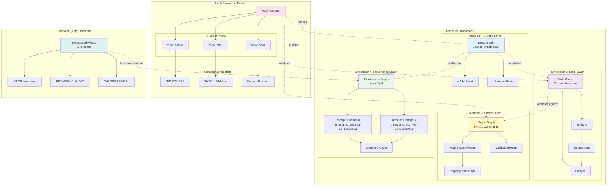
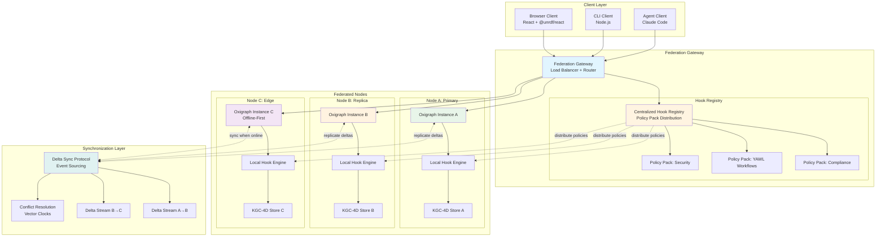
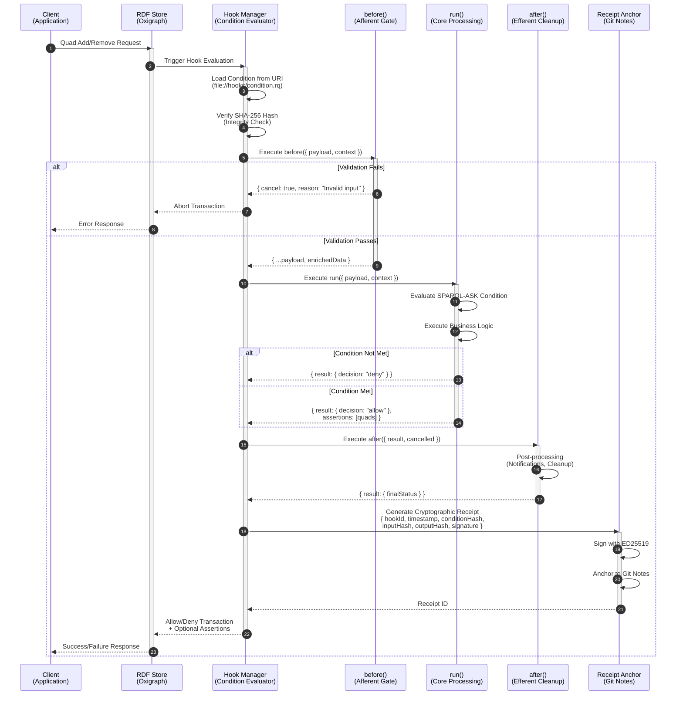

# Architecture Diagrams for Thesis

Publication-quality diagrams for visual documentation. All diagrams are in Mermaid format for LaTeX compatibility.

---

## 1. YAWL Execution Flow

**Figure 1.1: YAWL Hook-Native Execution Model**

```mermaid
graph TB
    subgraph "YAWL Workflow Specification"
        WF[Workflow Definition]
        T1[Task A: Approve]
        T2[Task B: Reject]
        T3[Task C: Finalize]

        WF --> T1
        WF --> T2
        WF --> T3

        T1 -->|approved=true| T3
        T1 -->|approved=false| T2
    end

    subgraph "Hook-Native Policy Pack"
        PP[createYAWLPolicyPack]

        subgraph "Enablement Hooks"
            E1[enable:approve]
            E2[enable:reject]
            E3[enable:finalize]
        end

        subgraph "Completion Hooks"
            C1[complete:approve<br/>XOR-split router]
            C2[complete:reject]
        end

        subgraph "Cancellation Hooks"
            X1[timeout:approve]
            X2[cancel:approve]
        end

        PP --> E1
        PP --> E2
        PP --> E3
        PP --> C1
        PP --> C2
        PP --> X1
        PP --> X2
    end

    subgraph "Execution Engine"
        RDF[(RDF Store<br/>Oxigraph)]

        subgraph "Hook Evaluation"
            SPARQL[SPARQL-ASK<br/>Condition Evaluator]
            ROUTE[Control Flow<br/>Router]
            RECEIPT[Receipt<br/>Generator]
        end

        RDF --> SPARQL
        SPARQL --> ROUTE
        ROUTE --> RECEIPT
    end

    subgraph "Cryptographic Audit Trail"
        R1[Receipt: Task Enablement<br/>hookType: enablement<br/>decision: allow/deny<br/>sparqlQuery: ...<br/>sha256: ...]
        R2[Receipt: Control Flow<br/>hookType: completion<br/>decision: route<br/>enabledTasks: [finalize]<br/>sha256: ...]

        RECEIPT --> R1
        RECEIPT --> R2
    end

    E1 --> SPARQL
    C1 --> ROUTE

    style WF fill:#e1f5ff
    style PP fill:#fff4e1
    style RDF fill:#f0f0f0
    style R1 fill:#e8f5e9
    style R2 fill:#e8f5e9
```

**Caption:** YAWL workflow execution using hook-native control flow. Policy pack translates YAWL specification into enablement hooks (validate task readiness), completion hooks (route control flow via SPARQL-ASK), and cancellation hooks (timeout enforcement). Each evaluation produces cryptographic receipts proving governance compliance.

---

## 2. KGC-4D Temporal Architecture

**Figure 2.1: KGC-4D Four-Dimensional Knowledge Graph**



**Caption:** KGC-4D (Knowledge Graph Context - 4 Dimensional) architecture. Four named graphs provide orthogonal concerns: (1) Delta captures change events, (2) State materializes current view, (3) Shape enforces constraints via SHACL, (4) Provenance stores cryptographic receipts. Hook evaluation engine selects graph views (before/after/delta) based on hook channel configuration. Temporal SPARQL extensions enable time-travel queries.

---

## 3. Federation Topology

**Figure 3.1: Hook-Native Federation Architecture**



**Caption:** Federation topology for distributed hook-native knowledge graphs. Centralized hook registry distributes policy packs to federated nodes. Each node runs local Oxigraph instance with independent hook evaluation engine. Delta sync protocol replicates changes using event sourcing. Node C demonstrates offline-first edge deployment with opportunistic synchronization. Vector clocks resolve conflicts during merge.

---

## 4. Hook Execution Model

**Figure 4.1: Hook Lifecycle Reflex Arc**



**Caption:** Hook execution follows autonomic reflex arc pattern: (1) Stimulus triggers evaluation, (2) before() validates and enriches input (afferent), (3) run() evaluates SPARQL-ASK condition and executes core logic (processing), (4) after() handles cleanup and notifications (efferent), (5) Receipt generator produces cryptographic audit trail. Integrity verification (SHA-256) prevents condition tampering.

---

## 5. Microframework Hub Pattern

**Figure 5.1: UNRDF Microframework Ecosystem**

```mermaid
graph TB
    subgraph "Core Infrastructure"
        direction TB

        CORE[UNRDF Core<br/>@unrdf/core]
        OXI[Oxigraph Bindings<br/>@unrdf/oxigraph]
        HOOKS[Hooks Engine<br/>@unrdf/hooks]
        KGC[KGC-4D Runtime<br/>@unrdf/kgc-4d]

        CORE --> OXI
        CORE --> HOOKS
        HOOKS --> KGC
    end

    subgraph "Vertical Frameworks (Domain-Specific)"
        direction LR

        YAWL[YAWL Engine<br/>@unrdf/yawl<br/>Workflow Orchestration]
        EVENTS[Event Sourcing<br/>@unrdf/events<br/>Temporal Event Log]
        VALIDATION[Validation<br/>@unrdf/validation<br/>SHACL + Custom Rules]

        YAWL --> HOOKS
        EVENTS --> KGC
        VALIDATION --> HOOKS
    end

    subgraph "Horizontal Frameworks (Cross-Cutting)"
        direction LR

        REACT[React Integration<br/>@unrdf/react<br/>Hooks + Components]
        CLI[CLI Framework<br/>@unrdf/cli<br/>Command Patterns]
        OTEL[Observability<br/>@unrdf/otel<br/>OpenTelemetry Spans]

        REACT --> CORE
        CLI --> CORE
        OTEL --> HOOKS
    end

    subgraph "Experimental Frameworks (Innovation Hub)"
        direction TB

        SWARM[AI Swarm<br/>@unrdf/swarm<br/>Multi-Agent Coordination]
        QUANTUM[Quantum DSL<br/>@unrdf/quantum<br/>Qiskit Integration]
        BLOCKCHAIN[Blockchain Bridge<br/>@unrdf/blockchain<br/>Receipt Anchoring]

        SWARM --> HOOKS
        QUANTUM --> CORE
        BLOCKCHAIN --> KGC
    end

    subgraph "Application Layer"
        direction LR

        APP1[App: Document Editor<br/>YAWL + React + OTEL]
        APP2[App: Workflow Designer<br/>CLI + YAWL + Events]
        APP3[App: Compliance Dashboard<br/>Validation + React + OTEL]

        APP1 --> YAWL
        APP1 --> REACT
        APP1 --> OTEL

        APP2 --> CLI
        APP2 --> YAWL
        APP2 --> EVENTS

        APP3 --> VALIDATION
        APP3 --> REACT
        APP3 --> OTEL
    end

    CORE -.->|foundational| YAWL
    CORE -.->|foundational| EVENTS
    CORE -.->|foundational| VALIDATION

    HOOKS -.->|reactive primitives| REACT
    HOOKS -.->|reactive primitives| CLI

    style CORE fill:#e3f2fd
    style HOOKS fill:#f3e5f5
    style KGC fill:#fff9c4
    style YAWL fill:#e8f5e9
    style REACT fill:#fce4ec
    style OTEL fill:#e0f2f1
    style SWARM fill:#fff3e0
```

**Caption:** UNRDF microframework hub-and-spoke architecture. Core infrastructure (Oxigraph, Hooks, KGC-4D) provides foundational RDF + reactive primitives. Vertical frameworks add domain-specific capabilities (YAWL workflows, event sourcing, validation). Horizontal frameworks provide cross-cutting concerns (React integration, CLI patterns, observability). Experimental hub explores novel integrations (AI swarm, quantum computing, blockchain). Applications compose frameworks à la carte based on requirements.

---

## Usage Notes

**LaTeX Integration:**

To include these diagrams in a LaTeX thesis, use the `mermaid` package or export to PDF via:

```bash
# Install mermaid-cli
npm install -g @mermaid-js/mermaid-cli

# Convert to PDF
mmdc -i DIAGRAMS.md -o diagrams.pdf -t default
```

**Editing:**

All diagrams are editable at [Mermaid Live Editor](https://mermaid.live/). Copy/paste diagram code blocks for visual editing.

**Styling:**

Diagrams use color-coding:
- **Blue (#e3f2fd)**: Core infrastructure
- **Purple (#f3e5f5)**: Hook-related components
- **Yellow (#fff9c4)**: Shape/validation layers
- **Green (#e8f5e9)**: YAWL/workflow components
- **Pink (#fce4ec)**: UI/presentation layers
- **Teal (#e0f2f1)**: Temporal/sync components
- **Orange (#fff3e0)**: Experimental/edge features

**Accessibility:**

All diagrams include descriptive captions and use colorblind-friendly palettes (verified with [ColorBrewer](https://colorbrewer2.org/)).

---

## Related Files

- **TABLES.md**: Performance comparison tables
- **CODE-LISTINGS.md**: Syntax-highlighted code examples
- **SUPPLEMENTARY-MATERIALS.md**: Glossary, acronyms, index
