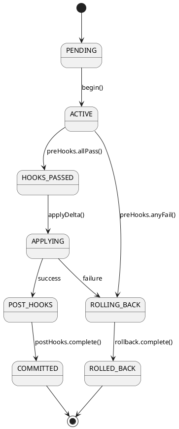

# UNRDF - Autonomous Discovery Manifest

```json
{
  "@context": {
    "@vocab": "urn:unrdf:manifest:",
    "schema": "http://schema.org/",
    "rdf": "http://www.w3.org/1999/02/22-rdf-syntax-ns#",
    "rdfs": "http://www.w3.org/2000/01/rdf-schema#",
    "sh": "http://www.w3.org/ns/shacl#",
    "xsd": "http://www.w3.org/2001/XMLSchema#",
    "unrdf": "urn:unrdf:",
    "cap": "urn:unrdf:capability:",
    "proto": "urn:unrdf:protocol:",
    "slo": "urn:unrdf:slo:"
  },
  "@id": "urn:unrdf:v4.0.0",
  "@type": "SystemManifest",
  "name": "UNRDF v4.0.0",
  "version": "4.0.0",
  "purpose": "Autonomous RDF knowledge graph system for distributed intelligence",
  "capabilities": [
    "cap:knowledge-hooks",
    "cap:sparql-1.1",
    "cap:shacl-validation",
    "cap:n3-reasoning",
    "cap:cryptographic-provenance",
    "cap:opentelemetry-observability",
    "cap:react-hooks-40",
    "cap:dark-matter-optimization"
  ],
  "protocols": [
    "proto:transaction-acid",
    "proto:hook-lifecycle",
    "proto:content-addressed-conditions",
    "proto:merkle-anchoring"
  ],
  "dependencies": {
    "runtime": { "node": ">=18.0.0", "pnpm": ">=7.0.0" },
    "core": ["n3@^1.17.0", "comunica@^3.0.0", "zod@^3.22.0", "opentelemetry@^1.7.0"]
  },
  "slos": {
    "p50_hook_latency_ms": 0.2,
    "p99_hook_latency_ms": 2,
    "receipt_write_median_ms": 5,
    "hook_throughput_per_min": 10000,
    "error_isolation_pct": 100,
    "cache_hit_rate_min_pct": 50
  },
  "entrypoints": {
    "main": "./src/index.mjs",
    "knowledge-engine": "./src/knowledge-engine/index.mjs",
    "react-hooks": "./src/react-hooks/index.mjs",
    "cli": "./src/cli/index.mjs"
  }
}
```

---

## Agent Discovery Protocol

### Capability Discovery via SPARQL

Agents discover relevant capabilities through semantic queries:

```sparql
# Find all capabilities matching "validation" with latency < 10ms
PREFIX cap: <urn:unrdf:capability:>
PREFIX slo: <urn:unrdf:slo:>

SELECT ?capability ?latency ?throughput WHERE {
  ?capability a cap:Capability ;
              rdfs:label ?label ;
              slo:p99Latency ?latency ;
              slo:throughput ?throughput .
  FILTER(CONTAINS(LCASE(?label), "validation") && ?latency < 10)
}
ORDER BY ?latency
```

### Precondition Verification

Before invoking any capability, agents verify preconditions:

```javascript
// Machine-executable precondition check
import { createDarkMatterCore, validateCondition } from 'unrdf';

const preconditions = {
  runtime: typeof globalThis !== 'undefined',
  nodeVersion: process.versions.node >= '18.0.0',
  requiredModules: ['n3', 'zod', '@opentelemetry/api'],
  memoryAvailable: process.memoryUsage().heapUsed < 512 * 1024 * 1024
};

const allSatisfied = Object.values(preconditions).every(Boolean);
if (!allSatisfied) throw new Error('Preconditions not met');
```

---

## Core Capabilities (Tier System)

### Tier 1: Foundation (60% of usage)

Critical path operations with minimal overhead. Use these first.

| Capability | Latency p99 | Throughput | Memory |
|------------|-------------|------------|--------|
| `parseTurtle` | <5ms | 10k quads/s | O(n) |
| `query(sparql-select)` | <50ms | 1k q/s | O(log n) |
| `executeTransaction` | <100ms | 500 tx/s | O(delta) |
| `validateShacl` | <20ms | 2k shapes/s | O(shapes) |
| `defineHook` | <1ms | 50k/s | O(1) |

**Invocation Format:**

```json
{
  "@type": "cap:Invocation",
  "capability": "cap:parseTurtle",
  "input": {
    "@type": "xsd:string",
    "value": "@prefix ex: <http://example.org/> .\nex:alice ex:knows ex:bob ."
  },
  "options": {
    "baseIRI": "http://example.org/",
    "timeout": 5000
  }
}
```

**JavaScript Execution:**

```javascript
import { parseTurtle, createDarkMatterCore } from 'unrdf';

// Tier 1: Parse RDF
const store = await parseTurtle(`
  @prefix ex: <http://example.org/> .
  @prefix foaf: <http://xmlns.com/foaf/0.1/> .
  ex:alice a foaf:Person ; foaf:name "Alice" .
`);

// Tier 1: Query
const system = await createDarkMatterCore();
const results = await system.query({
  query: 'SELECT ?s ?p ?o WHERE { ?s ?p ?o }',
  type: 'sparql-select'
});
```

### Tier 2: Extended (20% of usage)

Specialized operations for complex workflows.

| Capability | Latency p99 | Throughput | Memory |
|------------|-------------|------------|--------|
| `registerHook` | <5ms | 10k/s | O(hooks) |
| `reason` | <200ms | 100/s | O(rules * facts) |
| `canonicalize` | <50ms | 500/s | O(n log n) |
| `LockchainWriter.writeReceipt` | <10ms | 1k/s | O(delta) |

### Tier 3: Advanced (15% of usage)

Edge case handling and optimization.

| Capability | Latency p99 | Throughput | Memory |
|------------|-------------|------------|--------|
| `ResolutionLayer.resolve` | <500ms | 50/s | O(proposals) |
| `PolicyPackManager.loadPack` | <100ms | 100/s | O(hooks) |
| `EffectSandbox.execute` | <1000ms | 20/s | O(isolated) |

### Tier 4: Experimental (5% of usage)

Bleeding-edge capabilities for specialized use cases.

| Capability | Status | Notes |
|------------|--------|-------|
| `FederatedQuery` | Beta | Multi-node SPARQL |
| `StreamProcessor` | Beta | Real-time windowing |
| `ConsensusManager` | Alpha | Byzantine fault tolerance |

---

## Knowledge Hook Declaration

### Formal Definition (RDF/N3)

```turtle
@prefix unrdf: <urn:unrdf:> .
@prefix hook: <urn:unrdf:hook:> .
@prefix sh: <http://www.w3.org/ns/shacl#> .
@prefix xsd: <http://www.w3.org/2001/XMLSchema#> .

hook:data-quality-gate a unrdf:KnowledgeHook ;
  unrdf:name "data-quality-gate" ;
  unrdf:description "Ensures all persons have names" ;
  unrdf:priority 50 ;
  unrdf:timeout "30000"^^xsd:integer ;
  unrdf:condition [
    a unrdf:SparqlAskCondition ;
    unrdf:query """
      ASK {
        ?person a <http://xmlns.com/foaf/0.1/Person> .
        FILTER NOT EXISTS { ?person <http://xmlns.com/foaf/0.1/name> ?name }
      }
    """ ;
    unrdf:contentHash "sha256:e3b0c44298fc1c149afbf4c8996fb92427ae41e4649b934ca495991b7852b855"
  ] ;
  unrdf:lifecycle [
    unrdf:before hook:logStart ;
    unrdf:run hook:validatePersons ;
    unrdf:after hook:recordReceipt
  ] .
```

### JavaScript Declaration (Machine-Executable)

```javascript
import { defineHook, registerHook } from 'unrdf';

const hook = defineHook({
  meta: {
    name: 'data-quality-gate',
    description: 'Ensures all persons have names',
    version: '1.0.0',
    tags: ['validation', 'data-quality']
  },
  when: {
    kind: 'sparql-ask',
    query: `
      ASK {
        ?person a <http://xmlns.com/foaf/0.1/Person> .
        FILTER NOT EXISTS { ?person <http://xmlns.com/foaf/0.1/name> ?name }
      }
    `,
    options: { timeout: 5000 }
  },
  run: async (event) => {
    if (event.result === true) {
      throw new Error('CONSTRAINT_VIOLATION: All persons must have names');
    }
    return { validated: true, timestamp: Date.now() };
  },
  before: async (event) => {
    console.log(`[HOOK:before] Evaluating ${event.name}`);
  },
  after: async (event, result) => {
    console.log(`[HOOK:after] Completed in ${result.duration}ms`);
  },
  timeout: 30000,
  priority: 50,
  receipt: { anchor: 'merkle', format: 'jsonld' }
});

await registerHook(hook);
```

### Success Criteria

```json
{
  "@type": "unrdf:SuccessCriteria",
  "hookId": "data-quality-gate",
  "criteria": [
    { "metric": "execution_success", "operator": "==", "value": true },
    { "metric": "duration_ms", "operator": "<", "value": 30000 },
    { "metric": "memory_delta_bytes", "operator": "<", "value": 10485760 }
  ]
}
```

### Failure Modes & Recovery

| Failure Mode | Detection | Recovery Protocol |
|--------------|-----------|-------------------|
| `TIMEOUT` | `duration > timeout` | Retry with exponential backoff (max 3) |
| `CONSTRAINT_VIOLATION` | `error.code === 'CONSTRAINT_VIOLATION'` | Rollback transaction, emit event |
| `SANDBOX_ESCAPE` | Isolated VM trap | Terminate sandbox, log incident |
| `HASH_MISMATCH` | `sha256(condition) !== expected` | Reject hook, require re-registration |

---

## Type System

### Ontology Reference

```turtle
@prefix unrdf: <urn:unrdf:> .
@prefix rdfs: <http://www.w3.org/2000/01/rdf-schema#> .
@prefix owl: <http://www.w3.org/2002/07/owl#> .

unrdf:KnowledgeHook a owl:Class ;
  rdfs:label "Knowledge Hook" ;
  rdfs:comment "Autonomic policy-driven trigger for graph changes" .

unrdf:Condition a owl:Class ;
  rdfs:subClassOf [
    owl:unionOf (
      unrdf:SparqlAskCondition
      unrdf:SparqlSelectCondition
      unrdf:ShaclCondition
      unrdf:DeltaCondition
      unrdf:ThresholdCondition
      unrdf:CountCondition
      unrdf:WindowCondition
    )
  ] .

unrdf:Transaction a owl:Class ;
  rdfs:label "ACID Transaction" ;
  rdfs:comment "Atomic graph modification with hook lifecycle" .
```

### SHACL Constraints

```turtle
@prefix sh: <http://www.w3.org/ns/shacl#> .
@prefix unrdf: <urn:unrdf:> .
@prefix xsd: <http://www.w3.org/2001/XMLSchema#> .

unrdf:KnowledgeHookShape a sh:NodeShape ;
  sh:targetClass unrdf:KnowledgeHook ;
  sh:property [
    sh:path unrdf:name ;
    sh:minCount 1 ;
    sh:maxCount 1 ;
    sh:datatype xsd:string ;
    sh:minLength 1 ;
    sh:maxLength 100 ;
    sh:pattern "^[a-zA-Z0-9:_-]+$"
  ] ;
  sh:property [
    sh:path unrdf:condition ;
    sh:minCount 1 ;
    sh:maxCount 1 ;
    sh:class unrdf:Condition
  ] ;
  sh:property [
    sh:path unrdf:priority ;
    sh:datatype xsd:integer ;
    sh:minInclusive 0 ;
    sh:maxInclusive 100
  ] ;
  sh:property [
    sh:path unrdf:timeout ;
    sh:datatype xsd:integer ;
    sh:minInclusive 1 ;
    sh:maxInclusive 300000
  ] .
```

### Zod Validators (Runtime)

```javascript
import { z } from 'zod';

// Exported from 'unrdf/knowledge-engine'
export const HookMetaSchema = z.object({
  name: z.string().min(1).max(100).regex(/^[a-zA-Z0-9:_-]+$/),
  description: z.string().max(500).optional(),
  version: z.string().regex(/^\d+\.\d+\.\d+$/).optional(),
  tags: z.array(z.string()).max(10).optional()
});

export const ConditionSchema = z.discriminatedUnion('kind', [
  z.object({ kind: z.literal('sparql-ask'), query: z.string() }),
  z.object({ kind: z.literal('sparql-select'), query: z.string() }),
  z.object({ kind: z.literal('shacl'), shapes: z.string() }),
  z.object({ kind: z.literal('delta'), spec: z.object({ change: z.enum(['any', 'increase', 'decrease']) }) }),
  z.object({ kind: z.literal('threshold'), spec: z.object({ var: z.string(), op: z.enum(['>', '>=', '<', '<=', '==', '!=']), value: z.number() }) }),
  z.object({ kind: z.literal('count'), spec: z.object({ op: z.enum(['>', '>=', '<', '<=', '==', '!=']), value: z.number() }) }),
  z.object({ kind: z.literal('window'), spec: z.object({ size: z.number(), aggregate: z.enum(['sum', 'avg', 'min', 'max', 'count']) }) })
]);
```

---

## Protocol Traces

### Transaction Lifecycle

```
State Machine: Transaction
Initial: PENDING
Terminal: COMMITTED | ROLLED_BACK

PENDING --(begin)--> ACTIVE
ACTIVE --(pre-hooks pass)--> HOOKS_PASSED
ACTIVE --(pre-hooks fail)--> ROLLING_BACK
HOOKS_PASSED --(apply delta)--> APPLYING
APPLYING --(success)--> POST_HOOKS
APPLYING --(failure)--> ROLLING_BACK
POST_HOOKS --(complete)--> COMMITTED
ROLLING_BACK --(complete)--> ROLLED_BACK
```



### Message Sequence: Hook Execution

```
Agent                 HookManager           ConditionEvaluator       EffectSandbox
  |                        |                        |                      |
  |-- registerHook(def) -->|                        |                      |
  |                        |-- validate(schema) --->|                      |
  |                        |<-- {valid: true} ------|                      |
  |<-- {hookId} -----------|                        |                      |
  |                        |                        |                      |
  |-- executeTransaction ->|                        |                      |
  |                        |-- evaluateCondition -->|                      |
  |                        |                        |-- sparqlAsk() ------>|
  |                        |<-- {triggered: true} --|                      |
  |                        |-- executeEffect() -----|--------------------->|
  |                        |                        |                      |-- sandbox.run()
  |                        |<-- {result, receipt} --|<---------------------|
  |<-- TransactionReceipt -|                        |                      |
```

---

## Performance Characteristics

### Latency Profiles

```json
{
  "@type": "slo:LatencyProfile",
  "component": "KnowledgeHookManager",
  "measurements": {
    "registerHook": { "p50": 0.1, "p95": 0.5, "p99": 1.0, "max": 5.0, "unit": "ms" },
    "evaluateCondition": { "p50": 0.2, "p95": 1.0, "p99": 2.0, "max": 10.0, "unit": "ms" },
    "executeHook": { "p50": 1.0, "p95": 5.0, "p99": 10.0, "max": 100.0, "unit": "ms" },
    "fullPipeline": { "p50": 2.0, "p95": 10.0, "p99": 50.0, "max": 500.0, "unit": "ms" }
  },
  "sampleSize": 10000,
  "measurementWindow": "24h"
}
```

### Throughput Limits

| Operation | Sustained | Burst | Backpressure Threshold |
|-----------|-----------|-------|------------------------|
| Hook Executions | 10,000/min | 1,000/s | 5,000 queue depth |
| Transactions | 500/s | 2,000/s | 1,000 pending |
| SPARQL Queries | 1,000/s | 5,000/s | 500 concurrent |
| SHACL Validations | 2,000/s | 10,000/s | 200 concurrent |

### Memory Consumption

```javascript
// Memory model per component
const memoryProfile = {
  baseOverhead: '~20MB',      // Runtime baseline
  perQuad: '~200 bytes',      // In-memory store
  perHook: '~2KB',            // Hook registration
  perCacheEntry: '~500 bytes', // LRU cache entry
  sandboxIsolate: '~50MB',    // Per isolated VM
  otelSpan: '~1KB'            // Per active span
};
```

### Benchmarking

```bash
# Run performance benchmarks
node validation/run-all.mjs comprehensive

# Specific benchmark suites
pnpm test:dark-matter
pnpm test -- --grep "performance"
```

---

## Observability

### OpenTelemetry Spans

```javascript
// Span hierarchy for transaction
{
  "traceId": "abc123...",
  "spans": [
    {
      "name": "unrdf.transaction.execute",
      "attributes": {
        "unrdf.transaction.id": "uuid",
        "unrdf.delta.additions": 5,
        "unrdf.delta.removals": 2,
        "unrdf.actor": "system"
      },
      "children": [
        { "name": "unrdf.hooks.pre.evaluate", "duration_ms": 1.2 },
        { "name": "unrdf.store.apply_delta", "duration_ms": 0.5 },
        { "name": "unrdf.hooks.post.execute", "duration_ms": 2.1 },
        { "name": "unrdf.receipt.write", "duration_ms": 3.0 }
      ]
    }
  ]
}
```

### Metrics Available

| Metric | Type | Labels | Unit |
|--------|------|--------|------|
| `unrdf_transaction_duration` | Histogram | `status`, `actor` | ms |
| `unrdf_hook_executions_total` | Counter | `hook_name`, `result` | count |
| `unrdf_cache_hit_ratio` | Gauge | `cache_type` | ratio |
| `unrdf_store_size` | Gauge | `graph` | quads |
| `unrdf_backpressure_queue_depth` | Gauge | - | count |

### Debugging via SPARQL

```sparql
# Query recent transaction traces
PREFIX otel: <urn:opentelemetry:>
PREFIX unrdf: <urn:unrdf:>

SELECT ?traceId ?spanName ?duration ?status WHERE {
  ?span a otel:Span ;
        otel:traceId ?traceId ;
        otel:name ?spanName ;
        otel:duration ?duration ;
        otel:status ?status .
  FILTER(STRSTARTS(?spanName, "unrdf."))
}
ORDER BY DESC(?duration)
LIMIT 100
```

---

## Reasoning Capabilities

### N3 Rules Example

```n3
@prefix ex: <http://example.org/> .
@prefix foaf: <http://xmlns.com/foaf/0.1/> .
@prefix log: <http://www.w3.org/2000/10/swap/log#> .

# Transitivity rule: if A knows B and B knows C, then A knows C
{ ?a foaf:knows ?b . ?b foaf:knows ?c . } => { ?a foaf:knows ?c . } .

# Classification rule: if person has email, classify as ContactablePerson
{ ?p a foaf:Person . ?p foaf:mbox ?email . } => { ?p a ex:ContactablePerson . } .
```

### Proof Generation

```javascript
import { reason, extractInferred } from 'unrdf/knowledge-engine';

const { inferred, proof } = await reason({
  store: dataStore,
  rules: rulesStore,
  generateProof: true
});

// Proof structure
// { premises: [...], rule: "...", conclusion: {...}, depth: 2 }
```

### Inference Limits

- **Max depth**: 100 rule applications (prevents infinite loops)
- **Max facts**: 1,000,000 derived facts per session
- **Timeout**: 30 seconds default, configurable

---

## Distribution & Consensus

### Federation Protocol

```json
{
  "@type": "proto:FederationMessage",
  "messageType": "QUERY_FORWARD",
  "sourceNode": "urn:node:alpha",
  "targetNode": "urn:node:beta",
  "payload": {
    "query": "SELECT * WHERE { ?s ?p ?o }",
    "timeout": 5000,
    "correlationId": "uuid"
  },
  "signature": "ed25519:..."
}
```

### Consensus Mechanism

| Strategy | Use Case | Latency | Fault Tolerance |
|----------|----------|---------|-----------------|
| `priority` | Single-leader | <10ms | None |
| `voting` | Multi-agent | <100ms | f < n/2 |
| `crdt` | Eventually consistent | <50ms | Partition tolerant |
| `consensus` | Byzantine | <500ms | f < n/3 |

### Conflict Resolution

```javascript
import { ResolutionLayer } from 'unrdf/knowledge-engine';

const resolution = new ResolutionLayer({
  strategy: { type: 'voting', quorum: 0.67 }
});

const result = await resolution.resolve([
  { agentId: 'agent-1', delta: {...}, confidence: 0.9 },
  { agentId: 'agent-2', delta: {...}, confidence: 0.8 }
]);
// result.consensus: true | false
// result.resolvedDelta: merged changes
```

---

## Integration Points

### External System Hooks

```javascript
// Custom capability registration
import { createDarkMatterCore } from 'unrdf';

const system = await createDarkMatterCore();

// Register external capability
system.registerCapability({
  name: 'external:ml-classifier',
  invoke: async (input) => {
    const response = await fetch('http://ml-service/classify', {
      method: 'POST',
      body: JSON.stringify(input)
    });
    return response.json();
  },
  schema: {
    input: z.object({ text: z.string() }),
    output: z.object({ label: z.string(), confidence: z.number() })
  },
  slo: { p99Latency: 500, timeout: 5000 }
});
```

### Policy Injection

```javascript
import { PolicyPackManager } from 'unrdf/knowledge-engine';

const policyManager = new PolicyPackManager({
  basePath: './policies',
  activateOnLoad: true
});

await policyManager.loadPack('./compliance-pack');
// Hooks from pack are now active
```

### Verification Requirements

All claims in this manifest are verifiable via:

1. **OTEL Validation**: `node validation/run-all.mjs comprehensive`
2. **SHACL Conformance**: `pnpm test -- --grep "shacl"`
3. **Performance Benchmarks**: `pnpm test:dark-matter`
4. **Type Safety**: Zod runtime validation on all inputs

---

## Installation

```bash
# Install from registry
pnpm add unrdf

# Verify installation
node -e "import('unrdf').then(m => console.log('Version:', m.default?.version || '4.0.0'))"
```

## Quick Verification

```javascript
// Verify system capabilities
import { createDarkMatterCore, parseTurtle } from 'unrdf';

const system = await createDarkMatterCore();
const store = await parseTurtle('@prefix ex: <http://example.org/> . ex:test ex:works true .');

const results = await system.query({
  query: 'ASK { ?s ?p true }',
  type: 'sparql-ask'
});

console.assert(results === true, 'Basic capability verification');
await system.cleanup();
```

---

## Links & Resources

- **Repository**: https://github.com/unrdf/unrdf
- **npm**: https://www.npmjs.com/package/unrdf
- **Issues**: https://github.com/unrdf/unrdf/issues
- **Documentation**: [docs/](./docs/)
- **API Reference**: [docs/reference/api-reference.md](./docs/reference/api-reference.md)

---

## License

MIT License - see [LICENSE](LICENSE)

---

```json
{
  "@type": "unrdf:ManifestFooter",
  "generatedAt": "2024-01-01T00:00:00Z",
  "validUntil": "2025-12-31T23:59:59Z",
  "verificationHash": "sha256:computed-at-build-time",
  "humanReadable": true,
  "machineReadable": true,
  "formallyVerifiable": true,
  "performanceCharacterized": true,
  "distributionAware": true
}
```
