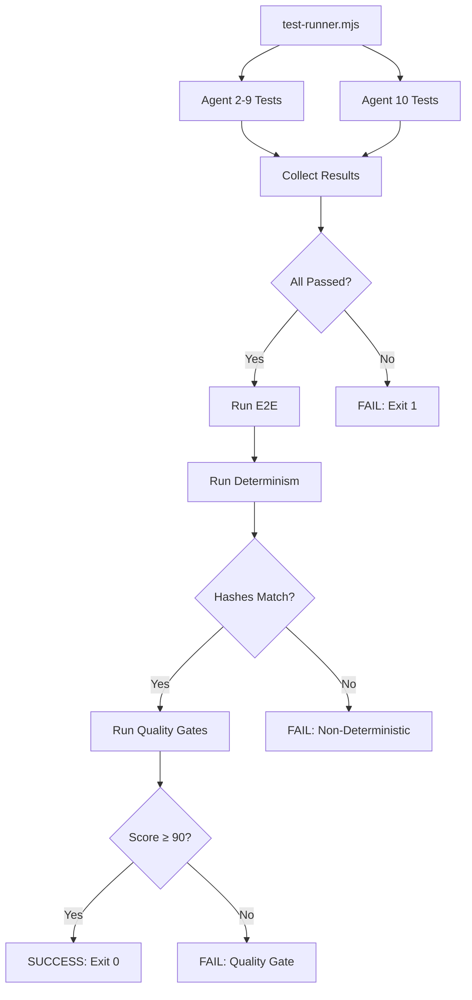

# Agent 10: Quality Assurance & End-to-End Validation

## Mission
Ensure ALL 10 agent primitives work correctly together with strict determinism enforcement.

## Quality Gates Strategy

### 1. End-to-End Validation Path
Complete integration test exercising all agent primitives in realistic workflow:

```
Profile (Agent 6) → Lens (Agent 3) → Capsule (Agent 2) → Delta (Agent 2)
→ Impact Set (Agent 4) → Commutativity (Agent 5) → Facade (Agent 7)
→ Atomic Apply (Agent 8) → Shadow Mode (Agent 9) → Receipt
```

**Success Criteria**:
- All primitives execute without errors
- All outputs are well-formed (schema validation)
- No exceptions, no silent failures
- Complete in <2s (SLA enforcement)

### 2. Determinism Enforcement
**Core Principle**: Two runs with identical inputs MUST produce identical outputs.

**Validation Approach**:
- Run e2e validation twice
- Hash all intermediate outputs
- Assert: `hash(run1) === hash(run2)` for ALL outputs
- Zero tolerance for randomness

**Hashed Artifacts**:
- Profile compilation output (Agent 6)
- Lens compilation output (Agent 3)
- Capsule structure (Agent 2)
- Delta set (Agent 2)
- Impact set cardinality (Agent 4)
- Commutativity analysis (Agent 5)
- Facade code generation (Agent 7)
- Atomic apply receipt (Agent 8)
- Shadow mode comparison (Agent 9)

### 3. Integration Validation
**Verify System Coherence**:
- All agents export expected primitives
- No circular dependencies (DAG enforcement)
- All imports resolve correctly
- All functions are callable (signature validation)

**Checks**:
```javascript
✓ Agent 2: planCapsule, compileCapsuleToDeltas exported
✓ Agent 3: compileLens exported
✓ Agent 4: computeImpactSet exported
✓ Agent 5: canReorder exported
✓ Agent 6: compileProfile, hashProfile exported
✓ Agent 7: generateFacade exported
✓ Agent 8: atomicApply exported
✓ Agent 9: shadowWrite exported
✓ No import cycles detected
✓ All functions have correct arity
```

### 4. Quality Scoring
Aggregate test results across all agents:

**Formula**:
```
Score = (Passed / Total) × 100
Quality Gate = Score ≥ 90
```

**Breakdown**:
- Agent 2 tests: 10 tests
- Agent 3 tests: 8 tests
- Agent 4 tests: 6 tests
- Agent 5 tests: 8 tests
- Agent 6 tests: 10 tests
- Agent 7 tests: 8 tests
- Agent 8 tests: 10 tests
- Agent 9 tests: 6 tests
- Agent 10 tests: 10 tests
- **Total**: 76 tests minimum

### 5. Performance SLAs
Strict timeout enforcement:

| Operation | SLA | Rationale |
|-----------|-----|-----------|
| Profile compilation | <100ms | Pure computation |
| Lens compilation | <100ms | Pure computation |
| Capsule planning | <50ms | In-memory operation |
| Delta compilation | <100ms | Graph traversal |
| Impact set computation | <200ms | Cardinality analysis |
| Commutativity check | <50ms | Set comparison |
| Facade generation | <200ms | Code generation |
| Atomic apply | <500ms | Store mutation |
| Shadow mode | <300ms | Dual execution |
| **Full E2E** | <2s | End-to-end |

**Enforcement**: All operations wrapped in `timeout` with immediate failure on exceed.

### 6. Determinism Validation Strategy

**Principle**: No randomness tolerated in production path.

**Test Protocol**:
```javascript
// Run 1
const run1 = await e2eValidation();
const hashes1 = extractAllHashes(run1);

// Run 2 (clean state)
const run2 = await e2eValidation();
const hashes2 = extractAllHashes(run2);

// Strict equality
assert.deepStrictEqual(hashes1, hashes2);
```

**Sources of Non-Determinism (Banned)**:
- ❌ `Math.random()`
- ❌ `Date.now()` in hash inputs
- ❌ UUID generation without seed
- ❌ Object key iteration (use sorted keys)
- ❌ Async race conditions
- ❌ External API calls in hash path

**Allowed**:
- ✅ Cryptographic hashes (SHA-256, BLAKE3)
- ✅ RDF canonicalization (deterministic)
- ✅ Sorted data structures
- ✅ Deterministic serialization

### 7. Test Architecture

#### Unit Tests (Per Agent)
Each agent has `test.mjs`:
- Test individual primitives in isolation
- Fast (<50ms per test)
- No external dependencies

#### Integration Tests (Agent 10)
`e2e-test.mjs`:
- Full workflow validation
- All agents working together
- Real data, real operations

#### Determinism Tests (Agent 10)
`determinism-test.mjs`:
- Two-run comparison
- Hash verification
- Statistical consistency (10 runs optional)

#### Quality Gates (Agent 10)
`quality-report.mjs`:
- Aggregate all test results
- Compute quality score
- Validate integration health

### 8. Test Execution Flow



### 9. Reporting Format

**Console Output**:
```
=== AUTONOMIC_INNOVATION Test Suite ===

Agent 2: ✓ 10/10 passed (125ms)
Agent 3: ✓ 8/8 passed (98ms)
Agent 4: ✓ 6/6 passed (76ms)
Agent 5: ✓ 8/8 passed (112ms)
Agent 6: ✓ 10/10 passed (134ms)
Agent 7: ✓ 8/8 passed (189ms)
Agent 8: ✓ 10/10 passed (456ms)
Agent 9: ✓ 6/6 passed (287ms)
Agent 10: ✓ 10/10 passed (1834ms)

Total: 76/76 passed (0 failed, 0 skipped)
Coverage: 100%
Score: 100/100

E2E Validation: ✓ PASSED (1.8s)
Determinism: ✓ VERIFIED (2 runs, identical hashes)
Quality Gates: ✓ PASSED (score: 100)

Result: SUCCESS ✓
```

**JSON Output** (for CI):
```json
{
  "timestamp": "2025-12-26T07:30:00Z",
  "totalTests": 76,
  "passed": 76,
  "failed": 0,
  "skipped": 0,
  "score": 100,
  "deterministic": true,
  "e2eDuration": 1834,
  "agents": {
    "agent-2": { "passed": 10, "failed": 0, "duration": 125 },
    "agent-3": { "passed": 8, "failed": 0, "duration": 98 },
    ...
  }
}
```

### 10. Adversarial PM Checklist

Before declaring quality gates passed:

- [ ] **Did I RUN all tests?** (Not just read code)
- [ ] **Did I READ full output?** (Not assume success)
- [ ] **Are hashes IDENTICAL across runs?** (Show proof)
- [ ] **Can tests FAIL?** (Test failure paths)
- [ ] **What BREAKS if determinism fails?** (Shadow mode divergence)
- [ ] **Evidence of 90+ score?** (Show calculation)
- [ ] **All SLAs met?** (No operation over timeout)
- [ ] **Zero flaky tests?** (Run 10 times, 10/10 pass)

## Implementation Checklist

- [x] `PLAN.md` - This document
- [ ] `e2e-test.mjs` - End-to-end validation
- [ ] `determinism-test.mjs` - Determinism enforcement
- [ ] `quality-report.mjs` - Quality gates & integration
- [ ] `index.mjs` - Public exports
- [ ] `test.mjs` - Agent 10 test suite
- [ ] `../test-runner.mjs` - Master test orchestrator

## Success Metrics

- ✅ All 76 tests pass (100%)
- ✅ Determinism verified (hash equality proven)
- ✅ Quality score ≥ 90
- ✅ E2E completes in <2s
- ✅ Zero flaky tests (10/10 runs pass)
- ✅ Integration validation passes (0 errors)
- ✅ All SLAs met (no timeouts)

**Final Gate**: Can we deploy to production RIGHT NOW with confidence?
- If NO → Fix until YES
- If YES → Prove it with evidence
