# 🎯 V6 Recovery Orchestration Plan
**Date**: 2025-12-27
**Orchestrator**: Task Orchestrator Agent
**Mission**: Execute 4-phase recovery to fix 3 critical blockers + 1 prerequisite
**Target**: Production-ready v6 with ≥80/100 OTEL validation

---

## Executive Summary

### Timeline Overview
| Phase | Duration | Parallelization | Agents | Critical Path |
|-------|----------|----------------|--------|---------------|
| **PHASE 0** (Prerequisite) | 15 min | Sequential | 1 | YES |
| **PHASE 1** (Unblock) | 2-4 hours | Sequential | 1 | YES |
| **PHASE 2** (Determinism) | 16-24 hours | **PARALLEL (3 agents)** | 2-5 | NO |
| **PHASE 3** (Zod Schemas) | 32-40 hours | **PARALLEL (4 agents)** | 6-9 | NO |
| **PHASE 4** (Validation) | 4-6 hours | Sequential | 10 | YES |
| **TOTAL** | **54-74 hours** | Max 4 concurrent | 10 | - |

### Critical Path
```
PHASE 0 → PHASE 1 → PHASE 4
  (15m)     (2-4h)    (4-6h)
= 6.25-10.25 hours MINIMUM before production validation
```

### Parallel Execution Opportunities
- **After PHASE 1**: Phases 2 & 3 can run concurrently
- **Phase 2**: 3 agents work on different modules simultaneously
- **Phase 3**: 4 agents generate schemas + add validation in parallel
- **Estimated speedup**: 32-40 hours reduced to ~12-16 hours with 4 agents

---

## Dependency Graph

```mermaid
graph TD
    subgraph "PHASE 0: Prerequisite (15 min)"
        P0[Fix vitest version: ^1.0.0 → ^4.0.15]
    end

    subgraph "PHASE 1: Unblock Testing (2-4 hours)"
        P1A[pnpm install --loglevel debug]
        P1B[Verify: pnpm test runs without ERR_MODULE_NOT_FOUND]
    end

    subgraph "PHASE 2: Fix Determinism (16-24h, PARALLEL)"
        P2A[Agent 2: Fix CLI modules<br/>18 violations]
        P2B[Agent 3: Fix delta adapters<br/>23 violations]
        P2C[Agent 4: Fix compat adapters<br/>22 violations]
        P2D[Agent 5: Verify 100/100 determinism proof]
    end

    subgraph "PHASE 3: Zod Schemas (32-40h, PARALLEL)"
        P3A[Agent 6: Generate v6-core schemas<br/>~30 files]
        P3B[Agent 7: Generate v6-compat schemas<br/>~15 files]
        P3C[Agent 8: Add .parse calls<br/>API boundaries]
        P3D[Agent 9: Verify 100% coverage<br/>linting + review]
    end

    subgraph "PHASE 4: Full Validation (4-6 hours)"
        P4A[npm run build: 0 errors]
        P4B[npm test: 100% pass]
        P4C[npm run lint: 0 violations]
        P4D[OTEL validation: ≥80/100]
        P4E[Generate evidence report]
    end

    P0 --> P1A
    P1A --> P1B
    P1B --> P2A & P2B & P2C & P3A & P3B & P3C
    P2A & P2B & P2C --> P2D
    P3A & P3B & P3C --> P3D
    P2D & P3D --> P4A
    P4A --> P4B
    P4B --> P4C
    P4C --> P4D
    P4D --> P4E

    classDef critical fill:#ff6b6b,stroke:#c92a2a,stroke-width:3px
    classDef parallel fill:#51cf66,stroke:#2f9e44,stroke-width:2px
    classDef validation fill:#339af0,stroke:#1971c2,stroke-width:2px

    class P0,P1A,P1B critical
    class P2A,P2B,P2C,P3A,P3B,P3C parallel
    class P4A,P4B,P4C,P4D,P4E validation
```



---

## Blocker Analysis

### Current State (Measured)
```bash
# Blocker counts (verified 2025-12-27)
grep -r "Date\.now()\|Math\.random()\|randomUUID()" packages/v6-*/src --include="*.mjs" | wc -l
# Result: 63 violations

find packages/v6-*/src -name "*.mjs" -type f | wc -l
# Result: 49 total files

find packages/v6-*/src -name "*.schema.mjs" | wc -l
# Result: 4 schema files (45 missing)

cat package.json | grep '"vitest"'
# Result: "vitest": "^1.0.0" (BLOCKER - needs ^4.0.15)
```

### Blockers Mapped to Phases
| Blocker | Phase | Impact | Evidence |
|---------|-------|--------|----------|
| **Vitest version mismatch** | PHASE 0 | Tests won't run | Root package.json line 107 |
| **pnpm install timeout** | PHASE 1 | No node_modules | ERR_MODULE_NOT_FOUND errors |
| **63 determinism violations** | PHASE 2 | Non-reproducible receipts | grep output |
| **45 missing Zod schemas** | PHASE 3 | No runtime validation | find output (4/49 files) |

---

## Phase Details & Agent Assignments

### PHASE 0: Fix Vitest Prerequisite (15 min, CRITICAL PATH)
**Agent**: Backend Dev (Agent 1)
**Blocker**: Vitest version mismatch blocking test execution

**Actions**:
```bash
# Edit /home/user/unrdf/package.json line 107
# BEFORE: "vitest": "^1.0.0"
# AFTER:  "vitest": "^4.0.15"
```

**Success Criteria**:
- [ ] package.json line 107 shows "vitest": "^4.0.15"
- [ ] No git diff shows unexpected changes

**Validation Gate**: Manual review of package.json diff

**Time Estimate**: 15 minutes

---

### PHASE 1: Unblock Testing (2-4 hours, CRITICAL PATH)
**Agent**: Backend Dev (Agent 1)
**Blocker**: Missing dependencies (pnpm install timeout)

**Actions**:
```bash
cd /home/user/unrdf
timeout 300s pnpm install --loglevel debug 2>&1 | tee pnpm-install.log

# Verify installation
pnpm --filter @unrdf/v6-core test 2>&1 | head -50
```

**Success Criteria**:
- [ ] pnpm install completes without timeout
- [ ] node_modules/ directory exists with dependencies
- [ ] `pnpm test` runs without ERR_MODULE_NOT_FOUND
- [ ] pnpm-install.log shows successful completion

**Validation Gate**: Test execution starts (even if tests fail)

**Rollback Plan**:
```bash
rm -rf node_modules pnpm-lock.yaml
pnpm install --frozen-lockfile
```

**Time Estimate**: 2-4 hours (includes diagnosis if timeout occurs)

---

### PHASE 2: Fix Determinism Violations (16-24 hours, PARALLEL)
**Blocker**: 63 Date.now/Math.random/randomUUID violations

#### PHASE 2.1: CLI Modules (Agent 2 - Backend Dev)
**Scope**: `/packages/v6-core/src/cli/`
**Violations**: ~18 instances

**Files to Fix**:
- `/packages/v6-core/src/cli/commands/delta.mjs` (8 violations)
- `/packages/v6-core/src/cli/commands/receipt.mjs` (6 violations)
- `/packages/v6-core/src/cli/nouns.mjs` (4 violations)

**Pattern**:
```javascript
// BEFORE (non-deterministic)
export function generateTimestamp() {
  return Date.now();  // ❌ VIOLATION
}

// AFTER (deterministic)
export function generateTimestamp(context = {}) {
  const { t_ns = Date.now() } = context;  // Injected timestamp
  return t_ns;  // ✅ Deterministic when context provided
}
```

**Success Criteria**:
- [ ] 0 Date.now() calls in CLI modules (grep result)
- [ ] All CLI functions accept optional `context` parameter
- [ ] Tests pass with injected timestamps

---

#### PHASE 2.2: Delta Adapters (Agent 3 - Backend Dev)
**Scope**: `/packages/v6-core/src/delta/adapters/`
**Violations**: ~23 instances

**Files to Fix**:
- Adapter files in delta/adapters/ directory

**Pattern**:
```javascript
// BEFORE (non-deterministic)
export function generateUUID() {
  return crypto.randomUUID();  // ❌ VIOLATION
}

// AFTER (deterministic)
import { v5 as uuidv5 } from 'uuid';

export function generateUUID(context = {}) {
  const { seed = 'default-seed', namespace } = context;
  return uuidv5(seed, namespace);  // ✅ Deterministic UUIDv5
}
```

**Success Criteria**:
- [ ] 0 randomUUID() calls in delta adapters
- [ ] UUIDv5 with seed/namespace used instead
- [ ] Tests verify identical UUIDs with same seed

---

#### PHASE 2.3: Compat Adapters (Agent 4 - Backend Dev)
**Scope**: `/packages/v6-compat/src/adapters.mjs`
**Violations**: ~22 instances

**Files to Fix**:
- `/packages/v6-compat/src/adapters.mjs`

**Pattern**:
```javascript
// BEFORE (non-deterministic)
export function randomSample(arr) {
  return arr[Math.floor(Math.random() * arr.length)];  // ❌ VIOLATION
}

// AFTER (deterministic)
export function randomSample(arr, context = {}) {
  const { random = Math.random } = context;  // Injected RNG
  return arr[Math.floor(random() * arr.length)];  // ✅ Deterministic with seeded RNG
}
```

**Success Criteria**:
- [ ] 0 Math.random() calls in compat adapters
- [ ] Seeded RNG (e.g., seedrandom) used for randomness
- [ ] Tests verify identical outputs with same seed

---

#### PHASE 2.4: Determinism Proof Validation (Agent 5 - Tester)
**Scope**: Run existing determinism tests
**Depends On**: PHASE 2.1, 2.2, 2.3 complete

**Actions**:
```bash
cd /home/user/unrdf
timeout 30s node test/l5-maturity/l3-determinism-direct.test.mjs

# Verify 100/100 identical hashes
grep "✅ 100/100" test-output.log
```

**Success Criteria**:
- [ ] 100/100 determinism proof passes
- [ ] Identical hashes across all runs
- [ ] 0 Date.now/Math.random violations in grep

**Time Estimate**: 16-24 hours total (parallelized across 3 agents)

---

### PHASE 3: Add Zod Schemas (32-40 hours, PARALLEL)
**Blocker**: 45 files missing Zod schemas (only 4/49 have schemas)

#### PHASE 3.1: Generate v6-core Schemas (Agent 6 - Coder)
**Scope**: `/packages/v6-core/src/` (~30 files)

**Actions**:
```bash
cd /home/user/unrdf

# Run schema generator on v6-core modules
node packages/v6-compat/scripts/generate-schemas.mjs \
  --input packages/v6-core/src \
  --output packages/v6-core/src \
  --pattern "*.mjs"

# Verify schemas generated
find packages/v6-core/src -name "*.schema.mjs" | wc -l
# Expected: ~30 files
```

**Success Criteria**:
- [ ] Schema file created for every .mjs file with exports
- [ ] All public exports have Zod schemas
- [ ] Schemas validate expected input/output types

---

#### PHASE 3.2: Generate v6-compat Schemas (Agent 7 - Coder)
**Scope**: `/packages/v6-compat/src/` (~15 files)

**Actions**:
```bash
node packages/v6-compat/scripts/generate-schemas.mjs \
  --input packages/v6-compat/src \
  --output packages/v6-compat/src \
  --pattern "*.mjs"

find packages/v6-compat/src -name "*.schema.mjs" | wc -l
# Expected: ~15 files
```

**Success Criteria**:
- [ ] All v6-compat modules have schemas
- [ ] Adapters have input/output validation
- [ ] Linter reports 0 missing schemas

---

#### PHASE 3.3: Add .parse() Calls (Agent 8 - Backend Dev)
**Scope**: API boundaries in v6-core and v6-compat
**Depends On**: PHASE 3.1, 3.2 complete

**Pattern**:
```javascript
// BEFORE (no validation)
export function createReceipt(data) {
  return { ...data, id: generateUUID() };
}

// AFTER (with Zod validation)
import { receiptInputSchema } from './schema.mjs';

export function createReceipt(data) {
  const validated = receiptInputSchema.parse(data);  // ✅ Runtime validation
  return { ...validated, id: generateUUID() };
}
```

**Success Criteria**:
- [ ] All public API functions use .parse()
- [ ] Invalid inputs throw ZodError
- [ ] Tests verify validation catches bad data

---

#### PHASE 3.4: Verify 100% Coverage (Agent 9 - Reviewer)
**Scope**: Comprehensive Zod coverage audit
**Depends On**: PHASE 3.1, 3.2, 3.3 complete

**Actions**:
```bash
# Count total exports
find packages/v6-*/src -name "*.mjs" -exec grep -c "^export" {} \; | \
  awk '{s+=$1} END {print s}'

# Count schemas
find packages/v6-*/src -name "*.schema.mjs" | wc -l

# Lint for missing schemas (should be 0)
npm run lint 2>&1 | grep -i "missing.*schema"
```

**Success Criteria**:
- [ ] 100% of exports have Zod schemas
- [ ] npm run lint reports 0 missing schemas
- [ ] Code review confirms validation at boundaries

**Time Estimate**: 32-40 hours total (parallelized across 4 agents)

---

### PHASE 4: Full Validation (4-6 hours, CRITICAL PATH)
**Agent**: Production Validator (Agent 10)
**Depends On**: All previous phases complete

#### PHASE 4.1: Build Validation
```bash
timeout 60s npm run build 2>&1 | tee build-output.log

# Success check
grep -i "error" build-output.log
# Expected: 0 results
```

**Success Criteria**:
- [ ] Build completes without errors
- [ ] 0 TypeScript errors (if type checking enabled)
- [ ] All packages build successfully

---

#### PHASE 4.2: Test Validation
```bash
timeout 120s npm test 2>&1 | tee test-output.log

# Success check
grep "✅.*pass" test-output.log | wc -l
grep "❌.*fail" test-output.log | wc -l
# Expected: All pass, 0 fail
```

**Success Criteria**:
- [ ] 100% test pass rate
- [ ] 0 failing tests
- [ ] All v6-core tests execute

---

#### PHASE 4.3: Lint Validation
```bash
timeout 60s npm run lint 2>&1 | tee lint-output.log

# Success check
grep -i "error\|warning" lint-output.log | wc -l
# Expected: 0 results
```

**Success Criteria**:
- [ ] 0 linting errors
- [ ] 0 linting warnings
- [ ] All files pass ESLint rules

---

#### PHASE 4.4: OTEL Validation
```bash
timeout 300s node validation/run-all.mjs comprehensive 2>&1 | \
  tee validation-output.log

# Success check
grep "Score:" validation-output.log
# Expected: ≥80/100

grep "FAILED\|Error" validation-output.log | wc -l
# Expected: 0 results
```

**Success Criteria**:
- [ ] OTEL score ≥80/100
- [ ] 0 failed validations
- [ ] All spans complete successfully

---

#### PHASE 4.5: Evidence Report
**Deliverable**: `/home/user/unrdf/V6-PRODUCTION-READINESS-REPORT.md`

**Contents**:
1. All 4 phases completed with evidence
2. Build/test/lint/OTEL outputs attached
3. Before/after metrics (violations, coverage, etc.)
4. Sign-off with adversarial PM validation

**Success Criteria**:
- [ ] Report generated with all evidence
- [ ] All claims backed by command output
- [ ] Adversarial PM checklist complete

**Time Estimate**: 4-6 hours total

---

## Validation Gates

### Gate 1: PHASE 0 → PHASE 1
**Condition**: Vitest version fixed in package.json
**Check**: `grep '"vitest": "\^4.0.15"' package.json`
**Failure Action**: Manual edit of package.json line 107

---

### Gate 2: PHASE 1 → PHASE 2/3
**Condition**: Dependencies installed, tests executable
**Check**: `pnpm test 2>&1 | grep -v ERR_MODULE_NOT_FOUND`
**Failure Action**: Retry with `rm -rf node_modules && pnpm install`

---

### Gate 3: PHASE 2 → PHASE 4
**Condition**: 0 determinism violations, 100/100 proof passes
**Check**: `grep -r "Date\.now()\|Math\.random()" packages/v6-*/src | wc -l` = 0
**Failure Action**: Revert commits, re-run PHASE 2 with agent review

---

### Gate 4: PHASE 3 → PHASE 4
**Condition**: 100% Zod coverage, 0 linting errors
**Check**: `npm run lint | grep -i "missing.*schema" | wc -l` = 0
**Failure Action**: Manual schema generation for missing files

---

### Gate 5: PHASE 4 → Production Release
**Condition**: All 4 validation steps pass (build/test/lint/OTEL)
**Check**: OTEL score ≥80/100 AND 100% test pass rate
**Failure Action**: Generate failure report, identify root cause

---

## Rollback Strategy

### PHASE 0 Rollback
```bash
# If vitest update breaks other packages
git checkout HEAD -- package.json
# Investigate version conflict, update pnpm overrides instead
```

---

### PHASE 1 Rollback
```bash
# If pnpm install corrupts lockfile
git checkout HEAD -- pnpm-lock.yaml
rm -rf node_modules
pnpm install --frozen-lockfile
```

---

### PHASE 2 Rollback
```bash
# If determinism fixes break tests
git log --oneline -10  # Find commits before PHASE 2
git revert <commit-hash-range>
# Re-execute PHASE 2 with code review first
```

---

### PHASE 3 Rollback
```bash
# If Zod schemas cause runtime errors
find packages/v6-*/src -name "*.schema.mjs" -delete
git checkout HEAD -- packages/v6-*/src/**/*.mjs
# Re-execute PHASE 3 with smaller batch (10 files at a time)
```

---

### PHASE 4 Rollback
**No code changes in PHASE 4** - only validation. If validation fails:
1. Generate detailed failure report
2. Identify which phase introduced regression
3. Rollback that phase using strategy above
4. Re-execute from that phase forward

---

## Success Metrics (Measurable)

### Before Recovery (Baseline)
```bash
# Determinism violations
grep -r "Date\.now()\|Math\.random()" packages/v6-*/src --include="*.mjs" | wc -l
# Baseline: 63 violations

# Zod schema coverage
find packages/v6-*/src -name "*.schema.mjs" | wc -l
# Baseline: 4 files (8% coverage)

# Test execution
pnpm test 2>&1 | grep ERR_MODULE_NOT_FOUND | wc -l
# Baseline: >10 errors (tests can't run)

# OTEL validation
# Baseline: Cannot run (blocked by dependencies)
```

---

### After Recovery (Target)
```bash
# Determinism violations
grep -r "Date\.now()\|Math\.random()" packages/v6-*/src --include="*.mjs" | wc -l
# Target: 0 violations

# Zod schema coverage
find packages/v6-*/src -name "*.schema.mjs" | wc -l
# Target: ~49 files (100% coverage)

# Test execution
pnpm test 2>&1 | grep "✅.*pass" | wc -l
# Target: 100% pass rate, 0 ERR_MODULE_NOT_FOUND

# OTEL validation
node validation/run-all.mjs comprehensive | grep "Score:"
# Target: ≥80/100
```

---

## Adversarial PM Validation

### Claims vs Reality Checklist
- [ ] **Did you RUN pnpm install?** (Show pnpm-install.log)
- [ ] **Did you RUN determinism tests?** (Show 100/100 proof output)
- [ ] **Did you RUN lint after Zod changes?** (Show 0 violations)
- [ ] **Did you RUN OTEL validation?** (Show ≥80/100 score)
- [ ] **Can you REPRODUCE from scratch?** (Document steps)

---

### Evidence Quality Checklist
- [ ] Violation counts with grep output (not estimates)
- [ ] Test pass rates with actual test output (not "tests pass")
- [ ] OTEL scores with validation logs (not "should work")
- [ ] Before/after metrics with measurable deltas

---

### Process Quality Checklist
- [ ] All operations batched in single messages where possible
- [ ] All commands use timeout (5s default, extended only if justified)
- [ ] All verification includes reading full output (not just exit codes)
- [ ] All cross-references validated (file counts, line numbers)

---

### Red Flag Detection
- ❌ **"I think..." / "should be..."** → No evidence, add measurement
- ❌ **"Mostly works" / "almost done"** → Not acceptable, fix blockers
- ❌ **"Code looks good"** → Didn't run it, execute tests
- ❌ **Agent says "done"** → Didn't verify, run OTEL validation

---

## Agent Pool Allocation

### Agents 1-5 (PHASE 0-2)
| Agent # | Role | Assignment | Hours |
|---------|------|------------|-------|
| **1** | Backend Dev | PHASE 0 + PHASE 1 (critical path) | 2.5-4.5 |
| **2** | Backend Dev | PHASE 2.1 (CLI determinism) | 5-8 |
| **3** | Backend Dev | PHASE 2.2 (Delta determinism) | 7-10 |
| **4** | Backend Dev | PHASE 2.3 (Compat determinism) | 6-9 |
| **5** | Tester | PHASE 2.4 (Determinism proof) | 2-3 |

---

### Agents 6-9 (PHASE 3)
| Agent # | Role | Assignment | Hours |
|---------|------|------------|-------|
| **6** | Coder | PHASE 3.1 (v6-core schemas) | 16-20 |
| **7** | Coder | PHASE 3.2 (v6-compat schemas) | 8-12 |
| **8** | Backend Dev | PHASE 3.3 (.parse() calls) | 6-8 |
| **9** | Reviewer | PHASE 3.4 (Coverage audit) | 2-4 |

---

### Agent 10 (PHASE 4)
| Agent # | Role | Assignment | Hours |
|---------|------|------------|-------|
| **10** | Production Validator | PHASE 4 (Full validation + report) | 4-6 |

---

**Total Agent Hours**: 58-84 hours
**Parallelized Duration**: 54-74 hours (wall clock time)

---

## Execution Timeline (Optimized)

### Day 1 (Critical Path)
- **00:00-00:15**: PHASE 0 (Agent 1: vitest version fix)
- **00:15-04:15**: PHASE 1 (Agent 1: pnpm install + verify)
- **04:15-04:30**: Gate 2 validation (test execution check)

---

### Day 2-3 (Parallel Execution)
- **04:30-28:30**: PHASE 2 (Agents 2-5: determinism fixes)
  - Agent 2: CLI modules (5-8h)
  - Agent 3: Delta adapters (7-10h)
  - Agent 4: Compat adapters (6-9h)
  - Agent 5: Determinism proof (2-3h after others complete)
- **04:30-44:30**: PHASE 3 (Agents 6-9: Zod schemas)
  - Agent 6: v6-core schemas (16-20h)
  - Agent 7: v6-compat schemas (8-12h)
  - Agent 8: .parse() calls (6-8h after schemas)
  - Agent 9: Coverage audit (2-4h after .parse())

**Parallel speedup**: PHASE 2 + 3 complete in ~40-44 hours (not 48-64 sequential)

---

### Day 4 (Validation)
- **44:30-50:30**: PHASE 4 (Agent 10: Full validation)
  - Build: 1h
  - Test: 1-2h
  - Lint: 0.5h
  - OTEL: 1-2h
  - Report: 0.5-1h

---

### Final Timeline
- **Start**: Day 1, Hour 0
- **Critical path complete**: Hour 4.5 (PHASE 0+1)
- **Parallel work complete**: Hour 44.5 (PHASE 2+3)
- **Validation complete**: Hour 50.5 (PHASE 4)
- **Production ready**: Hour 54 (minimum) to Hour 74 (maximum)

---

## Communication Protocol

### Progress Updates
- **Every 4 hours**: Agent status report with completed tasks
- **Phase completion**: Evidence-backed completion report
- **Gate failures**: Immediate notification with rollback plan

---

### Reporting Format
```markdown
## Agent [X] Progress Report
**Phase**: [Phase number and name]
**Status**: [X/Y tasks complete]
**Evidence**: [Command outputs, file counts, test results]
**Blockers**: [Any blockers encountered]
**Next Steps**: [Next tasks in queue]
```

---

### Escalation Path
1. **Gate failure** → Rollback last phase, notify orchestrator
2. **Agent blocked >2 hours** → Request assistance from backup agent
3. **Critical path delay >4 hours** → Escalate to human intervention

---

## Final Deliverables

### Code Deliverables
1. ✅ All 63 determinism violations fixed
2. ✅ All 45 missing Zod schemas added
3. ✅ 100% test pass rate achieved
4. ✅ 0 linting violations

---

### Documentation Deliverables
1. ✅ V6-PRODUCTION-READINESS-REPORT.md (with all evidence)
2. ✅ PHASE-2-DETERMINISM-FIXES.md (violation → fix mapping)
3. ✅ PHASE-3-ZOD-SCHEMAS.md (schema generation log)
4. ✅ OTEL validation logs (≥80/100 score proof)

---

### Validation Deliverables
1. ✅ Build output log (0 errors)
2. ✅ Test output log (100% pass rate)
3. ✅ Lint output log (0 violations)
4. ✅ OTEL validation log (≥80/100 score)

---

## Confidence Assessment

### Architecture Confidence: **95%**
- Recovery plan based on measured violations (not estimates)
- Dependency graph accounts for all blockers
- Parallel execution maximizes throughput

---

### Execution Confidence: **85%**
- **High (95%)**: PHASE 0+1 (straightforward fixes)
- **Medium (80%)**: PHASE 2 (pattern-based refactoring, well-defined)
- **Medium (75%)**: PHASE 3 (schema generation, requires testing)
- **High (90%)**: PHASE 4 (validation only, no code changes)

---

### Risk Mitigation: **90%**
- All phases have rollback plans
- Validation gates prevent cascading failures
- Parallel execution reduces critical path dependencies

---

## Next Decision Point

**Question for User**: Approve this orchestration plan and proceed with PHASE 0?

**If YES**:
1. Agent 1 (Backend Dev) fixes vitest version (15 min)
2. Agent 1 runs pnpm install (2-4 hours)
3. Agents 2-9 begin parallel execution on PHASE 2+3

**If NO**:
- Provide feedback on plan adjustments needed
- Revise dependency graph or phase assignments
- Re-run risk assessment with updated constraints

---

**Orchestration Plan Complete**
**Status**: ✅ Ready for Execution
**Estimated Time to Production**: 54-74 hours
**Agents Required**: 10 (Agents 1-10)
**Critical Path Duration**: 6.25-10.25 hours

**Awaiting approval to proceed with PHASE 0.**
