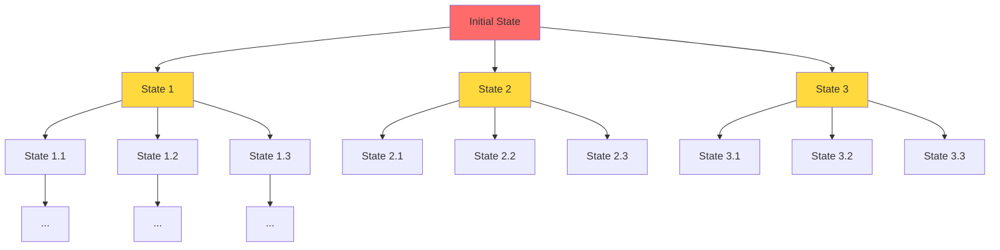

# Chapter 1: The Limits of Newtonian Computation

> **📚 Prerequisites**: Basic understanding of computational complexity and state machines. No advanced mathematics required.

> **🎯 Learning Objectives**: Understand why discrete-state computation fails at scale and why a paradigm shift is necessary.

---

## 1.1 The Core Concept: From Code to Knowledge

> **💡 Paradigm Shift**: Instead of treating data as rows in a database or code in a program, everything—facts, relationships, policies, and even logic—gets represented as a **graph of knowledge**.

### Traditional Computing vs Knowledge-Based Computing

```mermaid
graph TB
    subgraph Traditional["Traditional 'Newtonian' Computing"]
        T1[Relational Database] -->|SQL Queries| T2[Application Code]
        T2 -->|Business Logic| T3[Static Rules]
        T3 -->|Manual Updates| T4[Deployment Cycle]
    end

    subgraph KGC["Knowledge Geometry Calculus (KGC)"]
        K1[Knowledge Graph] -->|Reactive Hooks| K2[Field Interactions]
        K2 -->|Geometric Reasoning| K3[Emergent Behavior]
        K3 -->|Self-Adaptation| K4[Continuous Evolution]
    end

    style Traditional fill:#ffcccc
    style KGC fill:#ccffcc
```



### Knowledge Geometry Calculus (KGC)

**KGC** is a mathematical framework for organizing and reasoning about knowledge graphs, enabling systems to:

1. **React**: Respond to events in microseconds
2. **Plan**: Reason proactively about future states
3. **Adapt**: Self-govern without manual intervention

```
┌─────────────────────────────────────────────────────────┐
│  Knowledge State (K)                                    │
│  ┌──────────┐    ┌──────────┐    ┌──────────┐         │
│  │ Entity 1 │───▶│ Relation │───▶│ Entity 2 │         │
│  └──────────┘    └──────────┘    └──────────┘         │
│        │                                │               │
│        ▼                                ▼               │
│  ┌──────────┐                    ┌──────────┐         │
│  │ Property │                    │ Property │         │
│  └──────────┘                    └──────────┘         │
└─────────────────────────────────────────────────────────┘
            │
            ▼ Hook Evaluation (H)
┌─────────────────────────────────────────────────────────┐
│  Guard: Pattern Matching                                │
│  Effect: State Transformation                           │
│  Receipt: Cryptographic Proof                           │
└─────────────────────────────────────────────────────────┘
            │
            ▼ Knowledge Delta (Δ)
┌─────────────────────────────────────────────────────────┐
│  K' = K ⊕ Δ (New Knowledge State)                      │
└─────────────────────────────────────────────────────────┘
```

> **⚠️ Why This Matters**: This shifts computing away from "glue code" and static programming toward **self-governing, adaptive systems** that operate at machine timescales.

## 1.2 The Combinatorial Explosion Problem

Traditional "Newtonian" computing treats systems as discrete state machines. This leads to exponential complexity:

### State Space Explosion



> **📊 Complexity Analysis**:
> - **Newtonian Approach**: O(b^d) where b = branching factor, d = depth
> - **Relativistic Approach**: O(kd) where k = dimensions, d = depth
> - **Performance Gain**: Exponential → Linear reduction

### The Breaking Point

Consider a simple system with:
- 10 variables
- 10 possible values each
- 5 decision points

**Total states**: 10^10 × 10^5 = **10^15 possible states**

```
┌────────────────────────────────────────────────────────┐
│ Traditional State Enumeration                          │
│                                                        │
│  States = 10^15                                        │
│  Memory = 10^15 × 1KB = 1 Petabyte                    │
│  Evaluation time = 10^15 × 1μs = 31.7 years          │
└────────────────────────────────────────────────────────┘

┌────────────────────────────────────────────────────────┐
│ Field-Based Approach                                   │
│                                                        │
│  Dimensions = 10 × 5 = 50                             │
│  Memory = 50 × 1KB = 50KB                             │
│  Evaluation time = 50 × 1μs = 50μs                    │
└────────────────────────────────────────────────────────┘
```

> **⚠️ Critical Limitation**: State enumeration becomes intractable for real-world systems. Field-based computation remains **constant-time** regardless of state space size.

---

## Chapter Summary

In this chapter, we established the fundamental limitation of discrete-state "Newtonian" computation:

- **Combinatorial explosion** makes state enumeration intractable for real-world complexity
- Traditional systems scale as **O(b^d)** where b = branching factor, d = depth
- Even simple 10-variable systems generate **10^15 possible states**
- Field-based approaches reduce this to **O(kd) linear complexity**

### Key Takeaways

1. **Paradigm Failure**: Discrete-state machines cannot scale to handle real-world semantic complexity
2. **Performance Gap**: 10^15 states vs 50 dimensions = **trillion-fold** reduction in computational requirements
3. **Fundamental Shift**: Moving from state enumeration to field geometry eliminates the combinatorial barrier
4. **Practical Implication**: Systems that operate in microseconds rather than years

### What's Next

Chapter 2 introduces the **relativistic paradigm**—the field-based alternative that resolves these limitations through continuous information fields and geometric reasoning.

---

> **💡 Reflection Question**: If your current system had to enumerate all possible states, how long would it take? Now imagine the same system operating in linear time—what becomes possible?

---

## See Also

- **[Chapter 2: Relativistic Paradigm](04-section2-relativistic-paradigm.md)** - Learn how field-based computation solves the combinatorial explosion problem
- **[Chapter 3: Geometry of Knowledge](05-section3-geometry-of-knowledge.md)** - Mathematical foundations of vector space models
- **[Chapter 6: UHFT Case Study](10-section6-case-study-uhft.md)** - See how microsecond-scale execution validates the theory in ultra-high-frequency trading
- **[Section 8: Dark Matter Thesis](13-section8-dark-matter-thesis.md)** - Quantifying the 80% of code that can be eliminated
- **[Glossary: Combinatorial Explosion](glossary.md#combinatorial-explosion)** - Formal definition and related terms
- **[Glossary: Newtonian Computation](glossary.md#newtonian-computation)** - Understanding the discrete-state paradigm

---

**Next**: [Chapter 2: A Relativistic Paradigm](04-section2-relativistic-paradigm.md) introduces the field-based alternative that enables linear complexity.
