# Chapter 2: A Relativistic Paradigm - Field-Based Intelligence

> **📚 Prerequisites**: [Chapter 1: Limits of Newtonian Computation](03-section1-limits-of-newtonian-computation.md) - Understanding of combinatorial explosion and why discrete-state computation fails.

> **🎯 Learning Objectives**: Understand the four pillars of business value (Efficiency, Coordination, Compliance, Agility) and how field-based intelligence delivers them.

> **🔗 Connections**: This chapter introduces concepts validated empirically in [Chapter 6: UHFT](10-section6-case-study-uhft.md) and economically quantified in [Chapter 8: Dark Matter Thesis](13-section8-dark-matter-thesis.md).

---

## 2.1 The Dark Matter of Software

> **📊 The 80/20 Rule**: 80% of software development effort goes into non-differentiating "glue code" that connects systems, enforces policies, and maintains consistency. We call this the **Dark Matter of Enterprise IT**.


### Four Pillars of Business Value

<table>
<thead>
<tr>
<th>Pillar</th>
<th>Traditional Approach</th>
<th>KGC Approach</th>
<th>Value Created</th>
</tr>
</thead>
<tbody>
<tr>
<td><strong>Efficiency</strong></td>
<td>Manual coding of business rules</td>
<td>Graph-based knowledge hooks</td>
<td>80% reduction in code volume</td>
</tr>
<tr>
<td><strong>Coordination</strong></td>
<td>Message queues, APIs, polling</td>
<td>Real-time field synchronization</td>
<td>Microsecond-scale reactions</td>
</tr>
<tr>
<td><strong>Compliance</strong></td>
<td>Audit logs, manual reviews</td>
<td>Cryptographic receipts</td>
<td>Tamper-proof audit trails</td>
</tr>
<tr>
<td><strong>Agility</strong></td>
<td>Code-deploy-test cycles</td>
<td>Live graph updates</td>
<td>Zero-downtime policy changes</td>
</tr>
</tbody>
</table>

> **💡 Key Insight**: Knowledge hooks replace imperative code with declarative rules, reducing the "dark matter" overhead from 80% to <5% of total effort.

## 2.2 Efficiency: Eliminating Dark Matter

### Code Volume Comparison

```javascript
// Traditional Approach: 100+ lines of imperative code
function validateTransaction(tx) {
  if (tx.amount > 10000 && !tx.approved) {
    throw new Error("Requires approval");
  }
  if (tx.riskScore > 0.7) {
    flagForReview(tx);
  }
  if (tx.currency !== "USD") {
    convertCurrency(tx);
  }
  // ... 90+ more lines of business rules
  logAudit(tx);
  updateMetrics(tx);
  notifyStakeholders(tx);
}
```

```turtle
# KGC Approach: Declarative knowledge
:TransactionValidation a :Hook ;
  :guard [ :amount [ :greaterThan 10000 ] ; :approved false ] ;
  :effect [ :requireApproval true ] ;
  :priority :high .

:RiskAssessment a :Hook ;
  :guard [ :riskScore [ :greaterThan 0.7 ] ] ;
  :effect [ :flagForReview true ] .
```

> **📊 Reduction Metric**: 95-98% less code for equivalent business logic

### Visual Comparison


## 2.3 Coordination: Real-Time Shared Understanding

Multiple systems, agents, or even people can operate in real-time with shared understanding—perfect for multiplayer scenarios (e.g., finance, games, supply chain).

```mermaid
sequenceDiagram
    participant A as Agent A
    participant K as Knowledge Field
    participant B as Agent B
    participant C as Agent C

    A->>K: Update (t=0μs)
    K->>K: Field Propagation (t=1μs)
    K->>B: Reactive Hook Triggered (t=2μs)
    K->>C: Reactive Hook Triggered (t=2μs)
    B->>K: Coordinated Response (t=3μs)
    C->>K: Coordinated Response (t=3μs)

    Note over A,C: Total coordination time: <5μs
```



> **⚠️ Performance Note**: Traditional pub-sub systems operate at millisecond scale (1000x slower). KGC enables **microsecond-scale coordination**.

### Coordination Patterns


> **📊 Example**: In high-frequency trading, a 1ms delay can mean millions in lost opportunities. KGC's <5μs coordination enables strategies impossible with traditional architectures.

## 2.4 Compliance & Trust: Cryptographic Receipts

Every action can be cryptographically signed and auditable—crucial for governance, finance, and defense.

### Receipt Chain Architecture

```
Receipt = H(K₀) → H(K₁) → H(K₂) → ... → H(Kₙ)
           ↓        ↓        ↓              ↓
        Sign(H₀) Sign(H₁) Sign(H₂)      Sign(Hₙ)
```


> **🔒 Security Guarantee**: Receipts provide non-repudiable proof of every state transition, enabling compliance-by-design architecture.

### Audit Trail Properties

| Property | Traditional Logs | Cryptographic Receipts |
|----------|-----------------|------------------------|
| **Tamper Detection** | None | Immediate |
| **Non-Repudiation** | Weak (log rotation) | Strong (digital signatures) |
| **Completeness** | Partial (sampling) | Total (every transition) |
| **Performance Impact** | 10-30% overhead | <1% overhead |
| **Verification Cost** | O(n) log scanning | O(1) hash verification |

> **💡 Key Insight**: Traditional audit logs are append-only files that can be tampered with. Cryptographic receipts create an immutable chain where any modification breaks the signature chain.

## 2.5 Agility: Live Policy Updates

Changes to rules, policies, or strategies don't require re-coding—just update the graph.


### Live Update Example

```sparql
# Update trading risk limits in real-time
DELETE {
  :RiskPolicy :maxPositionSize 1000000 .
}
INSERT {
  :RiskPolicy :maxPositionSize 2000000 .
}
WHERE {
  :RiskPolicy a :TradingPolicy .
}
```

> **📊 Example**: Updating trading risk limits in traditional systems requires a deployment cycle (hours to days). With KGC, it's a graph update that takes effect in microseconds—**critical for high-frequency trading scenarios**.

### Deployment Comparison

| Metric | Traditional Deployment | KGC Live Update |
|--------|------------------------|-----------------|
| **Time to Production** | Hours to Days | Seconds |
| **Downtime** | Minutes to Hours | Zero |
| **Rollback Time** | Hours | Immediate |
| **Risk Level** | High (full rebuild) | Low (isolated change) |
| **Testing Required** | Full regression suite | Policy validation only |

> **⚠️ Important**: Live updates require careful policy validation to prevent inconsistent states. KGC's formal semantics ensure updates maintain system invariants.

---

## Practical Implications

### For Enterprise Decision-Makers

**Dark Matter Elimination**: Your organization is spending 80% of its IT budget on non-differentiating "glue code." KGC reduces this to <5%.

**Real-Time Governance**: Policy changes that currently require deployment cycles (hours to days) can execute in microseconds.

**Compliance-by-Design**: Instead of bolt-on audit systems, compliance becomes an architectural property with cryptographic guarantees.

**Strategic Flexibility**: Your systems can adapt to market changes at machine speeds, not human deployment cycles.

### For System Architects

**Architectural Simplification**: Replace complex microservices orchestration with declarative knowledge hooks.

**Performance Guarantees**: Microsecond-scale coordination enables applications impossible with traditional pub-sub (millisecond scale).

**Formal Verification**: Policy lattices with fixed-point convergence provide mathematical guarantees of system consistency.

**Zero-Downtime Evolution**: Live graph updates eliminate deployment windows and reduce operational risk.

### For Developers

**Code Volume Reduction**: 95-98% less code for equivalent business logic.

**Declarative Programming**: Focus on "what" (knowledge relationships) instead of "how" (imperative control flow).

**Built-in Auditability**: Every state transition automatically creates cryptographic receipts.

**Real-Time Reactivity**: Knowledge hooks trigger in microseconds, enabling new classes of applications.

---

## Chapter Summary

In this chapter, we introduced the **four pillars of business value** that the relativistic paradigm delivers:

### Key Concepts

1. **Efficiency**: 80% reduction in dark matter through knowledge hooks
2. **Coordination**: Microsecond-scale field synchronization vs millisecond pub-sub
3. **Compliance**: Cryptographic receipts provide tamper-proof audit trails
4. **Agility**: Live policy updates eliminate deployment cycles

### Quantified Benefits

| Pillar | Metric | Improvement |
|--------|--------|-------------|
| **Efficiency** | Lines of code | 95-98% reduction |
| **Coordination** | Reaction time | 1000x faster (μs vs ms) |
| **Compliance** | Tamper detection | Immediate vs none |
| **Agility** | Time to production | Seconds vs hours/days |

### Key Takeaways

1. **Paradigm Inversion**: Knowledge becomes truth, code becomes artifact
2. **Performance Quantum Leap**: Moving from milliseconds to microseconds enables entirely new application classes
3. **Economic Disruption**: Eliminating dark matter creates Blue Ocean market space
4. **Verifiable Trust**: Cryptographic receipts make compliance an architectural property, not a bolt-on feature

### What's Next

Chapter 3 provides the **mathematical foundation**—how vector space geometry enables semantic analogies and makes this paradigm shift formally rigorous.

---

> **💡 Strategic Question**: If your organization could eliminate 80% of its IT maintenance burden and react to market changes in microseconds instead of days, what new opportunities would become viable?

---

## See Also

- **[Chapter 3: Geometry of Knowledge](05-section3-geometry-of-knowledge.md)** - Mathematical foundations of vector space models and field theory
- **[Chapter 6: UHFT Case Study](10-section6-case-study-uhft.md)** - Real-world validation of microsecond-scale coordination in ultra-high-frequency trading
- **[Chapter 7: Mechanics of Determinism](11-section7-mechanics-of-determinism.md)** - Formal proof of the Chatman Constant and deterministic execution
- **[Chapter 8: Dark Matter Thesis](13-section8-dark-matter-thesis.md)** - Quantifying the 80/20 rule and reducible work
- **[Chapter 9: Blue Ocean Strategy](14-section9-blue-ocean-strategy.md)** - Strategic positioning through paradigm inversion
- **[Glossary: Dark Matter](glossary.md#dark-matter)** - Definition and economic impact
- **[Glossary: Field-Based Intelligence](glossary.md#field-based-intelligence)** - Paradigm overview

---

**Previous**: [Chapter 1: Limits of Newtonian Computation](03-section1-limits-of-newtonian-computation.md)
**Next**: [Chapter 3: The Geometry of Knowledge](05-section3-geometry-of-knowledge.md) provides the mathematical foundation for field-based reasoning.
