# Chapter 7: The Mechanics of Determinism

## 7.1 The Chatman Constant: 8-Primitive Bound

> **💡 Key Discovery**: Every reactive knowledge hook can be executed in **at most 8 primitive operations**, enabling microsecond-scale deterministic execution.

### The Eight Primitives

```mermaid
graph TD
    subgraph HookExecution["Hook Execution Pipeline (≤8 primitives)"]
        P1["1. Dispatch<br/>(O(1) lookup)"] -->|"~10ns"| P2["2-3. Memory Access<br/>(bounded footprint)"]
        P2 -->|"~20ns"| P3["4-6. Effect Execution<br/>(pure function)"]
        P3 -->|"~30ns"| P4["7. Receipt Hashing<br/>(bounded input)"]
        P4 -->|"~10ns"| P5["8. Deadline Check<br/>& Enqueue"]
    end

    style HookExecution fill:#e1f5ff
    style P1 fill:#51cf66
    style P2 fill:#51cf66
    style P3 fill:#51cf66
    style P4 fill:#51cf66
    style P5 fill:#51cf66
```



### Primitive Breakdown

```
┌─────────────────────────────────────────────────────┐
│ Primitive 1: Constant-Time Dispatch                │
│   Input: Hook trigger event                         │
│   Operation: Hash table lookup O(1)                │
│   Output: Hook handler reference                    │
│   Time: ~10ns (L1 cache hit)                       │
└─────────────────────────────────────────────────────┘

┌─────────────────────────────────────────────────────┐
│ Primitives 2-3: Bounded Memory Access              │
│   Input: Knowledge state reference                  │
│   Operation: Read constant-size fiber               │
│   Output: Relevant triples (max k triples)         │
│   Time: ~10ns per access (L1 cache)               │
└─────────────────────────────────────────────────────┘

┌─────────────────────────────────────────────────────┐
│ Primitives 4-6: Pure Effect on Bounded Footprint   │
│   Input: Guard evaluation result                    │
│   Operation: State transformation (max k triples)   │
│   Output: Knowledge delta Δ                        │
│   Time: ~10ns per operation                        │
└─────────────────────────────────────────────────────┘

┌─────────────────────────────────────────────────────┐
│ Primitive 7: Receipt Hashing                       │
│   Input: Pre/post state (truncated)                │
│   Operation: Cryptographic hash (SHA-256)          │
│   Output: Receipt digest                           │
│   Time: ~10ns (hardware-accelerated)              │
└─────────────────────────────────────────────────────┘

┌─────────────────────────────────────────────────────┐
│ Primitive 8: Deadline Check & Enqueue              │
│   Input: Current timestamp, deadline               │
│   Operation: Compare + queue insert O(1)           │
│   Output: Next hook in queue (if any)             │
│   Time: ~10ns                                      │
└─────────────────────────────────────────────────────┘
```

> **📊 Total Execution Time**: 8 × 10ns = **80ns per hook** (theoretical minimum with perfect cache locality)

## 7.2 Operational Semantics

### The Microstep Machine

```
M = (S, ⇒, cost)

Where:
- S = State space (K, Q)
  - K = Knowledge graph
  - Q = Pending hook queue
- ⇒ = Transition relation (executes ≤1 hook per reaction)
- cost: primitive → {1} (each primitive costs 1 unit)
```



```mermaid
stateDiagram-v2
    [*] --> σ₀: Initial State

    σ₀ --> σ₁: Hook₁ (≤8 primitives)
    σ₁ --> σ₂: Hook₂ (≤8 primitives)
    σ₂ --> σ₃: Hook₃ (≤8 primitives)
    σ₃ --> σₙ: ... (bounded queue)

    σₙ --> [*]: Stable State

    note right of σ₀
        State σ = (K, Q)
        K = Knowledge graph
        Q = Hook queue
    end note

    note right of σ₁
        Transition: σ ⇒ σ'
        Cost: ≤8 primitives
        Time: <100ns
    end note
```

### Determinism Guarantee

```
∀ σ, σ' ∈ S: σ ⇒ σ' is deterministic iff:

1. Guard evaluation is pure (no side effects)
2. Effect application is commutative for disjoint supports
3. Receipt generation is collision-resistant
4. Queue ordering is total (priority + timestamp)
```

> **🔒 Guarantee**: Given the same initial state K₀ and event sequence E, the system will always reach the same final state Kₙ with the same receipt chain R.

## 7.3 Boundedness Theorem

### Formal Statement

**Theorem (Chatman Constant)**:
If each hook H satisfies:
1. **Dispatchability**: O(1) selection independent of |K|
2. **Locality**: Effect reads/writes constant-size fiber of K
3. **Receipt bound**: |c(K')| truncated to constant-size digest

Then every reaction step σ ⇒ σ' consumes ≤ Θ = 8 primitives.

### Proof Sketch


**Proof**:
1. Map each sub-phase to primitives 1-8
2. Show each is constant-time under locality assumptions
3. Sum: 1 + 2 + 3 + 1 + 1 = 8 primitives
4. Therefore: ∀ σ ⇒ σ', cost(σ ⇒ σ') ≤ 8 ∎

> **⚠️ Critical**: The bound holds **only if hooks respect locality**. Unbounded effects break determinism.

## 7.4 Algebra of Effects

### Effect Composition

```
E: K → K (effect function on knowledge state)
supp(E) ⊆ K (support: subset affected by E)

Laws:
1. Commutativity by separation:
   supp(E₁) ∩ supp(E₂) = ∅ ⟹ E₁ ∘ E₂ = E₂ ∘ E₁

2. Idempotence (validation effects):
   E ∘ E = E

3. Monoid structure:
   (E, ∘, id) with selective commutativity

4. Deterministic batching:
   Order-irrelevant for disjoint supports
```



```mermaid
graph LR
    subgraph SeparateEffects["Disjoint Support (Commutative)"]
        S1[E₁: Updates entity A] -->|"Parallel"| S2[E₂: Updates entity B]
        S2 -->|"E₁ ∘ E₂ = E₂ ∘ E₁"| S3[Final State]
    end

    subgraph OverlappingEffects["Overlapping Support (Non-Commutative)"]
        O1[E₃: Reads + writes A] -->|"Sequential"| O2[E₄: Reads + writes A]
        O2 -->|"E₃ ∘ E₄ ≠ E₄ ∘ E₃"| O3[Order Matters]
    end

    style SeparateEffects fill:#ccffcc
    style OverlappingEffects fill:#ffe1e1
```

### Parallel Execution Example

```javascript
// Hook 1: Update transaction amount
const E1 = {
  support: ["tx:123", "tx:123/amount"],
  effect: (K) => K.set("tx:123/amount", 5000)
};

// Hook 2: Update transaction status
const E2 = {
  support: ["tx:456", "tx:456/status"],
  effect: (K) => K.set("tx:456/status", "approved")
};

// Disjoint supports → can execute in parallel
// E1 ∘ E2 = E2 ∘ E1 (order doesn't matter)
parallelExecute([E1, E2]); // Safe!
```

```javascript
// Hook 3: Read transaction amount
const E3 = {
  support: ["tx:123", "tx:123/amount"],
  effect: (K) => K.get("tx:123/amount") * 1.1
};

// Hook 4: Update transaction amount
const E4 = {
  support: ["tx:123", "tx:123/amount"],
  effect: (K) => K.set("tx:123/amount", 6000)
};

// Overlapping supports → must serialize
// E3 ∘ E4 ≠ E4 ∘ E3 (order matters)
sequentialExecute([E3, E4]); // Required!
```

> **💡 Key Optimization**: The system automatically detects disjoint supports and parallelizes hook execution, maximizing throughput while preserving determinism.

## 7.5 Provenance & Receipts

### Receipt Definition

```
R(K, H) = ⟨id(K), id(E(K))⟩

Where:
- id(K) = Canonical hash of knowledge state K
- E = Effect function of hook H
- E(K) = Resulting state after applying H to K
```

### Receipt Chain Properties

```mermaid
graph LR
    K0[K₀] -->|H₁| K1[K₁]
    K1 -->|H₂| K2[K₂]
    K2 -->|H₃| K3[K₃]

    K0 -.->|id(K₀)| R0["R₀ = ⟨h₀, h₁⟩"]
    K1 -.->|id(K₁)| R1["R₁ = ⟨h₁, h₂⟩"]
    K2 -.->|id(K₂)| R2["R₂ = ⟨h₂, h₃⟩"]

    R0 -->|Compose| R01["R₀₁ = ⟨h₀, h₂⟩"]
    R1 -->|Compose| R01
    R01 -->|Compose| R012["R₀₁₂ = ⟨h₀, h₃⟩"]
    R2 -->|Compose| R012

    style K0 fill:#e1f5ff
    style K1 fill:#e1f5ff
    style K2 fill:#e1f5ff
    style K3 fill:#e1f5ff
    style R012 fill:#51cf66
```

**Properties**:

1. **Integrity**: If h is collision-resistant, R binds pre/post states up to isomorphism
2. **Composability**: Receipts compose transitively
   `R₂ ∘ R₁ = ⟨id(K₀), id(K₂)⟩` if `K₁ = E₁(K₀)`, `K₂ = E₂(K₁)`
3. **Non-repudiation**: Digital signatures prevent denial of authorship
4. **Completeness**: Every state transition has a receipt (total audit trail)

### Verification Algorithm

```javascript
function verifyReceiptChain(receipts, initialState, finalState) {
  let currentHash = hash(initialState);

  for (const receipt of receipts) {
    // Verify receipt links to current state
    if (receipt.preHash !== currentHash) {
      return { valid: false, error: "Broken chain" };
    }

    // Verify signature
    if (!verifySignature(receipt.signature, receipt.hash)) {
      return { valid: false, error: "Invalid signature" };
    }

    currentHash = receipt.postHash;
  }

  // Verify final state matches
  if (currentHash !== hash(finalState)) {
    return { valid: false, error: "Final state mismatch" };
  }

  return { valid: true, proofChain: receipts };
}
```

> **🔒 Security**: Receipt verification is O(n) in chain length but O(1) per receipt. A 1000-step execution can be verified in <1ms.

## 7.6 Deadline Enforcement

### Temporal Constraints

```
Hook deadline: τ_deadline
Current time: τ_now

Constraint: τ_now ≤ τ_deadline for hook to execute

If τ_now > τ_deadline:
  - Hook is skipped
  - Violation receipt generated
  - Fallback policy triggered (optional)
```



```mermaid
sequenceDiagram
    participant T as Time
    participant Q as Hook Queue
    participant E as Executor
    participant V as Violation Handler

    T->>Q: τ = 0μs (Hook arrives, deadline = 10μs)
    Q->>E: τ = 2μs (Dispatch hook)
    E->>E: τ = 3μs (Check: 3μs ≤ 10μs ✓)
    E->>E: τ = 4μs (Execute)
    E->>Q: τ = 5μs (Complete ✓)

    T->>Q: τ = 12μs (Late hook, deadline = 10μs)
    Q->>E: τ = 13μs (Dispatch)
    E->>E: τ = 13μs (Check: 13μs > 10μs ✗)
    E->>V: τ = 14μs (Violation!)
    V->>Q: τ = 15μs (Log + Fallback)
```

> **⚠️ Critical for Real-Time**: Deadline enforcement ensures temporal determinism. In UHFT scenarios, a 100μs deadline miss can invalidate a trade.

## 7.7 L1 Cache Cost Model

### Cache Locality Optimization

```
Assumption: Knowledge state K fits in L1 cache
- L1 cache size: ~32KB per core
- Max triples: 32KB / 64B = ~500 triples
- Access time: ~1-4 CPU cycles (~0.3-1.2ns @ 3GHz)

Locality requirement:
  Hook effect footprint ≤ c × |L1|
  where c ≈ 0.1-0.2 (conservative bound)
```


> **📊 Performance Impact**:
> - L1 hit: ~1ns per access
> - L2 hit: ~3-10ns per access
> - RAM hit: ~50-100ns per access
>
> **KGC optimization**: Keep hook working set in L1 for consistent <100ns execution.

### Cache-Aware Hook Design

```javascript
// ❌ BAD: Unbounded traversal (cache thrashing)
function badHook(K) {
  const allTransactions = K.query("SELECT * FROM transactions");
  return processAll(allTransactions); // Could be millions!
}

// ✅ GOOD: Bounded footprint (cache-friendly)
function goodHook(K) {
  const recentTx = K.query(
    "SELECT * FROM transactions WHERE timestamp > NOW() - 1s LIMIT 10"
  );
  return processBatch(recentTx); // Max 10 triples
}
```

> **💡 Design Principle**: Hooks should operate on **constant-size knowledge fibers**, not unbounded graph traversals. This ensures cache locality and deterministic execution time.
