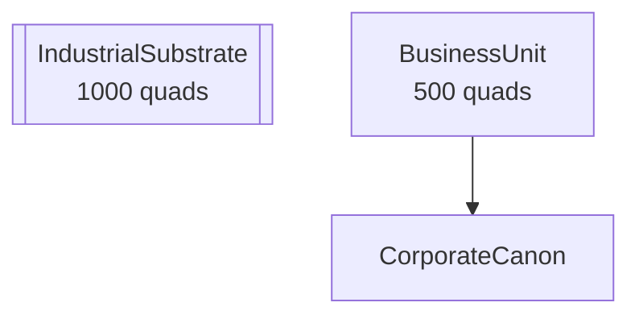

# Documentation as Projection

**Core Formula**: `M_t = Pi_doc(mu(O_t))`

Where:
- `O_t` = Monorepo universe at time t
- `mu(O)` = Operation producing artifacts
- `Pi_doc` = Documentation projection operator
- `M_t` = Markdown documentation

**Guarantee**: Same `O` always produces the same `M` (deterministic, reproducible).

---

## Overview

Documentation in UNRDF is not written manually but **projected** from the codebase. This ensures:

1. **Determinism**: Same source code always produces the same documentation
2. **Verifiability**: Every projection can be verified via content hash
3. **Auditability**: Every projection emits a receipt for governance trail
4. **Freshness**: Documentation is always in sync with code

---

## The Projection Model

### Input Universe

The documentation pipeline takes the monorepo universe as input:

```javascript
const input = {
  sources: [
    { name: 'universe.mjs', content: '...', type: 'source' },
    { name: 'universe.test.mjs', content: '...', type: 'test' },
  ],
  universe: universeInstance,  // RDF Universe with partitions
  receipts: receiptChain.getAll(),  // Governance receipts
  guides: [],  // Optional guide definitions
  customDocs: [],  // Additional custom documents
};
```

### Projection Operators

Each projector is a pure function that transforms input to Markdown:

| Projector | Input | Output | Diataxis Quadrant |
|-----------|-------|--------|-------------------|
| `JsDocProjector` | Source files with JSDoc | API reference | Reference |
| `ArchitectureProjector` | RDF partitions | Architecture docs | Explanation |
| `ExampleProjector` | Test files | Executable examples | Tutorial |
| `GuideProjector` | Patterns + context | How-to guides | How-to |
| `ChangelogProjector` | Receipt chain | Changelog | Reference |

### Output Hash

Every projection produces a deterministic hash:

```javascript
const result = await projector.project(sourceContent, moduleName);
console.log(result.hash);  // 'abc123...' - always same for same input
```

---

## Diataxis Framework

The `DiataxisRenderer` routes documentation to the appropriate quadrant:

```
                    PRACTICAL
                       |
    +------------------+------------------+
    |                  |                  |
    |    TUTORIALS     |    HOW-TO        |
    |                  |    GUIDES        |
    |  Learning-       |  Goal-           |
    |  oriented        |  oriented        |
    |                  |                  |
----+------------------+------------------+----
    |                  |                  |
    |  EXPLANATION     |   REFERENCE      |
    |                  |                  |
    |  Understanding-  |  Information-    |
    |  oriented        |  oriented        |
    |                  |                  |
    +------------------+------------------+
                       |
                   THEORETICAL
```

### Quadrant Mapping

| Source | Projector | Quadrant | Audience |
|--------|-----------|----------|----------|
| JSDoc comments | JsDocProjector | Reference | User, Contributor |
| Test files | ExampleProjector | Tutorial | User |
| Partition structure | ArchitectureProjector | Explanation | Contributor |
| Guide templates | GuideProjector | How-to | User |
| Receipt chain | ChangelogProjector | Reference | Auditor |

---

## Projector Details

### JsDocProjector

Extracts JSDoc comments and generates API reference documentation.

**Input**: JavaScript source files with JSDoc comments

```javascript
/**
 * Add two numbers
 *
 * @param {number} a - First number
 * @param {number} b - Second number
 * @returns {number} Sum
 *
 * @example
 * add(1, 2) // => 3
 */
export function add(a, b) {
  return a + b;
}
```

**Output**: Markdown API reference

```markdown
## add

`Function`

Add two numbers

**Parameters:**

| Name | Type | Description |
|------|------|-------------|
| `a` | `number` | First number |
| `b` | `number` | Second number |

**Returns:** `number` - Sum

**Example:**

```javascript
add(1, 2) // => 3
```
```

**Usage**:

```javascript
import { JsDocProjector } from '@unrdf/projection';

const projector = new JsDocProjector();
const result = await projector.project(sourceCode, 'my-module');

console.log(result.markdown);  // Markdown content
console.log(result.hash);      // Deterministic hash
console.log(result.entries);   // Parsed JSDoc entries
```

### ArchitectureProjector

Generates architecture documentation from RDF partition structure.

**Input**: Universe partition metadata

```javascript
const input = {
  partitions: [
    {
      name: 'IndustrialSubstrate',
      description: 'Foundational W3C ontologies',
      readOnly: true,
      namespaceIris: ['http://www.w3.org/ns/prov#'],
      size: 1000,
    },
    // ...
  ],
  dependencies: [
    { from: 'BusinessUnit', to: 'CorporateCanon', type: 'extends' },
  ],
};
```

**Output**: Architecture documentation with Mermaid diagrams

```markdown
## Partition Hierarchy

| Priority | Partition | Description | Read-Only | Quads |
|----------|-----------|-------------|-----------|-------|
| 1 | **IndustrialSubstrate** | Foundational W3C ontologies | Yes | 1000 |

## Structure Diagram


```

### ExampleProjector

Extracts test cases as executable examples.

**Input**: Test files with describe/it blocks

```javascript
describe('Calculator', () => {
  it('should add two numbers', () => {
    const result = add(1, 2);
    expect(result).toBe(3);
  });
});
```

**Output**: Example documentation

```markdown
## Calculator

### should add two numbers

Add two numbers

*Tags: `async`*

```javascript
const result = add(1, 2);
expect(result).toBe(3);
```

**Expected Output:**

```
result => 3
```
```

### GuideProjector

Generates how-to guides from templates and patterns.

**Built-in Templates**:

- `create-partition` - Creating custom partitions
- `add-ontology` - Adding ontologies to IndustrialSubstrate
- `create-receipt` - Generating governance receipts
- `query-universe` - Querying across partitions
- `project-documentation` - Generating documentation

**Usage**:

```javascript
import { GuideProjector } from '@unrdf/projection';

const projector = new GuideProjector();

// Generate from template
const guide = projector.generateFromTemplate('create-partition', {
  description: 'How to create a custom partition',
  code: [
    'class MyPartition extends Partition { ... }',
    'new MyPartition({ name: "MyPartition" })',
  ],
});

const result = await projector.project([guide]);
```

### ChangelogProjector

Generates changelog from governance receipts.

**Input**: Receipt chain

```javascript
const receipts = [
  {
    receiptHash: 'abc123...',
    decision: 'allow',
    epoch: 'τ_2025_12_26_1200_000',
    generatedAtTime: '2025-12-26T12:00:00.000Z',
    inputHashes: {
      ontologyReleases: ['hash1'],
      deltaCapsule: 'deltahash',
    },
  },
];
```

**Output**: Changelog

```markdown
# Changelog

## 2025-12-26

- **[ALLOW]** Admitted delta capsule with 1 ontology
  - Epoch: `τ_2025_12_26_1200_000`
  - Receipt: `abc123...`
```

---

## The Projection Pipeline

The `ProjectionPipeline` orchestrates all projectors:

```javascript
import { ProjectionPipeline } from '@unrdf/projection';

const pipeline = new ProjectionPipeline({
  projectName: 'UNRDF',
  version: '1.0.0',
  audiences: ['user', 'contributor', 'operator', 'auditor'],
});

const result = await pipeline.run({
  sources: [
    { name: 'universe.mjs', content: '...', type: 'source' },
    { name: 'universe.test.mjs', content: '...', type: 'test' },
  ],
  universe: universe,
  receipts: receiptChain.getAll(),
});

console.log(result.outputHash);        // Combined hash
console.log(result.deterministic);     // true
console.log(result.receipts);          // Projection receipts
console.log(result.diataxis.mainIndex); // Main documentation index
```

### Pipeline Output

```javascript
{
  inputHash: 'abc...',       // Hash of all inputs
  outputHash: 'def...',      // Combined output hash
  deterministic: true,       // Verification passed
  projections: {
    jsdoc: { modules: [...], combinedHash: '...' },
    architecture: { markdown: '...', hash: '...' },
    examples: { files: [...], combinedHash: '...' },
    guides: { guides: [...], combinedHash: '...' },
    changelog: { markdown: '...', hash: '...' },
  },
  diataxis: {
    mainIndex: '...',         // Main documentation index
    quadrants: {              // By quadrant
      tutorial: { index: '...', documents: [...] },
      'how-to': { ... },
      reference: { ... },
      explanation: { ... },
    },
    audiences: {              // By audience
      user: '...',
      contributor: '...',
    },
  },
  receipts: [                 // Projection receipts
    {
      projectorType: 'jsdoc',
      inputHash: '...',
      outputHash: '...',
      timestamp: '...',
      documentCount: 5,
      deterministic: true,
    },
  ],
  summary: {
    sourceCount: 10,
    testCount: 5,
    documentCount: 20,
    guideCount: 5,
    exampleCount: 15,
  },
}
```

---

## Determinism Verification

Every projection can be verified:

```javascript
// Single projector
const projector = new JsDocProjector();
const result = await projector.project(source, 'module');
const verified = await projector.verifyDeterminism(source, 'module', result.hash);
console.log(verified);  // true

// Full pipeline
const pipeline = new ProjectionPipeline({ projectName: 'Test' });
const result = await pipeline.run(input);
const verified = await pipeline.verifyDeterminism(input, result.outputHash);
console.log(verified);  // true
```

---

## Receipt Emission

Every projection emits a receipt for governance:

```javascript
const result = await pipeline.run(input);

for (const receipt of result.receipts) {
  console.log(receipt);
  // {
  //   projectorType: 'jsdoc',
  //   inputHash: 'abc...',
  //   outputHash: 'def...',
  //   timestamp: '2025-12-26T12:00:00.000Z',
  //   documentCount: 5,
  //   deterministic: true,
  // }
}
```

These receipts can be:
- Stored in the receipt chain
- Used for auditing
- Verified later for reproducibility

---

## Multi-Audience Rendering

Documentation is rendered for different audiences:

```javascript
const renderer = new DiataxisRenderer({
  projectName: 'UNRDF',
  audiences: ['user', 'contributor', 'operator', 'auditor'],
});

const result = await renderer.render(documents);

// Access audience-specific views
console.log(result.audiences.user);        // User documentation
console.log(result.audiences.contributor); // Contributor documentation
console.log(result.audiences.operator);    // Operator documentation
console.log(result.audiences.auditor);     // Auditor documentation
```

### Audience Focus

| Audience | Focus | Key Documents |
|----------|-------|---------------|
| User | API usage, tutorials | API Reference, Tutorials, Examples |
| Contributor | Architecture, development | Architecture, Development Guides |
| Operator | Deployment, configuration | Deployment Guides, Configuration |
| Auditor | Governance, receipts | Changelog, Receipt Logs, Proof Trees |

---

## Customizing Projections

### Custom Guide Templates

```javascript
const projector = new GuideProjector();

// Add steps to template
const guide = projector.generateFromTemplate('create-partition', {
  description: 'Create a partition for customer data',
  prerequisites: ['Node.js 18+', 'UNRDF installed'],
  code: [
    `class CustomerPartition extends Partition {
  constructor() {
    super({
      name: 'CustomerData',
      description: 'Customer-specific data',
      readOnly: false,
    });
  }
}`,
    // More code snippets for each step
  ],
  notes: [
    ['Partitions can be read-only or read-write'],
    ['Namespaces define allowed IRIs'],
  ],
});
```

### Custom Diataxis Quadrants

```javascript
const renderer = new DiataxisRenderer({
  projectName: 'UNRDF',
  customQuadrants: {
    governance: {
      label: 'Governance',
      description: 'Policy and compliance documentation',
      icon: 'shield',
    },
  },
});
```

---

## Pipeline Report

Generate a summary report:

```javascript
const result = await pipeline.run(input);
const report = pipeline.generateReport(result);
console.log(report);
```

Output:

```markdown
# Documentation Projection Report

**Project**: UNRDF
**Version**: 1.0.0
**Generated**: 2025-12-26T12:00:00.000Z

---

## Summary

| Metric | Value |
|--------|-------|
| Source Files | 10 |
| Test Files | 5 |
| Documents Generated | 20 |
| Guides | 5 |
| Examples | 15 |
| Deterministic | Yes |

## Hashes

- **Input Hash**: `abc123...`
- **Output Hash**: `def456...`

## Projection Receipts

| Projector | Input Hash | Output Hash | Documents |
|-----------|------------|-------------|-----------|
| jsdoc | `abc...` | `def...` | 5 |
| architecture | `ghi...` | `jkl...` | 1 |
| examples | `mno...` | `pqr...` | 5 |
```

---

## Best Practices

### 1. Always Verify Determinism

```javascript
const result1 = await pipeline.run(input);
const result2 = await pipeline.run(input);
assert(result1.outputHash === result2.outputHash);
```

### 2. Store Projection Receipts

```javascript
const result = await pipeline.run(input);
for (const receipt of result.receipts) {
  await receiptStore.save(receipt);
}
```

### 3. Use Typed Inputs

```javascript
// Good: Explicit types
const sources = [
  { name: 'module.mjs', content: code, type: 'source' },
  { name: 'module.test.mjs', content: test, type: 'test' },
];

// Bad: Implicit types
const sources = [
  { name: 'module.mjs', content: code },  // type missing
];
```

### 4. Include Custom Docs for Special Cases

```javascript
const result = await pipeline.run({
  sources: [...],
  customDocs: [
    {
      id: 'getting-started',
      title: 'Getting Started',
      content: '# Getting Started\n\nWelcome to UNRDF...',
      quadrant: 'tutorial',
      audience: 'user',
    },
  ],
});
```

---

## File Structure

```
src/projection/
  index.mjs                    # Module exports
  jsdoc-projector.mjs          # JSDoc -> API docs
  architecture-projector.mjs   # RDF structure -> architecture docs
  example-projector.mjs        # Tests -> examples
  guide-projector.mjs          # Patterns -> how-to guides
  changelog-projector.mjs      # Receipts -> changelog
  diataxis-renderer.mjs        # Route to Diataxis quadrants
  projection-pipeline.mjs      # Unified pipeline
  projection.test.mjs          # Tests
  package.json                 # Package configuration
```

---

## Summary

Documentation is a projection:

1. **Input**: Monorepo universe (source, tests, RDF, receipts)
2. **Projection**: Deterministic transformation to Markdown
3. **Verification**: Content hash proves reproducibility
4. **Audit**: Receipts provide governance trail

Same input always produces the same output. Documentation is governance.
