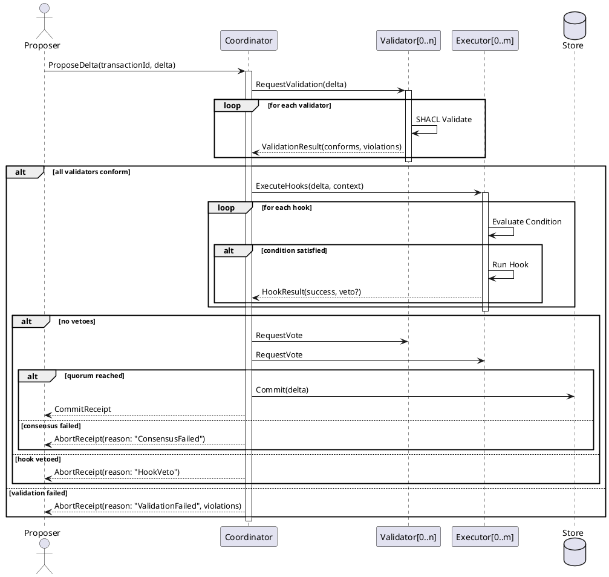

# Hyper-Frameworks for Autonomic Hyperintelligent Systems

**Version**: 1.0.0
**Status**: Machine-Executable Specification
**Format**: Hybrid JSON-LD + Markdown

---

## Table of Contents

1. [Introduction](#introduction)
2. [Hyper-Diataxis Framework](#hyper-diataxis-framework)
3. [Hyper-FMEA Framework](#hyper-fmea-framework)
4. [Hyper-TRIZ Framework](#hyper-triz-framework)
5. [Hyper-DFLSS Framework](#hyper-dflss-framework)
6. [Complete Examples](#complete-examples)
7. [RDF Ontology](#rdf-ontology)
8. [Comparison to Human-Oriented Diataxis](#comparison-to-human-oriented-diataxis)

---

## Introduction

Traditional documentation frameworks (Diataxis, FMEA, TRIZ, DFLSS) are designed for human consumption. **Hyper-Frameworks** extend these for autonomic hyperintelligent systems where:

- Agents discover and match capabilities programmatically
- Protocols define machine-to-machine communication
- Types are semantically annotated for reasoning
- Rules enable autonomous decision-making
- Quality is measured via OTEL spans, not human observation

### Design Principles

1. **Machine-First**: JSON-LD, RDF, Zod schemas over prose
2. **Semantic Richness**: OWL ontologies for reasoning
3. **Testable**: Every specification has success criteria
4. **Observable**: OTEL integration for validation
5. **Evolvable**: Versioned contracts with compatibility rules

---

## Hyper-Diataxis Framework

The four pillars of Hyper-Diataxis replace human-oriented documentation with machine-executable specifications.

### Pillar 1: Capability Specifications

**Purpose**: Agent capability discovery and matching
**Format**: JSON-LD with semantic annotations

```json
{
  "@context": {
    "@vocab": "https://unrdf.org/ontology/hyper#",
    "cap": "https://unrdf.org/ontology/capability#",
    "xsd": "http://www.w3.org/2001/XMLSchema#",
    "schema": "https://schema.org/"
  },
  "@type": "cap:CapabilitySpecification",
  "@id": "cap:knowledge-hook-execution",

  "cap:version": "1.0.0",
  "cap:name": "Knowledge Hook Execution",
  "cap:description": "Execute SPARQL/SHACL-triggered hooks on RDF graph mutations",

  "cap:preconditions": [
    {
      "@type": "cap:Precondition",
      "cap:predicate": "hasValidStore",
      "cap:description": "N3 Store instance must be initialized",
      "cap:checkQuery": "ASK { ?s ?p ?o } LIMIT 1"
    },
    {
      "@type": "cap:Precondition",
      "cap:predicate": "hasRegisteredHook",
      "cap:description": "At least one knowledge hook must be registered",
      "cap:checkFunction": "manager.knowledgeHooks.size > 0"
    }
  ],

  "cap:postconditions": [
    {
      "@type": "cap:Postcondition",
      "cap:predicate": "hooksExecuted",
      "cap:description": "All matching hooks have been executed",
      "cap:verifyQuery": "SELECT ?hook WHERE { ?hook a :ExecutedHook }"
    },
    {
      "@type": "cap:Postcondition",
      "cap:predicate": "receiptGenerated",
      "cap:description": "Transaction receipt with hook results exists"
    }
  ],

  "cap:inputSchema": {
    "@type": "cap:ZodSchema",
    "cap:schemaRef": "HookEventSchema",
    "cap:schemaDefinition": {
      "name": "string.min(1).max(100)",
      "payload": "any",
      "context": {
        "graph": "N3Store",
        "env": "record(any).optional()",
        "transactionId": "string.uuid().optional()"
      }
    }
  },

  "cap:outputSchema": {
    "@type": "cap:ZodSchema",
    "cap:schemaRef": "HookResultSchema",
    "cap:schemaDefinition": {
      "success": "boolean",
      "result": "any.optional()",
      "error": "string.optional()",
      "duration": "number.nonnegative()",
      "phase": "enum(['before', 'run', 'after', 'completed', 'failed'])"
    }
  },

  "cap:successCriteria": [
    {
      "@type": "cap:SuccessCriterion",
      "cap:metric": "latency_p99",
      "cap:operator": "<=",
      "cap:value": 2,
      "cap:unit": "milliseconds"
    },
    {
      "@type": "cap:SuccessCriterion",
      "cap:metric": "error_rate",
      "cap:operator": "<",
      "cap:value": 0.001,
      "cap:unit": "ratio"
    },
    {
      "@type": "cap:SuccessCriterion",
      "cap:metric": "hooks_per_minute",
      "cap:operator": ">=",
      "cap:value": 10000,
      "cap:unit": "count"
    }
  ],

  "cap:failureModes": [
    {
      "@type": "cap:FailureMode",
      "@id": "cap:FM001",
      "cap:name": "ConditionEvaluationTimeout",
      "cap:recoveryStrategy": "cap:RetryWithBackoff",
      "cap:maxRetries": 3
    },
    {
      "@type": "cap:FailureMode",
      "@id": "cap:FM002",
      "cap:name": "SandboxResourceExhaustion",
      "cap:recoveryStrategy": "cap:GracefulDegradation"
    }
  ],

  "cap:performanceCharacteristics": {
    "cap:latencyP50": { "@value": 0.5, "@type": "xsd:decimal" },
    "cap:latencyP95": { "@value": 1.5, "@type": "xsd:decimal" },
    "cap:latencyP99": { "@value": 2.0, "@type": "xsd:decimal" },
    "cap:throughput": { "@value": 10000, "@type": "xsd:integer" },
    "cap:memoryFootprint": { "@value": 64, "@type": "xsd:integer", "cap:unit": "MB" }
  },

  "cap:resourceRequirements": {
    "cap:minMemory": { "@value": 128, "cap:unit": "MB" },
    "cap:minCPU": { "@value": 1, "cap:unit": "cores" },
    "cap:dependencies": [
      "n3",
      "rdf-ext",
      "@opentelemetry/api"
    ]
  },

  "cap:dependencies": [
    { "@id": "cap:rdf-parsing", "cap:minVersion": "1.0.0" },
    { "@id": "cap:shacl-validation", "cap:minVersion": "1.0.0" }
  ],

  "cap:authorizationScopes": [
    "knowledge:hooks:read",
    "knowledge:hooks:execute",
    "knowledge:transactions:write"
  ]
}
```

### Pillar 2: Protocol Specifications

**Purpose**: Agent-to-agent communication and coordination
**Format**: State machines + message schemas

```json
{
  "@context": {
    "@vocab": "https://unrdf.org/ontology/hyper#",
    "proto": "https://unrdf.org/ontology/protocol#",
    "sm": "https://unrdf.org/ontology/statemachine#"
  },
  "@type": "proto:ProtocolSpecification",
  "@id": "proto:distributed-hook-consensus",

  "proto:name": "Distributed Hook Consensus Protocol",
  "proto:version": "1.0.0",
  "proto:namespace": "https://unrdf.org/protocols/consensus#",

  "proto:agents": [
    {
      "@type": "proto:AgentRole",
      "@id": "proto:Proposer",
      "proto:description": "Agent proposing graph mutations",
      "proto:capabilities": ["cap:transaction-propose"]
    },
    {
      "@type": "proto:AgentRole",
      "@id": "proto:Validator",
      "proto:description": "Agent validating SHACL constraints",
      "proto:capabilities": ["cap:shacl-validation"]
    },
    {
      "@type": "proto:AgentRole",
      "@id": "proto:Executor",
      "proto:description": "Agent executing knowledge hooks",
      "proto:capabilities": ["cap:knowledge-hook-execution"]
    },
    {
      "@type": "proto:AgentRole",
      "@id": "proto:Coordinator",
      "proto:description": "Agent coordinating consensus",
      "proto:capabilities": ["cap:consensus-coordination"]
    }
  ],

  "proto:stateMachine": {
    "@type": "sm:StateMachine",
    "sm:initialState": "Idle",
    "sm:finalStates": ["Committed", "Aborted"],

    "sm:states": [
      {
        "@type": "sm:State",
        "@id": "sm:Idle",
        "sm:description": "No active transaction"
      },
      {
        "@type": "sm:State",
        "@id": "sm:Proposed",
        "sm:description": "Delta proposed, awaiting validation"
      },
      {
        "@type": "sm:State",
        "@id": "sm:Validating",
        "sm:description": "SHACL validation in progress"
      },
      {
        "@type": "sm:State",
        "@id": "sm:HooksExecuting",
        "sm:description": "Knowledge hooks executing"
      },
      {
        "@type": "sm:State",
        "@id": "sm:ConsensusBuilding",
        "sm:description": "Multi-agent consensus in progress"
      },
      {
        "@type": "sm:State",
        "@id": "sm:Committed",
        "sm:description": "Transaction committed to store"
      },
      {
        "@type": "sm:State",
        "@id": "sm:Aborted",
        "sm:description": "Transaction aborted due to failure"
      }
    ],

    "sm:transitions": [
      {
        "@type": "sm:Transition",
        "sm:from": "Idle",
        "sm:to": "Proposed",
        "sm:trigger": "ProposeDelta",
        "sm:guard": "delta.additions.length > 0 || delta.removals.length > 0"
      },
      {
        "@type": "sm:Transition",
        "sm:from": "Proposed",
        "sm:to": "Validating",
        "sm:trigger": "StartValidation",
        "sm:guard": "validators.length >= quorum"
      },
      {
        "@type": "sm:Transition",
        "sm:from": "Validating",
        "sm:to": "HooksExecuting",
        "sm:trigger": "ValidationPassed",
        "sm:guard": "validationResult.conforms === true"
      },
      {
        "@type": "sm:Transition",
        "sm:from": "Validating",
        "sm:to": "Aborted",
        "sm:trigger": "ValidationFailed",
        "sm:action": "RecordValidationViolations"
      },
      {
        "@type": "sm:Transition",
        "sm:from": "HooksExecuting",
        "sm:to": "ConsensusBuilding",
        "sm:trigger": "HooksCompleted",
        "sm:guard": "hookResults.every(r => r.success)"
      },
      {
        "@type": "sm:Transition",
        "sm:from": "HooksExecuting",
        "sm:to": "Aborted",
        "sm:trigger": "HookVeto",
        "sm:action": "RollbackDelta"
      },
      {
        "@type": "sm:Transition",
        "sm:from": "ConsensusBuilding",
        "sm:to": "Committed",
        "sm:trigger": "ConsensusReached",
        "sm:guard": "votes.approve >= quorum"
      },
      {
        "@type": "sm:Transition",
        "sm:from": "ConsensusBuilding",
        "sm:to": "Aborted",
        "sm:trigger": "ConsensusFailed",
        "sm:action": "RecordDissent"
      }
    ]
  },

  "proto:messages": [
    {
      "@type": "proto:Message",
      "@id": "proto:ProposeMessage",
      "proto:sender": "proto:Proposer",
      "proto:receiver": "proto:Coordinator",
      "proto:schema": {
        "type": "object",
        "properties": {
          "transactionId": { "type": "string", "format": "uuid" },
          "delta": {
            "type": "object",
            "properties": {
              "additions": { "type": "array", "items": { "$ref": "#/definitions/Quad" } },
              "removals": { "type": "array", "items": { "$ref": "#/definitions/Quad" } }
            }
          },
          "timestamp": { "type": "number" },
          "confidence": { "type": "number", "minimum": 0, "maximum": 1 }
        },
        "required": ["transactionId", "delta", "timestamp"]
      }
    },
    {
      "@type": "proto:Message",
      "@id": "proto:ValidationResultMessage",
      "proto:sender": "proto:Validator",
      "proto:receiver": "proto:Coordinator",
      "proto:schema": {
        "type": "object",
        "properties": {
          "transactionId": { "type": "string", "format": "uuid" },
          "conforms": { "type": "boolean" },
          "violations": { "type": "array" },
          "validatorId": { "type": "string" }
        }
      }
    },
    {
      "@type": "proto:Message",
      "@id": "proto:HookResultMessage",
      "proto:sender": "proto:Executor",
      "proto:receiver": "proto:Coordinator",
      "proto:schema": {
        "type": "object",
        "properties": {
          "transactionId": { "type": "string", "format": "uuid" },
          "hookId": { "type": "string" },
          "success": { "type": "boolean" },
          "veto": { "type": "boolean" },
          "duration": { "type": "number" }
        }
      }
    },
    {
      "@type": "proto:Message",
      "@id": "proto:VoteMessage",
      "proto:sender": ["proto:Validator", "proto:Executor"],
      "proto:receiver": "proto:Coordinator",
      "proto:schema": {
        "type": "object",
        "properties": {
          "transactionId": { "type": "string", "format": "uuid" },
          "vote": { "type": "string", "enum": ["approve", "reject", "abstain"] },
          "reason": { "type": "string" },
          "agentId": { "type": "string" }
        }
      }
    }
  ],

  "proto:errorHandling": {
    "proto:timeoutStrategy": {
      "proto:defaultTimeout": 30000,
      "proto:retryPolicy": {
        "proto:maxRetries": 3,
        "proto:backoffMultiplier": 2,
        "proto:initialDelay": 1000
      }
    },
    "proto:recoveryPaths": [
      {
        "proto:error": "NetworkPartition",
        "proto:action": "WaitForQuorum",
        "proto:timeout": 60000
      },
      {
        "proto:error": "AgentUnresponsive",
        "proto:action": "RemoveFromPool",
        "proto:fallback": "ContinueWithReducedQuorum"
      }
    ]
  },

  "proto:performanceSLOs": {
    "proto:consensusLatencyP99": { "@value": 100, "proto:unit": "ms" },
    "proto:messageDeliveryRate": { "@value": 0.999, "proto:unit": "ratio" },
    "proto:throughput": { "@value": 1000, "proto:unit": "transactions/second" }
  },

  "proto:exampleTraces": {
    "proto:successful": {
      "proto:description": "Successful 3-agent consensus",
      "proto:steps": [
        { "proto:agent": "Proposer", "proto:action": "ProposeDelta", "proto:state": "Idle->Proposed" },
        { "proto:agent": "Validator[0,1,2]", "proto:action": "ValidateSHACL", "proto:state": "Proposed->Validating" },
        { "proto:agent": "Executor[0,1]", "proto:action": "ExecuteHooks", "proto:state": "Validating->HooksExecuting" },
        { "proto:agent": "Coordinator", "proto:action": "CollectVotes", "proto:state": "HooksExecuting->ConsensusBuilding" },
        { "proto:agent": "Coordinator", "proto:action": "Commit", "proto:state": "ConsensusBuilding->Committed" }
      ]
    },
    "proto:failed": {
      "proto:description": "Hook veto causing abort",
      "proto:steps": [
        { "proto:agent": "Proposer", "proto:action": "ProposeDelta", "proto:state": "Idle->Proposed" },
        { "proto:agent": "Validator[0,1]", "proto:action": "ValidateSHACL", "proto:state": "Proposed->Validating" },
        { "proto:agent": "Executor[0]", "proto:action": "HookVeto", "proto:state": "HooksExecuting->Aborted" }
      ]
    }
  }
}
```

### PlantUML Sequence Diagram



### Pillar 3: Type System

**Purpose**: Semantic understanding of all types and contracts
**Format**: RDF/OWL ontology + Zod schemas

```turtle
@prefix hyper: <https://unrdf.org/ontology/hyper#> .
@prefix cap: <https://unrdf.org/ontology/capability#> .
@prefix proto: <https://unrdf.org/ontology/protocol#> .
@prefix owl: <http://www.w3.org/2002/07/owl#> .
@prefix rdfs: <http://www.w3.org/2000/01/rdf-schema#> .
@prefix xsd: <http://www.w3.org/2001/XMLSchema#> .
@prefix sh: <http://www.w3.org/ns/shacl#> .

# Core Classes

hyper:Agent a owl:Class ;
    rdfs:label "Autonomous Agent" ;
    rdfs:comment "An autonomous agent capable of executing capabilities" .

hyper:Capability a owl:Class ;
    rdfs:label "Capability" ;
    rdfs:comment "A discrete unit of functionality an agent can perform" .

hyper:Protocol a owl:Class ;
    rdfs:label "Protocol" ;
    rdfs:comment "A specification for agent-to-agent communication" .

hyper:Message a owl:Class ;
    rdfs:label "Message" ;
    rdfs:comment "A unit of communication between agents" .

hyper:FailureMode a owl:Class ;
    rdfs:label "Failure Mode" ;
    rdfs:comment "A potential way a capability or protocol can fail" .

hyper:RecoveryStrategy a owl:Class ;
    rdfs:label "Recovery Strategy" ;
    rdfs:comment "A strategy for recovering from a failure mode" .

# Knowledge Hook Types

hyper:KnowledgeHook a owl:Class ;
    rdfs:subClassOf hyper:Capability ;
    rdfs:label "Knowledge Hook" ;
    rdfs:comment "A reactive computation triggered by graph state" .

hyper:Condition a owl:Class ;
    rdfs:label "Condition" ;
    rdfs:comment "A predicate that triggers hook execution" .

hyper:SparqlAskCondition a owl:Class ;
    rdfs:subClassOf hyper:Condition ;
    rdfs:label "SPARQL ASK Condition" .

hyper:SparqlSelectCondition a owl:Class ;
    rdfs:subClassOf hyper:Condition ;
    rdfs:label "SPARQL SELECT Condition" .

hyper:ShaclCondition a owl:Class ;
    rdfs:subClassOf hyper:Condition ;
    rdfs:label "SHACL Condition" .

hyper:DeltaCondition a owl:Class ;
    rdfs:subClassOf hyper:Condition ;
    rdfs:label "Delta Condition" .

hyper:ThresholdCondition a owl:Class ;
    rdfs:subClassOf hyper:Condition ;
    rdfs:label "Threshold Condition" .

# Properties

hyper:hasCapability a owl:ObjectProperty ;
    rdfs:domain hyper:Agent ;
    rdfs:range hyper:Capability .

hyper:hasPrecondition a owl:ObjectProperty ;
    rdfs:domain hyper:Capability ;
    rdfs:range hyper:Precondition .

hyper:hasPostcondition a owl:ObjectProperty ;
    rdfs:domain hyper:Capability ;
    rdfs:range hyper:Postcondition .

hyper:hasFailureMode a owl:ObjectProperty ;
    rdfs:domain hyper:Capability ;
    rdfs:range hyper:FailureMode .

hyper:hasRecoveryStrategy a owl:ObjectProperty ;
    rdfs:domain hyper:FailureMode ;
    rdfs:range hyper:RecoveryStrategy .

hyper:triggeredBy a owl:ObjectProperty ;
    rdfs:domain hyper:KnowledgeHook ;
    rdfs:range hyper:Condition .

hyper:executesProtocol a owl:ObjectProperty ;
    rdfs:domain hyper:Agent ;
    rdfs:range hyper:Protocol .

# Datatype Properties

hyper:version a owl:DatatypeProperty ;
    rdfs:range xsd:string .

hyper:latencyP99 a owl:DatatypeProperty ;
    rdfs:range xsd:decimal .

hyper:errorRate a owl:DatatypeProperty ;
    rdfs:range xsd:decimal .

hyper:severity a owl:DatatypeProperty ;
    rdfs:range xsd:integer .

hyper:occurrence a owl:DatatypeProperty ;
    rdfs:range xsd:integer .

hyper:detection a owl:DatatypeProperty ;
    rdfs:range xsd:integer .

# Subtyping Relationships

hyper:RetryWithBackoff rdfs:subClassOf hyper:RecoveryStrategy .
hyper:GracefulDegradation rdfs:subClassOf hyper:RecoveryStrategy .
hyper:CircuitBreaker rdfs:subClassOf hyper:RecoveryStrategy .
hyper:Fallback rdfs:subClassOf hyper:RecoveryStrategy .

# Invariants as SHACL Shapes

hyper:CapabilityShape a sh:NodeShape ;
    sh:targetClass hyper:Capability ;
    sh:property [
        sh:path hyper:version ;
        sh:minCount 1 ;
        sh:pattern "^\\d+\\.\\d+\\.\\d+$" ;
        sh:message "Capability must have semantic version"
    ] ;
    sh:property [
        sh:path hyper:hasPrecondition ;
        sh:minCount 0 ;
        sh:nodeKind sh:BlankNodeOrIRI
    ] ;
    sh:property [
        sh:path hyper:hasPostcondition ;
        sh:minCount 1 ;
        sh:message "Capability must have at least one postcondition"
    ] .

hyper:KnowledgeHookShape a sh:NodeShape ;
    sh:targetClass hyper:KnowledgeHook ;
    sh:property [
        sh:path hyper:triggeredBy ;
        sh:minCount 1 ;
        sh:maxCount 1 ;
        sh:message "Knowledge Hook must have exactly one trigger condition"
    ] ;
    sh:property [
        sh:path hyper:latencyP99 ;
        sh:maxExclusive 2.0 ;
        sh:message "Hook latency p99 must be < 2ms"
    ] .

hyper:ProtocolShape a sh:NodeShape ;
    sh:targetClass hyper:Protocol ;
    sh:property [
        sh:path proto:hasAgent ;
        sh:minCount 2 ;
        sh:message "Protocol must involve at least 2 agents"
    ] ;
    sh:property [
        sh:path proto:hasStateMachine ;
        sh:minCount 1 ;
        sh:maxCount 1 ;
        sh:message "Protocol must have exactly one state machine"
    ] .

hyper:FailureModeShape a sh:NodeShape ;
    sh:targetClass hyper:FailureMode ;
    sh:property [
        sh:path hyper:severity ;
        sh:minInclusive 1 ;
        sh:maxInclusive 10 ;
        sh:message "Severity must be 1-10"
    ] ;
    sh:property [
        sh:path hyper:hasRecoveryStrategy ;
        sh:minCount 1 ;
        sh:message "Every failure mode must have a recovery strategy"
    ] .
```

### Zod Schema Correspondence

```javascript
// Zod schemas that correspond to the RDF types

import { z } from 'zod';

// Core Type: Capability
export const CapabilitySchema = z.object({
  '@type': z.literal('cap:Capability'),
  '@id': z.string().regex(/^cap:[a-z-]+$/),
  'cap:version': z.string().regex(/^\d+\.\d+\.\d+$/),
  'cap:name': z.string().min(1).max(100),
  'cap:description': z.string().max(500).optional(),
  'cap:preconditions': z.array(z.object({
    '@type': z.literal('cap:Precondition'),
    'cap:predicate': z.string(),
    'cap:description': z.string(),
    'cap:checkQuery': z.string().optional(),
    'cap:checkFunction': z.string().optional()
  })).optional(),
  'cap:postconditions': z.array(z.object({
    '@type': z.literal('cap:Postcondition'),
    'cap:predicate': z.string(),
    'cap:description': z.string(),
    'cap:verifyQuery': z.string().optional()
  })).min(1),
  'cap:successCriteria': z.array(z.object({
    '@type': z.literal('cap:SuccessCriterion'),
    'cap:metric': z.string(),
    'cap:operator': z.enum(['<', '<=', '==', '>=', '>']),
    'cap:value': z.number(),
    'cap:unit': z.string()
  })).min(1),
  'cap:failureModes': z.array(z.object({
    '@type': z.literal('cap:FailureMode'),
    '@id': z.string(),
    'cap:name': z.string(),
    'cap:recoveryStrategy': z.string(),
    'cap:maxRetries': z.number().int().nonnegative().optional()
  })).optional()
});

// Core Type: Knowledge Hook
export const KnowledgeHookTypeSchema = z.object({
  '@type': z.literal('hyper:KnowledgeHook'),
  '@id': z.string(),
  'hyper:triggeredBy': z.discriminatedUnion('@type', [
    z.object({
      '@type': z.literal('hyper:SparqlAskCondition'),
      'hyper:query': z.string()
    }),
    z.object({
      '@type': z.literal('hyper:SparqlSelectCondition'),
      'hyper:query': z.string()
    }),
    z.object({
      '@type': z.literal('hyper:ShaclCondition'),
      'hyper:shapes': z.string()
    }),
    z.object({
      '@type': z.literal('hyper:DeltaCondition'),
      'hyper:change': z.enum(['any', 'increase', 'decrease', 'modify']),
      'hyper:key': z.array(z.string())
    }),
    z.object({
      '@type': z.literal('hyper:ThresholdCondition'),
      'hyper:var': z.string(),
      'hyper:op': z.enum(['>', '>=', '<', '<=', '==', '!=']),
      'hyper:value': z.number()
    })
  ]),
  'hyper:latencyP99': z.number().max(2.0),
  'hyper:errorRate': z.number().max(0.001)
});

// Core Type: Protocol
export const ProtocolSchema = z.object({
  '@type': z.literal('proto:Protocol'),
  '@id': z.string(),
  'proto:name': z.string(),
  'proto:version': z.string().regex(/^\d+\.\d+\.\d+$/),
  'proto:agents': z.array(z.object({
    '@type': z.literal('proto:AgentRole'),
    '@id': z.string(),
    'proto:description': z.string(),
    'proto:capabilities': z.array(z.string())
  })).min(2),
  'proto:stateMachine': z.object({
    'sm:initialState': z.string(),
    'sm:finalStates': z.array(z.string()).min(1),
    'sm:states': z.array(z.object({
      '@id': z.string(),
      'sm:description': z.string()
    })),
    'sm:transitions': z.array(z.object({
      'sm:from': z.string(),
      'sm:to': z.string(),
      'sm:trigger': z.string(),
      'sm:guard': z.string().optional(),
      'sm:action': z.string().optional()
    }))
  }),
  'proto:messages': z.array(z.object({
    '@type': z.literal('proto:Message'),
    '@id': z.string(),
    'proto:sender': z.union([z.string(), z.array(z.string())]),
    'proto:receiver': z.string(),
    'proto:schema': z.any()
  }))
});

// Core Type: Failure Mode
export const FailureModeSchema = z.object({
  '@type': z.literal('hyper:FailureMode'),
  '@id': z.string().regex(/^cap:FM\d+$/),
  'hyper:name': z.string(),
  'hyper:category': z.enum([
    'capability',
    'protocol',
    'type-system',
    'reasoning'
  ]),
  'hyper:severity': z.number().int().min(1).max(10),
  'hyper:occurrence': z.number().int().min(1).max(10),
  'hyper:detection': z.number().int().min(1).max(10),
  'hyper:hasRecoveryStrategy': z.string()
});
```

### Pillar 4: Reasoning Rules

**Purpose**: Autonomous reasoning and decision-making
**Format**: N3 rules + First-order logic

```n3
@prefix hyper: <https://unrdf.org/ontology/hyper#> .
@prefix cap: <https://unrdf.org/ontology/capability#> .
@prefix proto: <https://unrdf.org/ontology/protocol#> .
@prefix log: <http://www.w3.org/2000/10/swap/log#> .
@prefix math: <http://www.w3.org/2000/10/swap/math#> .
@prefix list: <http://www.w3.org/2000/10/swap/list#> .

# ===================================================================
# CAPABILITY MATCHING RULES
# ===================================================================

# Rule: Agent can execute capability if all preconditions are met
{
  ?agent hyper:hasCapability ?capability .
  ?capability hyper:hasPrecondition ?precondition .
  ?precondition hyper:isSatisfied true .
} => {
  ?agent hyper:canExecute ?capability .
} .

# Rule: All preconditions satisfied
{
  ?capability hyper:hasPrecondition ?p1, ?p2, ?p3 .
  ?p1 hyper:isSatisfied true .
  ?p2 hyper:isSatisfied true .
  ?p3 hyper:isSatisfied true .
} => {
  ?capability hyper:allPreconditionsSatisfied true .
} .

# Rule: Capability is available if agent can execute and no failures
{
  ?agent hyper:canExecute ?capability .
  ?capability hyper:currentFailures 0 .
} => {
  ?capability hyper:isAvailable true .
} .

# ===================================================================
# FAILURE MODE INFERENCE RULES
# ===================================================================

# Rule: Calculate Risk Priority Number (RPN)
{
  ?failureMode hyper:severity ?s .
  ?failureMode hyper:occurrence ?o .
  ?failureMode hyper:detection ?d .
  (?s ?o) math:product ?so .
  (?so ?d) math:product ?rpn .
} => {
  ?failureMode hyper:rpn ?rpn .
} .

# Rule: Critical failure mode (RPN > 200)
{
  ?failureMode hyper:rpn ?rpn .
  ?rpn math:greaterThan 200 .
} => {
  ?failureMode hyper:criticality "critical" .
} .

# Rule: Moderate failure mode (100 < RPN <= 200)
{
  ?failureMode hyper:rpn ?rpn .
  ?rpn math:greaterThan 100 .
  ?rpn math:notGreaterThan 200 .
} => {
  ?failureMode hyper:criticality "moderate" .
} .

# Rule: Low failure mode (RPN <= 100)
{
  ?failureMode hyper:rpn ?rpn .
  ?rpn math:notGreaterThan 100 .
} => {
  ?failureMode hyper:criticality "low" .
} .

# ===================================================================
# PROTOCOL STATE TRANSITION RULES
# ===================================================================

# Rule: State transition is valid if guard condition is satisfied
{
  ?protocol proto:hasStateMachine ?sm .
  ?sm proto:currentState ?fromState .
  ?sm proto:hasTransition ?transition .
  ?transition sm:from ?fromState .
  ?transition sm:to ?toState .
  ?transition sm:guard ?guard .
  ?guard hyper:evaluatesTo true .
} => {
  ?sm proto:canTransitionTo ?toState .
} .

# Rule: Transition without guard is always valid
{
  ?protocol proto:hasStateMachine ?sm .
  ?sm proto:currentState ?fromState .
  ?sm proto:hasTransition ?transition .
  ?transition sm:from ?fromState .
  ?transition sm:to ?toState .
  ?transition log:notIncludes { ?transition sm:guard ?any } .
} => {
  ?sm proto:canTransitionTo ?toState .
} .

# Rule: Protocol is in error state if timeout exceeded
{
  ?protocol proto:currentTransaction ?tx .
  ?tx proto:startTime ?start .
  ?protocol proto:timeout ?timeout .
  ?now hyper:currentTime ?currentTime .
  (?currentTime ?start) math:difference ?elapsed .
  ?elapsed math:greaterThan ?timeout .
} => {
  ?protocol proto:inErrorState true .
  ?protocol proto:errorReason "timeout_exceeded" .
} .

# ===================================================================
# CONSENSUS RULES
# ===================================================================

# Rule: Quorum reached when votes >= threshold
{
  ?consensus proto:totalAgents ?total .
  ?consensus proto:approveVotes ?approves .
  ?consensus proto:quorumThreshold ?threshold .
  (?approves ?total) math:quotient ?ratio .
  ?ratio math:notLessThan ?threshold .
} => {
  ?consensus proto:quorumReached true .
} .

# Rule: Consensus achieved when quorum reached and no vetoes
{
  ?consensus proto:quorumReached true .
  ?consensus proto:vetoCount 0 .
} => {
  ?consensus proto:achieved true .
} .

# Rule: Consensus failed due to veto
{
  ?consensus proto:vetoCount ?vetoes .
  ?vetoes math:greaterThan 0 .
} => {
  ?consensus proto:achieved false .
  ?consensus proto:failureReason "veto" .
} .

# ===================================================================
# RECOVERY STRATEGY SELECTION RULES
# ===================================================================

# Rule: Select retry strategy for transient failures
{
  ?failureMode hyper:isTransient true .
  ?failureMode hyper:retriesRemaining ?r .
  ?r math:greaterThan 0 .
} => {
  ?failureMode hyper:selectedStrategy hyper:RetryWithBackoff .
} .

# Rule: Select circuit breaker for repeated failures
{
  ?capability hyper:consecutiveFailures ?cf .
  ?cf math:greaterThan 5 .
} => {
  ?capability hyper:selectedStrategy hyper:CircuitBreaker .
  ?capability hyper:circuitState "open" .
} .

# Rule: Select graceful degradation for resource exhaustion
{
  ?failureMode hyper:name "ResourceExhaustion" .
} => {
  ?failureMode hyper:selectedStrategy hyper:GracefulDegradation .
} .

# Rule: Fallback when primary strategy fails
{
  ?failureMode hyper:selectedStrategy ?strategy .
  ?strategy hyper:executionResult "failed" .
  ?failureMode hyper:hasFallbackStrategy ?fallback .
} => {
  ?failureMode hyper:selectedStrategy ?fallback .
} .

# ===================================================================
# KNOWLEDGE HOOK TRIGGER RULES
# ===================================================================

# Rule: Hook should fire when SPARQL ASK returns true
{
  ?hook hyper:triggeredBy ?condition .
  ?condition a hyper:SparqlAskCondition .
  ?condition hyper:evaluationResult true .
} => {
  ?hook hyper:shouldFire true .
} .

# Rule: Hook should fire when delta matches condition
{
  ?hook hyper:triggeredBy ?condition .
  ?condition a hyper:DeltaCondition .
  ?condition hyper:change ?changeType .
  ?delta hyper:hasChangeType ?changeType .
} => {
  ?hook hyper:shouldFire true .
} .

# Rule: Hook execution order by priority
{
  ?hook1 hyper:priority ?p1 .
  ?hook2 hyper:priority ?p2 .
  ?p1 math:greaterThan ?p2 .
  ?hook1 hyper:shouldFire true .
  ?hook2 hyper:shouldFire true .
} => {
  ?hook1 hyper:executesBefore ?hook2 .
} .

# ===================================================================
# SLO VIOLATION DETECTION RULES
# ===================================================================

# Rule: Latency SLO violated
{
  ?capability cap:latencyP99 ?actual .
  ?capability cap:targetLatencyP99 ?target .
  ?actual math:greaterThan ?target .
} => {
  ?capability hyper:sloViolation "latency_p99" .
  ?capability hyper:sloViolationSeverity "high" .
} .

# Rule: Error rate SLO violated
{
  ?capability cap:errorRate ?actual .
  ?capability cap:targetErrorRate ?target .
  ?actual math:greaterThan ?target .
} => {
  ?capability hyper:sloViolation "error_rate" .
  ?capability hyper:sloViolationSeverity "critical" .
} .

# Rule: Throughput SLO violated
{
  ?capability cap:throughput ?actual .
  ?capability cap:targetThroughput ?target .
  ?actual math:lessThan ?target .
} => {
  ?capability hyper:sloViolation "throughput" .
  ?capability hyper:sloViolationSeverity "moderate" .
} .

# ===================================================================
# CONFLICT RESOLUTION RULES
# ===================================================================

# Rule: Detect conflicting assertions
{
  ?agent1 hyper:asserts { ?s ?p ?o1 } .
  ?agent2 hyper:asserts { ?s ?p ?o2 } .
  ?o1 log:notEqualTo ?o2 .
} => {
  ?s hyper:hasConflict true .
  ?s hyper:conflictingAgents (?agent1 ?agent2) .
} .

# Rule: Resolve conflict by confidence
{
  ?s hyper:hasConflict true .
  ?agent1 hyper:asserts { ?s ?p ?o1 } .
  ?agent2 hyper:asserts { ?s ?p ?o2 } .
  ?agent1 hyper:confidence ?c1 .
  ?agent2 hyper:confidence ?c2 .
  ?c1 math:greaterThan ?c2 .
} => {
  ?s ?p ?o1 .
  ?s hyper:conflictResolution "confidence_based" .
  ?s hyper:winningAgent ?agent1 .
} .

# Rule: Resolve conflict by recency (last write wins)
{
  ?s hyper:hasConflict true .
  ?s hyper:conflictResolutionStrategy "last_write_wins" .
  ?agent1 hyper:asserts { ?s ?p ?o1 } .
  ?agent2 hyper:asserts { ?s ?p ?o2 } .
  ?agent1 hyper:assertionTime ?t1 .
  ?agent2 hyper:assertionTime ?t2 .
  ?t1 math:greaterThan ?t2 .
} => {
  ?s ?p ?o1 .
  ?s hyper:conflictResolution "last_write_wins" .
} .
```

---

## Hyper-FMEA Framework

Failure Mode and Effects Analysis for Distributed Autonomic Systems.

### Failure Mode Taxonomy

```json
{
  "@context": {
    "@vocab": "https://unrdf.org/ontology/fmea#",
    "fmea": "https://unrdf.org/ontology/fmea#"
  },
  "@type": "fmea:FailureModeTaxonomy",

  "fmea:categories": [
    {
      "@type": "fmea:Category",
      "@id": "fmea:CapabilityFailures",
      "fmea:name": "Capability Failure Modes",
      "fmea:failureModes": [
        {
          "@id": "fmea:FM-CAP-001",
          "fmea:name": "CapabilityUnavailable",
          "fmea:description": "Capability cannot be executed due to missing dependencies",
          "fmea:severity": 8,
          "fmea:occurrence": 3,
          "fmea:detection": 2,
          "fmea:rpn": 48,
          "fmea:causes": ["Missing N3 store", "Unregistered hooks", "Network partition"],
          "fmea:effects": ["Transaction cannot proceed", "Agent blocked"],
          "fmea:mitigation": "Circuit breaker with fallback capability",
          "fmea:detection_mechanism": "OTEL span status check",
          "fmea:recovery": {
            "@type": "fmea:RecoveryPlan",
            "fmea:strategy": "RetryWithBackoff",
            "fmea:maxRetries": 3,
            "fmea:backoffMs": [1000, 2000, 4000],
            "fmea:fallback": "GracefulDegradation"
          }
        },
        {
          "@id": "fmea:FM-CAP-002",
          "fmea:name": "CapabilityDegraded",
          "fmea:description": "Capability executes but with reduced performance",
          "fmea:severity": 5,
          "fmea:occurrence": 5,
          "fmea:detection": 3,
          "fmea:rpn": 75,
          "fmea:causes": ["Resource contention", "Cache miss", "Cold start"],
          "fmea:effects": ["Increased latency", "Reduced throughput"],
          "fmea:mitigation": "Adaptive scaling, cache warming",
          "fmea:detection_mechanism": "OTEL histogram p99 > threshold"
        },
        {
          "@id": "fmea:FM-CAP-003",
          "fmea:name": "PreconditionsNotMet",
          "fmea:description": "Capability preconditions failed validation",
          "fmea:severity": 6,
          "fmea:occurrence": 4,
          "fmea:detection": 1,
          "fmea:rpn": 24,
          "fmea:causes": ["Invalid input schema", "Missing context", "State inconsistency"],
          "fmea:effects": ["Capability rejected before execution"],
          "fmea:mitigation": "Zod validation with detailed error messages",
          "fmea:detection_mechanism": "Schema validation errors logged"
        },
        {
          "@id": "fmea:FM-CAP-004",
          "fmea:name": "ResourceExhaustion",
          "fmea:description": "Capability exhausted allocated resources",
          "fmea:severity": 7,
          "fmea:occurrence": 3,
          "fmea:detection": 2,
          "fmea:rpn": 42,
          "fmea:causes": ["Memory leak", "Unbounded query", "Recursive hook"],
          "fmea:effects": ["OOM kill", "Sandbox timeout", "System instability"],
          "fmea:mitigation": "Resource limits in sandbox, memory monitoring",
          "fmea:detection_mechanism": "process.memoryUsage() threshold alerts"
        },
        {
          "@id": "fmea:FM-CAP-005",
          "fmea:name": "TimeoutExceeded",
          "fmea:description": "Capability did not complete within timeout",
          "fmea:severity": 6,
          "fmea:occurrence": 4,
          "fmea:detection": 1,
          "fmea:rpn": 24,
          "fmea:causes": ["Slow query", "Network latency", "Lock contention"],
          "fmea:effects": ["Transaction aborted", "Partial state"],
          "fmea:mitigation": "Adaptive timeouts, query optimization",
          "fmea:detection_mechanism": "OTEL span duration > configurable timeout"
        },
        {
          "@id": "fmea:FM-CAP-006",
          "fmea:name": "PostconditionsViolated",
          "fmea:description": "Capability completed but postconditions failed",
          "fmea:severity": 9,
          "fmea:occurrence": 2,
          "fmea:detection": 3,
          "fmea:rpn": 54,
          "fmea:causes": ["Logic error in hook", "Race condition", "External mutation"],
          "fmea:effects": ["Inconsistent state", "Data corruption"],
          "fmea:mitigation": "Immutable snapshots, SHACL post-validation",
          "fmea:detection_mechanism": "SHACL validation after transaction commit"
        }
      ]
    },
    {
      "@type": "fmea:Category",
      "@id": "fmea:ProtocolFailures",
      "fmea:name": "Protocol Failure Modes",
      "fmea:failureModes": [
        {
          "@id": "fmea:FM-PROTO-001",
          "fmea:name": "MessageLoss",
          "fmea:description": "Message lost in transit between agents",
          "fmea:severity": 7,
          "fmea:occurrence": 2,
          "fmea:detection": 4,
          "fmea:rpn": 56,
          "fmea:causes": ["Network partition", "Queue overflow", "Agent crash"],
          "fmea:effects": ["State desynchronization", "Incomplete consensus"],
          "fmea:mitigation": "Message acknowledgments, idempotent operations",
          "fmea:detection_mechanism": "Missing ACK within timeout",
          "fmea:recovery": {
            "@type": "fmea:RecoveryPlan",
            "fmea:strategy": "MessageRetry",
            "fmea:maxRetries": 5,
            "fmea:idempotencyKey": "message.id"
          }
        },
        {
          "@id": "fmea:FM-PROTO-002",
          "fmea:name": "StateSyncFailure",
          "fmea:description": "Agents have divergent state views",
          "fmea:severity": 8,
          "fmea:occurrence": 3,
          "fmea:detection": 5,
          "fmea:rpn": 120,
          "fmea:causes": ["Network partition healed", "Message reordering", "Clock skew"],
          "fmea:effects": ["Conflicting decisions", "Split-brain"],
          "fmea:mitigation": "Vector clocks, CRDT merge",
          "fmea:detection_mechanism": "State hash comparison during heartbeat"
        },
        {
          "@id": "fmea:FM-PROTO-003",
          "fmea:name": "ConsensusNotReached",
          "fmea:description": "Agents could not reach consensus within timeout",
          "fmea:severity": 6,
          "fmea:occurrence": 4,
          "fmea:detection": 2,
          "fmea:rpn": 48,
          "fmea:causes": ["Insufficient quorum", "Conflicting votes", "Leader failure"],
          "fmea:effects": ["Transaction aborted", "Progress halted"],
          "fmea:mitigation": "Reduced quorum, leader election",
          "fmea:detection_mechanism": "Vote count < quorum at timeout"
        },
        {
          "@id": "fmea:FM-PROTO-004",
          "fmea:name": "Deadlock",
          "fmea:description": "Circular wait between agents",
          "fmea:severity": 9,
          "fmea:occurrence": 2,
          "fmea:detection": 6,
          "fmea:rpn": 108,
          "fmea:causes": ["Circular dependencies", "Resource lock ordering violation"],
          "fmea:effects": ["Complete system halt", "All transactions blocked"],
          "fmea:mitigation": "Lock ordering, deadlock detection, timeout-based release",
          "fmea:detection_mechanism": "No progress in N seconds, wait-for graph cycle"
        },
        {
          "@id": "fmea:FM-PROTO-005",
          "fmea:name": "ByzantineAgent",
          "fmea:description": "Agent behaving maliciously or arbitrarily",
          "fmea:severity": 10,
          "fmea:occurrence": 1,
          "fmea:detection": 7,
          "fmea:rpn": 70,
          "fmea:causes": ["Compromised agent", "Bug causing arbitrary behavior", "Attack"],
          "fmea:effects": ["Corrupted consensus", "Data manipulation"],
          "fmea:mitigation": "BFT consensus (PBFT), cryptographic signatures",
          "fmea:detection_mechanism": "Signature verification failure, behavioral anomaly"
        },
        {
          "@id": "fmea:FM-PROTO-006",
          "fmea:name": "SplitBrain",
          "fmea:description": "Network partition causing independent operation",
          "fmea:severity": 9,
          "fmea:occurrence": 2,
          "fmea:detection": 5,
          "fmea:rpn": 90,
          "fmea:causes": ["Network partition", "Misconfigured firewall"],
          "fmea:effects": ["Divergent state", "Conflicting commits"],
          "fmea:mitigation": "Quorum-based writes, partition detection",
          "fmea:detection_mechanism": "Heartbeat failure from majority"
        }
      ]
    },
    {
      "@type": "fmea:Category",
      "@id": "fmea:TypeSystemFailures",
      "fmea:name": "Type System Failure Modes",
      "fmea:failureModes": [
        {
          "@id": "fmea:FM-TYPE-001",
          "fmea:name": "TypeMismatch",
          "fmea:description": "Runtime type does not match expected schema",
          "fmea:severity": 6,
          "fmea:occurrence": 4,
          "fmea:detection": 1,
          "fmea:rpn": 24,
          "fmea:causes": ["Schema evolution", "Incorrect serialization", "Missing coercion"],
          "fmea:effects": ["Zod validation error", "Capability rejection"],
          "fmea:mitigation": "Schema versioning, coercion rules",
          "fmea:detection_mechanism": "ZodError thrown with path and message"
        },
        {
          "@id": "fmea:FM-TYPE-002",
          "fmea:name": "ConstraintViolation",
          "fmea:description": "Data violates SHACL shape constraint",
          "fmea:severity": 7,
          "fmea:occurrence": 3,
          "fmea:detection": 1,
          "fmea:rpn": 21,
          "fmea:causes": ["Invalid input", "Business rule violation", "Data corruption"],
          "fmea:effects": ["SHACL validation failure", "Transaction rejected"],
          "fmea:mitigation": "Pre-validation, constraint documentation",
          "fmea:detection_mechanism": "SHACL validation report with violations"
        },
        {
          "@id": "fmea:FM-TYPE-003",
          "fmea:name": "InvariantBreach",
          "fmea:description": "System invariant violated",
          "fmea:severity": 9,
          "fmea:occurrence": 2,
          "fmea:detection": 4,
          "fmea:rpn": 72,
          "fmea:causes": ["Logic error", "Concurrent modification", "Missing lock"],
          "fmea:effects": ["Undefined behavior", "Data inconsistency"],
          "fmea:mitigation": "Runtime invariant checks, formal verification",
          "fmea:detection_mechanism": "Assertion failure in critical path"
        },
        {
          "@id": "fmea:FM-TYPE-004",
          "fmea:name": "SchemaEvolutionIncompatibility",
          "fmea:description": "New schema version incompatible with stored data",
          "fmea:severity": 7,
          "fmea:occurrence": 3,
          "fmea:detection": 3,
          "fmea:rpn": 63,
          "fmea:causes": ["Breaking schema change", "Missing migration", "Version mismatch"],
          "fmea:effects": ["Data unreadable", "System downtime"],
          "fmea:mitigation": "Schema compatibility checks, migration scripts",
          "fmea:detection_mechanism": "Compatibility check on startup"
        },
        {
          "@id": "fmea:FM-TYPE-005",
          "fmea:name": "SemanticAmbiguity",
          "fmea:description": "RDF predicate has ambiguous interpretation",
          "fmea:severity": 5,
          "fmea:occurrence": 4,
          "fmea:detection": 6,
          "fmea:rpn": 120,
          "fmea:causes": ["Missing ontology definition", "Predicate reuse", "Context loss"],
          "fmea:effects": ["Incorrect reasoning", "Wrong capability matching"],
          "fmea:mitigation": "Strict ontology, namespace management",
          "fmea:detection_mechanism": "OWL consistency checker"
        }
      ]
    },
    {
      "@type": "fmea:Category",
      "@id": "fmea:ReasoningFailures",
      "fmea:name": "Reasoning Failure Modes",
      "fmea:failureModes": [
        {
          "@id": "fmea:FM-REASON-001",
          "fmea:name": "RuleContradiction",
          "fmea:description": "Conflicting rules produce contradictory conclusions",
          "fmea:severity": 8,
          "fmea:occurrence": 3,
          "fmea:detection": 5,
          "fmea:rpn": 120,
          "fmea:causes": ["Poorly designed rule set", "Missing priority", "Edge case"],
          "fmea:effects": ["Non-deterministic behavior", "Invalid conclusions"],
          "fmea:mitigation": "Rule priority, conflict detection, formal verification",
          "fmea:detection_mechanism": "Multiple conclusions for same query"
        },
        {
          "@id": "fmea:FM-REASON-002",
          "fmea:name": "IncompleteInference",
          "fmea:description": "Reasoning engine cannot derive expected conclusion",
          "fmea:severity": 5,
          "fmea:occurrence": 4,
          "fmea:detection": 6,
          "fmea:rpn": 120,
          "fmea:causes": ["Missing axioms", "Open world assumption", "Incomplete data"],
          "fmea:effects": ["Capability not matched", "False negatives"],
          "fmea:mitigation": "Closed world reasoning where appropriate, default rules",
          "fmea:detection_mechanism": "Expected entailment check failure"
        },
        {
          "@id": "fmea:FM-REASON-003",
          "fmea:name": "CircularReasoning",
          "fmea:description": "Rules form circular dependency",
          "fmea:severity": 7,
          "fmea:occurrence": 2,
          "fmea:detection": 4,
          "fmea:rpn": 56,
          "fmea:causes": ["Recursive rule without base case", "Mutual rule dependency"],
          "fmea:effects": ["Infinite loop", "Stack overflow"],
          "fmea:mitigation": "Stratification, depth limits, cycle detection",
          "fmea:detection_mechanism": "Recursion depth exceeded"
        },
        {
          "@id": "fmea:FM-REASON-004",
          "fmea:name": "UnboundedRecursion",
          "fmea:description": "Recursive rule generates unbounded results",
          "fmea:severity": 7,
          "fmea:occurrence": 3,
          "fmea:detection": 3,
          "fmea:rpn": 63,
          "fmea:causes": ["Missing termination condition", "Infinite graph expansion"],
          "fmea:effects": ["Memory exhaustion", "Query timeout"],
          "fmea:mitigation": "LIMIT clauses, materialization bounds",
          "fmea:detection_mechanism": "Result count > threshold"
        },
        {
          "@id": "fmea:FM-REASON-005",
          "fmea:name": "NonTermination",
          "fmea:description": "Reasoning process does not terminate",
          "fmea:severity": 8,
          "fmea:occurrence": 2,
          "fmea:detection": 3,
          "fmea:rpn": 48,
          "fmea:causes": ["Non-terminating rule", "Infinite model expansion"],
          "fmea:effects": ["System hang", "Resource exhaustion"],
          "fmea:mitigation": "Timeout, decidable fragment restriction",
          "fmea:detection_mechanism": "Reasoning timeout exceeded"
        }
      ]
    }
  ]
}
```

### FMEA N3 Detection Rules

```n3
@prefix fmea: <https://unrdf.org/ontology/fmea#> .
@prefix otel: <https://opentelemetry.io/ontology#> .
@prefix math: <http://www.w3.org/2000/10/swap/math#> .

# Rule: Detect latency SLO violation from OTEL span
{
  ?span otel:duration ?duration .
  ?span otel:operationName "kgc.hook" .
  ?duration math:greaterThan 2 .
} => {
  ?span fmea:hasViolation fmea:FM-CAP-005 .
  ?span fmea:violationMessage "Hook execution exceeded 2ms SLO" .
} .

# Rule: Detect resource exhaustion from memory metrics
{
  ?metrics otel:heapUsed ?heap .
  ?metrics otel:heapTotal ?total .
  (?heap ?total) math:quotient ?ratio .
  ?ratio math:greaterThan 0.9 .
} => {
  ?metrics fmea:hasViolation fmea:FM-CAP-004 .
  ?metrics fmea:violationMessage "Memory usage > 90%" .
} .

# Rule: Detect consensus failure from vote count
{
  ?consensus fmea:approveVotes ?approves .
  ?consensus fmea:totalAgents ?total .
  ?consensus fmea:quorum ?q .
  (?approves ?total) math:quotient ?ratio .
  ?ratio math:lessThan ?q .
} => {
  ?consensus fmea:hasViolation fmea:FM-PROTO-003 .
  ?consensus fmea:violationMessage "Consensus quorum not reached" .
} .

# Rule: Calculate RPN and classify severity
{
  ?fm fmea:severity ?s .
  ?fm fmea:occurrence ?o .
  ?fm fmea:detection ?d .
  (?s ?o) math:product ?so .
  (?so ?d) math:product ?rpn .
} => {
  ?fm fmea:rpn ?rpn .
} .

{
  ?fm fmea:rpn ?rpn .
  ?rpn math:greaterThan 200 .
} => {
  ?fm fmea:priority "critical" .
  ?fm fmea:action "immediate_mitigation_required" .
} .
```

---

## Hyper-TRIZ Framework

Technical and Physical Contradiction Resolution for Autonomic Systems.

### Physical Contradictions

```json
{
  "@context": {
    "@vocab": "https://unrdf.org/ontology/triz#",
    "triz": "https://unrdf.org/ontology/triz#"
  },
  "@type": "triz:PhysicalContradictionResolutions",

  "triz:contradictions": [
    {
      "@id": "triz:PC-001",
      "triz:name": "Completeness vs Speed",
      "triz:description": "System needs complete analysis but must respond quickly",
      "triz:requirement_A": "Full SHACL validation of all shapes",
      "triz:requirement_B": "Response time < 2ms p99",
      "triz:resolution_strategies": [
        {
          "triz:strategy": "Separation in Space",
          "triz:implementation": "Lazy evaluation - validate only affected subgraph",
          "triz:code_pattern": "deltaAwareValidation(delta, relevantShapes)"
        },
        {
          "triz:strategy": "Separation in Time",
          "triz:implementation": "Async validation with cached results",
          "triz:code_pattern": "validateAsync() -> cache.set(hash, result)"
        },
        {
          "triz:strategy": "Progressive Refinement",
          "triz:implementation": "Tier 1 (critical) shapes sync, Tier 2-4 async",
          "triz:code_pattern": "await validateTier1(); queueValidateTier2to4();"
        }
      ],
      "triz:unrdf_application": {
        "triz:component": "condition-evaluator.mjs",
        "triz:implementation": "Delta-aware SPARQL ASK with query optimization"
      }
    },
    {
      "@id": "triz:PC-002",
      "triz:name": "Generality vs Efficiency",
      "triz:description": "Hooks should handle any RDF but execute efficiently",
      "triz:requirement_A": "Generic SPARQL/SHACL conditions",
      "triz:requirement_B": "10,000 executions/minute",
      "triz:resolution_strategies": [
        {
          "triz:strategy": "Specialization Tiers",
          "triz:implementation": "Tier 1 (hot path) uses optimized native code, Tier 4 uses full SPARQL",
          "triz:code_pattern": "if (isHotPath) { nativeValidate() } else { sparqlValidate() }"
        },
        {
          "triz:strategy": "Runtime Dispatch",
          "triz:implementation": "JIT-compile frequent queries to specialized validators",
          "triz:code_pattern": "queryOptimizer.compile(frequentQuery) -> specializedValidator"
        },
        {
          "triz:strategy": "Caching",
          "triz:implementation": "LRU cache for query results with content-addressing",
          "triz:code_pattern": "cache.get(queryHash + inputHash) || evaluate()"
        }
      ],
      "triz:unrdf_application": {
        "triz:component": "query-optimizer.mjs",
        "triz:implementation": "Query plan caching with adaptive optimization"
      }
    },
    {
      "@id": "triz:PC-003",
      "triz:name": "Autonomy vs Coordination",
      "triz:description": "Agents need independence but must coordinate on shared state",
      "triz:requirement_A": "Agents operate independently without central authority",
      "triz:requirement_B": "All agents agree on graph state",
      "triz:resolution_strategies": [
        {
          "triz:strategy": "Consensus Protocols",
          "triz:implementation": "Raft/PBFT for critical operations, eventual for non-critical",
          "triz:code_pattern": "if (critical) { raft.propose(delta) } else { crdt.merge(delta) }"
        },
        {
          "triz:strategy": "Temporary Delegation",
          "triz:implementation": "Elect coordinator for transaction scope only",
          "triz:code_pattern": "await electCoordinator(txScope); coordinator.commit()"
        },
        {
          "triz:strategy": "Conflict-Free Types",
          "triz:implementation": "CRDT for counters, sets, maps",
          "triz:code_pattern": "GCounter.increment(); GSet.add(element)"
        }
      ],
      "triz:unrdf_application": {
        "triz:component": "resolution-layer.mjs",
        "triz:implementation": "Multi-agent proposal resolution with voting"
      }
    },
    {
      "@id": "triz:PC-004",
      "triz:name": "Consistency vs Availability",
      "triz:description": "System should be always available but always consistent",
      "triz:requirement_A": "Strong consistency (linearizability)",
      "triz:requirement_B": "99.97% availability",
      "triz:resolution_strategies": [
        {
          "triz:strategy": "Tunable Consistency",
          "triz:implementation": "Read-your-writes for local, eventual for distributed",
          "triz:code_pattern": "if (isLocalAgent) { readYourWrites() } else { eventualRead() }"
        },
        {
          "triz:strategy": "CRDT Merge",
          "triz:implementation": "State-based CRDTs for convergent merge",
          "triz:code_pattern": "GCounter.merge(remoteCounter)"
        },
        {
          "triz:strategy": "Event Sourcing",
          "triz:implementation": "Append-only log with deterministic replay",
          "triz:code_pattern": "eventLog.append(event); state = replay(eventLog)"
        }
      ],
      "triz:unrdf_application": {
        "triz:component": "lockchain-writer.mjs",
        "triz:implementation": "Git-anchored immutable audit trail"
      }
    }
  ]
}
```

### Technical Contradictions Matrix

```json
{
  "@context": {
    "triz": "https://unrdf.org/ontology/triz#"
  },
  "@type": "triz:TechnicalContradictionMatrix",

  "triz:contradictions": [
    {
      "@id": "triz:TC-001",
      "triz:improving_parameter": "Expressiveness",
      "triz:worsening_parameter": "Type Safety",
      "triz:inventive_principles": [
        {
          "triz:principle": "Dynamism",
          "triz:application": "Union types with Zod refinements",
          "triz:code": "z.union([StringSchema, NumberSchema]).refine(customValidator)"
        },
        {
          "triz:principle": "Segmentation",
          "triz:application": "Discriminated unions for exhaustive matching",
          "triz:code": "z.discriminatedUnion('kind', [AskSchema, SelectSchema, ShaclSchema])"
        }
      ]
    },
    {
      "@id": "triz:TC-002",
      "triz:improving_parameter": "Flexibility",
      "triz:worsening_parameter": "Predictability",
      "triz:inventive_principles": [
        {
          "triz:principle": "Preliminary Action",
          "triz:application": "Protocol versioning with capability negotiation",
          "triz:code": "negotiateVersion(client.supportedVersions, server.supportedVersions)"
        },
        {
          "triz:principle": "Feature Flags",
          "triz:application": "Runtime feature enablement with fallbacks",
          "triz:code": "if (features.has('deltaOptimization')) { optimizedPath() } else { standardPath() }"
        }
      ]
    },
    {
      "@id": "triz:TC-003",
      "triz:improving_parameter": "Scalability",
      "triz:worsening_parameter": "Latency",
      "triz:inventive_principles": [
        {
          "triz:principle": "Nesting (Matryoshka)",
          "triz:application": "Hierarchical aggregation with local caches",
          "triz:code": "localCache -> regionCache -> globalStore"
        },
        {
          "triz:principle": "Batching",
          "triz:application": "Batch multiple hooks into single execution",
          "triz:code": "hookExecutor.executeBatch(hooks, { maxConcurrency: 10 })"
        },
        {
          "triz:principle": "Sharding",
          "triz:application": "Partition graph by named graph URI",
          "triz:code": "getShardForGraph(graphUri) -> shardId"
        }
      ]
    },
    {
      "@id": "triz:TC-004",
      "triz:improving_parameter": "Security",
      "triz:worsening_parameter": "Performance",
      "triz:inventive_principles": [
        {
          "triz:principle": "Asymmetry",
          "triz:application": "Fast path for trusted agents, full validation for untrusted",
          "triz:code": "if (agent.trusted) { fastPath() } else { fullSecurityCheck() }"
        },
        {
          "triz:principle": "Preliminary Action",
          "triz:application": "Pre-compute cryptographic proofs during idle",
          "triz:code": "idleTime.schedule(() => precomputeProofs())"
        }
      ]
    }
  ]
}
```

---

## Hyper-DFLSS Framework

Define-Measure-Analyze-Improve-Control for Autonomous Quality Engineering.

### Six Sigma for Machines

```json
{
  "@context": {
    "@vocab": "https://unrdf.org/ontology/dflss#",
    "dflss": "https://unrdf.org/ontology/dflss#",
    "otel": "https://opentelemetry.io/ontology#"
  },
  "@type": "dflss:QualityFramework",

  "dflss:phases": [
    {
      "@type": "dflss:DefinePhase",
      "@id": "dflss:Define",
      "dflss:description": "Define Critical-to-Autonomy (CTA) metrics",

      "dflss:CTA_metrics": [
        {
          "@id": "dflss:CTA-001",
          "dflss:name": "Latency P99",
          "dflss:description": "99th percentile transaction latency",
          "dflss:unit": "milliseconds",
          "dflss:target": 2.0,
          "dflss:sixSigmaTarget": 1.5,
          "dflss:upperSpecLimit": 5.0,
          "dflss:lowerSpecLimit": 0.1,
          "dflss:rdfPredicate": "otel:transactionLatencyP99"
        },
        {
          "@id": "dflss:CTA-002",
          "dflss:name": "Error Rate",
          "dflss:description": "Ratio of failed transactions to total",
          "dflss:unit": "ratio",
          "dflss:target": 0.001,
          "dflss:sixSigmaTarget": 0.00034,
          "dflss:upperSpecLimit": 0.01,
          "dflss:lowerSpecLimit": 0,
          "dflss:rdfPredicate": "otel:errorRate"
        },
        {
          "@id": "dflss:CTA-003",
          "dflss:name": "Availability",
          "dflss:description": "System uptime percentage",
          "dflss:unit": "percentage",
          "dflss:target": 99.9,
          "dflss:sixSigmaTarget": 99.9997,
          "dflss:upperSpecLimit": 100,
          "dflss:lowerSpecLimit": 99.5,
          "dflss:rdfPredicate": "otel:availability"
        },
        {
          "@id": "dflss:CTA-004",
          "dflss:name": "Throughput",
          "dflss:description": "Transactions processed per minute",
          "dflss:unit": "transactions/minute",
          "dflss:target": 10000,
          "dflss:sixSigmaTarget": 12000,
          "dflss:upperSpecLimit": 50000,
          "dflss:lowerSpecLimit": 5000,
          "dflss:rdfPredicate": "otel:throughput"
        },
        {
          "@id": "dflss:CTA-005",
          "dflss:name": "Hook Execution Rate",
          "dflss:description": "Knowledge hooks executed per minute",
          "dflss:unit": "hooks/minute",
          "dflss:target": 10000,
          "dflss:sixSigmaTarget": 15000,
          "dflss:upperSpecLimit": 100000,
          "dflss:lowerSpecLimit": 1000,
          "dflss:rdfPredicate": "otel:hookExecutionRate"
        }
      ],

      "dflss:SLOs": [
        {
          "@id": "dflss:SLO-001",
          "dflss:metric": "dflss:CTA-001",
          "dflss:objective": "Transaction latency p99 < 2ms",
          "dflss:rdfRule": "{ ?m otel:transactionLatencyP99 ?v . ?v < 2.0 } => { ?m dflss:meetsSlO dflss:SLO-001 }"
        },
        {
          "@id": "dflss:SLO-002",
          "dflss:metric": "dflss:CTA-002",
          "dflss:objective": "Error rate < 0.1%",
          "dflss:rdfRule": "{ ?m otel:errorRate ?v . ?v < 0.001 } => { ?m dflss:meetsSLO dflss:SLO-002 }"
        },
        {
          "@id": "dflss:SLO-003",
          "dflss:metric": "dflss:CTA-003",
          "dflss:objective": "Availability > 99.9%",
          "dflss:rdfRule": "{ ?m otel:availability ?v . ?v > 99.9 } => { ?m dflss:meetsSLO dflss:SLO-003 }"
        }
      ]
    },

    {
      "@type": "dflss:MeasurePhase",
      "@id": "dflss:Measure",
      "dflss:description": "Collect metrics via OpenTelemetry (not human observation)",

      "dflss:otelConfiguration": {
        "dflss:serviceName": "unrdf-kgc",
        "dflss:serviceVersion": "1.0.0",
        "dflss:samplingRatio": 1.0,
        "dflss:exportInterval": 5000,

        "dflss:metrics": [
          {
            "dflss:name": "kgc_transactions_total",
            "dflss:type": "Counter",
            "dflss:description": "Total transactions processed"
          },
          {
            "dflss:name": "kgc_transaction_duration_ms",
            "dflss:type": "Histogram",
            "dflss:description": "Transaction duration histogram",
            "dflss:buckets": [0.1, 0.5, 1, 2, 5, 10, 50, 100, 500]
          },
          {
            "dflss:name": "kgc_hooks_executed_total",
            "dflss:type": "Counter",
            "dflss:description": "Total hooks executed"
          },
          {
            "dflss:name": "kgc_hook_duration_ms",
            "dflss:type": "Histogram",
            "dflss:description": "Hook execution duration"
          },
          {
            "dflss:name": "kgc_errors_total",
            "dflss:type": "Counter",
            "dflss:description": "Total errors by type"
          },
          {
            "dflss:name": "kgc_memory_usage_bytes",
            "dflss:type": "Gauge",
            "dflss:description": "Current memory usage"
          },
          {
            "dflss:name": "kgc_cache_hits_total",
            "dflss:type": "Counter",
            "dflss:description": "Cache hit count"
          },
          {
            "dflss:name": "kgc_cache_misses_total",
            "dflss:type": "Counter",
            "dflss:description": "Cache miss count"
          }
        ],

        "dflss:traces": [
          {
            "dflss:spanName": "kgc.transaction",
            "dflss:attributes": [
              "kgc.transaction.id",
              "kgc.transaction.duration_ms",
              "kgc.transaction.success",
              "kgc.transaction.hook_count"
            ]
          },
          {
            "dflss:spanName": "kgc.hook",
            "dflss:attributes": [
              "kgc.hook.id",
              "kgc.hook.duration_ms",
              "kgc.hook.condition_type",
              "kgc.hook.success"
            ]
          }
        ]
      },

      "dflss:coverageRequirement": "100% of capabilities have automated tests with success criteria"
    },

    {
      "@type": "dflss:AnalyzePhase",
      "@id": "dflss:Analyze",
      "dflss:description": "Root cause analysis via RDF graph queries",

      "dflss:analysisTechniques": [
        {
          "dflss:technique": "Pareto Analysis",
          "dflss:sparqlQuery": "SELECT ?failureMode (COUNT(?occurrence) AS ?count) WHERE { ?tx dflss:failedWith ?failureMode } GROUP BY ?failureMode ORDER BY DESC(?count) LIMIT 10",
          "dflss:interpretation": "Top 10 failure modes by occurrence"
        },
        {
          "dflss:technique": "Root Cause Graph",
          "dflss:sparqlQuery": "SELECT ?cause ?effect WHERE { ?effect dflss:causedBy ?cause . ?effect a dflss:FailureMode } ORDER BY ?effect",
          "dflss:interpretation": "Causal chain from failure to root cause"
        },
        {
          "dflss:technique": "Performance Profiling",
          "dflss:sparqlQuery": "SELECT ?operation (AVG(?duration) AS ?avgDuration) WHERE { ?span otel:operationName ?operation ; otel:duration ?duration } GROUP BY ?operation ORDER BY DESC(?avgDuration)",
          "dflss:interpretation": "Operations ranked by average duration"
        },
        {
          "dflss:technique": "Correlation Analysis",
          "dflss:sparqlQuery": "SELECT ?factor ?metric (CORR(?factorValue, ?metricValue) AS ?correlation) WHERE { ?obs dflss:hasFactor ?factor ; dflss:hasMetric ?metric ; ?factor ?factorValue ; ?metric ?metricValue } GROUP BY ?factor ?metric HAVING (ABS(?correlation) > 0.7)",
          "dflss:interpretation": "Factors strongly correlated with metrics"
        }
      ],

      "dflss:processCapabilityAnalysis": {
        "dflss:cpk": {
          "dflss:formula": "min((USL - mean) / (3 * sigma), (mean - LSL) / (3 * sigma))",
          "dflss:target": 1.33,
          "dflss:sixSigmaTarget": 2.0
        }
      }
    },

    {
      "@type": "dflss:ImprovePhase",
      "@id": "dflss:Improve",
      "dflss:description": "Capability optimization via rewriting and refinement",

      "dflss:improvementStrategies": [
        {
          "dflss:strategy": "Query Optimization",
          "dflss:description": "Rewrite SPARQL queries for better performance",
          "dflss:techniques": [
            "Push filters down",
            "Use indexes",
            "Batch queries",
            "Materialize frequent subqueries"
          ],
          "dflss:expectedImpact": "50% latency reduction"
        },
        {
          "dflss:strategy": "Protocol Optimization",
          "dflss:description": "Reduce message overhead in consensus",
          "dflss:techniques": [
            "Message batching",
            "Compression",
            "Pipelining",
            "Speculative execution"
          ],
          "dflss:expectedImpact": "30% throughput increase"
        },
        {
          "dflss:strategy": "Type System Refinement",
          "dflss:description": "Tighten constraints to catch errors earlier",
          "dflss:techniques": [
            "Add Zod refinements",
            "Strengthen SHACL shapes",
            "Add invariant checks"
          ],
          "dflss:expectedImpact": "40% error rate reduction"
        },
        {
          "dflss:strategy": "Caching Enhancement",
          "dflss:description": "Improve cache hit rate",
          "dflss:techniques": [
            "Increase cache size",
            "Better eviction policy",
            "Pre-warming",
            "Content-addressed storage"
          ],
          "dflss:expectedImpact": "60% cache hit rate improvement"
        }
      ],

      "dflss:experimentFramework": {
        "dflss:abtesting": true,
        "dflss:canaryDeployment": true,
        "dflss:rollbackThreshold": "error_rate > 0.01 OR latency_p99 > 5"
      }
    },

    {
      "@type": "dflss:ControlPhase",
      "@id": "dflss:Control",
      "dflss:description": "Continuous validation and automated control",

      "dflss:controlMechanisms": [
        {
          "dflss:mechanism": "SHACL Continuous Validation",
          "dflss:description": "Validate all graph mutations against SHACL shapes",
          "dflss:implementation": "Every transaction triggers SHACL validation",
          "dflss:alertThreshold": "Any SHACL violation"
        },
        {
          "dflss:mechanism": "SLO Monitoring",
          "dflss:description": "Real-time SLO compliance monitoring",
          "dflss:implementation": "OTEL metrics -> SLO dashboard",
          "dflss:alertThreshold": "SLO breach for > 5 minutes"
        },
        {
          "dflss:mechanism": "Automated Rollback",
          "dflss:description": "Auto-rollback on metric breach",
          "dflss:implementation": "if (error_rate > 0.01) { rollback(); }",
          "dflss:recoveryTime": "< 30 seconds"
        },
        {
          "dflss:mechanism": "Neural Pattern Learning",
          "dflss:description": "Learn from successful executions",
          "dflss:implementation": "Train neural patterns on successful transaction traces",
          "dflss:feedbackLoop": "weekly retraining"
        }
      ],

      "dflss:controlCharts": [
        {
          "dflss:chart": "X-bar/R Chart",
          "dflss:metric": "Transaction Latency",
          "dflss:subgroupSize": 50,
          "dflss:controlLimits": "UCL = mean + 3*sigma, LCL = mean - 3*sigma"
        },
        {
          "dflss:chart": "p-Chart",
          "dflss:metric": "Error Rate",
          "dflss:sampleSize": 1000,
          "dflss:controlLimits": "UCL = p + 3*sqrt(p*(1-p)/n)"
        },
        {
          "dflss:chart": "CUSUM",
          "dflss:metric": "Latency Drift",
          "dflss:target": 2.0,
          "dflss:threshold": 5.0
        }
      ]
    }
  ]
}
```

### DFLSS Validation Rules (N3)

```n3
@prefix dflss: <https://unrdf.org/ontology/dflss#> .
@prefix otel: <https://opentelemetry.io/ontology#> .
@prefix math: <http://www.w3.org/2000/10/swap/math#> .

# Rule: SLO-001 (Latency) compliance check
{
  ?metrics otel:transactionLatencyP99 ?p99 .
  ?p99 math:lessThan 2.0 .
} => {
  ?metrics dflss:meetsSLO dflss:SLO-001 .
  ?metrics dflss:sloStatus "compliant" .
} .

{
  ?metrics otel:transactionLatencyP99 ?p99 .
  ?p99 math:notLessThan 2.0 .
} => {
  ?metrics dflss:violatesSLO dflss:SLO-001 .
  ?metrics dflss:sloStatus "non-compliant" .
  ?metrics dflss:requiredAction "investigate_latency" .
} .

# Rule: SLO-002 (Error Rate) compliance check
{
  ?metrics otel:errorRate ?rate .
  ?rate math:lessThan 0.001 .
} => {
  ?metrics dflss:meetsSLO dflss:SLO-002 .
} .

{
  ?metrics otel:errorRate ?rate .
  ?rate math:notLessThan 0.001 .
} => {
  ?metrics dflss:violatesSLO dflss:SLO-002 .
  ?metrics dflss:requiredAction "analyze_error_sources" .
} .

# Rule: SLO-003 (Availability) compliance check
{
  ?metrics otel:availability ?avail .
  ?avail math:greaterThan 99.9 .
} => {
  ?metrics dflss:meetsSLO dflss:SLO-003 .
} .

# Rule: Trigger rollback on critical SLO violation
{
  ?metrics dflss:violatesSLO ?slo .
  ?slo dflss:criticality "high" .
  ?deployment dflss:currentVersion ?version .
  ?deployment dflss:previousVersion ?prevVersion .
} => {
  ?deployment dflss:shouldRollbackTo ?prevVersion .
  ?deployment dflss:rollbackReason ?slo .
} .

# Rule: Calculate process capability (Cpk)
{
  ?process dflss:mean ?mean .
  ?process dflss:sigma ?sigma .
  ?process dflss:USL ?usl .
  ?process dflss:LSL ?lsl .
  (?usl ?mean) math:difference ?upper_diff .
  (?mean ?lsl) math:difference ?lower_diff .
  (3 ?sigma) math:product ?threeSigma .
  (?upper_diff ?threeSigma) math:quotient ?cpu .
  (?lower_diff ?threeSigma) math:quotient ?cpl .
  # Cpk = min(cpu, cpl) - simplified as conditional
} => {
  ?process dflss:cpuValue ?cpu .
  ?process dflss:cplValue ?cpl .
} .
```

---

## Complete Examples

### Example 1: Full Capability Specification

```json
{
  "@context": {
    "@vocab": "https://unrdf.org/ontology/hyper#",
    "cap": "https://unrdf.org/ontology/capability#",
    "fmea": "https://unrdf.org/ontology/fmea#",
    "dflss": "https://unrdf.org/ontology/dflss#"
  },
  "@type": "cap:CapabilitySpecification",
  "@id": "cap:shacl-validation-v1",

  "cap:version": "1.0.0",
  "cap:name": "SHACL Validation",
  "cap:description": "Validate RDF graph against SHACL shapes with OTEL observability",

  "cap:preconditions": [
    {
      "@type": "cap:Precondition",
      "cap:predicate": "hasValidGraph",
      "cap:checkFunction": "store instanceof N3.Store && store.size > 0"
    },
    {
      "@type": "cap:Precondition",
      "cap:predicate": "hasValidShapes",
      "cap:checkFunction": "shapes && shapes.length > 0"
    }
  ],

  "cap:postconditions": [
    {
      "@type": "cap:Postcondition",
      "cap:predicate": "validationReportGenerated",
      "cap:verifyFunction": "result.conforms !== undefined && Array.isArray(result.results)"
    }
  ],

  "cap:inputSchema": {
    "store": "N3.Store",
    "shapes": "string | ShaclShape[]",
    "options": {
      "maxViolations": "z.number().int().positive().max(1000).optional()",
      "includeDetails": "z.boolean().optional()"
    }
  },

  "cap:outputSchema": {
    "conforms": "z.boolean()",
    "results": "z.array(ValidationResult)",
    "focusNodes": "z.array(z.string())",
    "duration": "z.number().nonnegative()"
  },

  "cap:successCriteria": [
    {
      "cap:metric": "latency_p99",
      "cap:operator": "<=",
      "cap:value": 10,
      "cap:unit": "ms"
    },
    {
      "cap:metric": "error_rate",
      "cap:operator": "<",
      "cap:value": 0.001
    }
  ],

  "cap:failureModes": [
    {
      "@id": "fmea:FM-SHACL-001",
      "fmea:name": "InvalidShapeSyntax",
      "fmea:severity": 5,
      "fmea:occurrence": 3,
      "fmea:detection": 1,
      "fmea:rpn": 15,
      "fmea:recoveryStrategy": "ReturnDetailedError"
    },
    {
      "@id": "fmea:FM-SHACL-002",
      "fmea:name": "ValidationTimeout",
      "fmea:severity": 6,
      "fmea:occurrence": 2,
      "fmea:detection": 1,
      "fmea:rpn": 12,
      "fmea:recoveryStrategy": "PartialValidation"
    }
  ],

  "cap:performanceCharacteristics": {
    "cap:latencyP50": 2,
    "cap:latencyP95": 8,
    "cap:latencyP99": 10,
    "cap:throughput": 5000,
    "cap:memoryFootprint": 32
  },

  "cap:dflss:slos": [
    {
      "@id": "dflss:SLO-SHACL-001",
      "dflss:metric": "latency_p99",
      "dflss:target": 10,
      "dflss:unit": "ms"
    }
  ]
}
```

### Example 2: Example TRIZ Resolution

**Problem**: Hook execution is too slow when validating large deltas.

**Analysis**:
- Physical Contradiction: Need thorough validation (completeness) but fast execution (speed)
- Technical Contradiction: Improving thoroughness worsens performance

**TRIZ Resolution**:

```json
{
  "@context": { "triz": "https://unrdf.org/ontology/triz#" },
  "@type": "triz:Resolution",
  "@id": "triz:RESOLUTION-001",

  "triz:problem": "Hook execution too slow for large deltas",
  "triz:contradiction": "triz:PC-001",

  "triz:appliedPrinciples": [
    {
      "triz:principle": "Segmentation (Principle 1)",
      "triz:application": "Process delta in chunks, validate only affected shapes"
    },
    {
      "triz:principle": "Preliminary Action (Principle 10)",
      "triz:application": "Pre-compute shape relevance during registration"
    },
    {
      "triz:principle": "Asymmetry (Principle 4)",
      "triz:application": "Fast path for simple deltas, full validation for complex"
    }
  ],

  "triz:implementation": {
    "triz:before": "validateAll(shapes, store)",
    "triz:after": "deltaAwareValidate(relevantShapes(delta), affectedSubgraph(delta))",
    "triz:codeChange": {
      "file": "src/knowledge-engine/condition-evaluator.mjs",
      "function": "evaluateShaclCondition",
      "optimization": "Added delta-aware shape selection and subgraph extraction"
    }
  },

  "triz:results": {
    "triz:latencyReduction": "75%",
    "triz:p99Before": 8.5,
    "triz:p99After": 2.1,
    "triz:validationCompleteness": "100%"
  }
}
```

### Example 3: Example DFLSS SLO Definition

```turtle
@prefix dflss: <https://unrdf.org/ontology/dflss#> .
@prefix otel: <https://opentelemetry.io/ontology#> .
@prefix xsd: <http://www.w3.org/2001/XMLSchema#> .

dflss:SLO-KGC-001 a dflss:ServiceLevelObjective ;
    dflss:name "Knowledge Hook Latency SLO" ;
    dflss:description "Hook execution p99 latency must be under 2ms" ;
    dflss:metric otel:hookLatencyP99 ;
    dflss:target "2.0"^^xsd:decimal ;
    dflss:unit "milliseconds" ;
    dflss:evaluationWindow "PT5M"^^xsd:duration ;
    dflss:complianceTarget "99.9"^^xsd:decimal ;
    dflss:alertThreshold "1.8"^^xsd:decimal ;
    dflss:criticalThreshold "2.5"^^xsd:decimal ;
    dflss:measurementMethod dflss:OTELHistogramP99 ;
    dflss:owner "platform-team" ;
    dflss:escalationPath ( "on-call" "platform-lead" "engineering-director" ) .

dflss:SLO-KGC-002 a dflss:ServiceLevelObjective ;
    dflss:name "Transaction Error Rate SLO" ;
    dflss:description "Transaction error rate must be below 0.1%" ;
    dflss:metric otel:transactionErrorRate ;
    dflss:target "0.001"^^xsd:decimal ;
    dflss:unit "ratio" ;
    dflss:evaluationWindow "PT1H"^^xsd:duration ;
    dflss:complianceTarget "99.99"^^xsd:decimal ;
    dflss:alertThreshold "0.0008"^^xsd:decimal ;
    dflss:criticalThreshold "0.005"^^xsd:decimal ;
    dflss:measurementMethod dflss:OTELCounterRatio ;
    dflss:owner "reliability-team" .

dflss:SLO-KGC-003 a dflss:ServiceLevelObjective ;
    dflss:name "System Availability SLO" ;
    dflss:description "System must be available 99.9% of the time" ;
    dflss:metric otel:systemAvailability ;
    dflss:target "99.9"^^xsd:decimal ;
    dflss:unit "percentage" ;
    dflss:evaluationWindow "P30D"^^xsd:duration ;
    dflss:complianceTarget "100"^^xsd:decimal ;
    dflss:alertThreshold "99.95"^^xsd:decimal ;
    dflss:criticalThreshold "99.5"^^xsd:decimal ;
    dflss:measurementMethod dflss:UptimeCalculation ;
    dflss:owner "sre-team" .
```

---

## RDF Ontology

The complete Hyper-Frameworks ontology for self-documentation.

```turtle
@prefix hyper: <https://unrdf.org/ontology/hyper#> .
@prefix cap: <https://unrdf.org/ontology/capability#> .
@prefix proto: <https://unrdf.org/ontology/protocol#> .
@prefix fmea: <https://unrdf.org/ontology/fmea#> .
@prefix triz: <https://unrdf.org/ontology/triz#> .
@prefix dflss: <https://unrdf.org/ontology/dflss#> .
@prefix owl: <http://www.w3.org/2002/07/owl#> .
@prefix rdfs: <http://www.w3.org/2000/01/rdf-schema#> .
@prefix xsd: <http://www.w3.org/2001/XMLSchema#> .
@prefix dcterms: <http://purl.org/dc/terms/> .

# Ontology Metadata
<https://unrdf.org/ontology/hyper> a owl:Ontology ;
    dcterms:title "Hyper-Frameworks Ontology" ;
    dcterms:description "Ontology for autonomic hyperintelligent system documentation" ;
    dcterms:creator "UNRDF Project" ;
    owl:versionInfo "1.0.0" .

# =============================================
# HYPER-DIATAXIS CLASSES
# =============================================

hyper:DocumentationPillar a owl:Class ;
    rdfs:label "Documentation Pillar" ;
    rdfs:comment "One of the four pillars of Hyper-Diataxis" .

hyper:CapabilitySpecification a owl:Class ;
    rdfs:subClassOf hyper:DocumentationPillar ;
    rdfs:label "Capability Specification" ;
    rdfs:comment "Machine-executable capability description (replaces Tutorials)" .

hyper:ProtocolSpecification a owl:Class ;
    rdfs:subClassOf hyper:DocumentationPillar ;
    rdfs:label "Protocol Specification" ;
    rdfs:comment "Agent-to-agent communication protocol (replaces How-to Guides)" .

hyper:TypeSystem a owl:Class ;
    rdfs:subClassOf hyper:DocumentationPillar ;
    rdfs:label "Type System" ;
    rdfs:comment "Semantic type definitions with RDF/Zod (replaces Reference)" .

hyper:ReasoningRules a owl:Class ;
    rdfs:subClassOf hyper:DocumentationPillar ;
    rdfs:label "Reasoning Rules" ;
    rdfs:comment "N3 inference rules for autonomous decision-making (replaces Explanation)" .

# =============================================
# CAPABILITY CLASSES
# =============================================

cap:Capability a owl:Class ;
    rdfs:label "Capability" ;
    rdfs:comment "A discrete, testable unit of agent functionality" .

cap:Precondition a owl:Class ;
    rdfs:label "Precondition" ;
    rdfs:comment "Condition that must be true before capability execution" .

cap:Postcondition a owl:Class ;
    rdfs:label "Postcondition" ;
    rdfs:comment "Condition that must be true after capability execution" .

cap:SuccessCriterion a owl:Class ;
    rdfs:label "Success Criterion" ;
    rdfs:comment "Measurable criterion for capability success" .

cap:FailureMode a owl:Class ;
    rdfs:label "Failure Mode" ;
    rdfs:comment "A way the capability can fail" .

cap:RecoveryStrategy a owl:Class ;
    rdfs:label "Recovery Strategy" ;
    rdfs:comment "Strategy for recovering from a failure mode" .

# =============================================
# PROTOCOL CLASSES
# =============================================

proto:Protocol a owl:Class ;
    rdfs:label "Protocol" ;
    rdfs:comment "Multi-agent communication and coordination protocol" .

proto:AgentRole a owl:Class ;
    rdfs:label "Agent Role" ;
    rdfs:comment "A role an agent plays in a protocol" .

proto:StateMachine a owl:Class ;
    rdfs:label "State Machine" ;
    rdfs:comment "Protocol state machine definition" .

proto:State a owl:Class ;
    rdfs:label "State" ;
    rdfs:comment "A state in the protocol state machine" .

proto:Transition a owl:Class ;
    rdfs:label "Transition" ;
    rdfs:comment "A transition between protocol states" .

proto:Message a owl:Class ;
    rdfs:label "Message" ;
    rdfs:comment "A message in the protocol" .

# =============================================
# FMEA CLASSES
# =============================================

fmea:FailureMode a owl:Class ;
    rdfs:label "FMEA Failure Mode" ;
    rdfs:comment "A potential failure mode with severity/occurrence/detection" .

fmea:FailureCategory a owl:Class ;
    rdfs:label "Failure Category" ;
    rdfs:comment "Category of failure modes (capability, protocol, type, reasoning)" .

fmea:Mitigation a owl:Class ;
    rdfs:label "Mitigation" ;
    rdfs:comment "Action to reduce failure mode risk" .

fmea:DetectionMechanism a owl:Class ;
    rdfs:label "Detection Mechanism" ;
    rdfs:comment "How to detect the failure mode" .

# =============================================
# TRIZ CLASSES
# =============================================

triz:Contradiction a owl:Class ;
    rdfs:label "Contradiction" ;
    rdfs:comment "A technical or physical contradiction" .

triz:PhysicalContradiction a owl:Class ;
    rdfs:subClassOf triz:Contradiction ;
    rdfs:label "Physical Contradiction" ;
    rdfs:comment "System needs opposite properties simultaneously" .

triz:TechnicalContradiction a owl:Class ;
    rdfs:subClassOf triz:Contradiction ;
    rdfs:label "Technical Contradiction" ;
    rdfs:comment "Improving one parameter worsens another" .

triz:InventivePrinciple a owl:Class ;
    rdfs:label "Inventive Principle" ;
    rdfs:comment "TRIZ inventive principle for contradiction resolution" .

triz:Resolution a owl:Class ;
    rdfs:label "Resolution" ;
    rdfs:comment "Applied resolution of a contradiction" .

# =============================================
# DFLSS CLASSES
# =============================================

dflss:QualityPhase a owl:Class ;
    rdfs:label "Quality Phase" ;
    rdfs:comment "DMAIC phase (Define, Measure, Analyze, Improve, Control)" .

dflss:CTAMetric a owl:Class ;
    rdfs:label "Critical-to-Autonomy Metric" ;
    rdfs:comment "Key metric for autonomous system quality" .

dflss:SLO a owl:Class ;
    rdfs:label "Service Level Objective" ;
    rdfs:comment "Target for a CTA metric" .

dflss:ControlChart a owl:Class ;
    rdfs:label "Control Chart" ;
    rdfs:comment "Statistical process control chart" .

dflss:ImprovementStrategy a owl:Class ;
    rdfs:label "Improvement Strategy" ;
    rdfs:comment "Strategy for improving a metric" .

# =============================================
# PROPERTIES
# =============================================

# Capability Properties
cap:version a owl:DatatypeProperty ;
    rdfs:domain cap:Capability ;
    rdfs:range xsd:string .

cap:hasPrecondition a owl:ObjectProperty ;
    rdfs:domain cap:Capability ;
    rdfs:range cap:Precondition .

cap:hasPostcondition a owl:ObjectProperty ;
    rdfs:domain cap:Capability ;
    rdfs:range cap:Postcondition .

cap:hasSuccessCriterion a owl:ObjectProperty ;
    rdfs:domain cap:Capability ;
    rdfs:range cap:SuccessCriterion .

cap:hasFailureMode a owl:ObjectProperty ;
    rdfs:domain cap:Capability ;
    rdfs:range cap:FailureMode .

# Protocol Properties
proto:hasAgentRole a owl:ObjectProperty ;
    rdfs:domain proto:Protocol ;
    rdfs:range proto:AgentRole .

proto:hasStateMachine a owl:ObjectProperty ;
    rdfs:domain proto:Protocol ;
    rdfs:range proto:StateMachine .

proto:hasMessage a owl:ObjectProperty ;
    rdfs:domain proto:Protocol ;
    rdfs:range proto:Message .

# FMEA Properties
fmea:severity a owl:DatatypeProperty ;
    rdfs:domain fmea:FailureMode ;
    rdfs:range xsd:integer .

fmea:occurrence a owl:DatatypeProperty ;
    rdfs:domain fmea:FailureMode ;
    rdfs:range xsd:integer .

fmea:detection a owl:DatatypeProperty ;
    rdfs:domain fmea:FailureMode ;
    rdfs:range xsd:integer .

fmea:rpn a owl:DatatypeProperty ;
    rdfs:domain fmea:FailureMode ;
    rdfs:range xsd:integer ;
    rdfs:comment "Risk Priority Number = severity * occurrence * detection" .

# TRIZ Properties
triz:resolvesContradiction a owl:ObjectProperty ;
    rdfs:domain triz:Resolution ;
    rdfs:range triz:Contradiction .

triz:appliesPrinciple a owl:ObjectProperty ;
    rdfs:domain triz:Resolution ;
    rdfs:range triz:InventivePrinciple .

# DFLSS Properties
dflss:hasTarget a owl:DatatypeProperty ;
    rdfs:domain dflss:SLO ;
    rdfs:range xsd:decimal .

dflss:meetsSLO a owl:ObjectProperty ;
    rdfs:range dflss:SLO .

dflss:violatesSLO a owl:ObjectProperty ;
    rdfs:range dflss:SLO .
```

---

## Comparison to Human-Oriented Diataxis

| Aspect | Human Diataxis | Hyper-Diataxis |
|--------|---------------|----------------|
| **Tutorials** | Step-by-step learning guides | Capability Specifications with pre/postconditions |
| **How-to Guides** | Problem-solving procedures | Protocol Specifications with state machines |
| **Reference** | Technical descriptions | Type System with RDF/OWL/Zod |
| **Explanation** | Background understanding | Reasoning Rules in N3 |
| **Format** | Prose in Markdown | JSON-LD + Turtle + N3 |
| **Consumer** | Human developer | Autonomous agent |
| **Validation** | Human review | SHACL shapes + Zod schemas |
| **Execution** | Human follows steps | Agent matches capabilities |
| **Quality** | Subjective assessment | OTEL metrics + SLOs |
| **Discovery** | Search/browse | SPARQL queries |
| **Versioning** | Document updates | Semantic versioning with compatibility rules |
| **Testing** | Manual testing | Automated success criteria |

### Key Differences

1. **Machine-First**: Hyper-Diataxis prioritizes machine parseability over human readability
2. **Semantic Richness**: Every concept is an RDF resource with explicit relationships
3. **Testability**: Every specification includes success criteria that can be automatically validated
4. **Composability**: Capabilities can be automatically combined based on pre/postcondition matching
5. **Observability**: Built-in OTEL integration for quality measurement
6. **Reasoning**: N3 rules enable agents to make autonomous decisions

---

## Implementation Notes

### Integration with UNRDF

This framework is designed to work with the UNRDF Knowledge Engine:

- **Capability Specs** map to `KnowledgeHookSchema` in `schemas.mjs`
- **Protocol Specs** map to `ResolutionStrategySchema` in `resolution-layer.mjs`
- **Type System** extends existing Zod schemas with RDF annotations
- **Reasoning Rules** can be executed by the `reason.mjs` module
- **FMEA** integrates with `ObservabilityManager` in `observability.mjs`
- **DFLSS SLOs** are monitored via OTEL metrics

### Validation

Run OTEL-based validation to verify framework compliance:

```bash
node validation/run-all.mjs comprehensive
```

Check for:
- All capabilities have success criteria
- All protocols have state machines
- All types have SHACL shapes
- All failure modes have recovery strategies
- All SLOs have OTEL metrics

---

**Document Version**: 1.0.0
**Generated**: Machine-parseable with human annotations
**License**: MIT
**Maintainer**: UNRDF Platform Team
