# KGC-4D Documentation Architecture - Visual Diagrams

**Companion Document to:** KGC-4D-DOCUMENTATION-ARCHITECTURE.md
**Date:** 2025-12-27

---

## 1. Concept Dependency Graph

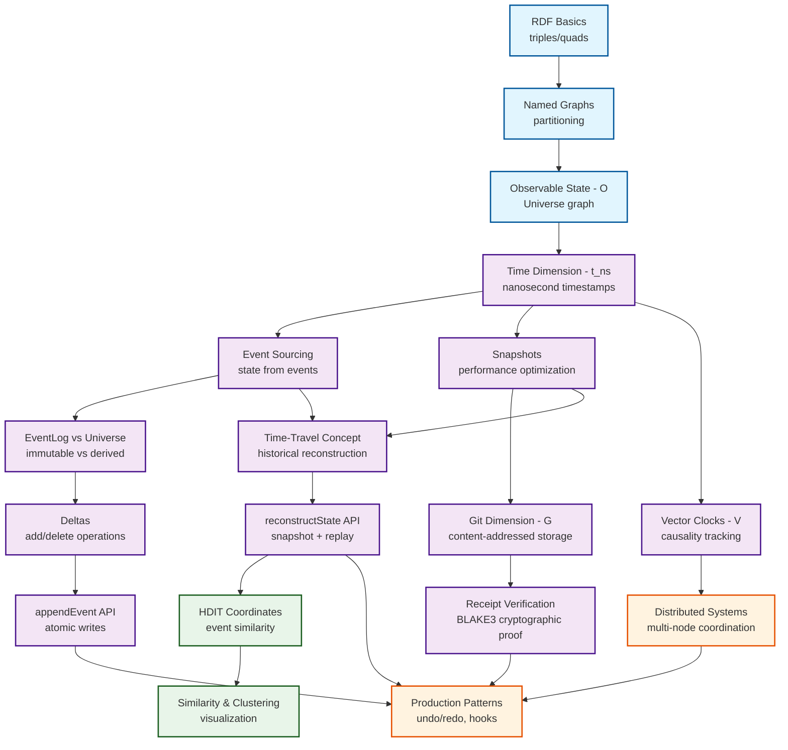

---

## 2. User Journey Maps

### 2.1 Data Scientist Journey

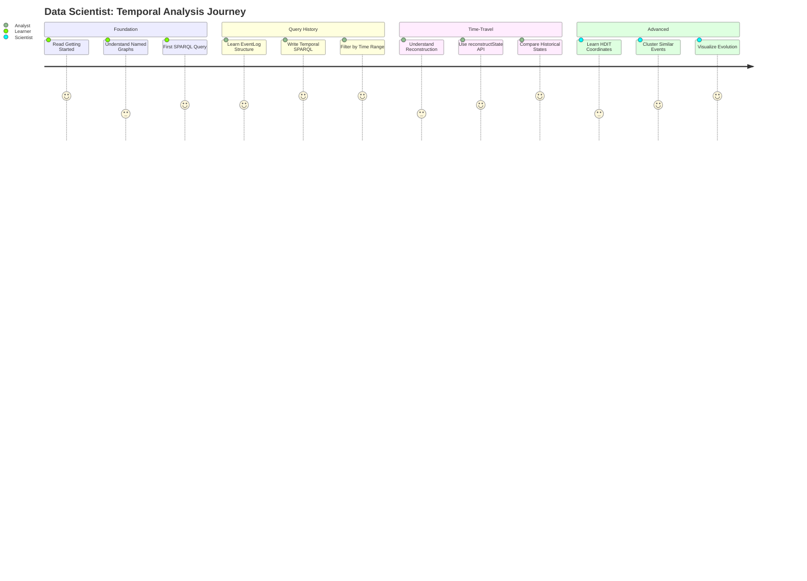

### 2.2 Application Builder Journey

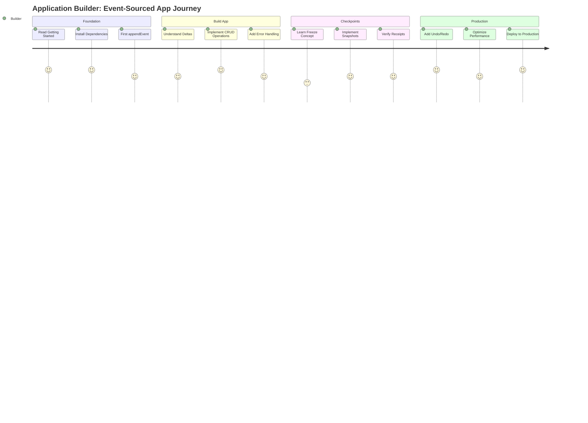

### 2.3 System Architect Journey

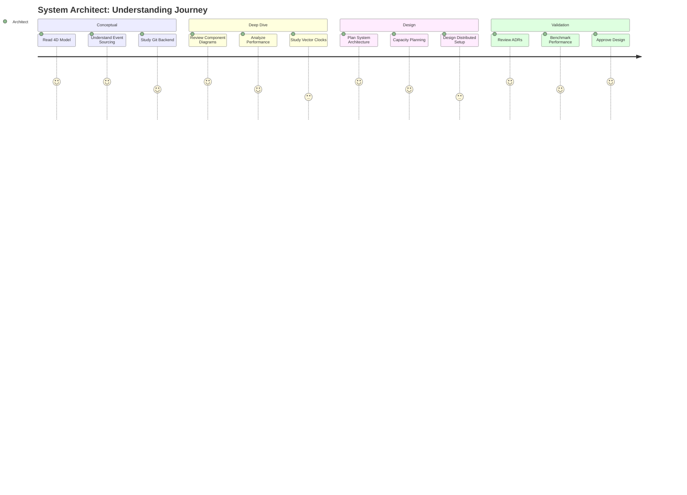

### 2.4 DevOps Engineer Journey

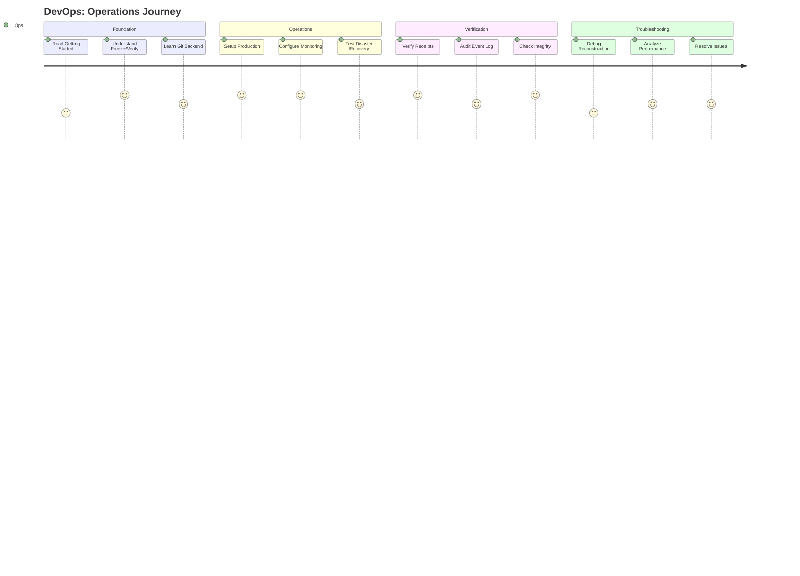

---

## 3. Learning Progression Paths

### 3.1 Linear Beginner Path

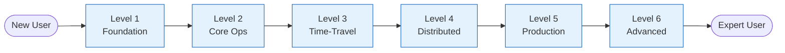

### 3.2 Role-Specific Fast Paths

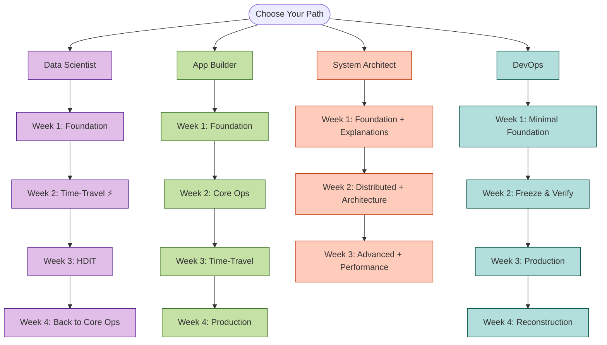

---

## 4. KGC-4D System Architecture

### 4.1 Component Architecture (C4 Model - Container Level)

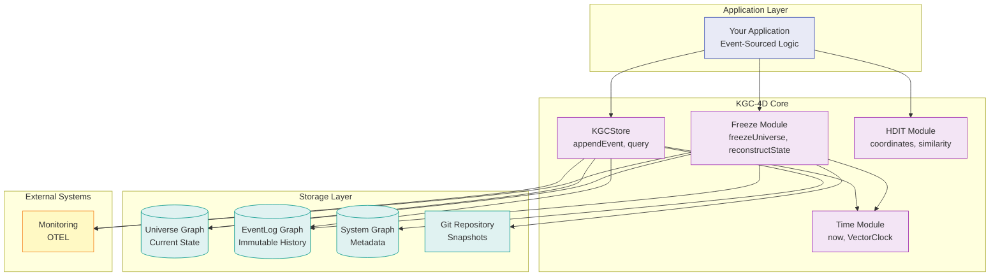

### 4.2 Freeze & Time-Travel Flow

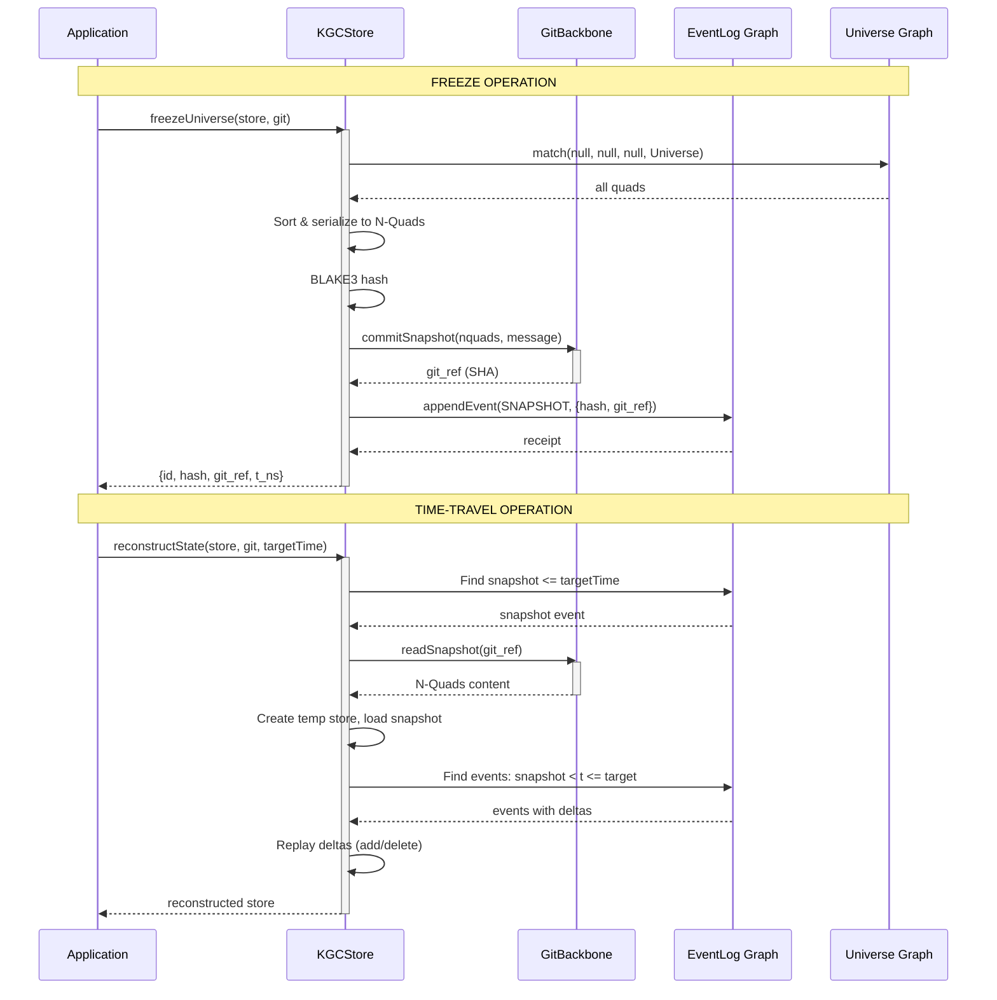

### 4.3 Event Sourcing Data Flow

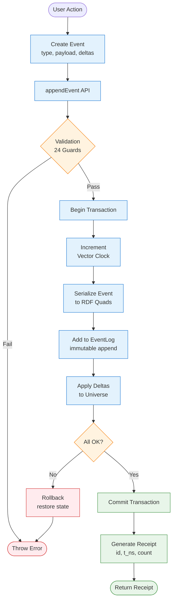

---

## 5. Documentation Structure Map

### 5.1 Diátaxis Quadrant Map

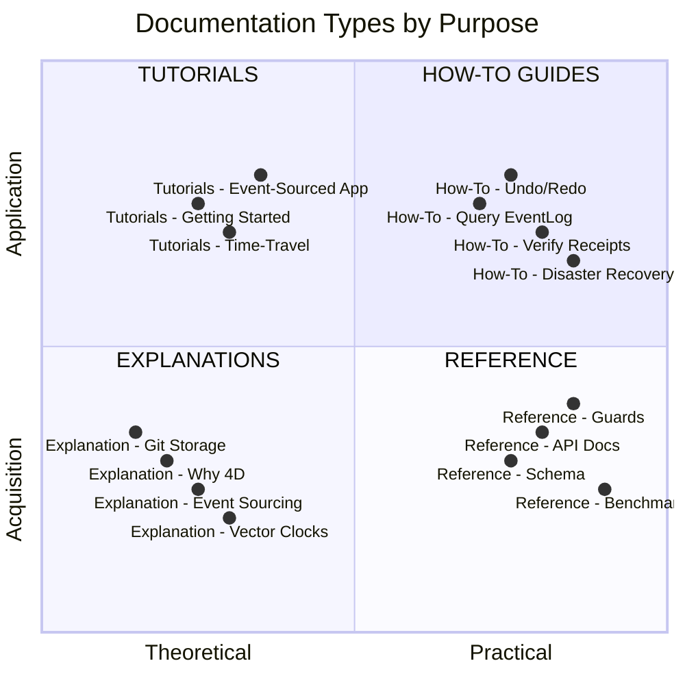

### 5.2 Priority Matrix

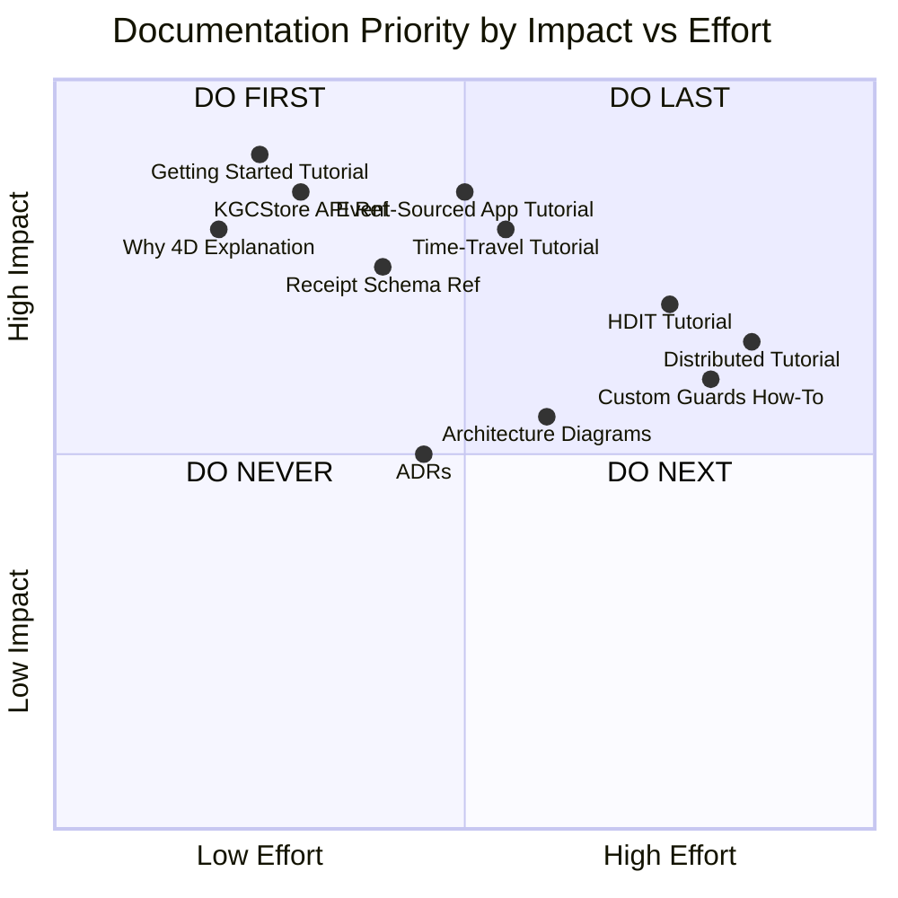

---

## 6. Performance & Scaling Guide

### 6.1 Time-Travel Performance by Snapshot Frequency

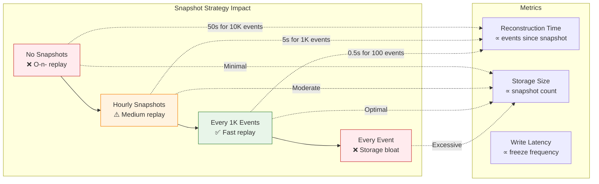

### 6.2 HDIT Dimension Scaling

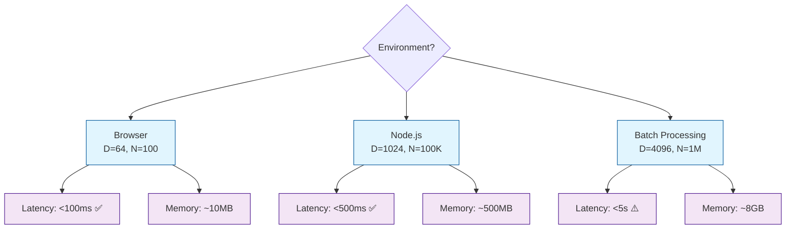

---

## 7. Error Handling Patterns

### 7.1 Guard Execution Flow

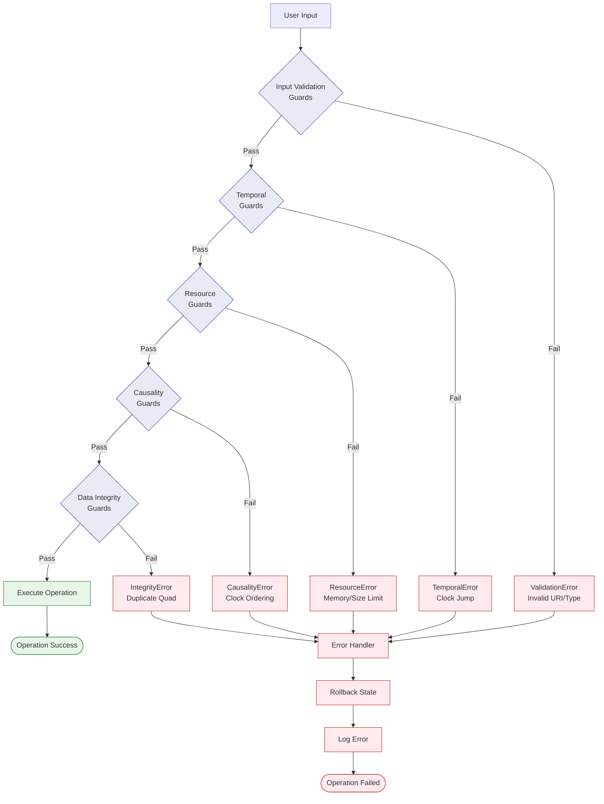

---

## 8. Cross-Environment Compatibility

### 8.1 Feature Matrix

```mermaid
graph TB
    subgraph "Node.js Environment"
        N1[✅ Full KGCStore API]
        N2[✅ Git Backend - Full]
        N3[✅ BLAKE3 Hashing]
        N4[✅ Vector Clocks]
        N5[✅ HDIT - High Dimension]
        N6[✅ File System Access]
    end

    subgraph "Browser Environment"
        B1[✅ Core KGCStore API]
        B2[❌ Git Backend - Limited]
        B3[✅ crypto.subtle - BLAKE3]
        B4[✅ Vector Clocks]
        B5[⚠️ HDIT - Low Dimension]
        B6[❌ No File System]
    end

    subgraph "Universal APIs"
        U1[appendEvent]
        U2[queryEventLog]
        U3[queryUniverse]
        U4[now, toISO]
        U5[VectorClock]
    end

    N1 -.->|Shared| U1
    N1 -.->|Shared| U2
    N1 -.->|Shared| U3

    B1 -.->|Shared| U1
    B1 -.->|Shared| U2
    B1 -.->|Shared| U3

    classDef nodeOnly fill:#c8e6c9,stroke:#2e7d32
    classDef browserOnly fill:#bbdefb,stroke:#1565c0
    classDef universal fill:#fff9c4,stroke:#f57f17

    class N1,N2,N3,N4,N5,N6 nodeOnly
    class B1,B2,B3,B4,B5,B6 browserOnly
    class U1,U2,U3,U4,U5 universal
```

---

## 9. Testing Strategy Pyramid

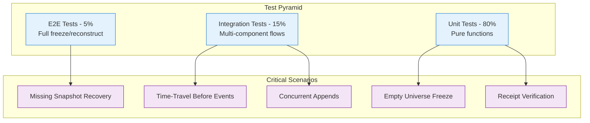

---

**End of Diagrams**

**File:** `/home/user/unrdf/docs/KGC-4D-DOCUMENTATION-DIAGRAMS.md`
