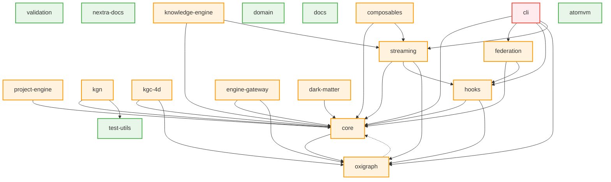

```mermaid
graph TD
  validation[validation]:::leaf
  test-utils[test-utils]:::leaf
  streaming[streaming]:::mid
  project-engine[project-engine]:::mid
  oxigraph[oxigraph]:::mid
  nextra-docs[nextra-docs]:::leaf
  knowledge-engine[knowledge-engine]:::mid
  kgn[kgn]:::mid
  kgc-4d[kgc-4d]:::mid
  hooks[hooks]:::mid
  federation[federation]:::mid
  engine-gateway[engine-gateway]:::mid
  domain[domain]:::leaf
  docs[docs]:::leaf
  dark-matter[dark-matter]:::mid
  core[core]:::mid
  composables[composables]:::mid
  cli[cli]:::hub
  atomvm[atomvm]:::leaf

  streaming --> core
  streaming --> hooks
  streaming --> oxigraph
  project-engine --> core
  oxigraph -.-> core
  knowledge-engine --> core
  knowledge-engine --> streaming
  kgn --> core
  kgn --> test-utils
  kgc-4d --> core
  kgc-4d --> oxigraph
  hooks --> core
  hooks --> oxigraph
  federation --> core
  federation --> hooks
  engine-gateway --> core
  engine-gateway --> oxigraph
  dark-matter --> core
  core --> oxigraph
  composables --> core
  composables --> streaming
  cli --> core
  cli --> federation
  cli --> hooks
  cli --> oxigraph
  cli --> streaming

  classDef leaf fill:#e8f5e9,stroke:#4caf50,stroke-width:2px
  classDef mid fill:#fff3e0,stroke:#ff9800,stroke-width:2px
  classDef hub fill:#ffebee,stroke:#f44336,stroke-width:2px
```

