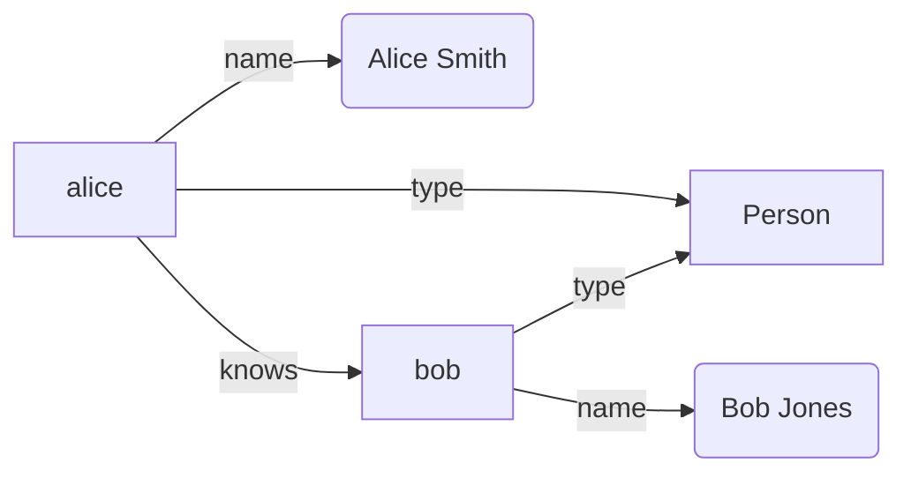

# How to Visualize RDF Graphs

**Goal:** Create visual representations of RDF data
**Time:** 10-15 minutes
**Difficulty:** Intermediate

## Problem

RDF triples are hard to understand in text format. You need visual representations to explore relationships and structure.

## Solution

Generate graph visualizations using DOT/Graphviz, convert RDF to visual formats, and create interactive diagrams.

## Prerequisites

- `@unrdf/kgn` package installed
- Graphviz installed (optional, for DOT rendering)
- RDF data to visualize

## Quick Example

```javascript
import { createStore } from '@unrdf/oxigraph';
import { executeSelectSync } from '@unrdf/core/sparql/executor-sync.mjs';

// Generate DOT format for Graphviz
function rdfToDOT(store) {
  const query = `SELECT ?s ?p ?o WHERE { ?s ?p ?o } LIMIT 100`;
  const results = executeSelectSync(store, query);

  let dot = 'digraph RDF {\n';
  dot += '  rankdir=LR;\n';
  dot += '  node [shape=ellipse];\n\n';

  results.forEach(row => {
    const s = simplifyURI(row.s.value);
    const p = simplifyURI(row.p.value);
    const o = row.o.termType === 'Literal'
      ? `"${row.o.value}"`
      : simplifyURI(row.o.value);

    dot += `  "${s}" -> "${o}" [label="${p}"];\n`;
  });

  dot += '}';
  return dot;
}

function simplifyURI(uri) {
  return uri.replace(/^https?:\/\/[^/]+\//, '')
           .replace(/#/, ':');
}
```

## Method 1: DOT/Graphviz Visualization

### Generate DOT Format

```javascript
/**
 * Convert RDF to DOT graph format
 */
class RDFToDOTConverter {
  constructor(options = {}) {
    this.options = {
      maxNodes: options.maxNodes || 100,
      colorByType: options.colorByType !== false,
      showLiterals: options.showLiterals !== false,
      ...options
    };

    this.nodeColors = new Map();
    this.typeColors = {
      'Person': '#90EE90',
      'Organization': '#87CEEB',
      'Document': '#FFB6C1',
      'default': '#D3D3D3'
    };
  }

  /**
   * Convert RDF store to DOT
   */
  convert(store) {
    const query = `
      SELECT ?s ?p ?o ?sType
      WHERE {
        ?s ?p ?o .
        OPTIONAL { ?s a ?sType }
      }
      LIMIT ${this.options.maxNodes}
    `;

    const results = executeSelectSync(store, query);

    let dot = 'digraph RDF {\n';
    dot += '  graph [rankdir=LR, splines=true, overlap=false];\n';
    dot += '  node [shape=box, style=rounded];\n\n';

    // Process nodes
    const nodes = new Set();
    const edges = [];

    results.forEach(row => {
      const subject = this.formatNode(row.s);
      const predicate = this.formatPredicate(row.p);
      const object = this.formatNode(row.o);

      nodes.add(subject);

      if (row.o.termType === 'Literal' && this.options.showLiterals) {
        edges.push({
          from: subject,
          to: object,
          label: predicate,
          style: 'dashed'
        });
      } else if (row.o.termType !== 'Literal') {
        nodes.add(object);
        edges.push({
          from: subject,
          to: object,
          label: predicate,
          style: 'solid'
        });
      }

      // Color nodes by type
      if (row.sType && this.options.colorByType) {
        const type = this.extractLocalName(row.sType.value);
        const color = this.typeColors[type] || this.typeColors.default;
        this.nodeColors.set(subject, color);
      }
    });

    // Write nodes
    nodes.forEach(node => {
      const color = this.nodeColors.get(node) || this.typeColors.default;
      dot += `  "${node}" [fillcolor="${color}", style="filled,rounded"];\n`;
    });

    dot += '\n';

    // Write edges
    edges.forEach(edge => {
      dot += `  "${edge.from}" -> "${edge.to}" [label="${edge.label}", style=${edge.style}];\n`;
    });

    dot += '}\n';
    return dot;
  }

  formatNode(term) {
    if (term.termType === 'Literal') {
      const value = term.value.length > 30
        ? term.value.substring(0, 27) + '...'
        : term.value;
      return value;
    }

    return this.extractLocalName(term.value);
  }

  formatPredicate(term) {
    return this.extractLocalName(term.value);
  }

  extractLocalName(uri) {
    const match = uri.match(/[#\/]([^#\/]+)$/);
    return match ? match[1] : uri;
  }
}

// Usage
import { writeFileSync } from 'fs';

const converter = new RDFToDOTConverter({
  maxNodes: 50,
  colorByType: true,
  showLiterals: true
});

const dot = converter.convert(store);
writeFileSync('graph.dot', dot);

console.log('✅ DOT file created: graph.dot');
console.log('Render with: dot -Tpng graph.dot -o graph.png');
```

### Render with Graphviz

```bash
# Install Graphviz (if not already installed)
# Ubuntu/Debian: sudo apt-get install graphviz
# macOS: brew install graphviz

# Render to PNG
dot -Tpng graph.dot -o graph.png

# Render to SVG (scalable)
dot -Tsvg graph.dot -o graph.svg

# Render to PDF
dot -Tpdf graph.dot -o graph.pdf

# Interactive SVG with tooltips
dot -Tsvg graph.dot -o graph-interactive.svg
```

## Method 2: Mermaid Diagrams

Generate Mermaid markdown for GitHub/documentation.

```javascript
/**
 * Convert RDF to Mermaid diagram
 */
function rdfToMermaid(store, options = {}) {
  const query = `
    SELECT ?s ?p ?o
    WHERE { ?s ?p ?o }
    LIMIT ${options.limit || 50}
  `;

  const results = executeSelectSync(store, query);

  let mermaid = 'graph LR\n';

  const nodeIds = new Map();
  let nodeCounter = 0;

  function getNodeId(term) {
    if (!nodeIds.has(term.value)) {
      nodeIds.set(term.value, `N${nodeCounter++}`);
    }
    return nodeIds.get(term.value);
  }

  function getLabel(term) {
    if (term.termType === 'Literal') {
      return `"${term.value.substring(0, 20)}"`;
    }
    return term.value.match(/[#\/]([^#\/]+)$/)?.[1] || term.value;
  }

  // Generate edges
  results.forEach(row => {
    const sId = getNodeId(row.s);
    const sLabel = getLabel(row.s);
    const pLabel = getLabel(row.p);
    const oId = getNodeId(row.o);
    const oLabel = getLabel(row.o);

    if (row.o.termType === 'Literal') {
      mermaid += `  ${sId}["${sLabel}"] -->|${pLabel}| ${oId}("${oLabel}")\n`;
    } else {
      mermaid += `  ${sId}["${sLabel}"] -->|${pLabel}| ${oId}["${oLabel}"]\n`;
    }
  });

  return mermaid;
}

// Usage
const mermaid = rdfToMermaid(store, { limit: 30 });

console.log('```mermaid');
console.log(mermaid);
console.log('```');
```

**Example Output:**



## Method 3: JSON Graph Format

Convert to JSON for d3.js or other JavaScript libraries.

```javascript
/**
 * Convert RDF to JSON graph format
 */
function rdfToJSONGraph(store) {
  const query = `SELECT ?s ?p ?o WHERE { ?s ?p ?o } LIMIT 200`;
  const results = executeSelectSync(store, query);

  const nodes = new Map();
  const links = [];

  function addNode(term) {
    const id = term.value;

    if (!nodes.has(id)) {
      nodes.set(id, {
        id,
        label: extractLabel(term),
        type: term.termType,
        group: term.termType === 'Literal' ? 'literal' : 'resource'
      });
    }

    return id;
  }

  function extractLabel(term) {
    if (term.termType === 'Literal') {
      return term.value.substring(0, 30);
    }
    return term.value.match(/[#\/]([^#\/]+)$/)?.[1] || term.value;
  }

  results.forEach(row => {
    const sourceId = addNode(row.s);
    const targetId = addNode(row.o);

    links.push({
      source: sourceId,
      target: targetId,
      label: extractLabel(row.p),
      predicate: row.p.value
    });
  });

  return {
    nodes: Array.from(nodes.values()),
    links
  };
}

// Usage
const graph = rdfToJSONGraph(store);

writeFileSync('graph.json', JSON.stringify(graph, null, 2));
console.log(`✅ Created graph with ${graph.nodes.length} nodes and ${graph.links.length} links`);
```

### Use with D3.js

```html
<!DOCTYPE html>
<html>
<head>
  <script src="https://d3js.org/d3.v7.min.js"></script>
  <style>
    .node { stroke: #fff; stroke-width: 1.5px; }
    .link { stroke: #999; stroke-opacity: 0.6; }
    .label { font-size: 10px; pointer-events: none; }
  </style>
</head>
<body>
  <svg width="960" height="600"></svg>
  <script>
    d3.json('graph.json').then(data => {
      const svg = d3.select('svg');
      const width = +svg.attr('width');
      const height = +svg.attr('height');

      const simulation = d3.forceSimulation(data.nodes)
        .force('link', d3.forceLink(data.links).id(d => d.id))
        .force('charge', d3.forceManyBody().strength(-300))
        .force('center', d3.forceCenter(width / 2, height / 2));

      const link = svg.append('g')
        .selectAll('line')
        .data(data.links)
        .enter().append('line')
        .attr('class', 'link');

      const node = svg.append('g')
        .selectAll('circle')
        .data(data.nodes)
        .enter().append('circle')
        .attr('class', 'node')
        .attr('r', 5)
        .attr('fill', d => d.group === 'literal' ? '#ff7f0e' : '#1f77b4');

      const label = svg.append('g')
        .selectAll('text')
        .data(data.nodes)
        .enter().append('text')
        .attr('class', 'label')
        .text(d => d.label);

      simulation.on('tick', () => {
        link
          .attr('x1', d => d.source.x)
          .attr('y1', d => d.source.y)
          .attr('x2', d => d.target.x)
          .attr('y2', d => d.target.y);

        node
          .attr('cx', d => d.x)
          .attr('cy', d => d.y);

        label
          .attr('x', d => d.x + 8)
          .attr('y', d => d.y + 3);
      });
    });
  </script>
</body>
</html>
```

## Method 4: ASCII Art Visualization

For quick terminal visualization.

```javascript
/**
 * Generate simple ASCII tree visualization
 */
function rdfToASCII(store, rootNode) {
  const query = `
    SELECT ?p ?o
    WHERE {
      <${rootNode}> ?p ?o .
    }
  `;

  const results = executeSelectSync(store, query);

  let ascii = `${simplifyURI(rootNode)}\n`;

  results.forEach((row, index) => {
    const isLast = index === results.length - 1;
    const branch = isLast ? '└─' : '├─';
    const p = simplifyURI(row.p.value);
    const o = row.o.termType === 'Literal'
      ? `"${row.o.value}"`
      : simplifyURI(row.o.value);

    ascii += `${branch} ${p}: ${o}\n`;

    // Recursively show children (limited depth)
    if (row.o.termType !== 'Literal') {
      const childResults = executeSelectSync(store, `
        SELECT ?p2 ?o2
        WHERE { <${row.o.value}> ?p2 ?o2 }
        LIMIT 3
      `);

      childResults.forEach((childRow, childIndex) => {
        const prefix = isLast ? '  ' : '│ ';
        const childBranch = childIndex === childResults.length - 1 ? '└─' : '├─';
        const p2 = simplifyURI(childRow.p2.value);
        const o2 = childRow.o2.termType === 'Literal'
          ? `"${childRow.o2.value}"`
          : simplifyURI(childRow.o2.value);

        ascii += `${prefix}  ${childBranch} ${p2}: ${o2}\n`;
      });
    }
  });

  return ascii;
}

// Usage
const ascii = rdfToASCII(store, 'http://example.org/alice');
console.log(ascii);
```

**Example Output:**

```
alice
├─ type: Person
├─ name: "Alice Smith"
├─ email: "alice@example.org"
├─ knows: bob
│   ├─ type: Person
│   └─ name: "Bob Jones"
└─ worksFor: acmeCorp
    ├─ type: Organization
    └─ name: "ACME Corp"
```

## Method 5: PlantUML Diagrams

Generate PlantUML for class diagrams.

```javascript
/**
 * Convert RDF ontology to PlantUML class diagram
 */
function ontologyToPlantUML(store) {
  const classQuery = `
    PREFIX owl: <http://www.w3.org/2002/07/owl#>
    PREFIX rdfs: <http://www.w3.org/2000/01/rdf-schema#>

    SELECT ?class ?label ?comment
    WHERE {
      ?class a owl:Class .
      OPTIONAL { ?class rdfs:label ?label }
      OPTIONAL { ?class rdfs:comment ?comment }
    }
  `;

  const propQuery = `
    PREFIX owl: <http://www.w3.org/2002/07/owl#>
    PREFIX rdfs: <http://www.w3.org/2000/01/rdf-schema#>

    SELECT ?prop ?domain ?range ?label
    WHERE {
      ?prop a owl:ObjectProperty .
      OPTIONAL { ?prop rdfs:domain ?domain }
      OPTIONAL { ?prop rdfs:range ?range }
      OPTIONAL { ?prop rdfs:label ?label }
    }
  `;

  const classes = executeSelectSync(store, classQuery);
  const properties = executeSelectSync(store, propQuery);

  let uml = '@startuml\n';

  // Define classes
  classes.forEach(row => {
    const className = simplifyURI(row.class.value);
    const label = row.label?.value || className;
    const comment = row.comment?.value || '';

    uml += `class ${className} {\n`;
    if (comment) {
      uml += `  note: ${comment}\n`;
    }
    uml += '}\n';
  });

  uml += '\n';

  // Define relationships
  properties.forEach(row => {
    if (row.domain && row.range) {
      const domain = simplifyURI(row.domain.value);
      const range = simplifyURI(row.range.value);
      const label = row.label?.value || simplifyURI(row.prop.value);

      uml += `${domain} --> ${range} : ${label}\n`;
    }
  });

  uml += '@enduml\n';
  return uml;
}

// Usage
const plantuml = ontologyToPlantUML(store);
writeFileSync('ontology.puml', plantuml);

console.log('✅ PlantUML diagram created: ontology.puml');
console.log('Render with: plantuml ontology.puml');
```

## Common Visualization Patterns

### Pattern 1: Filter by Type

```javascript
function visualizeType(store, type) {
  const query = `
    SELECT ?s ?p ?o
    WHERE {
      ?s a <${type}> ;
         ?p ?o .
    }
  `;

  const results = executeSelectSync(store, query);
  return rdfToDOT(results);
}

const personGraph = visualizeType(store, 'http://xmlns.com/foaf/0.1/Person');
```

### Pattern 2: Neighborhood Visualization

```javascript
function visualizeNeighborhood(store, nodeURI, depth = 1) {
  const query = `
    SELECT ?s ?p ?o
    WHERE {
      {
        <${nodeURI}> ?p ?o .
        BIND(<${nodeURI}> AS ?s)
      }
      UNION
      {
        ?s ?p <${nodeURI}> .
        BIND(<${nodeURI}> AS ?o)
      }
    }
  `;

  const results = executeSelectSync(store, query);
  return rdfToDOT(results);
}
```

### Pattern 3: Property Path Visualization

```javascript
function visualizePropertyPath(store, start, path, end) {
  const query = `
    SELECT ?intermediate
    WHERE {
      <${start}> ${path} ?intermediate .
      ${end ? `FILTER(?intermediate = <${end}>)` : ''}
    }
  `;

  const results = executeSelectSync(store, query);
  // Visualize path results
}
```

## Best Practices

1. **Limit visualization size:** Max 100-200 nodes for readability
2. **Color by type:** Use different colors for classes
3. **Simplify URIs:** Show local names only
4. **Group related nodes:** Use subgraphs in DOT
5. **Hide literals optionally:** Focus on structure
6. **Use appropriate layout:** Tree, force, circular based on data
7. **Add legends:** Explain colors and symbols

## Troubleshooting

### Problem: Graph too large

**Solution:** Filter and limit nodes:

```javascript
const converter = new RDFToDOTConverter({
  maxNodes: 50, // Limit number of nodes
  showLiterals: false // Hide literal values
});
```

### Problem: Overlapping nodes

**Solution:** Adjust layout algorithm:

```dot
graph [
  rankdir=TB,     // Top to bottom
  splines=ortho,  // Orthogonal edges
  overlap=false,  // Prevent overlap
  sep=0.5         // Node separation
];
```

### Problem: Unreadable labels

**Solution:** Truncate and add tooltips:

```javascript
function formatLabel(text, maxLength = 20) {
  if (text.length <= maxLength) return text;
  return text.substring(0, maxLength - 3) + '...';
}
```

## Related Guides

- [Generate RDF from Templates](./generate-rdf-from-templates.md)
- [Build SPARQL Queries](./build-sparql-queries.md)
- [Optimize RDF Serialization](./optimize-rdf-serialization.md)

## Reference

- [RDF-KGN API](../reference/rdf-kgn-api.md)
- [SPARQL Query Builder API](../reference/sparql-query-builder-api.md)
- [RDF-KGN Architecture](../explanation/rdf-kgn-architecture.md)
