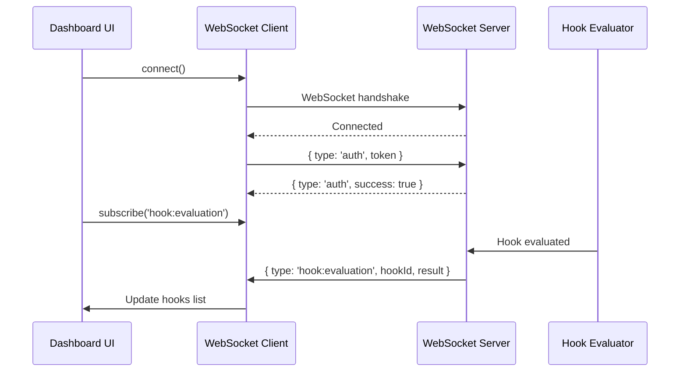

# Component Architecture - UNRDF Dashboard

**Status**: Proposed
**Date**: 2025-10-01
**Architect**: System Architecture Agent
**Context**: Design production-ready component architecture for transitioning vanilla HTML dashboard to Nuxt 4 + Vue 3

---

## Executive Summary

This document defines a component-based architecture for the UNRDF Knowledge Hooks dashboard, transitioning from a 515-line vanilla HTML file to a modular Nuxt 4 application with Vue 3 Composition API.

### Critical Finding

**Configuration Mismatch Detected:**
- Current `nuxt.config.mjs`: API-only mode (`ssr: false`, `pages: false`)
- Playground: Fully functional Express server with authentication, WebSocket, audit logging
- Proposed: Enable SSR + Pages for dashboard UI

### Key Architectural Decisions

1. **Enable Hybrid Mode**: Change `ssr: true`, `pages: true` in nuxt.config.mjs
2. **Component-First Design**: Vue 3 SFCs with `<script setup>`
3. **Composable State Management**: No Pinia, use Vue composables
4. **API Consolidation**: Migrate playground Express endpoints to Nuxt server/ routes
5. **Progressive Enhancement**: Core CRUD first, advanced features later

---

## 1. Current State Analysis

### 1.1 Playground (Express Server)

**File**: `/playground/server.mjs` (1,274 lines)

**Endpoints** (20+):
- `POST /api/auth/login` - JWT authentication
- `POST /api/auth/verify` - Token verification
- `GET /api/hooks` - List hooks
- `POST /api/hooks` - Create hook
- `GET /api/hooks/:id` - Get hook details
- `POST /api/hooks/:id/evaluate` - Evaluate hook
- `POST /api/hooks/:id/plan` - Plan execution
- `DELETE /api/hooks/:id` - Delete hook
- `GET /api/data` - List data sources
- `POST /api/data` - Create data source
- `POST /api/data/:id/query` - Query data source
- `GET /api/runtime/status` - Runtime status
- `POST /api/runtime/status` - Runtime commands (reset, backup, diagnostics)
- `POST /api/runtime/database` - Database configuration
- `POST /api/runtime/performance` - Performance metrics
- `GET /api/logs/audit` - Audit logs
- `GET /api/logs/errors` - Error logs
- `POST /api/logs/export` - Export logs

**Features**:
- JWT authentication with bcrypt
- WebSocket support for real-time updates
- Rate limiting (express-rate-limit)
- Audit logging (file-based)
- Custom predicates (HEALTH_SCORE)
- Backup/restore functionality
- System diagnostics

**UI**: `/playground/public/index.html` (515 lines)
- Vanilla HTML/CSS/JavaScript
- Four main sections: Create Hook, Manage Hooks, Runtime Status, Data Sources
- WebSocket integration for live updates

### 1.2 Sidecar (Nuxt API-Only)

**File**: `/sidecar/nuxt.config.mjs`

**Current Configuration**:
```javascript
{
  ssr: false,        // ❌ Must change to true for dashboard
  pages: false,      // ❌ Must change to true for dashboard
  nitro: {
    port: 3000,
    experimental: { openAPI: true, tasks: true },
    scheduledTasks: {
      'hooks:evaluate-periodic': '*/5 * * * *',
      'policies:refresh-packs': '0 * * * *',
      'lockchain:archive': '0 0 * * *',
      'health:self-heal': '*/1 * * * *'
    }
  }
}
```

**Existing Structure**:
- `/server/api/` - 14 API routes (transaction, policy, lockchain, etc.)
- `/server/middleware/` - 10 middleware (auth, rate-limit, OTEL, etc.)
- `/server/tasks/` - 6 scheduled tasks
- `/server/utils/` - 22 utility modules
- `/app/` - **Empty directories** (components, composables, layouts, pages)

**Gap**: No Vue components, no pages, no composables

---

## 2. Proposed Component Architecture

### 2.1 Directory Structure

```
sidecar/
├── app/
│   ├── app.vue                          # Root app component
│   ├── components/
│   │   ├── hooks/
│   │   │   ├── HooksList.vue            # Hooks table with actions
│   │   │   ├── HookEditor.vue           # Hook creation/edit form
│   │   │   ├── PredicateBuilder.vue     # Visual predicate builder
│   │   │   └── HookExecutionLog.vue     # Execution history
│   │   ├── policies/
│   │   │   ├── PoliciesList.vue         # Policies table
│   │   │   └── PolicyEditor.vue         # SHACL editor
│   │   ├── transactions/
│   │   │   ├── TransactionLog.vue       # Transaction history
│   │   │   └── RDFViewer.vue            # N-Quads/Turtle viewer
│   │   ├── lockchain/
│   │   │   ├── AuditTrail.vue           # Lockchain browser
│   │   │   └── ReceiptViewer.vue        # Cryptographic receipt viewer
│   │   ├── runtime/
│   │   │   ├── StatusDashboard.vue      # Runtime status overview
│   │   │   ├── PerformanceMetrics.vue   # Performance charts
│   │   │   └── DiagnosticsPanel.vue     # System diagnostics
│   │   └── shared/
│   │       ├── SPARQLEditor.vue         # SPARQL query editor
│   │       ├── DashboardStats.vue       # Stats cards
│   │       ├── NavMenu.vue              # Navigation menu
│   │       └── AuthGuard.vue            # Authentication wrapper
│   ├── composables/
│   │   ├── useKnowledgeHooks.mjs        # Hook state management
│   │   ├── usePolicies.mjs              # Policy state management
│   │   ├── useTransactions.mjs          # Transaction state
│   │   ├── useLockchain.mjs             # Lockchain state
│   │   ├── useRuntime.mjs               # Runtime status
│   │   ├── useAuth.mjs                  # Authentication state
│   │   └── useWebSocket.mjs             # WebSocket connection
│   ├── layouts/
│   │   ├── default.vue                  # Default layout (no auth)
│   │   └── dashboard.vue                # Dashboard layout (with auth)
│   ├── pages/
│   │   ├── index.vue                    # Dashboard home (overview)
│   │   ├── login.vue                    # Login page
│   │   ├── hooks/
│   │   │   ├── index.vue                # Hooks list page
│   │   │   └── [id].vue                 # Hook detail/edit page
│   │   ├── policies/
│   │   │   ├── index.vue                # Policies list page
│   │   │   └── [id].vue                 # Policy detail/edit page
│   │   ├── transactions/
│   │   │   ├── index.vue                # Transaction log page
│   │   │   └── [id].vue                 # Transaction detail page
│   │   ├── lockchain/
│   │   │   └── index.vue                # Audit trail browser
│   │   └── settings/
│   │       ├── index.vue                # General settings
│   │       ├── auth.vue                 # Authentication config
│   │       └── observability.vue        # OTEL configuration
│   └── schemas/
│       ├── hooks.mjs                    # Zod schemas for hooks
│       ├── policies.mjs                 # Zod schemas for policies
│       ├── transactions.mjs             # Zod schemas for transactions
│       └── common.mjs                   # Shared schemas
├── server/
│   └── api/
│       ├── hooks/
│       │   ├── index.get.mjs            # List hooks
│       │   ├── index.post.mjs           # Create hook
│       │   ├── [id].get.mjs             # Get hook
│       │   ├── [id].put.mjs             # Update hook
│       │   ├── [id].delete.mjs          # Delete hook
│       │   └── [id]/
│       │       ├── evaluate.post.mjs    # Evaluate hook
│       │       └── plan.post.mjs        # Plan hook
│       ├── auth/
│       │   ├── login.post.mjs           # User login
│       │   └── verify.post.mjs          # Token verification
│       ├── runtime/
│       │   ├── status.get.mjs           # Runtime status
│       │   ├── status.post.mjs          # Runtime commands
│       │   ├── database.post.mjs        # Database config
│       │   └── performance.post.mjs     # Performance metrics
│       └── logs/
│           ├── audit.get.mjs            # Audit logs
│           ├── errors.get.mjs           # Error logs
│           └── export.post.mjs          # Export logs
└── nuxt.config.mjs                      # Nuxt configuration (UPDATED)
```

### 2.2 Component Design Principles

**1. Single Responsibility**
- Each component handles one feature (e.g., HooksList only lists hooks)
- Separate presentation (Vue components) from business logic (composables)

**2. Composition API First**
```vue
<script setup>
// ✅ GOOD: Composition API with auto-imports
const { hooks, loading, fetchHooks, createHook } = useKnowledgeHooks()

onMounted(() => {
  fetchHooks()
})
</script>
```

**3. Props Down, Events Up**
```vue
<script setup>
/**
 * @typedef {import('~/schemas/hooks.mjs').KnowledgeHook} KnowledgeHook
 */

const props = defineProps({
  hooks: { type: Array, required: true }
})

const emit = defineEmits(['edit', 'delete', 'evaluate'])
</script>

<template>
  <div v-for="hook in hooks" :key="hook.id">
    <button @click="emit('evaluate', hook.id)">Evaluate</button>
  </div>
</template>
```

**4. Async State Management**
```javascript
// composables/useKnowledgeHooks.mjs
export const useKnowledgeHooks = () => {
  const hooks = ref([])
  const loading = ref(false)
  const error = ref(null)

  const fetchHooks = async () => {
    loading.value = true
    error.value = null
    try {
      const response = await $fetch('/api/hooks')
      hooks.value = response.hooks
    } catch (err) {
      error.value = err.message
    } finally {
      loading.value = false
    }
  }

  return { hooks, loading, error, fetchHooks }
}
```

---

## 3. Core Components

### 3.1 HooksList.vue

**Purpose**: Display hooks in a table with actions

**Props**:
- `hooks: KnowledgeHook[]` - Array of hooks to display

**Events**:
- `@edit` - Emitted when edit button clicked
- `@delete` - Emitted when delete button clicked
- `@evaluate` - Emitted when evaluate button clicked

**Template** (simplified):
```vue
<template>
  <div class="hooks-list">
    <table>
      <thead>
        <tr>
          <th>ID</th>
          <th>Name</th>
          <th>Phase</th>
          <th>Predicates</th>
          <th>Actions</th>
        </tr>
      </thead>
      <tbody>
        <tr v-for="hook in hooks" :key="hook.id">
          <td>{{ hook.id }}</td>
          <td>{{ hook.name }}</td>
          <td>{{ hook.phase }}</td>
          <td>{{ hook.predicates.length }}</td>
          <td>
            <button @click="emit('evaluate', hook.id)">Evaluate</button>
            <button @click="emit('edit', hook.id)">Edit</button>
            <button @click="emit('delete', hook.id)">Delete</button>
          </td>
        </tr>
      </tbody>
    </table>
  </div>
</template>
```

### 3.2 HookEditor.vue

**Purpose**: Create/edit knowledge hooks with form validation

**Props**:
- `hookId?: string` - Optional hook ID for editing (omit for create)

**Events**:
- `@save` - Emitted when form is saved
- `@cancel` - Emitted when form is cancelled

**Features**:
- Zod validation with `KnowledgeHookSchema`
- SPARQL editor with syntax highlighting
- Predicate builder (delegated to `PredicateBuilder.vue`)

### 3.3 StatusDashboard.vue

**Purpose**: Display runtime status overview

**Data Sources**:
- `GET /api/runtime/status` (polling every 5s)

**Sections**:
- System uptime and version
- Memory usage
- Hooks count and evaluation stats
- Data sources count
- Recent activity (last 10 evaluations)

---

## 4. State Management with Composables

### 4.1 useKnowledgeHooks.mjs

**Full Implementation**:
```javascript
// app/composables/useKnowledgeHooks.mjs

import { ref, computed } from 'vue'
import { KnowledgeHookSchema } from '~/schemas/hooks.mjs'

/**
 * Knowledge Hooks composable for managing hook state
 * @returns {Object} Hook management functions and state
 */
export const useKnowledgeHooks = () => {
  const hooks = ref([])
  const loading = ref(false)
  const error = ref(null)

  /**
   * Fetch all hooks from API
   * @returns {Promise<void>}
   */
  const fetchHooks = async () => {
    loading.value = true
    error.value = null
    try {
      const response = await $fetch('/api/hooks')
      // Validate with Zod before setting state
      hooks.value = response.hooks.map(h => KnowledgeHookSchema.parse(h))
    } catch (err) {
      error.value = err.message
      console.error('[useKnowledgeHooks] fetchHooks error:', err)
    } finally {
      loading.value = false
    }
  }

  /**
   * Get specific hook by ID
   * @param {string} id - Hook ID
   * @returns {Promise<Object>}
   */
  const getHook = async (id) => {
    try {
      const response = await $fetch(`/api/hooks/${id}`)
      return response.hook
    } catch (err) {
      error.value = err.message
      throw err
    }
  }

  /**
   * Create new hook
   * @param {import('~/schemas/hooks.mjs').KnowledgeHook} hookData
   * @returns {Promise<Object>}
   */
  const createHook = async (hookData) => {
    // Validate before sending
    const validated = KnowledgeHookSchema.parse(hookData)
    const response = await $fetch('/api/hooks', {
      method: 'POST',
      body: validated
    })
    await fetchHooks() // Refresh list
    return response
  }

  /**
   * Update existing hook
   * @param {string} id - Hook ID
   * @param {Partial<import('~/schemas/hooks.mjs').KnowledgeHook>} updates
   * @returns {Promise<Object>}
   */
  const updateHook = async (id, updates) => {
    const response = await $fetch(`/api/hooks/${id}`, {
      method: 'PUT',
      body: updates
    })
    await fetchHooks()
    return response
  }

  /**
   * Delete hook
   * @param {string} id
   * @returns {Promise<void>}
   */
  const deleteHook = async (id) => {
    await $fetch(`/api/hooks/${id}`, { method: 'DELETE' })
    await fetchHooks()
  }

  /**
   * Evaluate hook
   * @param {string} id - Hook ID
   * @param {Object} [data] - Optional RDF data
   * @returns {Promise<Object>}
   */
  const evaluateHook = async (id, data = null) => {
    const response = await $fetch(`/api/hooks/${id}/evaluate`, {
      method: 'POST',
      body: { data }
    })
    return response.result
  }

  /**
   * Plan hook execution
   * @param {string} id - Hook ID
   * @returns {Promise<Object>}
   */
  const planHook = async (id) => {
    const response = await $fetch(`/api/hooks/${id}/plan`, {
      method: 'POST'
    })
    return response.plan
  }

  const activeHooks = computed(() =>
    hooks.value.filter(h => !h.disabled)
  )

  const hookCount = computed(() => hooks.value.length)

  return {
    // State
    hooks,
    loading,
    error,

    // Actions
    fetchHooks,
    getHook,
    createHook,
    updateHook,
    deleteHook,
    evaluateHook,
    planHook,

    // Computed
    activeHooks,
    hookCount
  }
}
```

### 4.2 useAuth.mjs

**Purpose**: Manage authentication state

**Features**:
- JWT token management (HTTP-only cookies preferred)
- Login/logout
- Token verification
- User role checks

**Implementation**:
```javascript
// app/composables/useAuth.mjs

export const useAuth = () => {
  const user = ref(null)
  const token = ref(null)
  const isAuthenticated = computed(() => !!user.value)

  const login = async (username, password) => {
    const response = await $fetch('/api/auth/login', {
      method: 'POST',
      body: { username, password }
    })

    user.value = response.user
    token.value = response.token

    // Store token (consider HTTP-only cookies instead)
    if (process.client) {
      localStorage.setItem('auth_token', response.token)
    }

    return response
  }

  const logout = () => {
    user.value = null
    token.value = null
    if (process.client) {
      localStorage.removeItem('auth_token')
    }
  }

  const verifyToken = async () => {
    if (!token.value) return false

    try {
      const response = await $fetch('/api/auth/verify', {
        method: 'POST',
        headers: {
          Authorization: `Bearer ${token.value}`
        }
      })
      user.value = response.user
      return true
    } catch {
      logout()
      return false
    }
  }

  // Restore token on mount
  onMounted(() => {
    if (process.client) {
      const storedToken = localStorage.getItem('auth_token')
      if (storedToken) {
        token.value = storedToken
        verifyToken()
      }
    }
  })

  return {
    user,
    token,
    isAuthenticated,
    login,
    logout,
    verifyToken
  }
}
```

### 4.3 useWebSocket.mjs

**Purpose**: Manage WebSocket connection for real-time updates

**Features**:
- Auto-reconnect on disconnect
- Event subscription (hook evaluations, runtime status)
- Authentication handshake

**Implementation**:
```javascript
// app/composables/useWebSocket.mjs

export const useWebSocket = () => {
  const ws = ref(null)
  const connected = ref(false)
  const { token } = useAuth()

  const connect = () => {
    if (process.client) {
      const protocol = window.location.protocol === 'https:' ? 'wss:' : 'ws:'
      const url = `${protocol}//${window.location.host}`

      ws.value = new WebSocket(url)

      ws.value.onopen = () => {
        connected.value = true
        // Authenticate
        if (token.value) {
          ws.value.send(JSON.stringify({ type: 'auth', token: token.value }))
        }
      }

      ws.value.onclose = () => {
        connected.value = false
        // Auto-reconnect after 5s
        setTimeout(connect, 5000)
      }
    }
  }

  const send = (data) => {
    if (ws.value && connected.value) {
      ws.value.send(JSON.stringify(data))
    }
  }

  const subscribe = (type, handler) => {
    if (ws.value) {
      const listener = (event) => {
        const data = JSON.parse(event.data)
        if (data.type === type) {
          handler(data)
        }
      }
      ws.value.addEventListener('message', listener)
      return () => ws.value.removeEventListener('message', listener)
    }
  }

  onMounted(() => {
    connect()
  })

  onUnmounted(() => {
    if (ws.value) {
      ws.value.close()
    }
  })

  return {
    ws,
    connected,
    send,
    subscribe
  }
}
```

---

## 5. Routing and Navigation

### 5.1 Page Routes

**File-based routing** (Nuxt 4):

```
/                      → pages/index.vue (Dashboard home)
/login                 → pages/login.vue (Login page)
/hooks                 → pages/hooks/index.vue (Hooks list)
/hooks/:id             → pages/hooks/[id].vue (Hook detail)
/policies              → pages/policies/index.vue (Policies list)
/policies/:id          → pages/policies/[id].vue (Policy detail)
/transactions          → pages/transactions/index.vue (Transaction log)
/transactions/:id      → pages/transactions/[id].vue (Transaction detail)
/lockchain             → pages/lockchain/index.vue (Audit trail)
/settings              → pages/settings/index.vue (Settings)
/settings/auth         → pages/settings/auth.vue (Auth config)
/settings/observability → pages/settings/observability.vue (OTEL config)
```

### 5.2 Navigation Menu

**Component**: `app/components/shared/NavMenu.vue`

**Structure**:
```vue
<template>
  <nav>
    <NuxtLink to="/">Dashboard</NuxtLink>
    <NuxtLink to="/hooks">Knowledge Hooks</NuxtLink>
    <NuxtLink to="/policies">Policy Packs</NuxtLink>
    <NuxtLink to="/transactions">Transactions</NuxtLink>
    <NuxtLink to="/lockchain">Audit Trail</NuxtLink>
    <NuxtLink to="/settings">Settings</NuxtLink>
  </nav>
</template>
```

---

## 6. Data Flow

### 6.1 Component → Composable → API

```mermaid
graph LR
    Component[HooksList.vue] -->|useKnowledgeHooks| Composable[composables/useKnowledgeHooks.mjs]
    Composable -->|$fetch| API[/api/hooks]
    API -->|JSON| Composable
    Composable -->|Zod.parse| Validated[Validated Data]
    Validated -->|ref| Component
```

### 6.2 WebSocket Real-Time Updates



---

## 7. Security Considerations

### 7.1 Authentication Flow

1. User submits credentials via `/login` page
2. `POST /api/auth/login` returns JWT token
3. Token stored in HTTP-only cookie (not localStorage for security)
4. All subsequent API requests include cookie
5. Server validates token in `server/middleware/00.auth.mjs`

### 7.2 Authorization

- **RBAC Middleware**: Check user roles before allowing actions
- **Route Guards**: Middleware in `pages/` to redirect unauthenticated users
- **API Guards**: All `/api/` routes require authentication (except `/api/auth/login`)

### 7.3 Input Validation

- **Client-side**: Zod schemas in forms
- **Server-side**: Zod schemas in API routes
- **Double validation**: Never trust client input

---

## 8. Performance Targets

### 8.1 Key Metrics

- **Page Load**: < 1s (First Contentful Paint)
- **API Response**: < 200ms (p95)
- **Form Validation**: < 50ms (Zod parsing)
- **WebSocket Latency**: < 100ms (event delivery)

### 8.2 Optimization Strategies

1. **Code Splitting**: Nuxt 4 auto-imports components
2. **Data Caching**: Use `useFetch` with SWR pattern
3. **Lazy Loading**: Dynamic imports for heavy components (SPARQL editor)
4. **Bundle Size**: Tree-shake unused components

---

## 9. Testing Strategy

### 9.1 Component Tests

**Framework**: Vitest + @vue/test-utils + @nuxt/test-utils

**Example**:
```javascript
// test/nuxt/components/hooks/HooksList.test.mjs
import { describe, it, expect } from 'vitest'
import { mountSuspended } from '@nuxt/test-utils/runtime'
import HooksList from '~/components/hooks/HooksList.vue'

describe('HooksList', () => {
  it('renders hooks table', async () => {
    const wrapper = await mountSuspended(HooksList, {
      props: {
        hooks: [
          { id: 'hook-1', name: 'Test Hook', phase: 'pre', predicates: [] }
        ]
      }
    })

    expect(wrapper.text()).toContain('hook-1')
  })

  it('emits evaluate event', async () => {
    const wrapper = await mountSuspended(HooksList, {
      props: { hooks: [{ id: 'hook-1', name: 'Test', phase: 'pre', predicates: [] }] }
    })

    await wrapper.find('[data-test="evaluate-button"]').trigger('click')
    expect(wrapper.emitted('evaluate')).toBeTruthy()
  })
})
```

### 9.2 E2E Tests

**Framework**: Vitest + Playwright

**Example**:
```javascript
// test/e2e/scenarios/dashboard-hooks.test.mjs
import { describe, it, expect } from 'vitest'
import { setup, $fetch } from '@nuxt/test-utils/e2e'

describe('Dashboard - Hooks Management', async () => {
  await setup({ server: true, browser: true })

  it('creates hook via UI', async ({ page }) => {
    await page.goto('/login')
    await page.fill('#username', 'admin')
    await page.fill('#password', 'password')
    await page.click('[type="submit"]')

    await page.goto('/hooks')
    await page.click('[data-test="create-hook"]')
    await page.fill('#hook-id', 'test-hook')
    await page.click('[data-test="submit"]')

    // Verify API call
    const hooks = await $fetch('/api/hooks')
    expect(hooks.hooks).toContainEqual(
      expect.objectContaining({ id: 'test-hook' })
    )
  })
})
```

---

## 10. Migration Path

### Phase 1: Enable SSR and Pages (Day 1)

1. Update `nuxt.config.mjs`:
   ```javascript
   {
     ssr: true,    // Changed from false
     pages: true   // Changed from false
   }
   ```

2. Create basic layout structure:
   - `app/layouts/default.vue`
   - `app/layouts/dashboard.vue`
   - `app/pages/index.vue`

### Phase 2: Core Components (Days 2-3)

1. Implement composables:
   - `useKnowledgeHooks.mjs`
   - `useAuth.mjs`
   - `useRuntime.mjs`

2. Build core components:
   - `HooksList.vue`
   - `StatusDashboard.vue`
   - `NavMenu.vue`

### Phase 3: Migrate API Routes (Days 4-5)

1. Port playground Express routes to Nuxt server/ routes
2. Consolidate authentication middleware
3. Implement WebSocket in Nuxt server

### Phase 4: Advanced Features (Days 6-7)

1. Hook editor with Zod validation
2. SPARQL editor
3. Real-time WebSocket updates

---

## 11. Success Criteria

### 11.1 Technical KPIs

- ✅ **Test Coverage**: ≥ 80% (Vitest)
- ✅ **Bundle Size**: < 500KB (gzipped)
- ✅ **Lighthouse Score**: ≥ 90 (Performance, Accessibility)
- ✅ **Zero TypeScript**: 100% MJS/JSDoc compliance

### 11.2 Functional KPIs

- ✅ All 20+ playground endpoints migrated to Nuxt
- ✅ Authentication working with JWT
- ✅ WebSocket real-time updates functional
- ✅ CRUD operations for hooks, policies, transactions

---

## 12. Open Questions

1. **UI Framework**: Use Nuxt UI (@nuxt/ui) or build custom components?
2. **Dark Mode**: Support in Phase 1 or defer to Phase 4?
3. **Monaco Editor**: Use for SPARQL editor or lighter alternative (CodeMirror)?
4. **State Persistence**: Use localStorage or server-side session?

---

## 13. Next Steps

**After Hive Consensus Approval**:

1. Update `nuxt.config.mjs` (enable SSR + pages)
2. Implement Phase 1 (layouts and basic pages)
3. Build composables (Phase 2)
4. Migrate API routes (Phase 3)
5. Run validation tests (`npm test`)

**Validation Protocol**:
- Run `npm test` after each phase
- Check bundle size with `nuxt build`
- Run Lighthouse audit on `/` page
- Verify all API endpoints return 200 OK

---

**Document Version**: 1.0
**Last Updated**: 2025-10-01
**Next Review**: After Phase 1 completion
**Hive Consensus**: Pending
