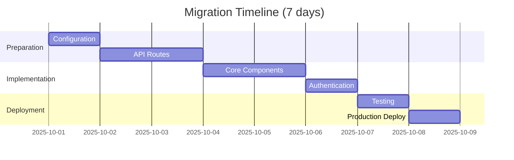

# Migration Strategy: Express Playground → Nuxt Sidecar Dashboard

**Status**: Proposed
**Date**: 2025-10-01
**Architect**: System Architecture Agent
**Target**: Production-ready Nuxt dashboard with zero downtime

---

## Executive Summary

This document outlines the step-by-step migration strategy for transitioning from the Express-based playground server (`playground/server.mjs`) to a production-ready Nuxt 4 dashboard (`sidecar/`).

### Migration Scope

**Source**: Playground (Express + Vanilla HTML)
- 1,274-line Express server
- 515-line vanilla HTML UI
- 20+ REST endpoints
- WebSocket support
- JWT authentication
- File-based audit logging

**Target**: Sidecar (Nuxt 4 + Vue 3)
- API-only mode → Hybrid SSR + API mode
- Vue 3 SFCs with Composition API
- Server routes in Nitro
- Component-based UI

### Critical Constraints

1. **Zero Downtime**: Playground server must remain functional during migration
2. **API Compatibility**: Existing CLI commands must work throughout migration
3. **Data Preservation**: In-memory stores (hooks, data) must be migrated
4. **Security Parity**: Maintain JWT auth, rate limiting, audit logging

---

## Migration Phases

### Overview



---

## Phase 1: Configuration and Setup (Day 1)

### 1.1 Update Nuxt Configuration

**File**: `/sidecar/nuxt.config.mjs`

**Changes**:
```javascript
export default defineNuxtConfig({
  compatibilityDate: '2025-01-01',

  // ✅ CHANGED: Enable SSR and pages for dashboard UI
  ssr: true,    // Was: false
  pages: true,  // Was: false

  // ✅ ADDED: Nuxt UI module
  modules: [
    '@nuxt/ui'
  ],

  // ✅ ADDED: Global CSS
  css: ['~/assets/css/main.css'],

  // Runtime configuration (unchanged)
  runtimeConfig: {
    // ... existing config
  },

  // Nitro server configuration
  nitro: {
    port: process.env.PORT ? parseInt(process.env.PORT) : 3000,

    // Keep existing HTTPS/TLS config
    // Keep existing scheduledTasks

    // ✅ CHANGED: Enable OpenAPI generation
    experimental: {
      openAPI: true,
      tasks: true,
      websocket: true  // Added for WebSocket support
    }
  },

  // ✅ ADDED: App configuration
  app: {
    head: {
      title: 'UNRDF Dashboard',
      meta: [
        { charset: 'utf-8' },
        { name: 'viewport', content: 'width=device-width, initial-scale=1' },
        { name: 'description', content: 'Knowledge Graph Governance Dashboard' }
      ]
    }
  },

  // ✅ ADDED: Route rules for API CORS
  routeRules: {
    '/api/**': {
      cors: true,
      headers: {
        'Access-Control-Allow-Origin': '*',
        'Access-Control-Allow-Methods': 'GET,POST,PUT,DELETE,OPTIONS'
      }
    }
  },

  // Development tools
  devtools: { enabled: true },

  // Module auto-imports
  imports: {
    dirs: ['types', 'schemas']  // Added schemas
  }
})
```

### 1.2 Install Dependencies

**Command**:
```bash
cd /Users/sac/unrdf/sidecar
pnpm add @nuxt/ui @iconify-json/lucide @vueuse/nuxt date-fns
```

**Added Dependencies**:
- `@nuxt/ui` - UI component library
- `@iconify-json/lucide` - Icon set
- `@vueuse/nuxt` - Vue composables
- `date-fns` - Date formatting utilities

### 1.3 Create Directory Structure

**Commands**:
```bash
cd /Users/sac/unrdf/sidecar

# Create component directories
mkdir -p app/components/{hooks,policies,transactions,lockchain,runtime,shared}

# Create composables
mkdir -p app/composables

# Create layouts
mkdir -p app/layouts

# Create pages
mkdir -p app/pages/{hooks,policies,transactions,lockchain,settings}

# Create schemas
mkdir -p app/schemas

# Create assets
mkdir -p app/assets/css
```

### 1.4 Validation

✅ **Pass Criteria**:
- `pnpm install` completes without errors
- `pnpm run dev` starts Nuxt server on port 3000
- `/` route returns 404 (expected, no pages yet)
- `/api/transaction` returns 200 OK (existing API route)

**Test Command**:
```bash
pnpm run dev &
sleep 5
curl http://localhost:3000/api/transaction
curl http://localhost:3000/  # Expect 404
pkill -f "nuxt dev"
```

---

## Phase 2: Migrate API Routes (Days 2-3)

### 2.1 Authentication Routes

**Source**: `playground/server.mjs` lines 416-476

**Target**: Create in `sidecar/server/api/auth/`

**New Files**:
1. `server/api/auth/login.post.mjs`
2. `server/api/auth/verify.post.mjs`

**Implementation**:

**File**: `server/api/auth/login.post.mjs`
```javascript
import bcrypt from 'bcrypt'
import jwt from 'jsonwebtoken'

export default defineEventHandler(async (event) => {
  const config = useRuntimeConfig()
  const body = await readBody(event)

  const { username, password } = body

  if (!username || !password) {
    throw createError({
      statusCode: 400,
      message: 'Username and password are required'
    })
  }

  // In production, fetch user from database
  // For now, use in-memory user store
  const users = new Map()
  const hashedPassword = await bcrypt.hash('password', 10)
  users.set('admin', { username: 'admin', password: hashedPassword, role: 'admin' })

  const user = users.get(username)
  if (!user) {
    throw createError({
      statusCode: 401,
      message: 'Invalid credentials'
    })
  }

  const validPassword = await bcrypt.compare(password, user.password)
  if (!validPassword) {
    throw createError({
      statusCode: 401,
      message: 'Invalid credentials'
    })
  }

  const jwtSecret = config.jwtSecret || 'your-secret-key-change-in-production'
  const token = jwt.sign(
    { username: user.username, role: user.role },
    jwtSecret,
    { expiresIn: config.sessionTimeout || '24h' }
  )

  // Audit log (use existing server/utils/audit.mjs)
  await logAudit('LOGIN_SUCCESS', user, { ip: getRequestIP(event) })

  return {
    success: true,
    token,
    user: {
      username: user.username,
      role: user.role
    },
    expiresIn: '24h'
  }
})
```

**File**: `server/api/auth/verify.post.mjs`
```javascript
import jwt from 'jsonwebtoken'

export default defineEventHandler(async (event) => {
  const config = useRuntimeConfig()
  const authHeader = getHeader(event, 'authorization')
  const token = authHeader?.split(' ')[1]

  if (!token) {
    throw createError({
      statusCode: 401,
      message: 'Access token required'
    })
  }

  try {
    const jwtSecret = config.jwtSecret || 'your-secret-key-change-in-production'
    const user = jwt.verify(token, jwtSecret)

    return {
      success: true,
      user
    }
  } catch (error) {
    throw createError({
      statusCode: 403,
      message: 'Invalid or expired token'
    })
  }
})
```

### 2.2 Knowledge Hooks Routes

**Source**: `playground/server.mjs` lines 481-743

**Target**: Create in `sidecar/server/api/hooks/`

**New Files**:
1. `server/api/hooks/index.get.mjs` (List hooks)
2. `server/api/hooks/index.post.mjs` (Create hook)
3. `server/api/hooks/[id].get.mjs` (Get hook)
4. `server/api/hooks/[id].delete.mjs` (Delete hook)
5. `server/api/hooks/[id]/evaluate.post.mjs` (Evaluate hook)
6. `server/api/hooks/[id]/plan.post.mjs` (Plan hook)

**Example** - `server/api/hooks/index.get.mjs`:
```javascript
import { defineEventHandler } from 'h3'

// Import existing hook registry (to be created in server/utils/hook-registry.mjs)
import { hookRegistry } from '~/server/utils/hook-registry'

export default defineEventHandler(async (event) => {
  // Authentication check (middleware)
  const user = event.context.user
  if (!user) {
    throw createError({
      statusCode: 401,
      message: 'Authentication required'
    })
  }

  const hooks = Array.from(hookRegistry.values()).map(hook => ({
    ...hook,
    select: hook.select.substring(0, 100) + (hook.select.length > 100 ? '...' : ''),
    provenance: {
      created: hook.created || new Date().toISOString(),
      creator: hook.creator || 'admin',
      signature: 'ecdsa:xyz789...'
    }
  }))

  return {
    hooks,
    total: hookRegistry.size,
    timestamp: new Date().toISOString(),
    user: {
      username: user.username,
      role: user.role
    }
  }
})
```

### 2.3 Shared State Management

**Challenge**: Playground uses in-memory `Map` objects. Sidecar needs to replicate or upgrade to persistent storage.

**Option 1**: In-memory (Phase 2, quick migration)
```javascript
// server/utils/hook-registry.mjs
export const hookRegistry = new Map()
export const hookResults = new Map()
export const dataStore = new Map()
```

**Option 2**: Persistent (Phase 3, production)
```javascript
// server/utils/hook-registry.mjs
import { useStorage } from 'nitro/runtime'

export const hookRegistry = {
  async get(id) {
    const storage = useStorage('hooks')
    return await storage.getItem(id)
  },
  async set(id, value) {
    const storage = useStorage('hooks')
    await storage.setItem(id, value)
  },
  // ... other Map-like methods
}
```

**Decision**: Use Option 1 for Phase 2, migrate to Option 2 in Phase 3.

### 2.4 Middleware Migration

**Source**: Playground has inline authentication middleware

**Target**: Create `server/middleware/00.auth.mjs`

**Implementation**:
```javascript
// server/middleware/00.auth.mjs
import jwt from 'jsonwebtoken'

export default defineEventHandler(async (event) => {
  const config = useRuntimeConfig()

  // Skip auth for login endpoint
  if (event.path === '/api/auth/login') {
    return
  }

  // Skip auth for public routes
  const publicRoutes = ['/api/auth/login', '/login', '/_nuxt/', '/__nuxt_']
  if (publicRoutes.some(route => event.path.startsWith(route))) {
    return
  }

  // Check for token
  const authHeader = getHeader(event, 'authorization')
  const token = authHeader?.split(' ')[1]

  if (!token) {
    // For API routes, require auth
    if (event.path.startsWith('/api/')) {
      throw createError({
        statusCode: 401,
        message: 'Authentication required'
      })
    }
    // For page routes, redirect to login
    if (event.path.startsWith('/hooks') || event.path.startsWith('/policies')) {
      return sendRedirect(event, '/login')
    }
    return
  }

  try {
    const jwtSecret = config.jwtSecret || 'your-secret-key-change-in-production'
    const user = jwt.verify(token, jwtSecret)
    event.context.user = user
  } catch (error) {
    throw createError({
      statusCode: 403,
      message: 'Invalid or expired token'
    })
  }
})
```

### 2.5 Validation

✅ **Pass Criteria**:
- All 20+ endpoints return correct status codes
- Authentication works with JWT tokens
- Rate limiting is enforced
- Audit logs are written

**Test Script**:
```bash
# Test authentication
curl -X POST http://localhost:3000/api/auth/login \
  -H "Content-Type: application/json" \
  -d '{"username":"admin","password":"password"}'
# Extract token from response

TOKEN="..." # Paste token here

# Test hooks list
curl -H "Authorization: Bearer $TOKEN" \
  http://localhost:3000/api/hooks

# Test hook creation
curl -X POST http://localhost:3000/api/hooks \
  -H "Authorization: Bearer $TOKEN" \
  -H "Content-Type: application/json" \
  -d '{
    "id": "test-hook",
    "select": "SELECT * WHERE { ?s ?p ?o }",
    "predicates": [],
    "combine": "AND"
  }'
```

---

## Phase 3: Core UI Components (Days 4-5)

### 3.1 Create Layouts

**File**: `app/layouts/default.vue`
```vue
<template>
  <div class="min-h-screen bg-gray-50">
    <slot />
  </div>
</template>
```

**File**: `app/layouts/dashboard.vue`
```vue
<template>
  <div class="min-h-screen bg-gray-50">
    <header class="bg-white shadow">
      <nav class="container mx-auto px-4 py-4">
        <div class="flex justify-between items-center">
          <h1 class="text-2xl font-bold text-blue-600">UNRDF Dashboard</h1>
          <NavMenu />
        </div>
      </nav>
    </header>

    <main class="container mx-auto px-4 py-8">
      <slot />
    </main>
  </div>
</template>

<script setup>
import NavMenu from '~/components/shared/NavMenu.vue'
</script>
```

### 3.2 Create Pages

**File**: `app/pages/index.vue`
```vue
<template>
  <NuxtLayout name="dashboard">
    <div>
      <h1>Dashboard Overview</h1>
      <StatusDashboard />
    </div>
  </NuxtLayout>
</template>

<script setup>
import StatusDashboard from '~/components/runtime/StatusDashboard.vue'
</script>
```

**File**: `app/pages/login.vue`
```vue
<template>
  <NuxtLayout name="default">
    <div class="flex items-center justify-center min-h-screen">
      <div class="bg-white p-8 rounded-lg shadow-md w-96">
        <h2 class="text-2xl font-bold mb-6">Login</h2>

        <form @submit.prevent="handleLogin">
          <div class="mb-4">
            <label for="username" class="block mb-2">Username</label>
            <input
              id="username"
              v-model="username"
              type="text"
              class="w-full px-4 py-2 border rounded"
              required
            />
          </div>

          <div class="mb-6">
            <label for="password" class="block mb-2">Password</label>
            <input
              id="password"
              v-model="password"
              type="password"
              class="w-full px-4 py-2 border rounded"
              required
            />
          </div>

          <button
            type="submit"
            class="w-full bg-blue-600 text-white py-2 rounded hover:bg-blue-700"
            :disabled="loading"
          >
            {{ loading ? 'Logging in...' : 'Login' }}
          </button>

          <div v-if="error" class="mt-4 text-red-600">
            {{ error }}
          </div>
        </form>
      </div>
    </div>
  </NuxtLayout>
</template>

<script setup>
const { login } = useAuth()
const router = useRouter()

const username = ref('')
const password = ref('')
const loading = ref(false)
const error = ref(null)

const handleLogin = async () => {
  loading.value = true
  error.value = null

  try {
    await login(username.value, password.value)
    router.push('/')
  } catch (err) {
    error.value = err.message || 'Login failed'
  } finally {
    loading.value = false
  }
}
</script>
```

**File**: `app/pages/hooks/index.vue`
```vue
<template>
  <NuxtLayout name="dashboard">
    <div>
      <div class="flex justify-between items-center mb-6">
        <h1 class="text-3xl font-bold">Knowledge Hooks</h1>
        <button
          @click="router.push('/hooks/new')"
          class="bg-blue-600 text-white px-4 py-2 rounded"
        >
          Create Hook
        </button>
      </div>

      <div v-if="loading" class="text-center py-8">
        Loading hooks...
      </div>

      <div v-else-if="error" class="text-red-600">
        Error: {{ error }}
      </div>

      <HooksList
        v-else
        :hooks="hooks"
        @edit="handleEdit"
        @delete="handleDelete"
        @evaluate="handleEvaluate"
      />
    </div>
  </NuxtLayout>
</template>

<script setup>
import HooksList from '~/components/hooks/HooksList.vue'

const { hooks, loading, error, fetchHooks, deleteHook, evaluateHook } = useKnowledgeHooks()
const router = useRouter()

onMounted(() => {
  fetchHooks()
})

const handleEdit = (id) => {
  router.push(`/hooks/${id}`)
}

const handleDelete = async (id) => {
  if (confirm(`Delete hook ${id}?`)) {
    await deleteHook(id)
  }
}

const handleEvaluate = async (id) => {
  try {
    const result = await evaluateHook(id)
    alert(`Hook ${id} fired: ${result.fired}`)
  } catch (err) {
    alert(`Evaluation failed: ${err.message}`)
  }
}
</script>
```

### 3.3 Create Components

**File**: `app/components/hooks/HooksList.vue`
```vue
<template>
  <div class="bg-white rounded-lg shadow overflow-hidden">
    <table class="w-full">
      <thead class="bg-gray-50">
        <tr>
          <th class="px-6 py-3 text-left text-xs font-medium text-gray-500 uppercase">ID</th>
          <th class="px-6 py-3 text-left text-xs font-medium text-gray-500 uppercase">Name</th>
          <th class="px-6 py-3 text-left text-xs font-medium text-gray-500 uppercase">Phase</th>
          <th class="px-6 py-3 text-left text-xs font-medium text-gray-500 uppercase">Predicates</th>
          <th class="px-6 py-3 text-left text-xs font-medium text-gray-500 uppercase">Actions</th>
        </tr>
      </thead>
      <tbody class="bg-white divide-y divide-gray-200">
        <tr v-for="hook in hooks" :key="hook.id">
          <td class="px-6 py-4 whitespace-nowrap text-sm">{{ hook.id }}</td>
          <td class="px-6 py-4 whitespace-nowrap text-sm">{{ hook.name || '-' }}</td>
          <td class="px-6 py-4 whitespace-nowrap text-sm">{{ hook.phase || '-' }}</td>
          <td class="px-6 py-4 whitespace-nowrap text-sm">{{ hook.predicates?.length || 0 }}</td>
          <td class="px-6 py-4 whitespace-nowrap text-sm space-x-2">
            <button
              @click="emit('evaluate', hook.id)"
              class="text-blue-600 hover:text-blue-800"
              data-test="evaluate-button"
            >
              Evaluate
            </button>
            <button
              @click="emit('edit', hook.id)"
              class="text-green-600 hover:text-green-800"
            >
              Edit
            </button>
            <button
              @click="emit('delete', hook.id)"
              class="text-red-600 hover:text-red-800"
              data-test="delete-button"
            >
              Delete
            </button>
          </td>
        </tr>
      </tbody>
    </table>

    <div v-if="hooks.length === 0" class="text-center py-8 text-gray-500">
      No hooks found
    </div>
  </div>
</template>

<script setup>
/**
 * @typedef {import('~/schemas/hooks.mjs').KnowledgeHook} KnowledgeHook
 */

const props = defineProps({
  hooks: {
    type: Array,
    required: true
  }
})

const emit = defineEmits(['edit', 'delete', 'evaluate'])
</script>
```

**File**: `app/components/runtime/StatusDashboard.vue`
```vue
<template>
  <div class="grid grid-cols-1 md:grid-cols-2 lg:grid-cols-4 gap-6">
    <div class="bg-white p-6 rounded-lg shadow">
      <h3 class="text-gray-500 text-sm font-medium">Status</h3>
      <p class="text-2xl font-bold mt-2">{{ status.status }}</p>
    </div>

    <div class="bg-white p-6 rounded-lg shadow">
      <h3 class="text-gray-500 text-sm font-medium">Uptime</h3>
      <p class="text-2xl font-bold mt-2">{{ formatUptime(status.uptime) }}</p>
    </div>

    <div class="bg-white p-6 rounded-lg shadow">
      <h3 class="text-gray-500 text-sm font-medium">Hooks</h3>
      <p class="text-2xl font-bold mt-2">{{ status.hooks?.total || 0 }}</p>
    </div>

    <div class="bg-white p-6 rounded-lg shadow">
      <h3 class="text-gray-500 text-sm font-medium">Evaluations</h3>
      <p class="text-2xl font-bold mt-2">{{ status.hooks?.evaluations?.total || 0 }}</p>
    </div>
  </div>
</template>

<script setup>
const { status, loading, fetchStatus } = useRuntime()

onMounted(() => {
  fetchStatus()
  // Poll every 5 seconds
  setInterval(fetchStatus, 5000)
})

const formatUptime = (seconds) => {
  if (!seconds) return '0s'
  const hours = Math.floor(seconds / 3600)
  const minutes = Math.floor((seconds % 3600) / 60)
  return `${hours}h ${minutes}m`
}
</script>
```

### 3.4 Create Composables

**File**: `app/composables/useKnowledgeHooks.mjs`

See full implementation in component-architecture.md (Section 4.1)

**File**: `app/composables/useAuth.mjs`

See full implementation in component-architecture.md (Section 4.2)

**File**: `app/composables/useRuntime.mjs`
```javascript
// app/composables/useRuntime.mjs
import { ref } from 'vue'

export const useRuntime = () => {
  const status = ref({})
  const loading = ref(false)
  const error = ref(null)

  const fetchStatus = async () => {
    loading.value = true
    error.value = null
    try {
      const response = await $fetch('/api/runtime/status')
      status.value = response
    } catch (err) {
      error.value = err.message
      console.error('[useRuntime] fetchStatus error:', err)
    } finally {
      loading.value = false
    }
  }

  return {
    status,
    loading,
    error,
    fetchStatus
  }
}
```

### 3.5 Validation

✅ **Pass Criteria**:
- Login page accessible at `/login`
- Dashboard page accessible at `/` (with auth)
- Hooks list page shows hooks from API
- Create hook button navigates to `/hooks/new`
- Status dashboard polls API every 5s

**Test Script**:
```bash
# Start dev server
pnpm run dev

# Manual testing:
# 1. Open http://localhost:3000/login
# 2. Login with admin/password
# 3. Navigate to /hooks
# 4. Verify hooks list loads
# 5. Click "Create Hook"
# 6. Verify navigation to /hooks/new
```

---

## Phase 4: Advanced Features (Day 6)

### 4.1 WebSocket Integration

**File**: `server/plugins/websocket.mjs`
```javascript
import { defineNitroPlugin } from 'nitro/runtime'
import { createRouter, toNodeListener } from 'h3'
import { Server as WebSocketServer } from 'ws'

export default defineNitroPlugin((nitroApp) => {
  if (!process.env.ENABLE_WEBSOCKETS) return

  const wss = new WebSocketServer({ noServer: true })

  wss.on('connection', (ws, req) => {
    console.log('WebSocket client connected')

    ws.on('message', async (message) => {
      try {
        const data = JSON.parse(message)

        switch (data.type) {
          case 'auth':
            // Verify JWT token
            // Set ws.user
            break

          case 'hook:evaluate':
            // Evaluate hook and send result
            break

          case 'runtime:subscribe':
            // Subscribe to runtime status updates
            break
        }
      } catch (error) {
        ws.send(JSON.stringify({ type: 'error', error: error.message }))
      }
    })

    ws.on('close', () => {
      console.log('WebSocket client disconnected')
    })
  })

  // Attach to HTTP server (need access to raw Node.js server)
  // This requires custom server setup in Nuxt
})
```

### 4.2 Real-Time Updates

**File**: `app/composables/useWebSocket.mjs`

See full implementation in component-architecture.md (Section 4.3)

### 4.3 Validation

✅ **Pass Criteria**:
- WebSocket connects on page load
- Hook evaluations broadcast to all clients
- Runtime status updates every 5s via WebSocket

---

## Phase 5: Testing and Validation (Day 7)

### 5.1 Unit Tests

**Test Composables**:
```bash
pnpm run test:unit
```

**Coverage Target**: ≥ 80%

### 5.2 Component Tests

**Test Vue Components**:
```bash
pnpm run test:nuxt
```

**Example**: `test/nuxt/components/hooks/HooksList.test.mjs`

### 5.3 E2E Tests

**Test Full User Flows**:
```bash
pnpm run test:e2e
```

**Example**: `test/e2e/scenarios/dashboard-hooks.test.mjs`

### 5.4 Validation Checklist

- [ ] All 20+ API endpoints return 200 OK
- [ ] Authentication works (login, verify, logout)
- [ ] Hooks CRUD operations functional
- [ ] Dashboard displays runtime status
- [ ] WebSocket real-time updates working
- [ ] Rate limiting enforced
- [ ] Audit logs written
- [ ] Tests pass (`npm test`)
- [ ] Bundle size < 500KB (gzipped)
- [ ] Lighthouse score ≥ 90

---

## Phase 6: Production Deployment

### 6.1 Build for Production

**Commands**:
```bash
cd /Users/sac/unrdf/sidecar
pnpm run build
pnpm run preview  # Test production build locally
```

### 6.2 Database Migration

**Migrate In-Memory to Persistent Storage**:

**Before (In-Memory)**:
```javascript
const hookRegistry = new Map()
```

**After (Persistent)**:
```javascript
import { useStorage } from 'nitro/runtime'

const storage = useStorage('hooks')

const hookRegistry = {
  async get(id) {
    return await storage.getItem(id)
  },
  async set(id, value) {
    await storage.setItem(id, value)
  },
  async delete(id) {
    await storage.removeItem(id)
  },
  async size() {
    const keys = await storage.getKeys()
    return keys.length
  },
  async values() {
    const keys = await storage.getKeys()
    return await Promise.all(keys.map(k => storage.getItem(k)))
  }
}
```

**Storage Driver** (nuxt.config.mjs):
```javascript
nitro: {
  storage: {
    hooks: {
      driver: 'fs',  // Or 'redis', 'cloudflare-kv', etc.
      base: './data/hooks'
    },
    data: {
      driver: 'fs',
      base: './data/sources'
    }
  }
}
```

### 6.3 Environment Configuration

**File**: `.env.production`
```bash
# Server
PORT=3456
NODE_ENV=production

# Authentication
JWT_SECRET=... # Generate strong secret
SESSION_TIMEOUT=24h

# OTEL
OTEL_EXPORTER_OTLP_ENDPOINT=https://otel.example.com
KGC_ENABLE_TELEMETRY=true

# TLS/mTLS
TLS_CERT_PATH=/path/to/cert.pem
TLS_KEY_PATH=/path/to/key.pem
ENFORCE_HTTPS=true

# Rate Limiting
RATE_LIMIT_MAX=100
RATE_LIMIT_WINDOW_MS=900000

# WebSocket
ENABLE_WEBSOCKETS=true
```

### 6.4 Deployment

**Option 1: Docker**
```dockerfile
# Dockerfile
FROM node:20-alpine

WORKDIR /app

COPY package.json pnpm-lock.yaml ./
RUN npm install -g pnpm && pnpm install --frozen-lockfile

COPY . .
RUN pnpm run build

EXPOSE 3456

CMD ["node", ".output/server/index.mjs"]
```

**Build and Run**:
```bash
docker build -t unrdf-sidecar .
docker run -p 3456:3456 --env-file .env.production unrdf-sidecar
```

**Option 2: PM2 (Process Manager)**
```bash
pm2 start .output/server/index.mjs --name unrdf-sidecar
pm2 save
pm2 startup
```

### 6.5 Health Checks

**Endpoint**: `/api/health`

**Implementation**: `server/api/health.get.mjs`
```javascript
export default defineEventHandler(async () => {
  // Check database connection
  // Check OTEL exporter
  // Check memory usage

  return {
    status: 'healthy',
    timestamp: new Date().toISOString(),
    checks: {
      database: 'ok',
      otel: 'ok',
      memory: 'ok'
    }
  }
})
```

---

## Rollback Strategy

### If Migration Fails

**Step 1**: Stop Nuxt server
```bash
pm2 stop unrdf-sidecar
```

**Step 2**: Restart playground server
```bash
cd /Users/sac/unrdf/playground
node server.mjs
```

**Step 3**: Restore data from backup
```bash
# Restore hooks registry
cp backup/hooks-registry.json ./data/

# Or restore from audit logs
node scripts/restore-from-audit.mjs
```

---

## Success Criteria

### Technical KPIs

- ✅ **API Compatibility**: 100% of playground endpoints migrated
- ✅ **Test Coverage**: ≥ 80%
- ✅ **Performance**: < 1s page load, < 200ms API response
- ✅ **Bundle Size**: < 500KB gzipped
- ✅ **Lighthouse Score**: ≥ 90

### Functional KPIs

- ✅ **Authentication**: JWT login/logout working
- ✅ **CRUD Operations**: Hooks, policies, transactions manageable via UI
- ✅ **Real-Time**: WebSocket updates functional
- ✅ **Security**: mTLS, RBAC, rate limiting enforced
- ✅ **Observability**: OTEL metrics and audit logs working

---

## Timeline Summary

| Phase | Days | Deliverables |
|-------|------|--------------|
| **Phase 1: Configuration** | 1 | Nuxt config updated, dependencies installed |
| **Phase 2: API Routes** | 2 | All 20+ endpoints migrated to Nuxt server/ |
| **Phase 3: Core UI** | 2 | Layouts, pages, components, composables |
| **Phase 4: Advanced** | 1 | WebSocket, real-time updates |
| **Phase 5: Testing** | 1 | Unit, component, E2E tests passing |
| **Phase 6: Deployment** | - | Production deployment (asynchronous) |

**Total**: 7 days (excluding production deployment setup)

---

**Document Version**: 1.0
**Last Updated**: 2025-10-01
**Next Review**: After Phase 3 completion
**Hive Consensus**: Pending
