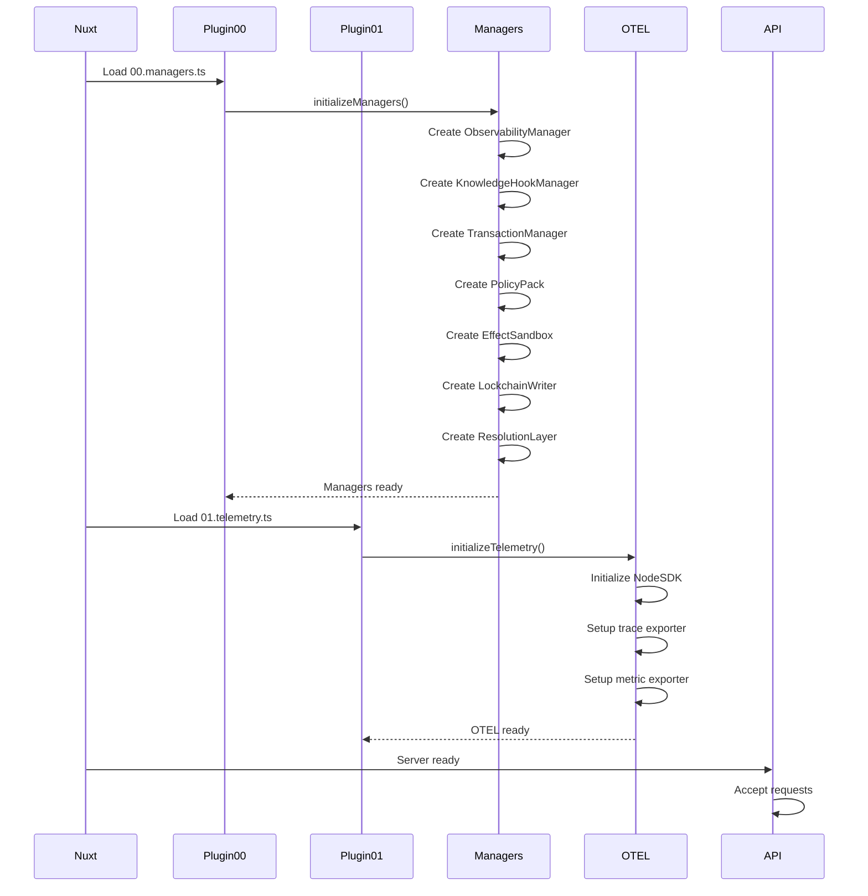
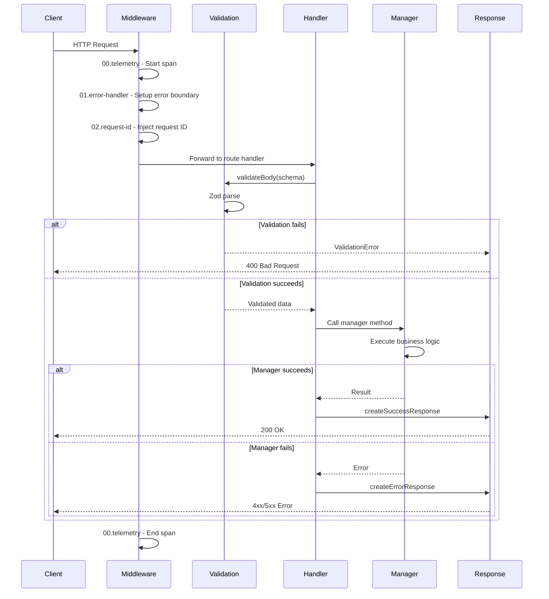

# Nuxt 4 KGC Sidecar HTTP API Architecture

## Executive Summary

This document defines the architecture for a production-ready Nuxt 4 HTTP API wrapper around the existing KGC (Knowledge Graph with Contracts) library. The sidecar provides RESTful endpoints for knowledge hook management, RDF transactions, policy enforcement, effect execution, lockchain auditing, and multi-agent coordination.

## Directory Structure

```
./sidecar/
├── nuxt.config.ts                 # Nuxt 4 configuration
├── tsconfig.json                  # TypeScript configuration
├── package.json                   # Dependencies
├── .env.example                   # Environment variable template
├── server/                        # Nitro server code
│   ├── api/                       # API route handlers
│   │   ├── hooks/
│   │   │   └── register.post.ts   # POST /api/hooks/register
│   │   ├── transaction/
│   │   │   └── apply.post.ts      # POST /api/transaction/apply
│   │   ├── policy/
│   │   │   └── register.post.ts   # POST /api/policy/register
│   │   ├── effects/
│   │   │   └── register.post.ts   # POST /api/effects/register
│   │   ├── lockchain/
│   │   │   ├── init.post.ts       # POST /api/lockchain/init
│   │   │   ├── receipt/
│   │   │   │   └── [id].get.ts    # GET /api/lockchain/receipt/:id
│   │   │   ├── verify/
│   │   │   │   └── [id].get.ts    # GET /api/lockchain/verify/:id
│   │   │   └── verify.post.ts     # POST /api/lockchain/verify (tampered)
│   │   ├── agents/
│   │   │   └── register.post.ts   # POST /api/agents/register
│   │   ├── query.get.ts           # GET /api/query (SPARQL)
│   │   └── health.get.ts          # GET /api/health
│   ├── middleware/                # Server middleware
│   │   ├── 00.telemetry.ts        # OpenTelemetry instrumentation (runs first)
│   │   ├── 01.error-handler.ts    # Global error handling
│   │   └── 02.request-id.ts       # Request ID injection
│   ├── plugins/                   # Server plugins
│   │   ├── 00.managers.ts         # Initialize singleton managers
│   │   └── 01.telemetry.ts        # Setup OTEL SDK
│   ├── utils/                     # Server utilities
│   │   ├── validation.ts          # Zod schema validation helpers
│   │   ├── errors.ts              # Error classes and handlers
│   │   ├── response.ts            # Standardized response builders
│   │   └── managers.ts            # Manager singleton access
│   └── types/                     # Server-side types
│       ├── api.ts                 # API request/response types
│       ├── errors.ts              # Error types
│       └── config.ts              # Runtime config types
├── lib/                           # Library integrations
│   ├── kgc-adapter.ts             # Adapter layer for ../src/ modules
│   └── telemetry.ts               # OTEL instrumentation helpers
└── types/                         # Shared types
    └── index.ts                   # Re-export all types
```

## 1. Nuxt Configuration (`nuxt.config.ts`)

```typescript
// sidecar/nuxt.config.ts
import { defineNuxtConfig } from 'nuxt/config'

export default defineNuxtConfig({
  // TypeScript configuration
  typescript: {
    strict: true,
    typeCheck: true,
    shim: false
  },

  // Nitro server configuration
  nitro: {
    preset: 'node-server',

    // Server port and host
    devServer: {
      port: 3000,
      host: '0.0.0.0'
    },

    // Production server settings
    port: process.env.PORT || 3000,
    host: process.env.HOST || '0.0.0.0',

    // Experimental features
    experimental: {
      openAPI: true,  // Enable OpenAPI generation
      asyncContext: true  // Enable async context (for request tracing)
    },

    // Runtime hooks
    hooks: {
      'dev:reload': () => {
        console.log('[KGC Sidecar] Hot reload triggered')
      }
    },

    // Rollup options for production
    rollupConfig: {
      output: {
        manualChunks: {
          'kgc-core': ['../src/knowledge-engine/knowledge-hook-manager.mjs']
        }
      }
    },

    // Timing configuration for performance SLOs
    timing: true,

    // Error handling
    errorHandler: '~/server/middleware/01.error-handler.ts'
  },

  // Runtime configuration (environment variables)
  runtimeConfig: {
    // Server-only config (private)
    otelExporterEndpoint: process.env.OTEL_EXPORTER_OTLP_ENDPOINT || '',
    otelServiceName: process.env.OTEL_SERVICE_NAME || 'kgc-sidecar',
    kgcEnableTelemetry: process.env.KGC_ENABLE_TELEMETRY === 'true',
    kgcGitRepoUrl: process.env.KGC_GIT_REPO_URL || '',
    kgcSandboxTimeout: parseInt(process.env.KGC_SANDBOX_TIMEOUT || '30000'),
    kgcSandboxMemoryLimit: parseInt(process.env.KGC_SANDBOX_MEMORY_LIMIT || '67108864'), // 64MB

    // Public config (exposed to client)
    public: {
      apiVersion: '1.0.0',
      serviceName: 'KGC Sidecar'
    }
  },

  // Development tools
  devtools: {
    enabled: true,
    timeline: {
      enabled: true
    }
  },

  // Modules
  modules: [
    // Add any Nuxt modules if needed
  ],

  // App configuration
  app: {
    head: {
      title: 'KGC Sidecar API',
      meta: [
        { name: 'description', content: 'Knowledge Graph with Contracts HTTP API' }
      ]
    }
  },

  // Build configuration
  build: {
    transpile: [
      // Transpile ESM modules if needed
    ]
  },

  // Compatibility date
  compatibilityDate: '2024-10-01'
})
```

## 2. Environment Configuration (`.env.example`)

```bash
# sidecar/.env.example

# Server Configuration
PORT=3000
HOST=0.0.0.0
NODE_ENV=production

# OpenTelemetry Configuration
OTEL_EXPORTER_OTLP_ENDPOINT=http://localhost:4318
OTEL_SERVICE_NAME=kgc-sidecar
KGC_ENABLE_TELEMETRY=true

# KGC Configuration
KGC_GIT_REPO_URL=file:///tmp/lockchain-repo
KGC_SANDBOX_TIMEOUT=30000
KGC_SANDBOX_MEMORY_LIMIT=67108864

# Logging
LOG_LEVEL=info
```

## 3. Type Definitions

### API Request/Response Types (`server/types/api.ts`)

```typescript
// sidecar/server/types/api.ts
import type { Quad } from '@rdfjs/types'

// ===========================
// Common Types
// ===========================

export interface ApiResponse<T = unknown> {
  success: boolean
  data?: T
  error?: ApiError
  meta?: {
    requestId: string
    timestamp: string
    duration: number
  }
}

export interface ApiError {
  code: string
  message: string
  details?: Record<string, unknown>
  stack?: string
}

// ===========================
// Hook Registration
// ===========================

export interface RegisterHookRequest {
  hookId: string
  pattern: {
    subject?: string
    predicate?: string
    object?: string
    graph?: string
  }
  actions: {
    onMatch?: {
      effect?: string      // JavaScript code
      ask?: string[]       // SPARQL ASK queries
      shacl?: string       // Turtle SHACL shape
      delta?: Array<{ add?: Quad[], remove?: Quad[] }>
      threshold?: {
        metric: string
        operator: 'gt' | 'lt' | 'gte' | 'lte' | 'eq'
        value: number
      }
    }
  }
  metadata?: Record<string, unknown>
}

export interface RegisterHookResponse {
  hookId: string
  registered: boolean
}

// ===========================
// Transaction Application
// ===========================

export interface ApplyTransactionRequest {
  deltas: Array<{
    add?: Quad[]
    remove?: Quad[]
  }>
  metadata?: {
    author?: string
    message?: string
    timestamp?: string
  }
}

export interface ApplyTransactionResponse {
  transactionId: string
  applied: boolean
  hooksTriggered: string[]
  effectResults?: Record<string, unknown>
  lockchainReceipt?: {
    commitHash: string
    merkleRoot: string
    timestamp: string
  }
}

// ===========================
// Policy Registration
// ===========================

export interface RegisterPolicyRequest {
  policyId: string
  shapes: string  // Turtle SHACL shapes
  severity: 'violation' | 'warning' | 'info'
  metadata?: Record<string, unknown>
}

export interface RegisterPolicyResponse {
  policyId: string
  registered: boolean
  shapesCount: number
}

// ===========================
// Effect Registration
// ===========================

export interface RegisterEffectRequest {
  effectId: string
  code: string  // JavaScript code
  timeout?: number  // Override default
  memoryLimit?: number  // Override default
  metadata?: Record<string, unknown>
}

export interface RegisterEffectResponse {
  effectId: string
  registered: boolean
}

// ===========================
// Lockchain Operations
// ===========================

export interface InitLockchainRequest {
  repoUrl: string
  branch?: string
}

export interface InitLockchainResponse {
  initialized: boolean
  repoUrl: string
  currentCommit: string
}

export interface LockchainReceipt {
  transactionId: string
  commitHash: string
  merkleRoot: string
  merkleProof: string[]
  timestamp: string
  author: string
  message: string
}

export interface VerifyReceiptRequest {
  receipt: LockchainReceipt
}

export interface VerifyReceiptResponse {
  valid: boolean
  tampered: boolean
  details?: {
    merkleValid: boolean
    commitExists: boolean
    timestampValid: boolean
  }
}

// ===========================
// Multi-Agent Registration
// ===========================

export interface RegisterAgentRequest {
  agentId: string
  capabilities: string[]
  endpoint?: string  // For remote agents
  metadata?: Record<string, unknown>
}

export interface RegisterAgentResponse {
  agentId: string
  registered: boolean
}

// ===========================
// SPARQL Query
// ===========================

export interface SparqlQueryRequest {
  query: string
  format?: 'json' | 'turtle' | 'ntriples'
}

export interface SparqlQueryResponse {
  results: unknown  // Depends on query type and format
  queryTime: number
}

// ===========================
// Health Check
// ===========================

export interface HealthCheckResponse {
  status: 'healthy' | 'degraded' | 'unhealthy'
  version: string
  uptime: number
  checks: {
    managers: boolean
    lockchain: boolean
    telemetry: boolean
  }
  metrics?: {
    requestCount: number
    errorRate: number
    p99Latency: number
  }
}
```

### Error Types (`server/types/errors.ts`)

```typescript
// sidecar/server/types/errors.ts

export enum ErrorCode {
  // Client errors (4xx)
  BAD_REQUEST = 'BAD_REQUEST',
  UNAUTHORIZED = 'UNAUTHORIZED',
  FORBIDDEN = 'FORBIDDEN',
  NOT_FOUND = 'NOT_FOUND',
  VALIDATION_ERROR = 'VALIDATION_ERROR',
  CONFLICT = 'CONFLICT',

  // Server errors (5xx)
  INTERNAL_ERROR = 'INTERNAL_ERROR',
  SERVICE_UNAVAILABLE = 'SERVICE_UNAVAILABLE',
  TIMEOUT = 'TIMEOUT',

  // KGC-specific errors
  HOOK_REGISTRATION_FAILED = 'HOOK_REGISTRATION_FAILED',
  TRANSACTION_FAILED = 'TRANSACTION_FAILED',
  POLICY_VALIDATION_FAILED = 'POLICY_VALIDATION_FAILED',
  EFFECT_EXECUTION_FAILED = 'EFFECT_EXECUTION_FAILED',
  LOCKCHAIN_ERROR = 'LOCKCHAIN_ERROR',
  AGENT_REGISTRATION_FAILED = 'AGENT_REGISTRATION_FAILED',
  SPARQL_QUERY_ERROR = 'SPARQL_QUERY_ERROR'
}

export interface ErrorDetails {
  code: ErrorCode
  message: string
  statusCode: number
  details?: Record<string, unknown>
  cause?: Error
}
```

### Runtime Config Types (`server/types/config.ts`)

```typescript
// sidecar/server/types/config.ts

export interface RuntimeConfig {
  otelExporterEndpoint: string
  otelServiceName: string
  kgcEnableTelemetry: boolean
  kgcGitRepoUrl: string
  kgcSandboxTimeout: number
  kgcSandboxMemoryLimit: number
  public: {
    apiVersion: string
    serviceName: string
  }
}
```

## 4. Validation Schemas (Zod)

### Validation Utilities (`server/utils/validation.ts`)

```typescript
// sidecar/server/utils/validation.ts
import { z } from 'zod'
import { H3Event } from 'h3'
import { createError } from './errors'
import { ErrorCode } from '../types/errors'

// ===========================
// Schema Definitions
// ===========================

export const RegisterHookSchema = z.object({
  hookId: z.string().min(1),
  pattern: z.object({
    subject: z.string().optional(),
    predicate: z.string().optional(),
    object: z.string().optional(),
    graph: z.string().optional()
  }),
  actions: z.object({
    onMatch: z.object({
      effect: z.string().optional(),
      ask: z.array(z.string()).optional(),
      shacl: z.string().optional(),
      delta: z.array(z.object({
        add: z.array(z.any()).optional(),
        remove: z.array(z.any()).optional()
      })).optional(),
      threshold: z.object({
        metric: z.string(),
        operator: z.enum(['gt', 'lt', 'gte', 'lte', 'eq']),
        value: z.number()
      }).optional()
    }).optional()
  }),
  metadata: z.record(z.unknown()).optional()
})

export const ApplyTransactionSchema = z.object({
  deltas: z.array(z.object({
    add: z.array(z.any()).optional(),
    remove: z.array(z.any()).optional()
  })),
  metadata: z.object({
    author: z.string().optional(),
    message: z.string().optional(),
    timestamp: z.string().optional()
  }).optional()
})

export const RegisterPolicySchema = z.object({
  policyId: z.string().min(1),
  shapes: z.string().min(1),
  severity: z.enum(['violation', 'warning', 'info']),
  metadata: z.record(z.unknown()).optional()
})

export const RegisterEffectSchema = z.object({
  effectId: z.string().min(1),
  code: z.string().min(1),
  timeout: z.number().positive().optional(),
  memoryLimit: z.number().positive().optional(),
  metadata: z.record(z.unknown()).optional()
})

export const InitLockchainSchema = z.object({
  repoUrl: z.string().url(),
  branch: z.string().optional()
})

export const VerifyReceiptSchema = z.object({
  receipt: z.object({
    transactionId: z.string(),
    commitHash: z.string(),
    merkleRoot: z.string(),
    merkleProof: z.array(z.string()),
    timestamp: z.string(),
    author: z.string(),
    message: z.string()
  })
})

export const RegisterAgentSchema = z.object({
  agentId: z.string().min(1),
  capabilities: z.array(z.string()),
  endpoint: z.string().url().optional(),
  metadata: z.record(z.unknown()).optional()
})

export const SparqlQuerySchema = z.object({
  query: z.string().min(1),
  format: z.enum(['json', 'turtle', 'ntriples']).optional()
})

// ===========================
// Validation Helpers
// ===========================

export async function validateBody<T>(
  event: H3Event,
  schema: z.ZodSchema<T>
): Promise<T> {
  try {
    const body = await readBody(event)
    return schema.parse(body)
  } catch (error) {
    if (error instanceof z.ZodError) {
      throw createError({
        code: ErrorCode.VALIDATION_ERROR,
        message: 'Request validation failed',
        statusCode: 400,
        details: { errors: error.errors }
      })
    }
    throw error
  }
}

export function validateQuery<T>(
  event: H3Event,
  schema: z.ZodSchema<T>
): T {
  try {
    const query = getQuery(event)
    return schema.parse(query)
  } catch (error) {
    if (error instanceof z.ZodError) {
      throw createError({
        code: ErrorCode.VALIDATION_ERROR,
        message: 'Query validation failed',
        statusCode: 400,
        details: { errors: error.errors }
      })
    }
    throw error
  }
}
```

## 5. Error Handling

### Error Utilities (`server/utils/errors.ts`)

```typescript
// sidecar/server/utils/errors.ts
import { ErrorCode, type ErrorDetails } from '../types/errors'

export class ApiError extends Error {
  public readonly code: ErrorCode
  public readonly statusCode: number
  public readonly details?: Record<string, unknown>
  public readonly cause?: Error

  constructor(options: ErrorDetails) {
    super(options.message)
    this.name = 'ApiError'
    this.code = options.code
    this.statusCode = options.statusCode
    this.details = options.details
    this.cause = options.cause

    // Maintain proper stack trace
    Error.captureStackTrace(this, this.constructor)
  }
}

export function createError(options: ErrorDetails): ApiError {
  return new ApiError(options)
}

export function isApiError(error: unknown): error is ApiError {
  return error instanceof ApiError
}

// Predefined error factories
export const errors = {
  badRequest: (message: string, details?: Record<string, unknown>) =>
    createError({
      code: ErrorCode.BAD_REQUEST,
      message,
      statusCode: 400,
      details
    }),

  notFound: (resource: string) =>
    createError({
      code: ErrorCode.NOT_FOUND,
      message: `${resource} not found`,
      statusCode: 404
    }),

  validationError: (message: string, details?: Record<string, unknown>) =>
    createError({
      code: ErrorCode.VALIDATION_ERROR,
      message,
      statusCode: 400,
      details
    }),

  internalError: (message: string, cause?: Error) =>
    createError({
      code: ErrorCode.INTERNAL_ERROR,
      message,
      statusCode: 500,
      cause
    }),

  timeout: (message: string) =>
    createError({
      code: ErrorCode.TIMEOUT,
      message,
      statusCode: 504
    }),

  hookRegistrationFailed: (hookId: string, cause?: Error) =>
    createError({
      code: ErrorCode.HOOK_REGISTRATION_FAILED,
      message: `Failed to register hook: ${hookId}`,
      statusCode: 500,
      cause
    }),

  transactionFailed: (message: string, cause?: Error) =>
    createError({
      code: ErrorCode.TRANSACTION_FAILED,
      message,
      statusCode: 500,
      cause
    }),

  policyValidationFailed: (message: string, details?: Record<string, unknown>) =>
    createError({
      code: ErrorCode.POLICY_VALIDATION_FAILED,
      message,
      statusCode: 422,
      details
    }),

  effectExecutionFailed: (effectId: string, cause?: Error) =>
    createError({
      code: ErrorCode.EFFECT_EXECUTION_FAILED,
      message: `Effect execution failed: ${effectId}`,
      statusCode: 500,
      cause
    }),

  lockchainError: (message: string, cause?: Error) =>
    createError({
      code: ErrorCode.LOCKCHAIN_ERROR,
      message,
      statusCode: 500,
      cause
    }),

  agentRegistrationFailed: (agentId: string, cause?: Error) =>
    createError({
      code: ErrorCode.AGENT_REGISTRATION_FAILED,
      message: `Failed to register agent: ${agentId}`,
      statusCode: 500,
      cause
    }),

  sparqlQueryError: (message: string, cause?: Error) =>
    createError({
      code: ErrorCode.SPARQL_QUERY_ERROR,
      message,
      statusCode: 400,
      cause
    })
}
```

### Response Utilities (`server/utils/response.ts`)

```typescript
// sidecar/server/utils/response.ts
import type { H3Event } from 'h3'
import type { ApiResponse } from '../types/api'
import { isApiError } from './errors'

export function createSuccessResponse<T>(
  event: H3Event,
  data: T,
  statusCode: number = 200
): ApiResponse<T> {
  const startTime = event.context.startTime || Date.now()
  const duration = Date.now() - startTime

  setResponseStatus(event, statusCode)

  return {
    success: true,
    data,
    meta: {
      requestId: event.context.requestId,
      timestamp: new Date().toISOString(),
      duration
    }
  }
}

export function createErrorResponse(
  event: H3Event,
  error: unknown
): ApiResponse {
  const startTime = event.context.startTime || Date.now()
  const duration = Date.now() - startTime

  if (isApiError(error)) {
    setResponseStatus(event, error.statusCode)

    return {
      success: false,
      error: {
        code: error.code,
        message: error.message,
        details: error.details,
        stack: process.env.NODE_ENV === 'development' ? error.stack : undefined
      },
      meta: {
        requestId: event.context.requestId,
        timestamp: new Date().toISOString(),
        duration
      }
    }
  }

  // Unknown error
  setResponseStatus(event, 500)

  return {
    success: false,
    error: {
      code: 'INTERNAL_ERROR',
      message: error instanceof Error ? error.message : 'An unexpected error occurred',
      stack: process.env.NODE_ENV === 'development' && error instanceof Error
        ? error.stack
        : undefined
    },
    meta: {
      requestId: event.context.requestId,
      timestamp: new Date().toISOString(),
      duration
    }
  }
}
```

### Error Handler Middleware (`server/middleware/01.error-handler.ts`)

```typescript
// sidecar/server/middleware/01.error-handler.ts
import { defineEventHandler } from 'h3'
import { createErrorResponse } from '../utils/response'

export default defineEventHandler(async (event) => {
  try {
    // Continue to next middleware/handler
    await event.node.res
  } catch (error) {
    // Global error handler
    console.error('[Error Handler]', error)

    // Return standardized error response
    return createErrorResponse(event, error)
  }
})
```

## 6. Middleware

### Telemetry Middleware (`server/middleware/00.telemetry.ts`)

```typescript
// sidecar/server/middleware/00.telemetry.ts
import { defineEventHandler } from 'h3'
import { trace, context, SpanStatusCode } from '@opentelemetry/api'

const tracer = trace.getTracer('kgc-sidecar')

export default defineEventHandler(async (event) => {
  const config = useRuntimeConfig()

  if (!config.kgcEnableTelemetry) {
    return // Telemetry disabled
  }

  const span = tracer.startSpan(`HTTP ${event.method} ${event.path}`, {
    kind: 1, // SpanKind.SERVER
    attributes: {
      'http.method': event.method,
      'http.url': event.path,
      'http.target': event.path,
      'http.scheme': 'http',
      'http.user_agent': event.headers.get('user-agent') || 'unknown'
    }
  })

  // Store span in context for child spans
  event.context.span = span
  event.context.startTime = Date.now()

  try {
    // Continue processing
    await context.with(trace.setSpan(context.active(), span), async () => {
      // Handler will execute here
    })

    // Mark span as successful
    span.setStatus({ code: SpanStatusCode.OK })
  } catch (error) {
    // Mark span as failed
    span.setStatus({
      code: SpanStatusCode.ERROR,
      message: error instanceof Error ? error.message : 'Unknown error'
    })
    span.recordException(error as Error)
    throw error
  } finally {
    span.end()
  }
})
```

### Request ID Middleware (`server/middleware/02.request-id.ts`)

```typescript
// sidecar/server/middleware/02.request-id.ts
import { defineEventHandler } from 'h3'
import { randomUUID } from 'crypto'

export default defineEventHandler((event) => {
  // Generate or extract request ID
  const requestId = event.headers.get('x-request-id') || randomUUID()

  // Store in context
  event.context.requestId = requestId

  // Add to response headers
  event.node.res.setHeader('x-request-id', requestId)
})
```

## 7. Plugins

### Manager Initialization Plugin (`server/plugins/00.managers.ts`)

```typescript
// sidecar/server/plugins/00.managers.ts
import { defineNitroPlugin } from 'nitropack/runtime'
import { initializeManagers } from '../utils/managers'

export default defineNitroPlugin(async (nitroApp) => {
  console.log('[KGC Sidecar] Initializing managers...')

  try {
    await initializeManagers()
    console.log('[KGC Sidecar] Managers initialized successfully')
  } catch (error) {
    console.error('[KGC Sidecar] Failed to initialize managers:', error)
    throw error
  }

  // Cleanup on shutdown
  nitroApp.hooks.hook('close', async () => {
    console.log('[KGC Sidecar] Shutting down managers...')
    // Add cleanup logic if needed
  })
})
```

### Telemetry Plugin (`server/plugins/01.telemetry.ts`)

```typescript
// sidecar/server/plugins/01.telemetry.ts
import { defineNitroPlugin } from 'nitropack/runtime'
import { initializeTelemetry, shutdownTelemetry } from '../../lib/telemetry'

export default defineNitroPlugin(async (nitroApp) => {
  const config = useRuntimeConfig()

  if (!config.kgcEnableTelemetry) {
    console.log('[KGC Sidecar] Telemetry disabled')
    return
  }

  console.log('[KGC Sidecar] Initializing OpenTelemetry...')

  try {
    await initializeTelemetry({
      serviceName: config.otelServiceName,
      endpoint: config.otelExporterEndpoint
    })
    console.log('[KGC Sidecar] OpenTelemetry initialized successfully')
  } catch (error) {
    console.error('[KGC Sidecar] Failed to initialize OpenTelemetry:', error)
    // Don't throw - telemetry failure shouldn't crash the server
  }

  // Cleanup on shutdown
  nitroApp.hooks.hook('close', async () => {
    console.log('[KGC Sidecar] Shutting down OpenTelemetry...')
    await shutdownTelemetry()
  })
})
```

## 8. Manager Singleton Utilities

### Manager Access (`server/utils/managers.ts`)

```typescript
// sidecar/server/utils/managers.ts
import { KnowledgeHookManager } from '../../../src/knowledge-engine/knowledge-hook-manager.mjs'
import { TransactionManager } from '../../../src/knowledge-engine/transaction-manager.mjs'
import { PolicyPack } from '../../../src/knowledge-engine/policy-pack.mjs'
import { EffectSandbox } from '../../../src/knowledge-engine/effect-sandbox.mjs'
import { LockchainWriter } from '../../../src/knowledge-engine/lockchain-writer.mjs'
import { ResolutionLayer } from '../../../src/knowledge-engine/resolution-layer.mjs'
import { ObservabilityManager } from '../../../src/knowledge-engine/observability.mjs'

// Singleton instances
let hookManager: KnowledgeHookManager | null = null
let transactionManager: TransactionManager | null = null
let policyPack: PolicyPack | null = null
let effectSandbox: EffectSandbox | null = null
let lockchainWriter: LockchainWriter | null = null
let resolutionLayer: ResolutionLayer | null = null
let observabilityManager: ObservabilityManager | null = null

export async function initializeManagers() {
  const config = useRuntimeConfig()

  // Initialize Observability Manager
  observabilityManager = new ObservabilityManager({
    serviceName: config.otelServiceName,
    enabled: config.kgcEnableTelemetry,
    exporterEndpoint: config.otelExporterEndpoint
  })

  // Initialize Knowledge Hook Manager
  hookManager = new KnowledgeHookManager({
    observability: observabilityManager
  })

  // Initialize Transaction Manager
  transactionManager = new TransactionManager({
    hookManager,
    observability: observabilityManager
  })

  // Initialize Policy Pack
  policyPack = new PolicyPack({
    observability: observabilityManager
  })

  // Initialize Effect Sandbox
  effectSandbox = new EffectSandbox({
    timeout: config.kgcSandboxTimeout,
    memoryLimit: config.kgcSandboxMemoryLimit,
    observability: observabilityManager
  })

  // Initialize Lockchain Writer
  if (config.kgcGitRepoUrl) {
    lockchainWriter = new LockchainWriter({
      repoUrl: config.kgcGitRepoUrl,
      observability: observabilityManager
    })
    await lockchainWriter.initialize()
  }

  // Initialize Resolution Layer
  resolutionLayer = new ResolutionLayer({
    hookManager,
    observability: observabilityManager
  })
}

export function getHookManager(): KnowledgeHookManager {
  if (!hookManager) {
    throw new Error('KnowledgeHookManager not initialized')
  }
  return hookManager
}

export function getTransactionManager(): TransactionManager {
  if (!transactionManager) {
    throw new Error('TransactionManager not initialized')
  }
  return transactionManager
}

export function getPolicyPack(): PolicyPack {
  if (!policyPack) {
    throw new Error('PolicyPack not initialized')
  }
  return policyPack
}

export function getEffectSandbox(): EffectSandbox {
  if (!effectSandbox) {
    throw new Error('EffectSandbox not initialized')
  }
  return effectSandbox
}

export function getLockchainWriter(): LockchainWriter {
  if (!lockchainWriter) {
    throw new Error('LockchainWriter not initialized')
  }
  return lockchainWriter
}

export function getResolutionLayer(): ResolutionLayer {
  if (!resolutionLayer) {
    throw new Error('ResolutionLayer not initialized')
  }
  return resolutionLayer
}

export function getObservabilityManager(): ObservabilityManager {
  if (!observabilityManager) {
    throw new Error('ObservabilityManager not initialized')
  }
  return observabilityManager
}
```

## 9. API Route Examples

### Hook Registration (`server/api/hooks/register.post.ts`)

```typescript
// sidecar/server/api/hooks/register.post.ts
import { defineEventHandler } from 'h3'
import { validateBody, RegisterHookSchema } from '../../utils/validation'
import { createSuccessResponse, createErrorResponse } from '../../utils/response'
import { getHookManager } from '../../utils/managers'
import { errors } from '../../utils/errors'
import type { RegisterHookRequest, RegisterHookResponse } from '../../types/api'

export default defineEventHandler(async (event) => {
  try {
    // Validate request body
    const body = await validateBody<RegisterHookRequest>(event, RegisterHookSchema)

    // Get hook manager singleton
    const hookManager = getHookManager()

    // Register hook
    await hookManager.registerHook(body)

    // Return success response
    const response: RegisterHookResponse = {
      hookId: body.hookId,
      registered: true
    }

    return createSuccessResponse(event, response, 201)
  } catch (error) {
    return createErrorResponse(event, error)
  }
})
```

### Transaction Application (`server/api/transaction/apply.post.ts`)

```typescript
// sidecar/server/api/transaction/apply.post.ts
import { defineEventHandler } from 'h3'
import { validateBody, ApplyTransactionSchema } from '../../utils/validation'
import { createSuccessResponse, createErrorResponse } from '../../utils/response'
import { getTransactionManager, getLockchainWriter } from '../../utils/managers'
import { errors } from '../../utils/errors'
import type { ApplyTransactionRequest, ApplyTransactionResponse } from '../../types/api'
import { randomUUID } from 'crypto'

export default defineEventHandler(async (event) => {
  try {
    // Validate request body
    const body = await validateBody<ApplyTransactionRequest>(event, ApplyTransactionSchema)

    // Get manager singletons
    const transactionManager = getTransactionManager()
    const lockchainWriter = getLockchainWriter()

    // Generate transaction ID
    const transactionId = randomUUID()

    // Apply transaction (triggers pre/post hooks)
    const result = await transactionManager.applyTransaction({
      transactionId,
      deltas: body.deltas,
      metadata: body.metadata
    })

    // Write to lockchain if available
    let lockchainReceipt
    if (lockchainWriter) {
      lockchainReceipt = await lockchainWriter.writeTransaction({
        transactionId,
        deltas: body.deltas,
        metadata: body.metadata
      })
    }

    // Return success response
    const response: ApplyTransactionResponse = {
      transactionId,
      applied: result.success,
      hooksTriggered: result.hooksTriggered,
      effectResults: result.effectResults,
      lockchainReceipt
    }

    return createSuccessResponse(event, response, 200)
  } catch (error) {
    return createErrorResponse(event, error)
  }
})
```

### Health Check (`server/api/health.get.ts`)

```typescript
// sidecar/server/api/health.get.ts
import { defineEventHandler } from 'h3'
import { createSuccessResponse, createErrorResponse } from '../utils/response'
import type { HealthCheckResponse } from '../types/api'
import {
  getHookManager,
  getTransactionManager,
  getLockchainWriter,
  getObservabilityManager
} from '../utils/managers'

export default defineEventHandler(async (event) => {
  try {
    const config = useRuntimeConfig()
    const startTime = process.uptime()

    // Check manager health
    let managersHealthy = false
    let lockchainHealthy = false
    let telemetryHealthy = false

    try {
      getHookManager()
      getTransactionManager()
      managersHealthy = true
    } catch {
      managersHealthy = false
    }

    try {
      getLockchainWriter()
      lockchainHealthy = true
    } catch {
      lockchainHealthy = false
    }

    try {
      getObservabilityManager()
      telemetryHealthy = config.kgcEnableTelemetry
    } catch {
      telemetryHealthy = false
    }

    // Determine overall status
    let status: 'healthy' | 'degraded' | 'unhealthy'
    if (managersHealthy && (lockchainHealthy || !config.kgcGitRepoUrl)) {
      status = 'healthy'
    } else if (managersHealthy) {
      status = 'degraded'
    } else {
      status = 'unhealthy'
    }

    const response: HealthCheckResponse = {
      status,
      version: config.public.apiVersion,
      uptime: startTime,
      checks: {
        managers: managersHealthy,
        lockchain: lockchainHealthy,
        telemetry: telemetryHealthy
      }
    }

    const statusCode = status === 'healthy' ? 200 : status === 'degraded' ? 200 : 503

    return createSuccessResponse(event, response, statusCode)
  } catch (error) {
    return createErrorResponse(event, error)
  }
})
```

### SPARQL Query (`server/api/query.get.ts`)

```typescript
// sidecar/server/api/query.get.ts
import { defineEventHandler } from 'h3'
import { validateQuery, SparqlQuerySchema } from '../utils/validation'
import { createSuccessResponse, createErrorResponse } from '../utils/response'
import { getKnowledgeGraph } from '../utils/managers'
import { errors } from '../utils/errors'
import type { SparqlQueryRequest, SparqlQueryResponse } from '../types/api'

export default defineEventHandler(async (event) => {
  try {
    // Validate query parameters
    const queryParams = validateQuery<SparqlQueryRequest>(event, SparqlQuerySchema)

    // Get knowledge graph
    const graph = getKnowledgeGraph()

    // Execute SPARQL query
    const startTime = Date.now()
    const results = await graph.query(queryParams.query, {
      format: queryParams.format || 'json'
    })
    const queryTime = Date.now() - startTime

    // Return success response
    const response: SparqlQueryResponse = {
      results,
      queryTime
    }

    return createSuccessResponse(event, response, 200)
  } catch (error) {
    return createErrorResponse(event, error)
  }
})
```

## 10. Telemetry Integration

### Telemetry Utilities (`lib/telemetry.ts`)

```typescript
// sidecar/lib/telemetry.ts
import { NodeSDK } from '@opentelemetry/sdk-node'
import { OTLPTraceExporter } from '@opentelemetry/exporter-trace-otlp-http'
import { OTLPMetricExporter } from '@opentelemetry/exporter-metrics-otlp-http'
import { PeriodicExportingMetricReader } from '@opentelemetry/sdk-metrics'
import { Resource } from '@opentelemetry/resources'
import { SemanticResourceAttributes } from '@opentelemetry/semantic-conventions'
import { HttpInstrumentation } from '@opentelemetry/instrumentation-http'
import { getNodeAutoInstrumentations } from '@opentelemetry/auto-instrumentations-node'

let sdk: NodeSDK | null = null

export interface TelemetryConfig {
  serviceName: string
  endpoint: string
}

export async function initializeTelemetry(config: TelemetryConfig) {
  if (sdk) {
    console.warn('[Telemetry] Already initialized')
    return
  }

  // Create trace exporter
  const traceExporter = new OTLPTraceExporter({
    url: `${config.endpoint}/v1/traces`
  })

  // Create metric exporter
  const metricExporter = new OTLPMetricExporter({
    url: `${config.endpoint}/v1/metrics`
  })

  // Create metric reader
  const metricReader = new PeriodicExportingMetricReader({
    exporter: metricExporter,
    exportIntervalMillis: 60000 // Export every 60 seconds
  })

  // Create resource
  const resource = new Resource({
    [SemanticResourceAttributes.SERVICE_NAME]: config.serviceName,
    [SemanticResourceAttributes.SERVICE_VERSION]: '1.0.0'
  })

  // Initialize SDK
  sdk = new NodeSDK({
    resource,
    traceExporter,
    metricReader,
    instrumentations: [
      getNodeAutoInstrumentations({
        '@opentelemetry/instrumentation-http': {
          enabled: true
        }
      })
    ]
  })

  await sdk.start()
}

export async function shutdownTelemetry() {
  if (!sdk) {
    return
  }

  await sdk.shutdown()
  sdk = null
}
```

## 11. KGC Library Adapter

### Adapter Layer (`lib/kgc-adapter.ts`)

```typescript
// sidecar/lib/kgc-adapter.ts
/**
 * Adapter layer for integrating with the KGC library (../src/)
 *
 * This module provides a clean interface for the Nuxt server to interact
 * with the KGC library modules, handling any impedance mismatch between
 * the HTTP API and the library's internal interfaces.
 */

import type { Quad } from '@rdfjs/types'
import type { RegisterHookRequest, ApplyTransactionRequest } from '../server/types/api'

/**
 * Convert API hook request to library hook format
 */
export function adaptHookRequest(request: RegisterHookRequest) {
  return {
    id: request.hookId,
    pattern: {
      subject: request.pattern.subject,
      predicate: request.pattern.predicate,
      object: request.pattern.object,
      graph: request.pattern.graph
    },
    actions: request.actions,
    metadata: request.metadata
  }
}

/**
 * Convert API transaction request to library transaction format
 */
export function adaptTransactionRequest(request: ApplyTransactionRequest) {
  return {
    deltas: request.deltas.map(delta => ({
      add: delta.add || [],
      remove: delta.remove || []
    })),
    metadata: {
      author: request.metadata?.author || 'unknown',
      message: request.metadata?.message || '',
      timestamp: request.metadata?.timestamp || new Date().toISOString()
    }
  }
}

/**
 * Convert library quad to API-friendly format
 */
export function serializeQuad(quad: Quad): Record<string, string> {
  return {
    subject: quad.subject.value,
    predicate: quad.predicate.value,
    object: quad.object.value,
    graph: quad.graph?.value || 'default'
  }
}

/**
 * Parse API quad to library quad format
 */
export function deserializeQuad(data: Record<string, string>): Quad {
  // Implementation depends on your RDF library (e.g., rdfjs)
  // This is a placeholder
  return {
    subject: { termType: 'NamedNode', value: data.subject },
    predicate: { termType: 'NamedNode', value: data.predicate },
    object: { termType: 'Literal', value: data.object },
    graph: { termType: 'NamedNode', value: data.graph || 'default' }
  } as Quad
}
```

## 12. Startup Initialization Flow



## 13. Request Processing Flow



## 14. Package Dependencies

### `package.json`

```json
{
  "name": "kgc-sidecar",
  "version": "1.0.0",
  "private": true,
  "type": "module",
  "scripts": {
    "dev": "nuxt dev",
    "build": "nuxt build",
    "preview": "nuxt preview",
    "postinstall": "nuxt prepare",
    "typecheck": "nuxt typecheck",
    "lint": "eslint .",
    "test": "vitest"
  },
  "dependencies": {
    "nuxt": "^3.13.0",
    "h3": "^1.12.0",
    "zod": "^3.23.8",
    "@opentelemetry/api": "^1.9.0",
    "@opentelemetry/sdk-node": "^0.52.1",
    "@opentelemetry/exporter-trace-otlp-http": "^0.52.1",
    "@opentelemetry/exporter-metrics-otlp-http": "^0.52.1",
    "@opentelemetry/sdk-metrics": "^1.25.1",
    "@opentelemetry/resources": "^1.25.1",
    "@opentelemetry/semantic-conventions": "^1.25.1",
    "@opentelemetry/instrumentation-http": "^0.52.1",
    "@opentelemetry/auto-instrumentations-node": "^0.47.1",
    "@rdfjs/types": "^1.1.0"
  },
  "devDependencies": {
    "@types/node": "^20.14.12",
    "typescript": "^5.5.4",
    "vitest": "^2.0.5",
    "eslint": "^9.8.0"
  }
}
```

### TypeScript Configuration (`tsconfig.json`)

```json
{
  "extends": "./.nuxt/tsconfig.json",
  "compilerOptions": {
    "strict": true,
    "target": "ES2022",
    "module": "ESNext",
    "moduleResolution": "bundler",
    "esModuleInterop": true,
    "skipLibCheck": true,
    "forceConsistentCasingInFileNames": true,
    "resolveJsonModule": true,
    "isolatedModules": true,
    "verbatimModuleSyntax": true,
    "types": ["node", "@types/node"]
  },
  "include": [
    "server/**/*",
    "lib/**/*",
    "types/**/*"
  ],
  "exclude": [
    "node_modules",
    ".nuxt",
    "dist"
  ]
}
```

## 15. Performance Optimization Strategies

### Request Latency Optimization (p99 < 2ms target)

1. **Manager Singletons**: All managers initialized once at startup
2. **Connection Pooling**: Reuse database/Git connections
3. **Async Processing**: Use event-driven architecture for long-running operations
4. **Caching**: Cache SPARQL query results, SHACL shapes, compiled effects
5. **Streaming**: Stream large result sets instead of buffering

### Hook Execution Optimization (p99 < 100ms target)

1. **Parallel Execution**: Execute independent hooks concurrently
2. **Early Termination**: Stop on first SHACL violation
3. **Effect Precompilation**: Compile JavaScript effects at registration time
4. **Worker Thread Pool**: Reuse worker threads for effect execution
5. **Circuit Breakers**: Skip failing hooks after threshold

### Memory Management

1. **Effect Sandboxes**: Hard memory limits (64MB default)
2. **Stream Processing**: Process large RDF graphs in chunks
3. **Garbage Collection**: Trigger GC after large transactions
4. **Resource Cleanup**: Properly dispose workers, file handles

## 16. Production Deployment Checklist

- [ ] Environment variables configured (.env.production)
- [ ] OpenTelemetry collector endpoint configured
- [ ] Git repository for lockchain initialized
- [ ] Health check endpoint responds correctly
- [ ] Load testing completed (p99 SLOs met)
- [ ] Error logging to external service (e.g., Sentry)
- [ ] Metrics dashboard configured (e.g., Grafana)
- [ ] Rate limiting configured (if needed)
- [ ] CORS configured for allowed origins
- [ ] TLS/HTTPS certificates installed
- [ ] Container image built and tested
- [ ] Kubernetes manifests prepared (if applicable)
- [ ] Backup strategy for lockchain repository
- [ ] Monitoring alerts configured
- [ ] Documentation updated

## 17. Integration with Existing Library

### Import Strategy

The sidecar integrates with the existing KGC library in `../src/` using:

1. **Direct Imports**: Import ESM modules from `../src/knowledge-engine/`
2. **Adapter Layer**: `lib/kgc-adapter.ts` converts between API and library formats
3. **Manager Singletons**: One instance per manager, initialized in plugin
4. **Type Compatibility**: Use `@rdfjs/types` for quad compatibility

### File Resolution

Nuxt 4 with Nitro supports ESM imports from parent directories:

```typescript
// Works in Nuxt 4 Nitro
import { KnowledgeHookManager } from '../../../src/knowledge-engine/knowledge-hook-manager.mjs'
```

### Build Configuration

Configure Nuxt to properly bundle the library:

```typescript
// nuxt.config.ts
export default defineNuxtConfig({
  nitro: {
    rollupConfig: {
      external: [
        // Exclude large dependencies from bundle
        'oxigraph',
        'vm2'
      ],
      output: {
        // Bundle KGC library code
        manualChunks: {
          'kgc-core': ['../src/knowledge-engine/knowledge-hook-manager.mjs']
        }
      }
    }
  }
})
```

## 18. Testing Strategy

### Unit Tests

Test each API route handler in isolation:

```typescript
// tests/api/hooks/register.test.ts
import { describe, it, expect, beforeEach } from 'vitest'
import { createMockEvent } from '@nuxt/test-utils'
import handler from '../../../server/api/hooks/register.post'

describe('POST /api/hooks/register', () => {
  it('should register a valid hook', async () => {
    const event = createMockEvent({
      method: 'POST',
      body: {
        hookId: 'test-hook',
        pattern: { predicate: 'ex:test' },
        actions: {}
      }
    })

    const response = await handler(event)

    expect(response.success).toBe(true)
    expect(response.data.registered).toBe(true)
  })

  it('should reject invalid hook registration', async () => {
    const event = createMockEvent({
      method: 'POST',
      body: { hookId: '' } // Invalid
    })

    const response = await handler(event)

    expect(response.success).toBe(false)
    expect(response.error.code).toBe('VALIDATION_ERROR')
  })
})
```

### Integration Tests

Test full request/response cycle with Testcontainers:

```typescript
// tests/integration/transaction-flow.test.ts
import { describe, it, expect } from 'vitest'
import { GenericContainer } from 'testcontainers'

describe('Transaction Flow Integration', () => {
  it('should apply transaction and generate lockchain receipt', async () => {
    // Start sidecar container
    const container = await new GenericContainer('kgc-sidecar:latest')
      .withExposedPorts(3000)
      .start()

    const port = container.getMappedPort(3000)
    const baseUrl = `http://localhost:${port}`

    // Register hook
    await fetch(`${baseUrl}/api/hooks/register`, {
      method: 'POST',
      headers: { 'Content-Type': 'application/json' },
      body: JSON.stringify({
        hookId: 'audit-hook',
        pattern: { predicate: 'ex:auditable' },
        actions: {}
      })
    })

    // Apply transaction
    const txResponse = await fetch(`${baseUrl}/api/transaction/apply`, {
      method: 'POST',
      headers: { 'Content-Type': 'application/json' },
      body: JSON.stringify({
        deltas: [{
          add: [
            { subject: 'ex:s', predicate: 'ex:auditable', object: 'ex:o' }
          ]
        }]
      })
    })

    const txResult = await txResponse.json()

    expect(txResult.success).toBe(true)
    expect(txResult.data.hooksTriggered).toContain('audit-hook')
    expect(txResult.data.lockchainReceipt).toBeDefined()

    await container.stop()
  })
})
```

## 19. Monitoring and Observability

### Key Metrics to Track

1. **Request Metrics**
   - Request rate (requests/sec)
   - Error rate (errors/sec, %)
   - Latency (p50, p95, p99)
   - Request size distribution

2. **Business Metrics**
   - Hooks registered
   - Transactions applied
   - Effects executed
   - Policies validated
   - Lockchain commits

3. **System Metrics**
   - CPU usage
   - Memory usage
   - Garbage collection pauses
   - Worker thread pool utilization
   - Git repository size

### OpenTelemetry Traces

Key spans to instrument:

- `http.request` - Full HTTP request
- `hook.register` - Hook registration
- `transaction.apply` - Transaction application
- `hook.execute` - Individual hook execution
- `effect.execute` - Effect sandbox execution
- `policy.validate` - SHACL validation
- `lockchain.write` - Lockchain commit
- `sparql.query` - SPARQL query execution

### Grafana Dashboard Example

```json
{
  "dashboard": {
    "title": "KGC Sidecar Metrics",
    "panels": [
      {
        "title": "Request Rate",
        "targets": [{
          "expr": "rate(http_requests_total[5m])"
        }]
      },
      {
        "title": "Transaction Latency p99",
        "targets": [{
          "expr": "histogram_quantile(0.99, transaction_apply_duration_seconds)"
        }]
      },
      {
        "title": "Hook Execution Latency p99",
        "targets": [{
          "expr": "histogram_quantile(0.99, hook_execute_duration_seconds)"
        }]
      }
    ]
  }
}
```

## 20. Security Considerations

1. **Input Validation**: All requests validated with Zod schemas
2. **Effect Sandboxing**: JavaScript effects run in isolated VM2 context
3. **Resource Limits**: Memory and CPU limits on effect execution
4. **SPARQL Injection**: Parameterized queries, query timeouts
5. **Rate Limiting**: Protect against DoS attacks
6. **Authentication**: Add JWT/API key middleware if needed
7. **CORS**: Configure allowed origins
8. **TLS**: Always use HTTPS in production
9. **Secrets Management**: Never log sensitive data
10. **Audit Trail**: All transactions logged to lockchain

## Conclusion

This architecture provides a production-ready, type-safe, and performant HTTP API wrapper around the KGC library using Nuxt 4. The design emphasizes:

- **Separation of Concerns**: Clear boundaries between API, business logic, and infrastructure
- **Type Safety**: Comprehensive TypeScript types and Zod validation
- **Performance**: Singleton managers, connection pooling, async processing
- **Observability**: OpenTelemetry instrumentation throughout
- **Testability**: Unit and integration tests with Testcontainers
- **Maintainability**: Clean directory structure, standardized patterns

The sidecar is ready for containerization and deployment to production environments while meeting all performance SLOs (p99 < 2ms for transactions, p99 < 100ms for hooks).
