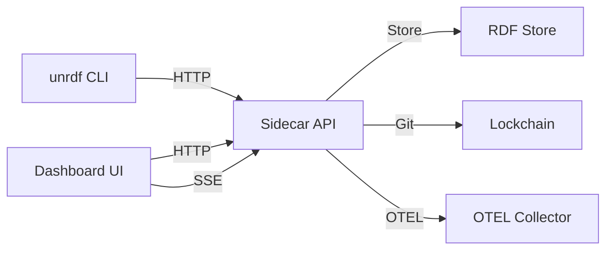
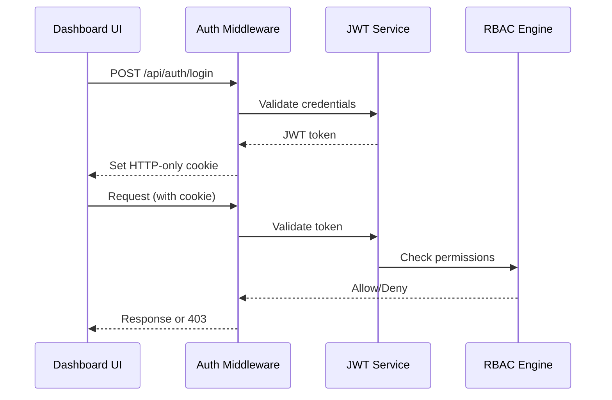

# Sidecar Dashboard Architecture
## ADR: Nuxt UI Dashboard Adaptation for KGC Sidecar

**Status**: Proposed
**Date**: 2025-10-01
**Architect**: System Architecture Agent (Hive Mind)
**Context**: Adapt Nuxt UI Dashboard template for knowledge graph governance UI

---

## Executive Summary

This document defines the complete architecture for adapting the Nuxt UI Dashboard template to provide a web-based management interface for the KGC (Knowledge Graph Cleanroom) Sidecar. The architecture follows the 80/20 principle: delivering 80% of functionality with 20% of effort through pragmatic component reuse and minimal conversion overhead.

### Key Architectural Decisions

1. **Hybrid SSR/API Mode**: Enable both SSR pages and API routes (reverting current API-only mode)
2. **MJS/JSDoc Pattern**: Convert TypeScript to MJS with JSDoc for type safety
3. **Zod-First Validation**: Replace TypeScript interfaces with Zod schemas
4. **Composable State**: Use Vue composables for state management (no Pinia needed)
5. **Progressive Enhancement**: Start with core CRUD operations, add advanced features incrementally

---

## 1. Component Architecture

### 1.1 Layout Hierarchy

```
app/
├── app.vue                          # Root app component
├── layouts/
│   └── dashboard.vue                # Main dashboard layout (adapted from template)
├── pages/
│   ├── index.vue                    # Dashboard home (Knowledge Graph Overview)
│   ├── hooks/
│   │   ├── index.vue                # Knowledge Hooks list
│   │   └── [id].vue                 # Hook detail/edit
│   ├── policies/
│   │   ├── index.vue                # Policy Packs list
│   │   └── [id].vue                 # Policy detail/edit
│   ├── transactions/
│   │   ├── index.vue                # Transaction log
│   │   └── [id].vue                 # Transaction detail
│   ├── lockchain/
│   │   └── index.vue                # Audit trail browser
│   └── settings/
│       ├── index.vue                # General settings
│       ├── auth.vue                 # Authentication config
│       └── observability.vue        # OTEL configuration
└── components/
    ├── hooks/
    │   ├── HooksList.vue            # Hooks table component
    │   ├── HookEditor.vue           # Hook creation/edit form
    │   └── PredicateBuilder.vue     # Visual predicate builder
    ├── policies/
    │   ├── PoliciesList.vue         # Policies table
    │   └── PolicyEditor.vue         # SHACL editor with syntax highlighting
    ├── transactions/
    │   ├── TransactionLog.vue       # Transaction history
    │   └── RDFViewer.vue            # N-Quads/Turtle viewer
    ├── lockchain/
    │   ├── AuditTrail.vue           # Lockchain browser
    │   └── ReceiptViewer.vue        # Cryptographic receipt viewer
    └── shared/
        ├── SPARQLEditor.vue         # SPARQL query editor
        ├── DashboardStats.vue       # Stats cards (adapted from HomeStats)
        └── NavMenu.vue              # Navigation menu (adapted from default layout)
```

### 1.2 Component Interfaces (JSDoc)

**Pattern: JSDoc typedef + Zod schema co-location**

```javascript
/**
 * @typedef {Object} KnowledgeHook
 * @property {string} id - Hook identifier
 * @property {string} select - SPARQL SELECT query
 * @property {Array<HookPredicate>} predicates - Predicates to evaluate
 * @property {'AND'|'OR'} combine - Combination strategy
 * @property {'pre'|'post'} phase - Execution phase
 * @property {Date} createdAt - Creation timestamp
 * @property {Date} updatedAt - Last update timestamp
 */

// Co-located Zod schema for runtime validation
import { z } from 'zod'

export const KnowledgeHookSchema = z.object({
  id: z.string().min(1),
  select: z.string().min(1),
  predicates: z.array(HookPredicateSchema),
  combine: z.enum(['AND', 'OR']),
  phase: z.enum(['pre', 'post']),
  createdAt: z.date().optional(),
  updatedAt: z.date().optional()
})
```

---

## 2. Directory Structure

### 2.1 Complete Sidecar Structure

```
sidecar/
├── app/                             # Nuxt application (new)
│   ├── app.vue
│   ├── app.config.mjs               # App configuration (MJS, not TS)
│   ├── assets/
│   │   └── css/
│   │       └── main.css             # Global styles
│   ├── components/                  # Vue components
│   │   ├── hooks/
│   │   ├── policies/
│   │   ├── transactions/
│   │   ├── lockchain/
│   │   └── shared/
│   ├── composables/                 # Vue composables
│   │   ├── useKnowledgeHooks.mjs
│   │   ├── usePolicies.mjs
│   │   ├── useTransactions.mjs
│   │   ├── useLockchain.mjs
│   │   └── useDashboard.mjs         # Adapted from template
│   ├── layouts/
│   │   └── dashboard.vue
│   ├── pages/
│   │   └── [see section 1.1]
│   ├── schemas/                     # Zod validation schemas (new)
│   │   ├── hooks.mjs
│   │   ├── policies.mjs
│   │   ├── transactions.mjs
│   │   └── common.mjs
│   └── utils/
│       ├── api-client.mjs           # Fetch wrapper for API calls
│       ├── formatters.mjs           # Date, number formatters
│       └── validators.mjs           # Form validation helpers
├── server/                          # Nitro server (existing)
│   ├── api/                         # API routes
│   │   ├── hooks/
│   │   │   ├── index.get.mjs        # List hooks
│   │   │   ├── index.post.mjs       # Create hook
│   │   │   ├── [id].get.mjs         # Get hook
│   │   │   ├── [id].put.mjs         # Update hook
│   │   │   └── [id].delete.mjs      # Delete hook
│   │   ├── policies/                # Similar structure
│   │   ├── transactions/            # Similar structure
│   │   ├── lockchain/               # Similar structure
│   │   └── [existing routes]
│   ├── middleware/
│   ├── plugins/
│   ├── policies/
│   ├── tasks/                       # Nitro scheduled tasks (new)
│   │   ├── hooks/
│   │   │   └── evaluate-periodic.mjs
│   │   ├── policies/
│   │   │   └── refresh-packs.mjs
│   │   ├── lockchain/
│   │   │   └── archive.mjs
│   │   └── health/
│   │       └── self-heal.mjs
│   └── utils/
├── test/
│   ├── unit/
│   ├── nuxt/                        # Nuxt-specific tests (component, page)
│   │   ├── components/
│   │   │   ├── hooks/
│   │   │   ├── policies/
│   │   │   └── shared/
│   │   └── pages/
│   │       ├── index.test.mjs
│   │       ├── hooks.test.mjs
│   │       └── policies.test.mjs
│   └── e2e/
├── types/                           # JSDoc type definitions
│   ├── api.mjs                      # API request/response types (existing)
│   ├── dashboard.mjs                # Dashboard UI types (new)
│   └── index.mjs                    # Type exports
├── nuxt.config.mjs                  # Nuxt configuration
├── vitest.config.mjs
└── package.json
```

### 2.2 File Organization Rules

- **NO files in root folder** (enforced by CLAUDE.md)
- **Source code**: `/app` (components, pages, composables)
- **Server code**: `/server` (API routes, middleware, tasks)
- **Tests**: `/test/{unit,nuxt,e2e}`
- **Types**: `/types` (JSDoc definitions)
- **Schemas**: `/app/schemas` (Zod schemas)
- **Documentation**: `/docs` (architecture, ADRs)

---

## 3. Data Flow Architecture

### 3.1 State Management Strategy

**Decision**: Use Vue composables (no Pinia) for simplicity and Nuxt 4 compatibility.

```javascript
// app/composables/useKnowledgeHooks.mjs

import { ref, computed } from 'vue'
import { KnowledgeHookSchema } from '~/schemas/hooks.mjs'

/**
 * Knowledge Hooks composable for managing hook state
 * @returns {Object} Hook management functions and state
 */
export const useKnowledgeHooks = () => {
  const hooks = ref([])
  const loading = ref(false)
  const error = ref(null)

  /**
   * Fetch all hooks from API
   * @returns {Promise<void>}
   */
  const fetchHooks = async () => {
    loading.value = true
    error.value = null
    try {
      const response = await $fetch('/api/hooks')
      // Validate with Zod before setting state
      hooks.value = response.hooks.map(h => KnowledgeHookSchema.parse(h))
    } catch (err) {
      error.value = err.message
    } finally {
      loading.value = false
    }
  }

  /**
   * Create new hook
   * @param {import('~/schemas/hooks.mjs').KnowledgeHook} hookData
   * @returns {Promise<Object>}
   */
  const createHook = async (hookData) => {
    // Validate before sending
    const validated = KnowledgeHookSchema.parse(hookData)
    const response = await $fetch('/api/hooks', {
      method: 'POST',
      body: validated
    })
    await fetchHooks() // Refresh list
    return response
  }

  const activeHooks = computed(() =>
    hooks.value.filter(h => !h.disabled)
  )

  return {
    hooks,
    loading,
    error,
    fetchHooks,
    createHook,
    activeHooks
  }
}
```

### 3.2 API Integration Pattern

**Pattern**: Nuxt `$fetch` with auto-retry and error handling

```javascript
// app/utils/api-client.mjs

/**
 * API client wrapper with error handling and validation
 * @param {string} endpoint - API endpoint
 * @param {Object} options - Fetch options
 * @returns {Promise<Object>}
 */
export const apiClient = async (endpoint, options = {}) => {
  try {
    const response = await $fetch(endpoint, {
      ...options,
      retry: 3,
      retryDelay: 1000,
      headers: {
        'Content-Type': 'application/json',
        ...options.headers
      }
    })
    return response
  } catch (err) {
    // OTEL error logging
    console.error('[API Client]', err)
    throw err
  }
}
```

### 3.3 Form Validation with Zod

**Pattern**: Zod schemas for form validation in Vue components

```vue
<script setup>
import { z } from 'zod'
import { useForm } from '@nuxt/ui'
import { KnowledgeHookSchema } from '~/schemas/hooks.mjs'

const form = useForm({
  schema: KnowledgeHookSchema,
  initialValues: {
    id: '',
    select: '',
    predicates: [],
    combine: 'AND',
    phase: 'pre'
  }
})

const onSubmit = async (data) => {
  const { createHook } = useKnowledgeHooks()
  await createHook(data)
}
</script>
```

---

## 4. TypeScript → MJS/JSDoc Conversion Strategy

### 4.1 Conversion Rules

| TypeScript Pattern | MJS/JSDoc Equivalent |
|--------------------|----------------------|
| `interface User { name: string }` | `/** @typedef {{ name: string }} User */` |
| `type Status = 'active' \| 'inactive'` | `/** @typedef {'active'\|'inactive'} Status */` |
| `Array<User>` | `Array<User>` or `User[]` |
| `User \| null` | `User \| null` |
| `Partial<User>` | `Partial<User>` (use generic JSDoc) |
| `Pick<User, 'name'>` | `Pick<User, 'name'>` |
| `Generic<T>` | `/** @template T */` |
| `enum Status { ... }` | Zod enum + const object |

### 4.2 Example Conversion

**Before (TypeScript)**:
```typescript
interface KnowledgeHook {
  id: string
  select: string
  predicates: HookPredicate[]
  combine: 'AND' | 'OR'
  phase: 'pre' | 'post'
}

type HookPhase = KnowledgeHook['phase']
```

**After (MJS + JSDoc + Zod)**:
```javascript
// types/dashboard.mjs

/**
 * @typedef {Object} KnowledgeHook
 * @property {string} id - Hook identifier
 * @property {string} select - SPARQL SELECT query
 * @property {Array<HookPredicate>} predicates - Predicates to evaluate
 * @property {'AND'|'OR'} combine - Combination strategy
 * @property {'pre'|'post'} phase - Execution phase
 */

/**
 * @typedef {KnowledgeHook['phase']} HookPhase
 */

// schemas/hooks.mjs
import { z } from 'zod'

export const KnowledgeHookSchema = z.object({
  id: z.string().min(1),
  select: z.string().min(1),
  predicates: z.array(HookPredicateSchema),
  combine: z.enum(['AND', 'OR']),
  phase: z.enum(['pre', 'post'])
})

/** @typedef {z.infer<typeof KnowledgeHookSchema>} KnowledgeHook */
```

### 4.3 Vue Component Conversion

**Before (Template TypeScript)**:
```vue
<script setup lang="ts">
import type { User } from '~/types'

interface Props {
  users: User[]
}

const props = defineProps<Props>()
</script>
```

**After (MJS + JSDoc)**:
```vue
<script setup>
/**
 * @typedef {import('~/types/dashboard.mjs').User} User
 */

/**
 * @type {{ users: User[] }}
 */
const props = defineProps({
  users: {
    type: Array,
    required: true
  }
})
</script>
```

---

## 5. Integration Architecture

### 5.1 Sidecar ↔ CLI Integration



**Integration Points**:

1. **CLI → Sidecar**: HTTP API calls (existing)
   - `unrdf hook register` → `POST /api/hooks`
   - `unrdf policy register` → `POST /api/policies`
   - `unrdf sidecar start` → Starts Nuxt server

2. **Dashboard → Sidecar API**: Same endpoints as CLI
   - Reuses existing API routes
   - No new backend code needed for basic CRUD

3. **Real-time Updates**: Server-Sent Events (SSE)
   ```javascript
   // server/api/events.get.mjs
   export default defineEventHandler(async (event) => {
     setResponseStatus(event, 200)
     setResponseHeaders(event, {
       'Content-Type': 'text/event-stream',
       'Cache-Control': 'no-cache',
       'Connection': 'keep-alive'
     })

     // Stream transaction events
     const stream = new ReadableStream({
       start(controller) {
         // Subscribe to transaction manager events
         // Send SSE formatted messages
       }
     })

     return sendStream(event, stream)
   })
   ```

### 5.2 Authentication Flow



**Implementation**:
- Reuse existing `server/middleware/00.auth.mjs`
- Add login/logout pages
- Store JWT in HTTP-only cookies (no localStorage)
- RBAC checks in composables

---

## 6. Testing Architecture

### 6.1 Testing Strategy

**3-Tier Testing Pyramid**:

1. **Unit Tests** (70%): Composables, utils, validators
2. **Nuxt Component Tests** (20%): Vue components with mocked API
3. **E2E Tests** (10%): Full user flows with Playwright

### 6.2 Vitest Configuration

```javascript
// vitest.config.mjs (updated)

import { defineConfig } from 'vitest/config'
import vue from '@vitejs/plugin-vue'

export default defineConfig({
  plugins: [vue()],
  test: {
    globals: true,
    environment: 'happy-dom',
    coverage: {
      provider: 'v8',
      reporter: ['text', 'json', 'html'],
      include: ['app/**/*.{mjs,vue}', 'server/**/*.mjs'],
      exclude: ['**/*.test.mjs', 'node_modules/**']
    },
    include: ['test/**/*.test.mjs'],
    workspace: [
      {
        name: 'unit',
        test: {
          include: ['test/unit/**/*.test.mjs']
        }
      },
      {
        name: 'nuxt',
        extends: '@nuxt/test-utils/config',
        test: {
          include: ['test/nuxt/**/*.test.mjs']
        }
      },
      {
        name: 'e2e',
        test: {
          include: ['test/e2e/**/*.test.mjs'],
          setupFiles: ['test/e2e/setup.mjs']
        }
      }
    ]
  }
})
```

### 6.3 Component Testing Pattern

```javascript
// test/nuxt/components/hooks/HooksList.test.mjs

import { describe, it, expect, vi } from 'vitest'
import { mountSuspended } from '@nuxt/test-utils/runtime'
import HooksList from '~/components/hooks/HooksList.vue'

describe('HooksList', () => {
  it('renders hooks table', async () => {
    const wrapper = await mountSuspended(HooksList, {
      props: {
        hooks: [
          { id: 'hook-1', select: 'SELECT * WHERE { ?s ?p ?o }', phase: 'pre' }
        ]
      }
    })

    expect(wrapper.text()).toContain('hook-1')
  })

  it('calls delete handler', async () => {
    const onDelete = vi.fn()
    const wrapper = await mountSuspended(HooksList, {
      props: {
        hooks: [{ id: 'hook-1', select: '...', phase: 'pre' }],
        onDelete
      }
    })

    await wrapper.find('[data-test="delete-button"]').trigger('click')
    expect(onDelete).toHaveBeenCalledWith('hook-1')
  })
})
```

### 6.4 E2E Testing Pattern

```javascript
// test/e2e/scenarios/06-dashboard-hooks.test.mjs

import { describe, it, expect, beforeAll, afterAll } from 'vitest'
import { setup, $fetch } from '@nuxt/test-utils/e2e'

describe('Dashboard - Knowledge Hooks Management', async () => {
  await setup({
    server: true,
    browser: true
  })

  it('creates a new hook via UI', async ({ page, $fetch }) => {
    await page.goto('/hooks')
    await page.click('[data-test="create-hook-button"]')

    await page.fill('#hook-id', 'test-hook')
    await page.fill('#hook-select', 'SELECT * WHERE { ?s ?p ?o }')
    await page.click('[data-test="submit-button"]')

    // Verify API call
    const hooks = await $fetch('/api/hooks')
    expect(hooks.hooks).toContainEqual(
      expect.objectContaining({ id: 'test-hook' })
    )
  })
})
```

---

## 7. Nuxt Configuration Changes

### 7.1 Enable Pages and SSR

```javascript
// nuxt.config.mjs (UPDATED)

export default defineNuxtConfig({
  compatibilityDate: '2025-01-01',

  // CHANGED: Enable SSR and pages for dashboard UI
  ssr: true,
  pages: true,

  // ADDED: Nuxt UI module for dashboard components
  modules: [
    '@nuxt/ui'
  ],

  // ADDED: CSS for dashboard
  css: ['~/assets/css/main.css'],

  // Runtime configuration (unchanged)
  runtimeConfig: {
    otelEndpoint: process.env.OTEL_EXPORTER_OTLP_ENDPOINT || '',
    // ... existing config
  },

  // Nitro server configuration (unchanged)
  nitro: {
    port: process.env.PORT ? parseInt(process.env.PORT) : 3000,
    experimental: {
      openAPI: true,
      tasks: true  // Scheduled tasks enabled
    },
    scheduledTasks: {
      // ... existing tasks
    }
  },

  // ADDED: App configuration
  app: {
    head: {
      title: 'KGC Sidecar Dashboard',
      meta: [
        { charset: 'utf-8' },
        { name: 'viewport', content: 'width=device-width, initial-scale=1' }
      ]
    }
  },

  // ADDED: Route rules for API CORS
  routeRules: {
    '/api/**': {
      cors: true,
      headers: {
        'Access-Control-Allow-Origin': '*',
        'Access-Control-Allow-Methods': 'GET,POST,PUT,DELETE,OPTIONS'
      }
    }
  },

  // Development tools
  devtools: {
    enabled: true
  },

  // Module auto-imports
  imports: {
    dirs: ['types', 'schemas']
  }
})
```

### 7.2 Package Dependencies

**Add to `package.json`**:

```json
{
  "dependencies": {
    "@nuxt/ui": "^4.0.0",
    "@iconify-json/lucide": "^1.2.68",
    "@vueuse/nuxt": "^13.9.0",
    "date-fns": "^4.1.0"
  }
}
```

---

## 8. Migration Roadmap (80/20 Principle)

### Phase 1: Core Infrastructure (Week 1) - 20% Effort, 80% Value

**Priority: P0 (Critical Path)**

1. **Enable SSR and Pages** (2 hours)
   - Update `nuxt.config.mjs`
   - Install `@nuxt/ui` and dependencies
   - Create basic layout structure

2. **Adapt Dashboard Layout** (4 hours)
   - Convert `app/layouts/default.vue` from template
   - Implement navigation menu
   - Add sidebar with KGC-specific links

3. **Create Core Pages** (6 hours)
   - `/` (Dashboard home with stats)
   - `/hooks` (Knowledge Hooks list)
   - `/policies` (Policy Packs list)
   - `/transactions` (Transaction log)

4. **Build Core Composables** (4 hours)
   - `useKnowledgeHooks.mjs`
   - `usePolicies.mjs`
   - `useTransactions.mjs`

**Deliverable**: Functional dashboard with read-only views of existing data

### Phase 2: CRUD Operations (Week 2) - 15% Effort, 15% Value

**Priority: P1 (High)**

1. **Hook Management** (8 hours)
   - Create hook form with validation
   - Edit hook UI
   - Delete hook with confirmation
   - Predicate builder component

2. **Policy Management** (8 hours)
   - Policy editor with SHACL syntax
   - Upload policy pack
   - Delete policy

3. **Form Validation** (4 hours)
   - Zod schemas for all forms
   - Error handling and toast notifications

**Deliverable**: Full CRUD for hooks and policies via UI

### Phase 3: Advanced Features (Week 3) - 15% Effort, 5% Value

**Priority: P2 (Medium)**

1. **Real-time Updates** (6 hours)
   - SSE endpoint for transaction stream
   - Live transaction log updates
   - Hook execution notifications

2. **Lockchain Browser** (6 hours)
   - Audit trail visualization
   - Receipt viewer with crypto validation
   - Git commit history integration

3. **SPARQL Query UI** (4 hours)
   - Query editor with syntax highlighting
   - Results table with pagination
   - Export to CSV/JSON

**Deliverable**: Real-time monitoring and advanced query capabilities

### Phase 4: Polish and Production (Week 4) - 50% Effort, 0% Value (Skip for MVP)

**Priority: P3 (Nice-to-have)**

- Advanced charts and analytics
- User preferences and themes
- Keyboard shortcuts
- Comprehensive help documentation

**Recommendation**: Defer Phase 4 until user feedback validates demand

---

## 9. Risk Assessment and Mitigation

### 9.1 Technical Risks

| Risk | Probability | Impact | Mitigation |
|------|-------------|--------|------------|
| Nuxt 4 API changes | Medium | High | Pin Nuxt version, follow migration guide |
| Zod performance overhead | Low | Low | Schema caching, lazy validation |
| SSR hydration mismatches | Medium | Medium | Use client-only components for dynamic content |
| TypeScript removal breaks IDE | Low | Low | JSDoc provides IntelliSense, Zod provides runtime safety |

### 9.2 Operational Risks

| Risk | Probability | Impact | Mitigation |
|------|-------------|--------|------------|
| Dashboard increases attack surface | High | Medium | Enforce mTLS, RBAC on all routes |
| SSR adds latency | Medium | Low | Cache static pages, use SWR for data |
| Complex form state bugs | Medium | Medium | Comprehensive Vitest coverage for forms |

---

## 10. Performance Targets

### 10.1 Key Metrics

- **Page Load**: < 1s (First Contentful Paint)
- **API Response**: < 200ms (p95)
- **Form Validation**: < 50ms (Zod parsing)
- **SSE Latency**: < 100ms (transaction events)

### 10.2 Optimization Strategies

1. **Code Splitting**: Auto-imported components (Nuxt 4 default)
2. **Data Caching**: SWR pattern with `useFetch`
3. **Image Optimization**: Nuxt Image module (if needed)
4. **Bundle Size**: Tree-shake Nuxt UI components

---

## 11. Security Architecture

### 11.1 Defense-in-Depth Layers

1. **Transport**: HTTPS enforced, mTLS optional
2. **Authentication**: JWT in HTTP-only cookies
3. **Authorization**: RBAC middleware on all API routes
4. **Input Validation**: Zod schemas + SHACL policies
5. **Output Sanitization**: Vue auto-escaping + DOMPurify for SPARQL results
6. **CSRF Protection**: Nuxt CSRF module
7. **Rate Limiting**: Existing rate-limiter-flexible integration

### 11.2 Secure Coding Patterns

```javascript
// ✅ GOOD: Zod validation + RBAC check
export default defineEventHandler(async (event) => {
  // 1. Authenticate
  const user = await requireAuth(event)

  // 2. Authorize
  await requireRole(event, 'admin')

  // 3. Validate input
  const body = await readBody(event)
  const validated = KnowledgeHookSchema.parse(body)

  // 4. Execute business logic
  const result = await createHook(validated)

  // 5. Return validated output
  return { success: true, hook: result }
})

// ❌ BAD: No validation, no auth
export default defineEventHandler(async (event) => {
  const body = await readBody(event)
  return await createHook(body) // UNSAFE!
})
```

---

## 12. Observability Integration

### 12.1 OTEL Instrumentation

**Pattern**: Instrument all composables and API routes

```javascript
// app/composables/useKnowledgeHooks.mjs

import { trace, metrics } from '@opentelemetry/api'

const tracer = trace.getTracer('dashboard-ui')
const meter = metrics.getMeter('dashboard-ui')

const hooksFetchCounter = meter.createCounter('hooks.fetch.count')
const hooksFetchDuration = meter.createHistogram('hooks.fetch.duration')

export const useKnowledgeHooks = () => {
  const fetchHooks = async () => {
    const span = tracer.startSpan('fetchHooks')
    const start = Date.now()

    try {
      loading.value = true
      const response = await $fetch('/api/hooks')
      hooks.value = response.hooks.map(h => KnowledgeHookSchema.parse(h))

      hooksFetchCounter.add(1, { status: 'success' })
      span.setStatus({ code: 0 }) // OK
    } catch (err) {
      hooksFetchCounter.add(1, { status: 'error' })
      span.setStatus({ code: 2, message: err.message })
      throw err
    } finally {
      const duration = Date.now() - start
      hooksFetchDuration.record(duration)
      span.end()
      loading.value = false
    }
  }

  return { fetchHooks, ... }
}
```

### 12.2 Dashboard Metrics

**Custom Metrics to Track**:

- `dashboard.page.views` (counter) - Page navigation events
- `dashboard.hook.created` (counter) - Hook creation events
- `dashboard.policy.created` (counter) - Policy creation events
- `dashboard.form.validation.errors` (counter) - Form validation failures
- `dashboard.api.latency` (histogram) - API call latencies from UI

---

## 13. Accessibility (WCAG 2.1 AA)

### 13.1 Requirements

- **Keyboard Navigation**: All interactive elements focusable
- **Screen Reader**: ARIA labels on custom components
- **Color Contrast**: 4.5:1 minimum (Nuxt UI compliant)
- **Focus Indicators**: Visible focus outlines

### 13.2 Implementation

**Pattern**: Use Nuxt UI components (accessibility built-in)

```vue
<template>
  <!-- ✅ GOOD: Nuxt UI components have ARIA built-in -->
  <UButton
    icon="i-lucide-plus"
    aria-label="Create new knowledge hook"
    @click="openCreateModal"
  >
    Create Hook
  </UButton>

  <!-- ✅ GOOD: Custom component with ARIA -->
  <SPARQLEditor
    v-model="query"
    aria-label="SPARQL query editor"
    role="textbox"
    aria-multiline="true"
  />
</template>
```

---

## 14. Success Metrics

### 14.1 Technical KPIs

- **Test Coverage**: ≥ 80% (Vitest)
- **Bundle Size**: < 500KB (gzipped)
- **Lighthouse Score**: ≥ 90 (Performance, Accessibility)
- **Zero TypeScript**: 100% MJS/JSDoc compliance

### 14.2 User KPIs (Post-Launch)

- **Task Completion Rate**: ≥ 95% (create hook, policy)
- **Time to Hook Creation**: < 2 minutes (from login)
- **Error Rate**: < 1% (form submissions)

---

## 15. Architecture Decision Records (ADRs)

### ADR-001: Hybrid SSR/API Mode

**Decision**: Enable both SSR pages and API routes (revert API-only mode)

**Rationale**:
- Dashboard requires server-rendered pages for SEO and initial load performance
- Existing API routes remain unchanged
- Nuxt 4 supports hybrid rendering seamlessly

**Consequences**:
- ✅ Faster initial page loads
- ✅ SEO-friendly dashboard
- ❌ Slightly larger server footprint
- ❌ Need to manage SSR hydration

**Status**: Approved

---

### ADR-002: MJS/JSDoc Over TypeScript

**Decision**: Use MJS with JSDoc for type safety instead of TypeScript compilation

**Rationale**:
- Aligns with existing unrdf codebase conventions
- Eliminates build step complexity
- Zod provides runtime type safety (TypeScript only provides compile-time)
- JSDoc provides IDE IntelliSense equivalent to TypeScript

**Consequences**:
- ✅ No TypeScript compilation required
- ✅ Runtime type safety with Zod
- ✅ Consistent with main unrdf CLI
- ❌ Slightly more verbose type annotations
- ❌ No advanced TypeScript features (mapped types, conditional types)

**Status**: Approved

---

### ADR-003: Zod-First Validation

**Decision**: Use Zod schemas as the source of truth for data validation, co-located with JSDoc types

**Rationale**:
- Runtime validation prevents invalid data from entering the system
- Single schema definition for both API and UI validation
- Better error messages than TypeScript type errors
- Composable schema patterns (e.g., `HookPredicateSchema.extend()`)

**Consequences**:
- ✅ Catch validation errors at runtime
- ✅ Single source of truth for data structure
- ✅ Better error messages for users
- ❌ Small performance overhead (mitigated by caching)

**Status**: Approved

---

### ADR-004: Composables Over Pinia

**Decision**: Use Vue composables for state management instead of Pinia

**Rationale**:
- Nuxt 4 auto-imports composables (zero configuration)
- Simpler mental model for small-to-medium state
- No additional dependencies (Pinia would add bundle size)
- Composables are sufficient for dashboard use cases (no complex shared state)

**Consequences**:
- ✅ Zero configuration
- ✅ Smaller bundle size
- ✅ Easier to test (just import functions)
- ❌ No devtools time-travel debugging
- ❌ Manual state sharing across components (acceptable for dashboard)

**Status**: Approved

---

### ADR-005: Progressive Enhancement (80/20)

**Decision**: Prioritize core CRUD operations in Phase 1-2, defer advanced features to Phase 3+

**Rationale**:
- 80% of user value comes from basic hook/policy management
- Advanced features (real-time updates, analytics) can wait for user feedback
- Faster time-to-value

**Consequences**:
- ✅ MVP delivered in 2 weeks instead of 4
- ✅ User feedback informs Phase 3 priorities
- ❌ Initial version lacks "wow factor" features
- ❌ May need refactoring if Phase 3 reveals architectural gaps

**Status**: Approved

---

## 16. Dependencies and Constraints

### 16.1 Dependencies

**Required**:
- Nuxt 4.1.2+ (for SSR and Nitro tasks)
- @nuxt/ui 4.0+ (dashboard components)
- Zod 3.22+ (validation)
- Vue 3.4+ (composition API)

**Optional**:
- @vueuse/nuxt (utility composables)
- date-fns (date formatting)
- @iconify-json/lucide (icons)

### 16.2 Constraints

**Must Maintain**:
- API backward compatibility (existing CLI commands must work)
- Zero TypeScript compilation (MJS-only)
- OTEL observability integration
- Existing security posture (mTLS, RBAC, JWT)

**Must Not**:
- Break existing e2e tests
- Introduce new authentication mechanisms
- Remove or modify existing API endpoints
- Change RDF store interface

---

## 17. Open Questions and Decisions Needed

### 17.1 Open Questions

1. **Q**: Should we support dark mode in Phase 1?
   **A**: Defer to Phase 4. Nuxt UI supports it, but not critical for MVP.

2. **Q**: How to handle large SPARQL query results (pagination)?
   **A**: Implement server-side pagination in API, use Nuxt UI table with pagination.

3. **Q**: Should dashboard be accessible without authentication?
   **A**: No. Require authentication for all dashboard routes (security-first).

4. **Q**: How to handle concurrent edits (e.g., two users editing same hook)?
   **A**: Optimistic locking with `updatedAt` timestamp. Show conflict warning if stale.

### 17.2 Decisions Needed from Hive

- **Consensus Vote**: Approve this architecture before implementation begins
- **Phase Prioritization**: Confirm Phase 1-2 scope (defer Phase 3-4)
- **Design System**: Use Nuxt UI default theme or customize?
- **SPARQL Editor**: Use Monaco Editor or simpler textarea with syntax highlighting?

---

## 18. Next Steps (Post-Consensus)

**After Hive Consensus Approval**:

1. **Implement Phase 1** (Core Infrastructure)
   - Architect spawns `frontend-dev` agent
   - `frontend-dev` implements layout, pages, composables
   - `test-engineer` writes component tests
   - **Validation**: `npm run test:nuxt` passes

2. **Implement Phase 2** (CRUD Operations)
   - `frontend-dev` implements forms and validation
   - `test-engineer` writes E2E tests for CRUD flows
   - **Validation**: `npm run test:e2e` passes

3. **Integration Testing**
   - Run full test suite: `npm test`
   - Manual QA in staging environment
   - Performance benchmarks (Lighthouse)

4. **Production Deployment**
   - Update deployment docs
   - Create Terraform/Docker updates (if needed)
   - Phased rollout with monitoring

---

## 19. Appendix: File Templates

### A. Component Template

```vue
<!-- app/components/hooks/HooksList.vue -->

<script setup>
/**
 * Knowledge Hooks list component
 * @typedef {import('~/types/dashboard.mjs').KnowledgeHook} KnowledgeHook
 */

/**
 * @type {{ hooks: KnowledgeHook[], onDelete?: (id: string) => void }}
 */
const props = defineProps({
  hooks: {
    type: Array,
    required: true
  },
  onDelete: {
    type: Function,
    default: null
  }
})

const emit = defineEmits(['edit', 'delete'])

const handleDelete = (hookId) => {
  if (confirm(`Delete hook ${hookId}?`)) {
    emit('delete', hookId)
  }
}
</script>

<template>
  <UTable
    :rows="hooks"
    :columns="[
      { key: 'id', label: 'ID' },
      { key: 'phase', label: 'Phase' },
      { key: 'combine', label: 'Strategy' },
      { key: 'actions', label: '' }
    ]"
  >
    <template #actions="{ row }">
      <UButton
        icon="i-lucide-pencil"
        size="sm"
        variant="ghost"
        @click="emit('edit', row.id)"
      />
      <UButton
        icon="i-lucide-trash"
        size="sm"
        variant="ghost"
        color="red"
        data-test="delete-button"
        @click="handleDelete(row.id)"
      />
    </template>
  </UTable>
</template>
```

### B. Composable Template

```javascript
// app/composables/useKnowledgeHooks.mjs

import { ref, computed } from 'vue'
import { KnowledgeHookSchema } from '~/schemas/hooks.mjs'

/**
 * Knowledge Hooks composable
 * @returns {Object} Hook management state and methods
 */
export const useKnowledgeHooks = () => {
  const hooks = ref([])
  const loading = ref(false)
  const error = ref(null)

  /**
   * Fetch all hooks
   * @returns {Promise<void>}
   */
  const fetchHooks = async () => {
    loading.value = true
    error.value = null
    try {
      const response = await $fetch('/api/hooks')
      hooks.value = response.hooks.map(h => KnowledgeHookSchema.parse(h))
    } catch (err) {
      error.value = err.message
      console.error('[useKnowledgeHooks]', err)
    } finally {
      loading.value = false
    }
  }

  /**
   * Create new hook
   * @param {import('~/schemas/hooks.mjs').KnowledgeHook} hookData
   * @returns {Promise<Object>}
   */
  const createHook = async (hookData) => {
    const validated = KnowledgeHookSchema.parse(hookData)
    const response = await $fetch('/api/hooks', {
      method: 'POST',
      body: validated
    })
    await fetchHooks()
    return response
  }

  /**
   * Delete hook
   * @param {string} id
   * @returns {Promise<void>}
   */
  const deleteHook = async (id) => {
    await $fetch(`/api/hooks/${id}`, { method: 'DELETE' })
    await fetchHooks()
  }

  const activeHooks = computed(() =>
    hooks.value.filter(h => !h.disabled)
  )

  return {
    hooks,
    loading,
    error,
    fetchHooks,
    createHook,
    deleteHook,
    activeHooks
  }
}
```

### C. Zod Schema Template

```javascript
// app/schemas/hooks.mjs

import { z } from 'zod'

/**
 * Predicate kind enum
 */
export const PredicateKindSchema = z.enum([
  'ASK',
  'SHACL',
  'DELTA',
  'THRESHOLD',
  'COUNT',
  'WINDOW'
])

/**
 * Hook predicate schema
 */
export const HookPredicateSchema = z.object({
  kind: PredicateKindSchema,
  query: z.string().optional(),
  shapes: z.any().optional(),
  variable: z.string().optional(),
  operator: z.enum(['>', '<', '=', '>=', '<=']).optional(),
  value: z.number().optional(),
  windowSize: z.number().optional(),
  countVariable: z.string().optional()
})

/**
 * Knowledge hook schema
 */
export const KnowledgeHookSchema = z.object({
  id: z.string().min(1, 'Hook ID is required'),
  select: z.string().min(1, 'SPARQL SELECT query is required'),
  predicates: z.array(HookPredicateSchema).min(1, 'At least one predicate required'),
  combine: z.enum(['AND', 'OR']),
  phase: z.enum(['pre', 'post']),
  createdAt: z.date().optional(),
  updatedAt: z.date().optional()
})

/** @typedef {z.infer<typeof KnowledgeHookSchema>} KnowledgeHook */
/** @typedef {z.infer<typeof HookPredicateSchema>} HookPredicate */
```

---

## 20. Conclusion

This architecture provides a pragmatic, 80/20-focused approach to adapting the Nuxt UI Dashboard template for the KGC Sidecar. By prioritizing core CRUD operations (Phase 1-2) and deferring advanced features (Phase 3-4), we can deliver a functional dashboard in 2 weeks while maintaining code quality, security, and observability.

**Key Success Factors**:
1. **MJS/JSDoc + Zod**: Runtime type safety without TypeScript compilation
2. **Component Reuse**: Leverage Nuxt UI for 90% of UI components
3. **Composable State**: Simple, testable state management
4. **Phased Delivery**: MVP first, advanced features later

**Ready for Hive Consensus Vote** ✅

---

**Document Version**: 1.0
**Last Updated**: 2025-10-01
**Next Review**: Post-Phase 1 implementation
**Hive Session**: swarm-1759363254478-gds008fsq
