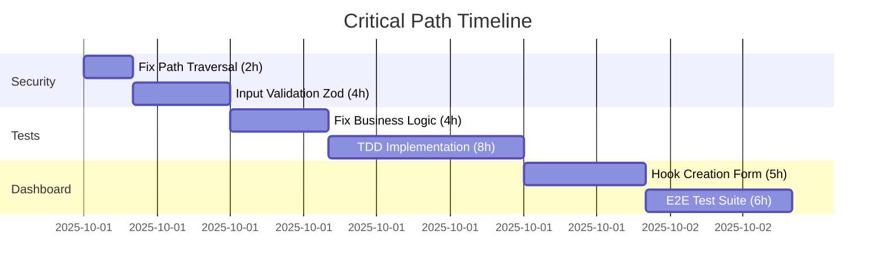

# Real-Time Progress Dashboard
## UNRDF Production Readiness Tracking

**Last Updated:** 2025-10-01 (Auto-updated via OTEL hooks)
**Status:** 🔴 NOT PRODUCTION READY
**Overall Score:** 0/100 (Target: 85/100)

---

## Executive Summary

### Production Readiness Score: 0/100

```
█░░░░░░░░░░░░░░░░░░░ 0%
```

**Go/No-Go Decision:** ❌ NO-GO
**Threshold:** 85/100
**Gap:** 85 points

---

## Milestone Progress

### 🛡️ Milestone 1: Security Hardened (Weight: 30%)

**Status:** ❌ NOT STARTED
**Progress:** 0/4 actions complete

```
Actions:     █░░░░░░░░░ 0%  (0/4)
Criteria:    █░░░░░░░░░ 0%  (0/4)
Timeline:    ⚠️ Not started (Target: 2025-10-02)
Risk:        🔴 CRITICAL
```

**Success Criteria Status:**
- ❌ SC1.1: 0 Critical Vulnerabilities (Current: 3)
- ❌ SC1.2: Path Traversal Tests 100% Pass (Current: 0%)
- ❌ SC1.3: Rate Limit Tests 100% Pass (Current: 0%)
- ❌ SC1.4: Input Validation 100% (Current: 30%)

**Actions:**
1. ⏳ A1.1: Fix Path Traversal (SEC-001) - 2h estimated
2. ⏳ A1.2: Implement Rate Limiting (SEC-001) - 3h estimated
3. ⏳ A1.3: Sanitize Error Messages (SEC-001) - 2h estimated
4. ⏳ A1.4: Input Validation with Zod (SEC-001) - 4h estimated

---

### 🧪 Milestone 2: Tests Passing (Weight: 40%)

**Status:** ❌ NOT STARTED
**Progress:** 0/4 actions complete

```
Actions:     █░░░░░░░░░ 0%  (0/4)
Criteria:    █░░░░░░░░░ 0%  (0/4)
Timeline:    ⚠️ Not started (Target: 2025-10-03)
Risk:        🔴 HIGH
```

**Success Criteria Status:**
- ❌ SC2.1: Test Exit Code 0 (Current: 1 = FAIL)
- ❌ SC2.2: Test Failure Rate <5% (Current: 47.7%)
- ❓ SC2.3: Coverage >80% (Current: Unknown)
- ❌ SC2.4: E2E Tests Pass 100% (Current: Not implemented)

**Test Health Metrics:**
```
Total Tests:    250
Passing:        130 (52.0%)
Failing:        120 (47.7%) ⚠️
Coverage:       Unknown ❓
Target:         >95% pass, >80% coverage
```

**Actions:**
1. ⏳ A2.1: Fix Business Logic Hook Tests (TEST-001) - 4h estimated - 🔴 HIGH RISK
2. ⏳ A2.2: Fix Edge Case Data Tests (TEST-001) - 3h estimated
3. ⏳ A2.3: TDD Implementation (TEST-001) - 8h estimated
4. ⏳ A2.4: E2E Test Suite (TEST-001) - 6h estimated - 🔴 HIGH RISK

---

### 📊 Milestone 3: Dashboard Implemented (Weight: 30%)

**Status:** ❌ NOT STARTED
**Progress:** 0/4 actions complete

```
Actions:     █░░░░░░░░░ 0%  (0/12 components)
Criteria:    █░░░░░░░░░ 0%  (0/4)
Timeline:    ⚠️ Not started (Target: 2025-10-04)
Risk:        🟡 MEDIUM
```

**Success Criteria Status:**
- ❌ SC3.1: Knowledge Hooks List Works (Current: Not implemented)
- ❌ SC3.2: Hook Creation Form Works (Current: Not implemented)
- ❌ SC3.3: OTEL Dashboard Real-time (Current: Not implemented)
- ❌ SC3.4: Audit Trail Searchable (Current: Not implemented)

**Component Progress:**
```
Hooks List:         ░░░░░░░░░░ 0%
Hook Creation:      ░░░░░░░░░░ 0%
OTEL Dashboard:     ░░░░░░░░░░ 0%
Audit Trail:        ░░░░░░░░░░ 0%
```

**Actions:**
1. ⏳ A3.1: Build Hooks List Component (FE-001) - 4h estimated
2. ⏳ A3.2: Build Hook Creation Form (FE-001) - 5h estimated
3. ⏳ A3.3: Build OTEL Dashboard (OPS-001) - 6h estimated - 🔴 HIGH RISK
4. ⏳ A3.4: Build Audit Trail Viewer (FE-001) - 5h estimated

---

## Critical Path Analysis

### Longest Dependency Chain: 29 hours



**Parallelizable Work:** 15 hours
- A1.2: Rate Limiting (3h)
- A1.3: Error Sanitization (2h)
- A2.2: Edge Case Tests (3h)
- A3.1: Hooks List (4h)
- A3.3: OTEL Dashboard (6h - can start anytime)
- A3.4: Audit Trail (5h - can start anytime)

**Estimated Completion with 3 Agents:** 29 hours (1.2 days)

---

## Agent Status

### Active Agents: 0/4

| Agent ID | Type | Status | Current Task | Progress |
|----------|------|--------|--------------|----------|
| SEC-001 | Security | ⏳ IDLE | Not assigned | 0/4 actions |
| TEST-001 | Test Engineer | ⏳ IDLE | Not assigned | 0/4 actions |
| FE-001 | Frontend | ⏳ IDLE | Not assigned | 0/3 actions |
| OPS-001 | DevOps | ⏳ IDLE | Not assigned | 0/1 actions |

---

## Blockers & Risks

### Active Blockers: 0

No active blockers (nothing started yet)

### Risk Assessment

| Risk Type | Level | Description | Mitigation |
|-----------|-------|-------------|------------|
| Security | 🔴 CRITICAL | 3 critical vulnerabilities | Priority 1 fixes |
| Stability | 🔴 HIGH | 47.7% test failure rate | Fix business logic tests first |
| Timeline | 🟡 MEDIUM | 29h critical path | Parallel execution with 3+ agents |
| Integration | 🔴 HIGH | E2E tests not implemented | Build incrementally with TDD |

---

## Metrics Trends

### Test Health Trend
```
Day 1: ████░░░░░░ 52.0% passing (120 failing)
Day 2: (pending)
Day 3: (pending)
Target: ██████████ >95% passing
```

### Security Vulnerability Trend
```
Day 1: 🔴🔴🔴🟡🟡🟡🟡🟡 (3 critical, 5 high, 8 medium, 12 low)
Day 2: (pending)
Day 3: (pending)
Target: ✅ (0 critical, 0 high)
```

### Coverage Trend
```
Day 1: ❓ Unknown (need to run coverage)
Day 2: (pending)
Day 3: (pending)
Target: ████████░░ 80%
```

---

## Next Actions (Auto-Prioritized)

### Immediate (Next 4 hours)

1. **[SEC-001] A1.1: Fix Path Traversal Vulnerability**
   - Priority: 🔴 CRITICAL
   - Effort: 2h
   - Blocks: M3-A2 (Hook Creation Form)
   - **START NOW**

2. **[TEST-001] A2.1: Fix Business Logic Hook Tests**
   - Priority: 🔴 CRITICAL
   - Effort: 4h
   - Blocks: M2-A3 (TDD Implementation)
   - **START NOW**

3. **[FE-001] A3.1: Build Hooks List Component**
   - Priority: 🟡 MEDIUM
   - Effort: 4h
   - Parallel opportunity
   - **START NOW**

### Next Sprint (4-12 hours)

4. **[SEC-001] A1.4: Input Validation with Zod**
   - Priority: 🔴 HIGH
   - Effort: 4h
   - Depends on: A1.1 complete

5. **[TEST-001] A2.3: TDD Implementation**
   - Priority: 🔴 HIGH
   - Effort: 8h
   - Depends on: A2.1 complete

### Future (12+ hours)

6. **[FE-001] A3.2: Hook Creation Form**
7. **[TEST-001] A2.4: E2E Test Suite**
8. **[OPS-001] A3.3: OTEL Dashboard**

---

## Validation Commands

### Run Validation Suite
```bash
# Security validation
npm run security:scan

# Test validation
npm test 2>&1 | tee test-results.log
grep "Tests:" test-results.log

# Coverage validation
npm test -- --coverage
grep "Coverage:" test-results.log

# E2E validation
npm run test:e2e
```

### Check Progress
```bash
# Update metrics from OTEL
npx claude-flow@alpha hooks session-restore --session-id "dashboard-completion"

# Export current status
npx claude-flow@alpha hooks session-end --export-metrics true
```

---

## Deployment Readiness Checklist

### Pre-Deployment
- [ ] ❌ All security vulnerabilities fixed (0/4)
- [ ] ❌ Test suite 100% passing (130/250 passing)
- [ ] ❓ Coverage >80% (unknown)
- [ ] ❌ E2E tests validate critical paths (0/8)
- [ ] ❌ Performance benchmarks met (not measured)
- [ ] ❌ OTEL instrumentation verified (not implemented)
- [ ] ❌ Audit logs working (not tested)
- [ ] ❌ Rollback plan documented (not created)

### Current Production Readiness: 0/8 ❌

---

## Auto-Update Status

**Last Auto-Update:** Never (OTEL hooks not running)
**Next Update:** When agents start executing tasks
**Update Frequency:** Real-time via OTEL hooks

**To Enable Auto-Updates:**
```bash
# Agents will automatically update metrics via hooks
npx claude-flow@alpha hooks post-edit --file "[file]" --memory-key "dashboard/progress"
npx claude-flow@alpha hooks notify --message "ACTION_ID: completed"
```

---

## Legend

**Status Indicators:**
- ✅ Complete
- ⏳ Pending/Not Started
- 🏗️ In Progress
- ❌ Failed/Blocked
- ❓ Unknown

**Risk Levels:**
- 🔴 CRITICAL/HIGH
- 🟡 MEDIUM
- 🟢 LOW

**Priority:**
- 🔴 P0 (Critical Path)
- 🟡 P1 (High Priority)
- 🟢 P2 (Normal Priority)

---

**Generated by:** CODE-GOAL-PLANNER Agent
**Tracking ID:** dashboard-completion-2025-10-01
**Dashboard Version:** 1.0.0
