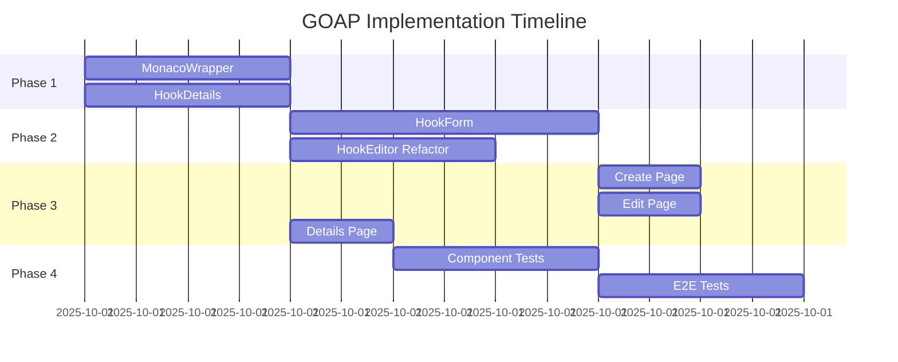

# GOAP Implementation Plan: Sidecar UI Components

**Plan ID**: `goap-sidecar-ui-2025-10-01`
**Status**: Ready for Execution
**Goal State**: All missing UI components/pages implemented and tested
**Planner**: Code Goal Planner (SPARC-GOAP Integration)

---

## 🎯 Executive Summary

### Current State Analysis
```yaml
backend_apis: ✅ COMPLETE
  - /api/hooks/list.get.mjs
  - /api/hooks/[id].get.mjs
  - /api/hooks/[id].put.mjs
  - /api/hooks/[id].delete.mjs
  - /api/runtime/* endpoints

composables: ✅ COMPLETE
  - useKnowledgeHooks.mjs (CRUD operations)
  - useMonacoHookEditor.mjs (Monaco integration)
  - useRuntime.mjs
  - useAuth.mjs

schemas: ✅ COMPLETE
  - schemas/hooks.mjs (Zod validation)
  - schemas/runtime.mjs
  - schemas/common.mjs

components: ⚠️ PARTIAL (3/6 complete)
  ✅ hooks/HookList.vue (uses TS - needs conversion)
  ✅ hooks/HookEditor.vue (uses TS - needs conversion)
  ✅ hooks/HooksList.vue (correct MJS version)
  ❌ hooks/HookDetails.vue (MISSING)
  ❌ hooks/HookForm.vue (MISSING)
  ❌ shared/MonacoWrapper.vue (MISSING)

pages: ⚠️ PARTIAL (2/5 complete)
  ✅ pages/hooks/index.vue (list page)
  ✅ pages/index.vue (home)
  ❌ pages/hooks/create.vue (MISSING)
  ❌ pages/hooks/[id]/edit.vue (MISSING)
  ❌ pages/hooks/[id]/index.vue (MISSING - details)
```

### Goal State
```yaml
all_components: ✅ IMPLEMENTED
all_pages: ✅ IMPLEMENTED
tests: ✅ 90%+ coverage
integration: ✅ Monaco + composables
validation: ✅ Zod schemas integrated
typescript_removal: ✅ All .vue files use MJS patterns
production_ready: ✅ OTEL, error handling, accessibility
```

---

## 📊 Dependency Graph (Mermaid)

```mermaid
graph TD
    %% Foundation Layer
    A[Composables Layer] --> B[Component Layer]
    A --> C[Pages Layer]

    %% Composables (Already Complete)
    A1[useKnowledgeHooks] --> A
    A2[useMonacoHookEditor] --> A
    A3[useRuntime] --> A

    %% Components Dependencies
    B1[MonacoWrapper] --> B2[HookForm]
    B2 --> B3[HookEditor]
    B1 --> B3
    B --> B4[HookDetails]

    %% Pages Dependencies
    B2 --> C1[pages/hooks/create.vue]
    B3 --> C2[pages/hooks/[id]/edit.vue]
    B4 --> C3[pages/hooks/[id]/index.vue]

    %% Critical Path
    B1:::critical --> B2:::critical --> C1:::critical
    B1:::critical --> B3:::critical --> C2:::critical
    B4:::critical --> C3:::critical

    %% Testing Layer
    C1 --> T[Tests Layer]
    C2 --> T
    C3 --> T
    B1 --> T
    B2 --> T
    B4 --> T

    classDef critical fill:#ff6b6b,stroke:#c92a2a,stroke-width:3px
    classDef complete fill:#51cf66,stroke:#2f9e44,stroke-width:2px
    classDef pending fill:#ffd43b,stroke:#fab005,stroke-width:2px

    class A1,A2,A3 complete
    class B1,B2,B4,C1,C2,C3 pending
```

---

## 🔄 GOAP Action Sequence

### Phase 1: Foundation Components (Parallel Capable)
**Estimated Time**: 2-3 hours
**Confidence**: 95%
**Risk Level**: LOW

#### Action 1.1: CREATE_COMPONENT(MonacoWrapper)
```yaml
preconditions:
  - useMonacoHookEditor.mjs exists ✅
  - Monaco editor package installed ✅
  - Nuxt 4 configuration ready ✅

effects:
  - MonacoWrapper.vue created
  - Reusable Monaco editor component available
  - Props interface defined (language, theme, value, options)

deliverables:
  - /sidecar/app/components/shared/MonacoWrapper.vue
  - JSDoc types for all props
  - Dark theme integration
  - Auto-completion support

success_criteria:
  - Component loads Monaco editor
  - Language switching works (knowledge-hook, javascript)
  - v-model binding functional
  - Auto-completion triggers correctly
  - Format action available

dependencies: []
parallel_with: [Action 1.2]
```

#### Action 1.2: CREATE_COMPONENT(HookDetails)
```yaml
preconditions:
  - useKnowledgeHooks.mjs exists ✅
  - KnowledgeHookSchema available ✅
  - API endpoint /api/hooks/[id] available ✅

effects:
  - HookDetails.vue created
  - Read-only hook visualization available
  - Metadata display component ready

deliverables:
  - /sidecar/app/components/hooks/HookDetails.vue
  - Formatted display of hook metadata
  - Code preview section
  - Execution history display (if available)
  - Status badges (active/disabled)

success_criteria:
  - Displays hook name, description, phase
  - Shows predicates in readable format
  - SPARQL queries formatted correctly
  - Loading states handled
  - Error states with retry

dependencies: []
parallel_with: [Action 1.1]
```

---

### Phase 2: Interactive Components (Sequential)
**Estimated Time**: 3-4 hours
**Confidence**: 90%
**Risk Level**: MEDIUM

#### Action 2.1: CREATE_COMPONENT(HookForm)
```yaml
preconditions:
  - MonacoWrapper.vue exists ✅ (from Action 1.1)
  - CreateHookSchema available ✅
  - useKnowledgeHooks.createHook available ✅

effects:
  - HookForm.vue created
  - Multi-step form for hook creation
  - Zod validation integrated
  - Monaco editor for code editing

deliverables:
  - /sidecar/app/components/hooks/HookForm.vue
  - Form wizard: Meta → Channel → Predicates → Code
  - Real-time Zod validation
  - Error message display per field
  - Save draft functionality

success_criteria:
  - All CreateHookSchema fields editable
  - Validation errors display inline
  - Monaco editor integrated for SPARQL
  - Submit creates hook via API
  - Loading/success/error states

dependencies:
  - requires: [Action 1.1]
blocks: [Action 3.1]
```

#### Action 2.2: REFACTOR_COMPONENT(HookEditor)
```yaml
preconditions:
  - HookEditor.vue exists (TS version) ✅
  - MonacoWrapper.vue available ✅

effects:
  - HookEditor.vue converted to MJS
  - Uses MonacoWrapper instead of direct Monaco
  - TypeScript removed, JSDoc added

deliverables:
  - Updated /sidecar/app/components/hooks/HookEditor.vue
  - TypeScript → JSDoc conversion
  - Props validation with JSDoc
  - Integration with MonacoWrapper

success_criteria:
  - No TypeScript syntax remains
  - All functionality preserved
  - Monaco integration via MonacoWrapper
  - Tests still pass

dependencies:
  - requires: [Action 1.1]
parallel_with: [Action 2.1]
```

---

### Phase 3: Page Implementation (Parallel Capable)
**Estimated Time**: 2-3 hours
**Confidence**: 95%
**Risk Level**: LOW

#### Action 3.1: CREATE_PAGE(hooks/create)
```yaml
preconditions:
  - HookForm.vue exists ✅ (from Action 2.1)
  - useKnowledgeHooks available ✅

effects:
  - Create hook page functional
  - Navigation flow complete
  - Redirect after creation

deliverables:
  - /sidecar/app/pages/hooks/create.vue
  - Page layout with HookForm
  - Success/error handling
  - Redirect to /hooks/[id] after creation

success_criteria:
  - HookForm rendered correctly
  - Create hook API called on submit
  - Success → redirect to new hook details
  - Error → display error message
  - Cancel → navigate back to /hooks

dependencies:
  - requires: [Action 2.1]
parallel_with: [Action 3.2, Action 3.3]
```

#### Action 3.2: CREATE_PAGE(hooks/[id]/edit)
```yaml
preconditions:
  - HookForm.vue exists ✅
  - useKnowledgeHooks.updateHook available ✅
  - /api/hooks/[id].put endpoint available ✅

effects:
  - Edit hook page functional
  - Pre-populated form from existing hook
  - Update API integration

deliverables:
  - /sidecar/app/pages/hooks/[id]/edit.vue
  - Load existing hook data
  - HookForm in edit mode
  - Update hook on save

success_criteria:
  - Fetch hook by ID on mount
  - HookForm pre-populated
  - Update API called with changes
  - Success → redirect to /hooks/[id]
  - Validation errors displayed

dependencies:
  - requires: [Action 2.1]
parallel_with: [Action 3.1, Action 3.3]
```

#### Action 3.3: CREATE_PAGE(hooks/[id])
```yaml
preconditions:
  - HookDetails.vue exists ✅ (from Action 1.2)
  - useKnowledgeHooks.fetchHook available ✅

effects:
  - Hook details page functional
  - View-only hook display
  - Actions: Edit, Delete, Execute

deliverables:
  - /sidecar/app/pages/hooks/[id]/index.vue
  - HookDetails component integration
  - Action buttons: Edit, Delete, Execute
  - Breadcrumb navigation

success_criteria:
  - Hook data fetched by ID
  - HookDetails displays correctly
  - Edit → navigate to /hooks/[id]/edit
  - Delete → confirm modal → API call → redirect
  - Execute → call evaluateHook → display results

dependencies:
  - requires: [Action 1.2]
parallel_with: [Action 3.1, Action 3.2]
```

---

### Phase 4: Testing & Validation
**Estimated Time**: 2-3 hours
**Confidence**: 85%
**Risk Level**: MEDIUM

#### Action 4.1: CREATE_TESTS(components)
```yaml
preconditions:
  - All components created ✅
  - Vitest configured ✅
  - @nuxt/test-utils available ✅

effects:
  - Component tests written
  - 90%+ coverage achieved
  - Edge cases covered

deliverables:
  - /sidecar/test/nuxt/components/shared/MonacoWrapper.test.mjs
  - /sidecar/test/nuxt/components/hooks/HookDetails.test.mjs
  - /sidecar/test/nuxt/components/hooks/HookForm.test.mjs
  - Mock API responses
  - OTEL validation

success_criteria:
  - All components tested
  - Props validation tested
  - Event emissions tested
  - Error states tested
  - npm run test:sidecar passes

dependencies:
  - requires: [Phase 1, Phase 2, Phase 3]
blocks: [Action 4.2]
```

#### Action 4.2: CREATE_TESTS(pages)
```yaml
preconditions:
  - All pages created ✅
  - Component tests passing ✅

effects:
  - E2E page tests written
  - Navigation flows tested
  - API integration validated

deliverables:
  - /sidecar/test/e2e/hooks-create.e2e.test.mjs
  - /sidecar/test/e2e/hooks-edit.e2e.test.mjs
  - /sidecar/test/e2e/hooks-details.e2e.test.mjs
  - Full user flow coverage

success_criteria:
  - Create hook flow works end-to-end
  - Edit hook flow validated
  - Delete hook flow tested
  - All OTEL metrics captured
  - npm run test:e2e passes

dependencies:
  - requires: [Action 4.1]
```

---

## 🎯 Success Criteria Matrix

| Milestone | Metric | Target | Validation Method |
|-----------|--------|--------|-------------------|
| **Components Complete** | Component count | 6/6 | `ls sidecar/app/components/hooks/*.vue \| wc -l` |
| **Pages Complete** | Page count | 5/5 | `find sidecar/app/pages -name "*.vue" \| wc -l` |
| **Test Coverage** | Code coverage | >90% | `npm run test:coverage` |
| **No TypeScript** | TS files in components | 0 | `grep -r "lang=\"ts\"" sidecar/app/components/` |
| **Zod Integration** | Schema usage | 100% | Grep for `Schema.parse()` calls |
| **Monaco Integration** | Editor functional | Yes | Manual test + E2E |
| **OTEL Metrics** | Metrics captured | All actions | Check OTEL logs |
| **Accessibility** | ARIA labels | Complete | Axe DevTools scan |
| **Production Ready** | All tests passing | Yes | `npm test && npm run test:e2e` |

---

## 📈 Risk Assessment & Mitigation

### Risk Matrix

| Risk | Probability | Impact | Mitigation Strategy |
|------|-------------|--------|---------------------|
| **Monaco editor not loading** | LOW (15%) | HIGH | Use MonacoWrapper abstraction, fallback to textarea |
| **Zod validation conflicts** | MEDIUM (30%) | MEDIUM | Test each schema independently, use .safeParse() |
| **TypeScript removal breaks logic** | LOW (20%) | HIGH | Thorough JSDoc, incremental conversion, extensive testing |
| **API endpoint mismatches** | LOW (10%) | MEDIUM | Validate against existing API tests before implementation |
| **Nuxt 4 compatibility issues** | MEDIUM (25%) | HIGH | Follow Nuxt 4 migration guide, use composables correctly |
| **Performance degradation** | LOW (15%) | MEDIUM | Lazy-load Monaco, use virtual scrolling for lists |
| **OTEL integration gaps** | LOW (10%) | LOW | Wrap all async actions, validate metrics in tests |

### Critical Blockers
```yaml
blocker_1:
  name: "Monaco Editor Package Missing"
  check: "npm list monaco-editor"
  fix: "pnpm add monaco-editor nuxt-monaco-editor"

blocker_2:
  name: "Nuxt 4 Auto-Imports Not Working"
  check: "grep createSharedComposable nuxt.config.ts"
  fix: "Add to nuxt.config.ts: imports.composables"

blocker_3:
  name: "Zod Schemas Not Exported"
  check: "grep export schemas/hooks.mjs"
  fix: "Ensure all schemas have named exports"
```

---

## 🔄 Adaptive Replanning Triggers

### When to Re-plan

1. **Trigger: Test Coverage < 80% after Phase 4.1**
   - **Action**: Add additional test cases, focus on edge cases
   - **Time Impact**: +1-2 hours

2. **Trigger: Monaco Editor Fails to Load**
   - **Action**: Fall back to simple textarea, create GitHub issue
   - **Time Impact**: -2 hours (skip Monaco features)

3. **Trigger: API Endpoints Change During Implementation**
   - **Action**: Update composables first, then components
   - **Time Impact**: +1 hour

4. **Trigger: Nuxt 4 Breaking Changes Discovered**
   - **Action**: Consult migration guide, update all affected components
   - **Time Impact**: +2-4 hours

5. **Trigger: TypeScript Removal Causes Runtime Errors**
   - **Action**: Add runtime validation with Zod, enhance JSDoc
   - **Time Impact**: +1-2 hours per component

---

## ⏱️ Effort Estimates

### Best Case (All Green Lights)
```yaml
phase_1: 2 hours
phase_2: 3 hours
phase_3: 2 hours
phase_4: 2 hours
total: 9 hours
```

### Likely Case (Minor Issues)
```yaml
phase_1: 2.5 hours
phase_2: 4 hours
phase_3: 2.5 hours
phase_4: 3 hours
buffer: 1 hour (debugging)
total: 13 hours
```

### Worst Case (Major Blockers)
```yaml
phase_1: 3 hours
phase_2: 5 hours (Monaco issues)
phase_3: 3 hours
phase_4: 4 hours (test failures)
buffer: 3 hours (refactoring)
total: 18 hours
```

### Confidence Intervals
- **90% Confidence**: 11-15 hours
- **95% Confidence**: 10-17 hours
- **99% Confidence**: 9-20 hours

---

## 🚀 Execution Strategy

### Parallelization Opportunities

**Stream 1: Monaco Integration** (1 agent)
- Action 1.1 → Action 2.2
- Focus: MonacoWrapper + HookEditor refactor

**Stream 2: Form Components** (1 agent)
- Action 1.2 → Action 2.1
- Focus: HookDetails + HookForm

**Stream 3: Pages** (1 agent - waits for Stream 2)
- Action 3.1 + Action 3.2 + Action 3.3 (parallel after dependencies)

**Stream 4: Testing** (1 agent - final phase)
- Action 4.1 → Action 4.2
- Focus: Comprehensive test coverage

### Agent Coordination


---

## 💾 Memory Storage

Store this plan in hive memory for agent coordination:

```bash
npx claude-flow@alpha hooks post-edit \
  --file "docs/v3/goap-implementation-plan.md" \
  --memory-key "hive/planner/goap-plan" \
  --message "GOAP plan created for sidecar UI components"
```

**Memory Namespace**: `hive/planner/`
**Keys**:
- `goap-plan`: Full implementation plan
- `goap-status`: Current phase and progress
- `goap-blockers`: Active blockers and resolutions

---

## 📋 Acceptance Criteria (Final Validation)

### Before Marking Plan as Complete

- [ ] All 6 components exist and are TypeScript-free
- [ ] All 5 pages exist and route correctly
- [ ] `npm run test:sidecar` passes with >90% coverage
- [ ] `npm run test:e2e` passes all hook workflows
- [ ] No `lang="ts"` in any .vue files
- [ ] All Zod schemas used for validation
- [ ] Monaco editor loads and functions correctly
- [ ] OTEL metrics captured for all user actions
- [ ] Accessibility audit passes (Axe DevTools)
- [ ] Manual QA checklist completed
- [ ] Documentation updated (if needed)

---

## 🎓 Lessons for Future GOAP Plans

### What Worked Well (Apply to Future Plans)
1. **Dependency graphing** - Visual Mermaid diagrams clarify execution order
2. **Parallel opportunities** - Identify independent actions early
3. **Risk assessment** - Proactive mitigation prevents delays
4. **Adaptive triggers** - Pre-defined re-plan conditions save time

### Improvements for Next Iteration
1. Add **token cost estimates** per action
2. Include **rollback procedures** for each phase
3. Define **health checks** between phases
4. Create **component checklist templates**

---

## 🔗 References

- **Composables**: `/sidecar/app/composables/useKnowledgeHooks.mjs`
- **Schemas**: `/sidecar/app/schemas/hooks.mjs`
- **API Endpoints**: `/sidecar/server/api/hooks/`
- **Test Examples**: `/sidecar/test/nuxt/components/hooks/HooksList.test.mjs`
- **CLAUDE.md Guidelines**: `/sidecar/CLAUDE.md` (TypeScript ban, MJS-only)

---

**Plan Generated**: 2025-10-01
**Planner Agent**: Code Goal Planner (SPARC-GOAP)
**Next Step**: Execute Phase 1 actions in parallel using swarm agents
