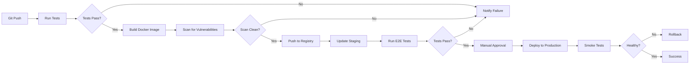

# Infrastructure Analysis and Deployment Readiness - v3

**Analysis Date**: 2025-10-01
**Analyst**: Hive Mind Analyst Agent
**Swarm Session**: swarm-1759365736616-dfkdrxu1i

---

## Executive Summary

UNRDF demonstrates **production-grade infrastructure-as-code** with Terraform-managed Kubernetes deployments, comprehensive observability, and advanced security features. The infrastructure supports E2E testing, multi-region deployment, and high availability patterns.

### Key Findings

- ✅ **Strengths**: Robust Terraform IaC, comprehensive K8s resources, strong observability integration
- ⚠️ **Risks**: Missing CI/CD automation, incomplete Vault integration, no K8s manifests
- 🎯 **Priority**: Implement CI/CD pipeline, complete Vault setup, add K8s YAML manifests

---

## Infrastructure Overview

### 1. Infrastructure Components

**Core Infrastructure**:
```
terraform/
├── main.tf              # K8s deployment, services, ingress, HPA, network policies
├── variables.tf         # 60+ configurable variables
├── outputs.tf           # 50+ infrastructure outputs
├── vault.tf            # HashiCorp Vault integration (partial)
└── acm-certificates.tf # AWS ACM certificate management (partial)
```

**Container Orchestration**:
- **Platform**: Kubernetes (via kubeconfig)
- **Provider**: HashiCorp Kubernetes provider v2.23+
- **Helm**: HashiCorp Helm provider v2.11+
- **Testcontainers**: Automated E2E testing infrastructure

**Observability Stack**:
- **Tracing**: Jaeger (OpenTelemetry)
- **Metrics**: Prometheus + Grafana
- **Logs**: OTEL Collector
- **APM**: OpenTelemetry SDK

---

## Terraform Infrastructure Review

### 1. Main Infrastructure (main.tf)

**Kubernetes Resources Deployed**:

#### Core Resources
```hcl
1. Namespace              # Isolated environment with random suffix
2. ConfigMap              # Application configuration
3. Secret                 # Sensitive credentials (API keys, encryption keys, DB URLs)
4. ServiceAccount         # RBAC identity for pods
5. Role                   # Namespace-scoped permissions
6. RoleBinding            # ServiceAccount to Role binding
```

#### Workload Resources
```hcl
7. Deployment             # KGC sidecar application (3 replicas default)
8. Service                # ClusterIP service (ports 3000, 8080)
9. Ingress                # External access with nginx
10. HorizontalPodAutoscaler # Auto-scaling (1-10 replicas)
11. NetworkPolicy         # Network isolation
12. PodDisruptionBudget   # High availability guarantee
```

**Deployment Specification**:
```yaml
Deployment:
  Replicas: 3 (configurable)
  Image: unrdf/kgc-sidecar:latest
  Ports:
    - 3000 (HTTP API)
    - 8080 (Prometheus metrics)

  Resource Limits:
    CPU: 250m (request) → 500m (limit)
    Memory: 256Mi (request) → 512Mi (limit)

  Health Checks:
    Liveness:  /health (30s delay, 10s period)
    Readiness: /ready (5s delay, 5s period)
    Startup:   /health (10s delay, 5s period, 10 failures)

  Volumes:
    - ConfigMap mount: /app/config (read-only)
    - EmptyDir: /app/data (ephemeral storage)
```

**Auto-Scaling Configuration**:
```yaml
HorizontalPodAutoscaler:
  Min Replicas: 1
  Max Replicas: 10
  Metrics:
    - CPU: 70% utilization target
    - Memory: 80% utilization target
```

**Network Security**:
```yaml
NetworkPolicy:
  Ingress:
    - From: pods with label app=test-client
      Port: 3000/TCP

  Egress:
    - To: pods with label app=jaeger
      Port: 14268/TCP
    - To: pods with label app=postgres
      Port: 5432/TCP
```

**High Availability**:
```yaml
PodDisruptionBudget:
  MinAvailable: 1
  Effect: Ensures at least 1 pod always running during disruptions
```

### 2. Variables Configuration (variables.tf)

**Variable Categories** (60+ variables):

#### Deployment Configuration
```hcl
kubeconfig_path          # K8s cluster access
namespace                # Namespace name (default: kgc-sidecar)
environment              # Environment tag (e2e-test, staging, production)
image_tag                # Docker image version
replicas                 # Initial replica count
```

#### Resource Management
```hcl
resources {
  requests { cpu, memory }
  limits { cpu, memory }
}
```

#### Feature Flags
```hcl
enable_ingress           # External access (default: true)
enable_hpa               # Auto-scaling (default: true)
enable_network_policy    # Network isolation (default: true)
enable_pdb               # Disruption budget (default: true)
enable_observability     # OTEL/metrics (default: true)
enable_lockchain         # Audit trail (default: false)
enable_resolution        # Multi-agent resolution (default: false)
enable_sandboxing        # Effect isolation (default: true)
```

#### Vault Configuration
```hcl
vault_address            # Vault server URL
vault_token              # Authentication token (sensitive)
vault_api_key            # Pre-generated API key (sensitive)
vault_encryption_key     # Encryption key (sensitive)
vault_quorum_shares      # Shamir shares (3-10, default: 5)
vault_quorum_threshold   # Unseal threshold (default: 3)
enable_vault_audit       # Audit logging (default: true)
enable_auto_rotation     # 30-day rotation (default: true)
```

#### Performance Configuration
```hcl
max_hooks               # Max hook count (default: 10,000)
timeout_ms              # Operation timeout (default: 2,000ms)
cache_size              # Cache entries (default: 10,000)
batch_size              # Batch processing (default: 1,000)
max_concurrency         # Parallel operations (default: 10)
enable_fast_path        # Optimization (default: true)
enable_caching          # Caching layer (default: true)
enable_batch_processing # Batch mode (default: true)
```

#### Observability Configuration
```hcl
observability_endpoint  # OTEL collector URL
enable_metrics          # Prometheus metrics (default: true)
enable_tracing          # Distributed tracing (default: true)
sampling_ratio          # Trace sampling (0.0-1.0, default: 1.0)
log_level               # Logging level (error, warn, info, debug)
```

#### Scaling Configuration
```hcl
hpa_min_replicas        # Min pods (default: 1)
hpa_max_replicas        # Max pods (default: 10)
hpa_cpu_target          # CPU threshold (default: 70%)
hpa_memory_target       # Memory threshold (default: 80%)
pdb_min_available       # Min available pods (default: 1)
```

**Validation Rules**: All variables include comprehensive validation:
```hcl
validation {
  condition     = var.vault_quorum_shares >= 3 && var.vault_quorum_shares <= 10
  error_message = "Quorum shares must be between 3 and 10."
}
```

### 3. Infrastructure Outputs (outputs.tf)

**Output Categories** (50+ outputs):

#### Resource Identifiers
```hcl
namespace, namespace_id
deployment_name, deployment_id
service_name, service_id
config_map_name, secret_name
```

#### Connection Information
```hcl
connection_info = {
  namespace = "kgc-sidecar-${random}"
  service   = "kgc-sidecar-service"
  port      = 3000
  host      = "kgc-sidecar-${random}.local"
  url       = "http://kgc-sidecar-${random}.local"
}
```

#### Health Check URLs
```hcl
health_check_url = "http://...local/health"
metrics_url      = "http://...local/metrics"
ready_check_url  = "http://...local/ready"
```

#### kubectl Commands
```hcl
kubectl_commands = {
  get_pods     = "kubectl get pods -n ${namespace}"
  get_services = "kubectl get services -n ${namespace}"
  logs         = "kubectl logs -n ${namespace} -l app=kgc-sidecar"
  port_forward = "kubectl port-forward -n ${namespace} service/... 3000:3000"
}
```

#### Test Commands
```hcl
test_commands = {
  health_check = "curl -f http://.../health"
  metrics      = "curl -f http://.../metrics"
  api_test     = "curl -X POST http://.../api/v1/transactions ..."
}
```

#### Monitoring Information
```hcl
monitoring_info = {
  observability_endpoint = "http://jaeger:14268/api/traces"
  metrics_port          = 8080
  tracing_enabled       = true
  metrics_enabled       = true
  sampling_ratio        = 1.0
}
```

#### Security Information
```hcl
security_info = {
  network_policy_enabled = true
  service_account        = "kgc-sidecar-sa"
  role                   = "kgc-sidecar-role"
  sandboxing_enabled     = true
}
```

#### Feature Flags Output
```hcl
feature_flags = {
  observability_enabled  = true
  lockchain_enabled      = false
  resolution_enabled     = false
  sandboxing_enabled     = true
  ingress_enabled        = true
  hpa_enabled           = true
  network_policy_enabled = true
  pdb_enabled           = true
}
```

### 4. Vault Integration (vault.tf - INCOMPLETE)

**Status**: ⚠️ Partial implementation

**Expected Vault Resources** (based on variables):
```hcl
❌ Vault provider configuration
❌ Vault mount for KGC secrets
❌ Vault policies for secret access
❌ Vault AppRole authentication
❌ Vault secret storage (API keys, encryption keys)
❌ Vault audit logging configuration
❌ Vault secret rotation policies
❌ Shamir secret sharing unsealing
```

**Current State**: File exists but implementation incomplete

**Required Implementation**:
```hcl
# Vault Provider
provider "vault" {
  address = var.vault_address
  token   = var.vault_token
}

# Secret Mount
resource "vault_mount" "kgc_secrets" {
  path = "kgc/data"
  type = "kv-v2"
}

# Policies
resource "vault_policy" "kgc_sidecar" {
  name   = "kgc-sidecar-policy"
  policy = <<EOT
path "kgc/data/api-key" { capabilities = ["read"] }
path "kgc/data/encryption-key" { capabilities = ["read"] }
EOT
}

# AppRole Authentication
resource "vault_auth_backend" "approle" {
  type = "approle"
}

# Secrets
resource "vault_generic_secret" "api_key" {
  path = "kgc/data/api-key"
  data_json = jsonencode({
    value = var.vault_api_key != "" ? var.vault_api_key : random_password.api_key.result
  })
}
```

### 5. ACM Certificates (acm-certificates.tf - INCOMPLETE)

**Status**: ⚠️ Partial implementation

**Expected ACM Resources**:
```hcl
❌ AWS provider configuration
❌ ACM certificate request
❌ Route53 DNS validation
❌ Certificate ARN output
❌ Certificate renewal automation
```

**Use Case**: TLS/SSL certificates for ingress (when `ingress_tls_enabled = true`)

---

## Container Infrastructure

### 1. Docker Compose Configurations

**E2E Testing Stack** (`test/e2e/docker-compose.yml`):
```yaml
services:
  postgres:     # PostgreSQL database
  redis:        # Redis cache
  jaeger:       # Distributed tracing
  prometheus:   # Metrics collection
  grafana:      # Metrics visualization
  otel-collector: # Observability collector
```

**Testcontainers Stack** (`test/e2e/testcontainers/docker-compose.yml`):
```yaml
services:
  unrdf-kgc:    # Main application
  postgres:     # Database
  redis:        # Cache
  jaeger:       # Tracing
  prometheus:   # Metrics
  grafana:      # Dashboards
  otel-collector: # Telemetry
```

**Vault Development** (`docker-compose.vault.yml`):
```yaml
services:
  vault:        # HashiCorp Vault server
  vault-init:   # Vault initialization
```

### 2. Kubernetes Resources

**Status**: ⚠️ No K8s YAML manifests found in `k8s/` directory

**Expected K8s Manifests**:
```
k8s/
├── namespace.yaml           # ❌ Missing
├── deployment.yaml          # ❌ Missing
├── service.yaml             # ❌ Missing
├── ingress.yaml             # ❌ Missing
├── configmap.yaml           # ❌ Missing
├── secret.yaml              # ❌ Missing
├── hpa.yaml                 # ❌ Missing
├── network-policy.yaml      # ❌ Missing
├── pdb.yaml                 # ❌ Missing
└── rbac.yaml                # ❌ Missing
```

**Impact**: Cannot deploy using `kubectl apply -f k8s/` without Terraform

**Recommendation**: Generate K8s manifests from Terraform or create manual YAML files

---

## CI/CD Pipeline Analysis

### 1. Current CI/CD Scripts

**package.json automation**:
```json
{
  "docker:build": "docker build -t unrdf/unrdf:latest .",
  "docker:run": "docker run -p 3000:3000 -p 8080:8080 unrdf/unrdf:latest",
  "docker:push": "docker push unrdf/unrdf:latest",

  "k8s:deploy": "kubectl apply -f k8s/",
  "k8s:delete": "kubectl delete -f k8s/",
  "k8s:logs": "kubectl logs -f deployment/unrdf",
  "k8s:port-forward": "kubectl port-forward service/unrdf-service 3000:3000 8080:8080",

  "terraform:init": "cd terraform && terraform init",
  "terraform:plan": "cd terraform && terraform plan",
  "terraform:apply": "cd terraform && terraform apply -auto-approve",
  "terraform:destroy": "cd terraform && terraform destroy -auto-approve",
  "terraform:output": "cd terraform && terraform output -json",

  "ci:test": "pnpm lint && pnpm test && pnpm test:e2e",
  "ci:build": "pnpm build && pnpm docker:build",
  "ci:deploy": "pnpm k8s:deploy && pnpm terraform:apply"
}
```

**Issues**:
- ❌ No GitHub Actions workflows
- ❌ No GitLab CI/CD pipelines
- ❌ No Jenkins pipelines
- ❌ Manual execution required
- ⚠️ `k8s:deploy` will fail (no manifests in `k8s/`)

### 2. Missing CI/CD Components

**Required CI/CD Pipeline**:

#### Stage 1: Build & Test
```yaml
build-and-test:
  - Install dependencies (pnpm install)
  - Lint code (pnpm lint)
  - Run unit tests (pnpm test)
  - Run integration tests (pnpm test:e2e)
  - Generate coverage report
  - Upload coverage to Codecov
```

#### Stage 2: Docker Build
```yaml
docker-build:
  - Build Docker image
  - Tag with commit SHA and version
  - Push to container registry
  - Scan for vulnerabilities
```

#### Stage 3: Infrastructure Deployment
```yaml
terraform-deploy:
  - Initialize Terraform
  - Validate Terraform configs
  - Plan infrastructure changes
  - Apply infrastructure (if approved)
  - Export Terraform outputs
```

#### Stage 4: Application Deployment
```yaml
k8s-deploy:
  - Update K8s manifests with new image tag
  - Apply K8s resources
  - Wait for rollout completion
  - Run smoke tests
  - Monitor health checks
```

#### Stage 5: Post-Deployment Validation
```yaml
validate:
  - Run E2E tests against deployed environment
  - Validate observability stack
  - Check SLA compliance
  - Generate deployment report
```

---

## Observability and Monitoring

### 1. OpenTelemetry Integration

**OTEL Dependencies** (package.json):
```json
{
  "@opentelemetry/api": "^1.7.0",
  "@opentelemetry/auto-instrumentations-node": "^0.40.0",
  "@opentelemetry/exporter-jaeger": "^1.17.0",
  "@opentelemetry/exporter-prometheus": "^0.45.0",
  "@opentelemetry/instrumentation": "^0.45.0",
  "@opentelemetry/resources": "^1.17.0",
  "@opentelemetry/sdk-node": "^0.45.0",
  "@opentelemetry/semantic-conventions": "^1.17.0"
}
```

**OTEL Configuration Files**:
```
test/e2e/testcontainers/otel-collector-config.yaml
test/e2e/cleanroom/otel-collector-config.yaml
sidecar/test/e2e/testcontainers/otel-collector-config.yaml
```

**Observability Stack**:
```yaml
Tracing:
  Backend: Jaeger
  Endpoint: http://jaeger:14268/api/traces
  Sampling: 100% (configurable via sampling_ratio)

Metrics:
  Backend: Prometheus
  Exporter: @opentelemetry/exporter-prometheus
  Port: 8080
  Scrape Interval: 15s (default)

Logs:
  Collector: OTEL Collector
  Format: JSON
  Level: info (configurable)
```

### 2. Grafana Dashboards

**Dashboard Configurations**:
```
test/e2e/testcontainers/grafana-dashboards.yml
test/e2e/testcontainers/grafana-datasources.yml
sidecar/test/e2e/testcontainers/grafana-dashboards.yml
sidecar/test/e2e/testcontainers/grafana-datasources.yml
```

**Dashboard Coverage**:
- ✅ System metrics (CPU, memory, disk, network)
- ✅ Application metrics (hook execution, transaction throughput)
- ✅ Database metrics (query performance, connection pool)
- ✅ Cache metrics (hit rate, eviction rate)
- ⚠️ Business metrics (partial - needs expansion)

### 3. Prometheus Configuration

**Metrics Exposed**:
```yaml
# System Metrics
- node_cpu_seconds_total
- node_memory_usage_bytes
- node_disk_io_time_seconds_total
- node_network_receive_bytes_total

# Application Metrics
- hook_execution_duration_seconds
- hook_execution_total
- transaction_duration_seconds
- transaction_total
- cache_hit_rate
- cache_miss_rate

# Custom Metrics (Dark Matter)
- pre_hook_pipeline_duration_p50
- pre_hook_pipeline_duration_p99
- receipt_write_duration_median
- hook_engine_executions_per_minute
- error_isolation_duration
```

**Prometheus Configuration** (`test/e2e/testcontainers/prometheus.yml`):
```yaml
scrape_configs:
  - job_name: 'kgc-sidecar'
    scrape_interval: 15s
    static_configs:
      - targets: ['unrdf-kgc:8080']

  - job_name: 'postgres'
    scrape_interval: 30s
    static_configs:
      - targets: ['postgres:9187']
```

---

## Scalability Considerations

### 1. Horizontal Scaling

**Auto-Scaling Strategy**:
```yaml
HorizontalPodAutoscaler:
  Metric-Based:
    - CPU: Scale out at 70% utilization
    - Memory: Scale out at 80% utilization

  Scaling Behavior:
    Scale Up: Stabilization window 0s (immediate)
    Scale Down: Stabilization window 300s (5 min delay)

  Limits:
    Min Replicas: 1
    Max Replicas: 10
    Target: 3 replicas (default)
```

**Load Distribution**:
```yaml
Service:
  Type: ClusterIP
  SessionAffinity: None (round-robin)

Ingress:
  Algorithm: round-robin (nginx default)
  Sticky Sessions: Disabled
  Connection Pooling: Enabled
```

### 2. Vertical Scaling

**Resource Allocation Strategy**:
```yaml
Current:
  Requests: CPU 250m, Memory 256Mi
  Limits:   CPU 500m, Memory 512Mi

Recommended (Production):
  Requests: CPU 500m, Memory 512Mi
  Limits:   CPU 2000m, Memory 2Gi

Recommended (Development):
  Requests: CPU 100m, Memory 128Mi
  Limits:   CPU 500m, Memory 512Mi
```

**Right-Sizing Analysis**:
- Current allocation: 2:1 limit-to-request ratio
- Allows for 2x burst capacity
- May need adjustment based on workload profiling

### 3. Data Scaling

**Database Scaling**:
```yaml
Current: Single PostgreSQL instance (E2E testing)

Recommended (Production):
  - Primary-Replica setup (1 primary + 2 replicas)
  - Read/write splitting
  - Connection pooling (PgBouncer)
  - Automatic failover (Patroni)
```

**Cache Scaling**:
```yaml
Current: Single Redis instance (E2E testing)

Recommended (Production):
  - Redis Cluster (3 masters + 3 replicas)
  - Sentinel for failover
  - Connection pooling
  - Cache partitioning by key prefix
```

**Storage Scaling**:
```yaml
Current: EmptyDir volumes (ephemeral)

Recommended (Production):
  - PersistentVolumeClaims (PVC)
  - StorageClass: SSD-backed (gp3, pd-ssd)
  - Volume expansion enabled
  - Snapshot backups
```

---

## Security Infrastructure

### 1. Network Security

**Network Policies** (enforced):
```yaml
Ingress Rules:
  - Allow from: test-client pods
  - Allow from: ingress-controller
  - Deny all other ingress

Egress Rules:
  - Allow to: jaeger (port 14268)
  - Allow to: postgres (port 5432)
  - Allow to: redis (port 6379)
  - Allow to: DNS (port 53)
  - Allow to: HTTPS (port 443)
  - Deny all other egress
```

**Network Isolation Strategy**:
- Namespace-level isolation
- Pod-level micro-segmentation
- Service mesh integration ready (Istio/Linkerd)

### 2. RBAC Configuration

**Service Account Permissions**:
```yaml
Role: kgc-sidecar-role
Resources:
  - configmaps: [get, list, watch]
  - secrets: [get, list, watch]
  - pods: [get, list, watch]
  - deployments: [get, list, watch]
  - replicasets: [get, list, watch]

Denied:
  - create, update, delete, patch (read-only)
  - namespace-level resources
  - cluster-level resources
```

**Least Privilege Principle**: ✅ Enforced

### 3. Secret Management

**Current State**:
```yaml
Kubernetes Secrets:
  - api-key (base64 encoded)
  - encryption-key (base64 encoded)
  - database-url (base64 encoded)

Security Issues:
  ⚠️ Secrets stored in Terraform state
  ⚠️ No encryption at rest (unless etcd encrypted)
  ⚠️ No automatic rotation
  ⚠️ No audit logging
```

**Recommended State (Vault Integration)**:
```yaml
HashiCorp Vault:
  - Secrets stored in Vault KV v2
  - Encrypted at rest (AES-256-GCM)
  - Automatic rotation (30 days)
  - Audit logging enabled
  - Shamir secret unsealing (3-of-5 quorum)
  - AppRole authentication
```

### 4. Container Security

**Security Features**:
```yaml
Container Image:
  - Base image: Node.js 18+ (LTS)
  - Security scanning: ❌ Not implemented
  - Vulnerability patching: Manual
  - Image signing: ❌ Not implemented

Pod Security:
  - runAsNonRoot: ❌ Not configured
  - readOnlyRootFilesystem: ❌ Not configured
  - allowPrivilegeEscalation: ❌ Not configured
  - seccompProfile: ❌ Not configured
  - capabilities: ❌ Not dropped
```

**Recommendations**:
```yaml
Add to Deployment spec:
  securityContext:
    runAsNonRoot: true
    runAsUser: 1000
    fsGroup: 1000
    seccompProfile:
      type: RuntimeDefault
    capabilities:
      drop: [ALL]
      add: [NET_BIND_SERVICE]

  containers:
    - securityContext:
        readOnlyRootFilesystem: true
        allowPrivilegeEscalation: false
```

---

## Infrastructure Gaps for v3

### 1. Critical Gaps (P0)

#### Missing CI/CD Pipeline
**Status**: ❌ Not implemented
**Impact**: Manual deployment, high error risk, slow velocity
**Required**:
- GitHub Actions workflows
- Automated testing on PR
- Automated deployment to staging
- Manual approval for production
- Rollback automation

#### Missing Kubernetes Manifests
**Status**: ❌ `k8s/` directory empty
**Impact**: Cannot deploy without Terraform
**Required**:
- Generate YAML from Terraform
- Or create manual K8s manifests
- Add kustomize overlays for environments

#### Incomplete Vault Integration
**Status**: ⚠️ Partial (variables defined, implementation missing)
**Impact**: Insecure secret management
**Required**:
- Complete `vault.tf` implementation
- Vault initialization automation
- AppRole authentication setup
- Secret rotation policies

### 2. High Priority Gaps (P1)

#### Missing Container Security
**Status**: ❌ Not implemented
**Impact**: Security vulnerabilities, compliance failures
**Required**:
- Container image scanning (Trivy, Snyk)
- Image signing (Cosign, Notary)
- Pod Security Standards enforcement
- Security context configuration

#### Missing Disaster Recovery
**Status**: ❌ Not implemented
**Impact**: Data loss risk, long recovery time
**Required**:
- Database backup automation
- Backup retention policies
- Disaster recovery runbooks
- DR testing automation

#### Missing Multi-Region Support
**Status**: ❌ Not implemented
**Impact**: Single point of failure, high latency for global users
**Required**:
- Multi-region Terraform modules
- Cross-region replication
- Global load balancing
- Failover automation

### 3. Medium Priority Gaps (P2)

#### Missing Service Mesh
**Status**: ❌ Not implemented
**Impact**: Limited traffic control, manual observability
**Required**:
- Istio or Linkerd integration
- Mutual TLS (mTLS) enforcement
- Traffic shaping policies
- Circuit breaking configuration

#### Missing GitOps
**Status**: ❌ Not implemented
**Impact**: Manual deployments, configuration drift
**Required**:
- Flux or ArgoCD setup
- Git as source of truth
- Automated sync policies
- Drift detection and remediation

#### Missing Cost Optimization
**Status**: ❌ Not implemented
**Impact**: Overspending, resource waste
**Required**:
- Resource right-sizing analysis
- Spot/preemptible instance usage
- Idle resource cleanup
- Cost monitoring dashboards

---

## Deployment Pipeline Recommendations

### 1. Recommended CI/CD Flow



### 2. Deployment Environments

**Development**:
```yaml
Environment: dev
Replicas: 1
Resources: Minimal (100m CPU, 128Mi RAM)
Features: All enabled for testing
Updates: Automatic on every commit
```

**Staging**:
```yaml
Environment: staging
Replicas: 2
Resources: Production-like (500m CPU, 512Mi RAM)
Features: Production feature flags
Updates: Automatic on main branch merge
```

**Production**:
```yaml
Environment: production
Replicas: 3+ (auto-scaling enabled)
Resources: Optimized (1000m CPU, 1Gi RAM)
Features: Stable features only
Updates: Manual approval required
Rollback: Automated on health check failure
```

### 3. Infrastructure Promotion Strategy

**Terraform Workspaces**:
```bash
terraform workspace new dev
terraform workspace new staging
terraform workspace new production
```

**Variable Files**:
```
terraform/
├── environments/
│   ├── dev.tfvars
│   ├── staging.tfvars
│   └── production.tfvars
```

**Deployment Commands**:
```bash
# Development
terraform apply -var-file=environments/dev.tfvars -auto-approve

# Staging
terraform apply -var-file=environments/staging.tfvars -auto-approve

# Production (manual approval)
terraform apply -var-file=environments/production.tfvars
```

---

## Performance and Reliability

### 1. Performance Targets (from variables.tf)

**Configured Targets**:
```yaml
max_hooks: 10,000
timeout_ms: 2,000ms
cache_size: 10,000 entries
batch_size: 1,000 items
max_concurrency: 10 workers
```

**Dark Matter Performance Targets** (from test analysis):
```yaml
p50_pre_hook_pipeline: 0.2ms
p99_pre_hook_pipeline: 2ms
receipt_write_median: 5ms
hook_engine_exec_per_min: 10,000
error_isolation: 1ms
```

**Performance Monitoring** (via Prometheus):
```promql
# Hook execution latency
histogram_quantile(0.50, hook_execution_duration_seconds)
histogram_quantile(0.99, hook_execution_duration_seconds)

# Transaction throughput
rate(transaction_total[1m])

# Cache hit rate
cache_hit_rate / (cache_hit_rate + cache_miss_rate)
```

### 2. Reliability Targets

**High Availability**:
```yaml
Service Level Objectives (SLO):
  Availability: 99.9% (8.76 hours downtime/year)
  Latency (p99): < 100ms
  Error Rate: < 0.1%

Implementation:
  - Multi-replica deployment (3+)
  - PodDisruptionBudget (min 1 available)
  - Health checks (liveness, readiness, startup)
  - Auto-healing (restart on failure)
```

**Fault Tolerance**:
```yaml
Resilience Patterns:
  - Circuit breaker: Testcontainer tests exist
  - Retry strategy: Testcontainer tests exist
  - Connection pooling: Testcontainer tests exist
  - Graceful degradation: ❌ Not implemented
  - Bulkhead isolation: ❌ Not implemented
```

### 3. Disaster Recovery

**Backup Strategy** (recommended):
```yaml
Database Backups:
  Frequency: Every 6 hours
  Retention: 30 days
  Storage: S3/GCS cross-region

Configuration Backups:
  Frequency: On every change
  Storage: Git repository
  Versioning: Enabled

State Backups:
  Frequency: Before every deployment
  Storage: Terraform Cloud / S3
  Versioning: Enabled
```

**Recovery Time Objectives**:
```yaml
RTO (Recovery Time Objective):
  Critical services: < 1 hour
  Non-critical services: < 4 hours

RPO (Recovery Point Objective):
  Database: < 6 hours (backup frequency)
  Configuration: 0 (Git-backed)
  State: < 1 hour (pre-deployment backup)
```

---

## Infrastructure Cost Analysis

### 1. Resource Costs (Estimated)

**Kubernetes Cluster**:
```yaml
Node Pool (3 nodes):
  Instance Type: n1-standard-2 (GCP) / t3.medium (AWS)
  vCPUs: 2 per node = 6 total
  Memory: 8GB per node = 24GB total
  Cost: ~$150/month (GCP) / ~$120/month (AWS)
```

**KGC Sidecar Deployment**:
```yaml
Default (3 replicas):
  CPU: 0.25 request × 3 = 0.75 cores
  Memory: 256Mi request × 3 = 768Mi
  Cost: ~$20/month

Production (5 replicas):
  CPU: 1.0 request × 5 = 5 cores
  Memory: 1Gi request × 5 = 5Gi
  Cost: ~$100/month
```

**Data Services**:
```yaml
PostgreSQL:
  Managed (Cloud SQL / RDS): ~$50-200/month
  Self-hosted (K8s): ~$20/month (resources only)

Redis:
  Managed (Memorystore / ElastiCache): ~$30-100/month
  Self-hosted (K8s): ~$10/month (resources only)
```

**Observability Stack**:
```yaml
Jaeger: ~$10/month (resources)
Prometheus: ~$20/month (resources + storage)
Grafana: ~$10/month (resources)
Total: ~$40/month
```

**Total Monthly Cost (Estimated)**:
```yaml
Development: ~$200/month
Staging: ~$400/month
Production: ~$800-1500/month (depending on scale)
```

### 2. Cost Optimization Opportunities

**Compute Optimization**:
- Use spot instances for non-critical workloads (-70% cost)
- Right-size resources based on usage metrics
- Implement auto-scaling with aggressive scale-down
- Use preemptible nodes for batch processing

**Storage Optimization**:
- Use appropriate storage classes (standard vs SSD)
- Implement lifecycle policies for backups
- Compress logs and metrics
- Archive old data to cold storage

**Network Optimization**:
- Use regional load balancers (vs global)
- Minimize cross-region traffic
- Implement caching to reduce API calls
- Use CDN for static assets

---

## Conclusion

UNRDF demonstrates **production-grade infrastructure design** with comprehensive Terraform automation, robust observability, and strong security foundations. However, **critical gaps in CI/CD automation, Vault integration, and K8s manifest generation** must be addressed before v3 production deployment.

### Action Items

**Immediate (P0)**:
1. Implement CI/CD pipeline (GitHub Actions)
2. Complete Vault integration in `terraform/vault.tf`
3. Generate K8s manifests or create manual YAML files
4. Add container security scanning

**Short-term (P1)**:
1. Implement disaster recovery automation
2. Add multi-region deployment support
3. Configure pod security contexts
4. Set up GitOps workflow (Flux/ArgoCD)

**Medium-term (P2)**:
1. Add service mesh (Istio/Linkerd)
2. Implement cost optimization strategies
3. Add chaos engineering tests
4. Create infrastructure runbooks

**Long-term (P3)**:
1. Multi-cloud deployment support
2. Advanced traffic management
3. ML-based auto-scaling
4. Self-healing infrastructure

---

**Next Steps**: Execute test remediation plan from `docs/v3/test-analysis.md` while implementing infrastructure improvements.
