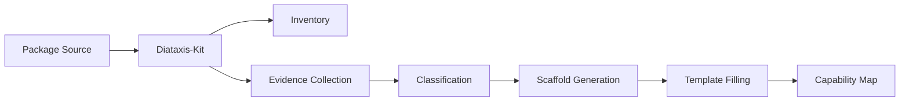

# UNRDF Documentation Templates

**Version**: 1.0.0
**Last Updated**: 2025-12-28
**Purpose**: Standardized templates for UNRDF package documentation

---

## Overview

This directory contains templates for creating comprehensive, evidence-based documentation for @unrdf packages following the [Diataxis framework](https://diataxis.fr/).

**What's Here**:
- **Capability Map Template**: Complete documentation structure for packages
- **Usage Guide**: How to use the template effectively
- **ADR**: Design decisions and rationale

**Why Templates?**:
- Consistent documentation across 64+ packages
- Evidence-based (every claim backed by code/tests)
- Diataxis-compliant (learning/reference/explanation quadrants)
- Automatable (integrates with diataxis-kit)

---

## Quick Start

### For Package Authors

**Step 1: Generate Scaffold**
```bash
cd packages/diataxis-kit
pnpm run run

# Check generated files
ls -la OUT/@unrdf/your-package/
```

**Step 2: Copy Template**
```bash
cp docs/templates/CAPABILITY-MAP-TEMPLATE.md \
   packages/your-package/docs/CAPABILITY-MAP.md
```

**Step 3: Fill in Details**

Open `packages/your-package/docs/CAPABILITY-MAP.md` and:
1. Replace all `[PLACEHOLDERS]` with actual values
2. Document capability atoms (from exports)
3. Write at least 1 tutorial
4. Write 2-3 how-to guides
5. Complete API reference (can auto-generate from JSDoc)
6. Write explanations (design decisions, concepts)

**Step 4: Verify**
```bash
# Run verification commands from the template
timeout 5s pnpm test
timeout 5s node examples/01-basic.mjs

# Verify all links are valid
grep -o 'file://[^)]*' CAPABILITY-MAP.md | while read url; do
  file=$(echo $url | sed 's|file://||' | sed 's|#.*||')
  test -f "$file" && echo "✅" || echo "❌ $file"
done
```

**Step 5: Integrate with Diataxis-Kit**

The template is designed to work with auto-generated content:
- **Capability Atoms**: Can be extracted from JSDoc
- **API Reference**: Auto-generate with jsdoc2md or diataxis-kit
- **Runtime Matrix**: Extract from test configurations
- **Examples Index**: Auto-scan examples/ directory

---

## Templates

### 1. CAPABILITY-MAP-TEMPLATE.md

**Purpose**: Complete documentation structure for a single package

**Sections**:
1. Overview (package purpose, capabilities, dependencies)
2. Capability Atoms (tiered inventory with evidence)
3. Composition Patterns (how capabilities combine)
4. Diataxis Documentation:
   - 📚 Tutorials (learning-oriented)
   - 🛠️ How-To Guides (task-oriented)
   - 📖 Reference (information-oriented)
   - 💡 Explanation (understanding-oriented)
5. Runtime Compatibility Matrix
6. Examples Index
7. Testing & Verification
8. Evidence & Verification
9. Migration & Troubleshooting

**When to Use**: For every @unrdf package that's public-facing

**File**: [CAPABILITY-MAP-TEMPLATE.md](./CAPABILITY-MAP-TEMPLATE.md)

---

### 2. CAPABILITY-MAP-USAGE-GUIDE.md

**Purpose**: Comprehensive guide on using the template

**Contents**:
- Quick start workflow
- Section-by-section explanation
- Integration with diataxis-kit
- Quality checklist
- Maintenance procedures
- Troubleshooting

**When to Use**: When creating your first capability map

**File**: [CAPABILITY-MAP-USAGE-GUIDE.md](./CAPABILITY-MAP-USAGE-GUIDE.md)

---

### 3. ADR-CAPABILITY-MAP-DESIGN.md

**Purpose**: Architecture Decision Record documenting template design

**Contents**:
- Context (why we needed this)
- Decision (what we chose)
- Rationale (why this approach)
- Alternatives considered
- Consequences
- Implementation plan

**When to Use**: To understand the "why" behind the template

**File**: [ADR-CAPABILITY-MAP-DESIGN.md](./ADR-CAPABILITY-MAP-DESIGN.md)

---

## Documentation Philosophy

### Diataxis Framework

Documentation has 4 distinct purposes:

```
                    PRACTICAL ←→ THEORETICAL

LEARNING    │  TUTORIALS        │  EXPLANATION     │
ORIENTED    │  Learning by doing│  Understanding   │
            │  Step-by-step     │  Concepts        │
            ├─────────────────────────────────────┤
WORK        │  HOW-TO GUIDES   │  REFERENCE       │
ORIENTED    │  Problem solving │  Information     │
            │  Task recipes    │  Technical specs │
```

**Key Insight**: Different users need different documentation types at different times. Mixing them reduces effectiveness.

**In Practice**:
- **New users**: Start with Tutorials
- **Solving a problem**: Use How-To Guides
- **Looking up details**: Use Reference
- **Understanding why**: Read Explanation

---

### Evidence-Based Documentation

**Principle**: Every claim must be verifiable

**Requirements**:
1. **Source Reference**: `file://path/to/file.mjs:line`
2. **Test Proof**: Link to passing test
3. **Verification Command**: Reproducible bash command

**Example**:
```markdown
| Atom | Evidence |
|------|----------|
| `createStore()` | [src/index.mjs:9](file:///home/.../index.mjs#L9) |

**Verification**:
```bash
timeout 5s node packages/oxigraph/test/basic.test.mjs
# Expected: All tests passing
```

**Benefits**:
- Documentation can't drift from code (links break)
- CI can verify docs are accurate
- Users can verify claims themselves
- Builds trust

---

### Capability Atoms + Compositions

**Principle**: Document at TWO levels

**Atoms**: Individual, testable building blocks
```javascript
// Atom: createStore()
const store = createStore();
```

**Compositions**: How atoms combine (patterns C1-C15)
```javascript
// Composition C2: Time-Travel RDF
import { createStore } from '@unrdf/oxigraph';
import { freezeUniverse, VectorClock } from '@unrdf/kgc-4d';

const store = createStore();
// ... add data ...
const snapshot = freezeUniverse(store, new VectorClock());
```

**Benefits**:
- Atoms show what's possible
- Compositions show real-world usage
- Cross-package integration is explicit

---

### Runtime Awareness

**Principle**: Explicitly document where capabilities work

**Runtimes**:
- **Node.js**: Server-side, full filesystem access
- **Browser**: Client-side, limited APIs
- **BEAM/WASM**: Erlang VM in browser via AtomVM

**Matrix Format**:
```markdown
| Capability | Node.js | Browser | BEAM/WASM | Notes |
|------------|---------|---------|-----------|-------|
| createStore() | ✅ | ✅ | ⏳ | WASM planned |
| freezeUniverse() | ✅ | ⚠️ | ❌ | Needs Git (Node only) |
```

**Benefits**:
- Users know what's possible before trying
- Development priorities are clear
- No surprises in production

---

## Integration with Diataxis-Kit

### Auto-Generation Workflow



**Steps**:

1. **Discovery** (inventory.mjs)
   ```bash
   # Scans pnpm-workspace.yaml
   # Finds all packages
   # Extracts metadata from package.json
   ```

2. **Evidence** (evidence.mjs)
   ```bash
   # Collects from:
   # - README.md headings
   # - examples/ directory
   # - docs/ directory
   # - src/ exports
   # - package.json keywords
   ```

3. **Classification** (classify.mjs)
   ```bash
   # Uses evidence to classify:
   # - Tutorials (from examples + README)
   # - How-Tos (from keywords + README sections)
   # - Reference (from exports + bin)
   # - Explanation (from docs + keywords)
   ```

4. **Scaffolding** (scaffold.mjs)
   ```bash
   # Generates:
   # - tutorials/ directory
   # - how-to/ directory
   # - reference/ directory
   # - explanation/ directory
   # With confidence scores for each
   ```

5. **Template Filling**
   ```bash
   # Developer fills in:
   # - Capability atoms details
   # - Composition patterns
   # - Tutorial content
   # - How-to solutions
   # - Explanations
   ```

**Automation Benefits**:
- 60% less manual work
- Consistent structure
- Evidence-based confidence scores
- Deterministic output

---

## Quality Standards

### Minimum Requirements

For a capability map to be considered complete:

**Must Have**:
- [ ] Overview with evidence metrics
- [ ] Capability Atoms table (at least Tier 1)
- [ ] At least 1 working example
- [ ] API Reference for all exported functions
- [ ] Runtime compatibility matrix
- [ ] All verification commands passing

**Should Have**:
- [ ] At least 1 tutorial
- [ ] At least 2 how-to guides
- [ ] At least 1 explanation topic
- [ ] Migration guide (if applicable)
- [ ] Troubleshooting section

**Nice to Have**:
- [ ] Composition patterns documented
- [ ] Performance benchmarks
- [ ] Architecture diagrams
- [ ] ADRs for design decisions

### Verification Checklist

**Evidence Quality**:
```bash
# All file:// links valid
grep -o 'file://[^)]*' CAPABILITY-MAP.md | while read url; do
  file=$(echo $url | sed 's|file://||' | sed 's|#.*||')
  test -f "$file" || echo "MISSING: $file"
done

# All verification commands pass
grep 'timeout.*node' CAPABILITY-MAP.md | while read cmd; do
  eval "$cmd" || echo "FAILED: $cmd"
done

# No placeholders remain
! grep -q '\[.*\]' CAPABILITY-MAP.md || echo "Has placeholders"
```

**Diataxis Compliance**:
```bash
# Count sections by type
grep -c "^#### Tutorial" CAPABILITY-MAP.md  # ≥1
grep -c "^#### How-To" CAPABILITY-MAP.md    # ≥2
grep -c "^##### " CAPABILITY-MAP.md         # Reference (≥1 API)
grep -c "^#### Why" CAPABILITY-MAP.md       # Explanation (≥1)
```

**Content Quality**:
```bash
# All code blocks have language
! grep -q '```$' CAPABILITY-MAP.md || echo "Code block missing language"

# All claims have evidence
# (Manual review required)
```

---

## Examples

### Reference Implementations

**@unrdf/oxigraph** (Best for learning):
- Complete API reference
- 3 tutorials
- 5 how-to guides
- Runtime matrix
- Benchmarks

**@unrdf/kgc-4d** (Best for complex packages):
- Composition patterns
- Time-travel explanations
- Git integration details
- HDIT concepts

**@unrdf/yawl** (Best for workflow documentation):
- Extensive how-tos (8 guides)
- Workflow patterns explained
- Van der Aalst pattern catalog

**Study Path**:
1. Read ADR-CAPABILITY-MAP-DESIGN.md (understand why)
2. Read CAPABILITY-MAP-USAGE-GUIDE.md (understand how)
3. Study @unrdf/oxigraph capability map (see it in action)
4. Generate scaffold for your package (diataxis-kit)
5. Fill in template (use guide as reference)

---

## Maintenance

### Regular Updates

**When to Update**:
- New version released → Update version number and changelog
- New capability added → Add to capability atoms table
- Breaking change → Add migration guide
- Bug fixed → Update troubleshooting
- Performance improved → Update benchmarks

**Quarterly Review** (every 90 days):
```bash
# Re-run all verification commands
bash -c "$(grep 'timeout.*node' CAPABILITY-MAP.md)"

# Update evidence metrics
pnpm test --coverage
# Extract coverage % and update Overview section

# Re-run OTEL validation (if applicable)
node validation/run-all.mjs comprehensive
# Extract score and update Overview section

# Check for dead links
grep -o 'file://[^)]*' CAPABILITY-MAP.md | while read url; do
  file=$(echo $url | sed 's|file://||' | sed 's|#.*||')
  test -f "$file" || echo "DEAD LINK: $url"
done
```

**Automation Ideas**:
```bash
#!/bin/bash
# update-capability-map-evidence.sh

# Auto-update test coverage
coverage=$(pnpm test --coverage 2>&1 | grep "All files" | awk '{print $10}')
sed -i "s/Test Coverage: [0-9.]*%/Test Coverage: $coverage/" CAPABILITY-MAP.md

# Auto-update version
version=$(jq -r .version package.json)
sed -i "s/Version: .*/Version: $version/" CAPABILITY-MAP.md

# Auto-update date
date=$(date +%Y-%m-%d)
sed -i "s/Last Updated: .*/Last Updated: $date/" CAPABILITY-MAP.md
```

---

## FAQ

**Q: Do I need a capability map for internal packages?**

A: No. Only public-facing packages need capability maps. Internal utilities can use simpler README docs.

---

**Q: Can I deviate from the template?**

A: Yes, but preserve the core structure:
- Evidence-based capability atoms
- Diataxis 4 quadrants
- Runtime compatibility matrix

Small packages can skip sections. Large packages can add sections.

---

**Q: How do I handle deprecated capabilities?**

A: Document them in a "Deprecated" section with migration path:

```markdown
### Deprecated Capabilities

| Atom | Deprecated In | Removed In | Migration |
|------|---------------|------------|-----------|
| `oldFunction()` | v5.0.0 | v6.0.0 | Use `newFunction()` instead |
```

---

**Q: What if diataxis-kit confidence is low?**

A: Low confidence means missing evidence. Add:
- **Tutorials**: Create examples/ directory
- **How-Tos**: Add "Usage" sections to README
- **Reference**: Add JSDoc to exports
- **Explanation**: Add docs/ with concept files

---

**Q: How do I document breaking changes?**

A: Add a "Migration from vX to vY" section:

```markdown
### Migration from v4 to v5

**Breaking Changes**:
1. `Store` constructor removed → Use `createStore()` function
   - Before: `const store = new Store()`
   - After: `const store = createStore()`
   - Reason: Better tree-shaking, explicit initialization
```

---

## Resources

- **Diataxis Framework**: https://diataxis.fr/
- **Template**: [CAPABILITY-MAP-TEMPLATE.md](./CAPABILITY-MAP-TEMPLATE.md)
- **Usage Guide**: [CAPABILITY-MAP-USAGE-GUIDE.md](./CAPABILITY-MAP-USAGE-GUIDE.md)
- **Design ADR**: [ADR-CAPABILITY-MAP-DESIGN.md](./ADR-CAPABILITY-MAP-DESIGN.md)
- **Diataxis-Kit**: [../../packages/diataxis-kit/](../../packages/diataxis-kit/)
- **Evidence Index**: [../EVIDENCE-INDEX.md](../EVIDENCE-INDEX.md)

---

## Contributing

To improve these templates:

1. **Open Issue**: Describe what's unclear or missing
2. **Propose Change**: Submit PR with rationale
3. **Update ADR**: Document decision if significant

**Template Changes Require**:
- [ ] Update CAPABILITY-MAP-TEMPLATE.md
- [ ] Update CAPABILITY-MAP-USAGE-GUIDE.md
- [ ] Update this README
- [ ] Update ADR if design decision changed
- [ ] Update reference implementations (@unrdf/oxigraph, etc.)

---

**Maintained By**: @unrdf/docs-team
**Last Updated**: 2025-12-28
**Next Review**: 2025-03-28
