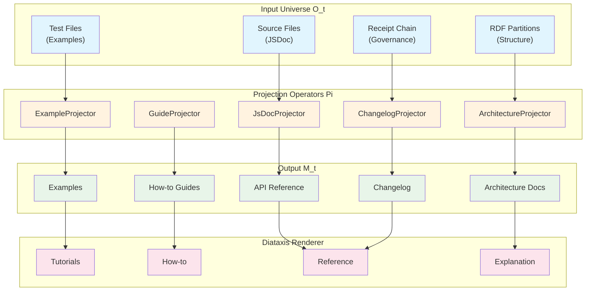
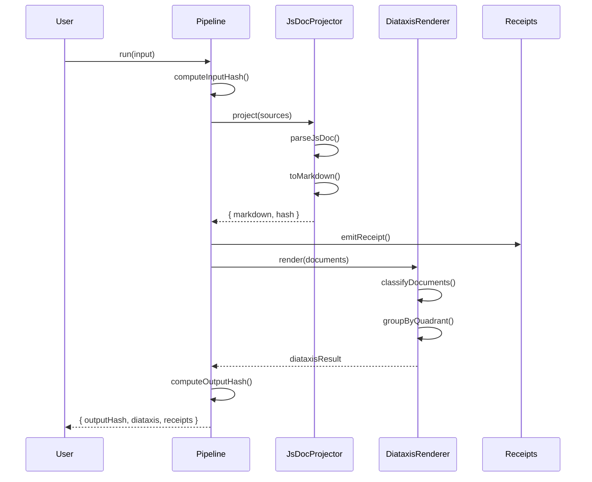

# Documentation Projection Architecture

Understanding the documentation projection system in UNRDF.

---

## Overview

Documentation in UNRDF is generated through a deterministic projection process:

```
M_t = Pi_doc(mu(O_t))
```

Where:
- **O_t** = Monorepo universe at time t
- **mu(O)** = Operation producing artifacts
- **Pi_doc** = Documentation projection operator
- **M_t** = Markdown documentation

This ensures that the same source code always produces the same documentation.

---

## Architecture Diagram



---

## Component Details

### Projectors

Each projector is a pure function transforming specific input to Markdown:

| Projector | Input | Output | Quadrant |
|-----------|-------|--------|----------|
| JsDocProjector | Source files with JSDoc | API reference | Reference |
| ArchitectureProjector | RDF partition structure | Architecture docs | Explanation |
| ExampleProjector | Test files | Executable examples | Tutorial |
| GuideProjector | Templates + patterns | How-to guides | How-to |
| ChangelogProjector | Receipt chain | Changelog | Reference |

### Determinism Guarantees

Every projection produces a content hash:

```javascript
const result = await projector.project(input);
console.log(result.hash);  // 'abc123...'
```

Properties:
- **Reproducible**: Same input always produces same hash
- **Verifiable**: Hash can be checked later
- **Auditable**: Receipts track all projections

### Receipt Emission

Each projection emits a receipt:

```javascript
{
  projectorType: 'jsdoc',
  inputHash: 'input-hash',
  outputHash: 'output-hash',
  timestamp: '2025-12-26T12:00:00.000Z',
  documentCount: 5,
  deterministic: true,
}
```

---

## Data Flow



---

## File Structure

```
src/projection/
  index.mjs                    # Module exports
  jsdoc-projector.mjs          # JSDoc -> API docs
  architecture-projector.mjs   # RDF -> architecture docs
  example-projector.mjs        # Tests -> examples
  guide-projector.mjs          # Patterns -> guides
  changelog-projector.mjs      # Receipts -> changelog
  diataxis-renderer.mjs        # Quadrant routing
  projection-pipeline.mjs      # Unified pipeline
  projection.test.mjs          # Tests
  package.json                 # Package config
```

---

## Diataxis Framework

The documentation follows the Diataxis framework:

```
                PRACTICAL
                   |
    +--------------+--------------+
    |              |              |
    |  TUTORIALS   |   HOW-TO     |
    |              |   GUIDES     |
    |  Learning-   |   Goal-      |
    |  oriented    |   oriented   |
    |              |              |
----+--------------+--------------+----
    |              |              |
    |  EXPLANATION |   REFERENCE  |
    |              |              |
    |  Understanding-  Information- |
    |  oriented    |   oriented   |
    |              |              |
    +--------------+--------------+
                   |
               THEORETICAL
```

Each quadrant serves a different purpose:

| Quadrant | Purpose | Audience Need |
|----------|---------|---------------|
| Tutorial | Learning | "I want to learn" |
| How-to | Problem-solving | "I want to accomplish X" |
| Reference | Information | "I want to know about X" |
| Explanation | Understanding | "I want to understand X" |

---

## Integration Points

### With Universe

```javascript
const input = projector.extractFromUniverse(universe);
const result = await projector.project(input);
```

### With Receipt Chain

```javascript
const result = await changelogProjector.project(
  receiptChain.getAll(),
  { projectName: 'UNRDF' }
);
```

### With CI/CD

```bash
# Generate docs on every commit
node scripts/generate-docs.mjs

# Verify determinism
node scripts/verify-docs.mjs --expected-hash $EXPECTED_HASH
```

---

## Design Principles

1. **Determinism**: Same input always produces same output
2. **Transparency**: Every projection is auditable via receipts
3. **Separation**: Projectors are independent and composable
4. **Extensibility**: Custom projectors can be added
5. **Diataxis-native**: Built-in audience-aware routing

---

*Generated by @unrdf/projection*
