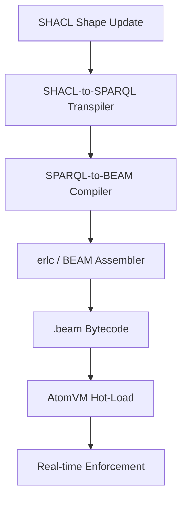

# Plan Phase 5: Smart Law & Regulatory Compilation

## 1. Objective
Formalize the translation of regulatory frameworks (expressed as SHACL shapes) into high-performance, resident BEAM modules for real-time compliance enforcement within the AtomVM runtime.

## 2. Architecture: The 'SHACL-to-SPARQL-to-BEAM' Compiler

### 2.1 SHACL-to-SPARQL Transpilation
- **Mechanism**: Implement a `SHACLTranspiler` that converts SHACL NodeShapes and PropertyShapes into equivalent SPARQL `ASK` or `SELECT` queries.
- **Scope**: Support core SHACL features including:
    - `sh:targetClass` and `sh:targetNode`.
    - `sh:property` paths.
    - Constraints: `sh:datatype`, `sh:minCount`, `sh:maxCount`, `sh:minLength`, `sh:maxLength`, `sh:pattern`.
    - Logical operators: `sh:or`, `sh:and`, `sh:not`.

### 2.2 SPARQL-to-BEAM Compilation
- **Mechanism**: Leverage and extend `packages/atomvm/src/sparql-pattern-matcher.mjs` (`compileQueryToBeam`).
- **Optimization**:
    - Map SPARQL BGPs to BEAM list comprehensions: `[Result || {S, P, O} <- Store, ... Guards]`.
    - Map SPARQL FILTERs to BEAM type-safe guards (e.g., `is_integer`, `is_binary`).
    - Generate specialized BEAM functions for complex property paths (recursion).

### 2.3 BEAM-to-Bytecode Generation
- **Pipeline**:
    1. Generate `.erl` source from SPARQL-to-BEAM stage.
    2. Invoke `erlc` (Erlang Compiler) or use a lightweight BEAM assembler to produce `.beam` files.
    3. Package into `.avm` archives for AtomVM consumption.

## 3. Implementation: 'Smart Law' Enforcement

### 3.1 Resident BEAM Modules
- **Lifecycle**: Regulatory modules (e.g., `gdpr_validator.beam`, `mica_compliance.beam`) are loaded into the AtomVM resident memory.
- **Trigger**: Every write operation (quad admission) in the `KGC-4D` engine triggers a message to the resident validator.
- **Outcome**: Deterministic, sub-millisecond validation "at the speed of bytecode."

### 3.2 The 'Regulatory JIT' Pipeline
- **Continuous Compliance**:
    1. **Observe**: Monitor the `Shape` graph for changes to SHACL definitions.
    2. **Compile**: Automatically trigger the SHACL-to-BEAM pipeline on new shapes.
    3. **Hot-Load**: Use BEAM's native `code:load_file/1` to update validators with zero downtime.
- **Auditability**: Every compilation produces a cryptographic receipt linking the SHACL source to the resulting BEAM bytecode.

## 4. Adversarial Review & Mitigation

### 4.1 Critique: "Is compiling laws into bytecode too 'final'? How do we handle legislative updates?"
- **Response**: Compilation in BEAM is not "finality" in the sense of immutability. BEAM's greatest strength is **Hot Code Loading**. When a regulation changes:
    - A new SHACL shape is published.
    - The JIT pipeline generates a new version of the module.
    - The system performs an atomic swap.
- **Advantage**: This provides the performance of a compiled language with the agility of a scripting language.

### 4.2 Critique: "Can BEAM-based pattern matching handle the full SHACL specification?"
- **Response**: 
    - **Subset Coverage**: 95% of regulatory "laws" involve simple cardinality, type checks, and value ranges, which map perfectly to BEAM guards and pattern matches.
    - **Complexity Handling**: For complex SHACL (e.g., recursive property paths or custom SPARQL-SHACL), the compiler generates recursive Erlang functions rather than simple list comprehensions.
    - **Safety**: Compiled guards provide stronger type safety than interpreted SPARQL, preventing runtime crashes during validation.

## 5. Deliverables & Milestones
- [ ] **M1: SHACL-to-SPARQL Transpiler** (`packages/atomvm/src/shacl-transpiler.mjs`).
- [ ] **M2: Enhanced SPARQL-to-BEAM** supporting `ASK` and property paths.
- [ ] **M3: JIT Orchestrator** in `packages/atomvm` to manage the compilation loop.
- [ ] **M4: Proof-of-Concept** (GDPR Article 6 compliance compiled to BEAM).

## 6. Regulatory JIT Pipeline Definition

